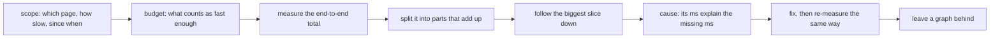
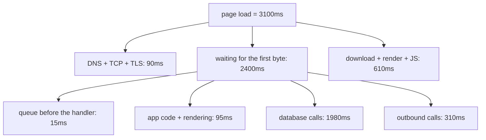
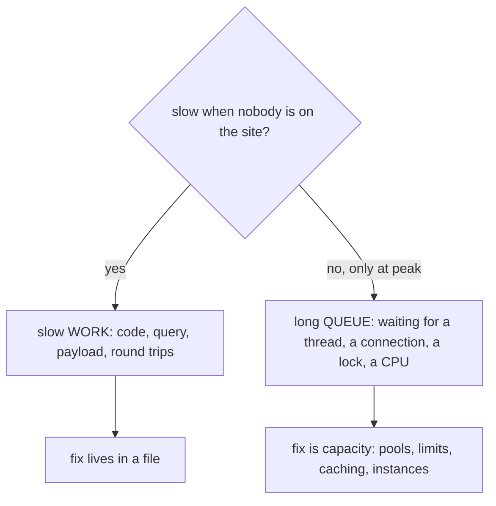

# The Site Is Slow: How Do You Find the Cause?

This is not a question about a bug. It is a question about whether you have a
**method** — and the interviewer will hear the answer in your first sentence. If
it starts with "I'd add a cache" or "probably the database", you have already
answered. If it starts with "first I'd find out which page and how slow, then
measure where the time actually goes", the rest is detail.

The method, in order:

One rule governs the whole thing: **find where the time goes before deciding
what to make faster.** A request that takes 4 seconds spends those 4 seconds
somewhere specific, and every second is in exactly one place at a time.

## 1. "Slow" is a feeling. Turn it into a number

Five questions, asked together (one at a time turns a five-minute scoping into
an afternoon of ping-pong):

| Question | Why it earns its place |
|---|---|
| **Which** page or request? A URL, not "the site" | One page fires a dozen calls; eleven may be fine |
| **Who** sees it? One user, one region, one device, everybody? | Separates a data/network problem from a system-wide one |
| **How** slow? Seconds, measured, versus what it used to be | "Slow" and "3.1s at p95 instead of 0.9s" are different bug reports |
| **Since when**? A slope over a month, or a cliff on Tuesday at 14:20? | A cliff points at a deploy, a config change, a dependency. A slope points at data volume, a cache that stopped fitting, a leak |
| **How often**? Every request, or one in ten? | Every time is a system property. One in ten is a *tail*, and that is a different investigation |

Then read the shape of the latency, not its average:

- **avg** — always available, almost never useful. It mixes cache hits with
  misses and empty accounts with large ones, and one 30-second request drags it
  up while everything else is fine.
- **p50** — what a normal visit looks like.
- **p95** — what the person complaining is living through. This is the number
  you optimise.
- **p99** — the shape of the tail. A user who makes six requests per page meets
  your p99 more often than you would like.

Finally, write down the **budget**: "the product page at p95 under 800ms". Without
it, "faster" is a job rather than a task — there is always one more query to
tune. The budget also decides which findings matter: at an 800ms target, a 40ms
segment is noise you should refuse to look at.

## 2. Measure the total, then split it into parts that add up

For a website the first screen is free and already installed: the browser's
network panel decomposes the wait exactly the way the user experiences it (this
is the same journey as [what happens when you type a URL](topic:browser-page-load)).

The rule that makes this work: **the parts must add up to the number the user
feels.** If the parts sum to 400ms and the page takes 4 seconds, the interesting
3.6 seconds is in something you have not instrumented — and that gap is itself
the finding.

What each top-level segment rules in or out:

- **DNS / connect / TLS high** → network, geography, no connection reuse, a
  missing CDN, or a certificate chain problem ([SSL/TLS certificates](topic:ssl-tls-certificate)).
- **TTFB high** → the server. Everything in section 3 applies.
- **TTFB fine, page still late** → the browser: render-blocking JavaScript,
  unoptimised images, third-party scripts on the critical path. Half the slow
  websites in the world have a perfectly fast backend.
- **Nothing is high, but there are 80 requests** → the problem is the *number* of
  round trips, not any single one ([how the frontend and the backend talk](topic:frontend-backend-interaction)).

## 3. Follow the biggest slice down

Split, follow the biggest piece, split again, stop when the remainder is small
enough to be a cause. It converges because each level multiplies your resolution
instead of lengthening a checklist, and it keeps your opinions out: your belief
about which layer is "probably" slow never gets a vote.

| Level | Question | Tool |
|---|---|---|
| Browser | Server or client side? | Network panel, coverage tab |
| Request | Queue, handler, database, outbound? | Access log with durations, a trace, a request id in every log line |
| Handler | Which call, how many times? | Profiler, APM span, SQL log |
| Query | What does the plan actually do? | [EXPLAIN and the query plan](topic:query-execution-plan), [reading PostgreSQL EXPLAIN](topic:postgresql-explain-plan-reading) |

Drill into the biggest slice **and only the biggest slice**. A level you open out
of curiosity is a level you will optimise out of sunk cost.

Inside a web request, the shortlist of what is usually holding the time:

- **The database**: a missing index ([which indexes to add](topic:indexes-for-query-optimization)),
  an index that exists but is not used ([why](topic:postgresql-index-not-used)),
  a query whose plan flipped when the table grew, or lock waits.
- **N+1 queries** — 213 statements where one would do; the classic invisible
  killer, because every individual query is fast ([the N+1 select problem](topic:hibernate-n-plus-one)).
- **A slow dependency** you call synchronously, with a generous timeout
  ([timeouts, fallbacks and circuit breakers](topic:service-timeouts-fallbacks)).
- **Payload size** — 4MB of JSON that took 40ms to build and 2s to ship.
- **Algorithmic cost** that only shows up on production-sized data
  ([why O(n²) is bad](topic:quadratic-complexity)).
- **GC pauses** or a heap that keeps filling ([memory growth in production](topic:diagnosing-memory-leaks),
  [configuring the GC](topic:gc-configuration)).

## 4. Slow work, or a long queue?

One comparison decides which half of the world you are in: time the **same
request** when the site is idle and again at peak.

These halves have nothing in common, and the mistake is expensive: if the time
is queueing, **profiling the handler shows you nothing at all** — every method
is fast, because the request was not running, it was waiting. That is a capacity
problem ([a single server is overwhelmed](topic:scaling-an-overloaded-server)),
and it is solved with pools, limits and instances rather than cleverness.

To find the queue, walk the resources the request needs and ask three things
about each: how busy it is, whether anything is **waiting in line** for it, and
whether it is refusing work. The middle one is what people skip and the one that
explains latency — a pool at 100% utilization with nobody queued is doing its
job; a pool at 60% with a queue behind it is where seconds disappear. The usual
suspects are few enough to memorise: CPU, memory and GC, the connection pool,
the database's own locks and IO, the [thread pool](topic:java-thread-pool), and
the network to whatever you call.

A saturated shared resource explains latency for *every* endpoint at once —
which is exactly what "the whole site got slow" means.

## 5. Price the fix before you build it

Before writing anything, do this arithmetic out loud:

> Making a **95ms** segment **4×** faster removes **71ms** of a **3100ms** page
> = **2%**. Nobody can perceive that.

That is Amdahl's law, and it settles most performance arguments before they
start: **the ceiling on any optimisation is the size of the slice it touches.**
Even making that slice infinitely fast only buys you the slice. Run the
calculation on your own idea first — it is equally good at killing the rewrite
you wanted and at justifying the boring cache you did not. And note where it
points: two seconds of waiting on a database beats every micro-optimisation in
your codebase combined ([streams vs loops](topic:streams-vs-loops-performance)
is the wrong argument to be having when a query is scanning 2.1M rows).

## 6. Confirm, fix, verify

A **cause** is not "suspicious code". The bar is that its milliseconds *account
for* the milliseconds you are missing. If your cause explains 300ms of a
3-second page, you have found *a* cause and not *the* cause, and shipping it
produces a graph that does not move and a stakeholder who stops believing you.
The cheapest confirmation usually needs no code at all: disable the suspected
work in a scratch environment, or run the same request against the same data
with the suspect removed, and watch the number come down.

Then **one** change at a time, with the expected saving written down before the
deploy — two changes at once means neither has a measurement. Prefer the boring
fix: an index, a missing cache, one query instead of N, a smaller payload, work
moved off the request path or done in parallel.

**Verify with the same measurement**: same page, same percentile, in production.
Not a local run, not a benchmark of the method you changed, not "it feels
snappier". Look at the whole distribution too — a fix can improve p50 and leave
the p99 people complain about untouched.

And expect the bottleneck to *move* rather than disappear. Removing one just
promotes the next one, which is why a 61% win can still be over budget, and why
the honest answer is "split the new total and go again".

## 7. What you leave behind

The permanent output of a performance hunt is not the fix — the same page will
get slow again for a different reason. It is the measurement you did not have
when it started:

1. A **p95 graph** for this journey, on the same dashboard as the deploys.
2. An **alert** on the budget you agreed, so a regression is found by a machine
   instead of a customer.
3. **Per-request timings** with one request id shared by the gateway, the app and
   the database log, so the next split takes minutes ([why Kibana](topic:why-kibana)).

If none of these exist today, that is not a failure — it is the honest first
answer to this question in most real systems, and the cheap layer is already
there: access logs have durations, the browser has a waterfall, and one request
id turns four disconnected logs into one timeline.

## The 60-second interview answer

> First I'd turn "slow" into a measurement: which page, for whom, how slow, since
> when, and how often — plus the target we're aiming at, at p95 rather than on
> average. Then I'd measure the end-to-end time and split it into parts that add
> up: DNS, connect, TLS, time to first byte, download, render. That tells me
> whether I'm on the server or in the browser. I'd take the biggest slice and
> split it again — first byte into queueing, application code, database and
> outbound calls; the slow query into what its plan actually does — until what's
> left is small enough to be a cause. Along the way I'd check one thing: is it
> slow when nobody's on the site, or only at peak? If only at peak I'm looking
> for a queue — a connection pool, a thread pool, a lock — and profiling code
> would tell me nothing. Before building a fix I'd price it: a slice that's 3% of
> the request can't buy more than 3%. Then one change, re-measure the same way,
> and leave behind the graph and the alert so the next one starts from data.

## Common traps

- **Optimising on a hunch.** It feels like progress and it can even be a real
  improvement — but if the thing you improved was 4% of the request, the user
  cannot notice, and now you have a change to a system you still cannot explain.
- **Reading the average.** It describes nobody. The complaint lives at p95.
- **Profiling code that is waiting rather than working.** Under queueing every
  method is fast and the request is still slow.
- **"Just add a cache."** Sometimes exactly right; often it hides the problem,
  moves it to invalidation, and makes the tail worse on a cold start.
- **Adding servers for a request that is slow when idle.** More instances shorten
  queues, not work.
- **Testing on your laptop with 40 rows.** The cause is often data volume, and a
  plan that is fine at 40 rows flips at 2 million.
- **Declaring victory without re-measuring.** A change with no before-number is a
  belief, not an improvement — and beliefs travel with you into the next system.
- **Stopping at the first cause.** Check whether its milliseconds actually add up
  to the milliseconds you were missing.

Related: the same discipline applied to failures rather than latency is
[it passed tests and broke in production](topic:endpoint-broken-in-prod), and
picking *which* queries deserve the effort is
[choosing queries to optimize](topic:query-optimization-candidates).
