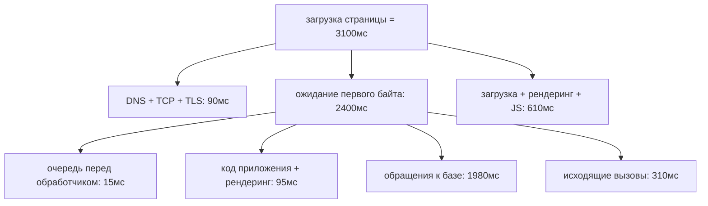
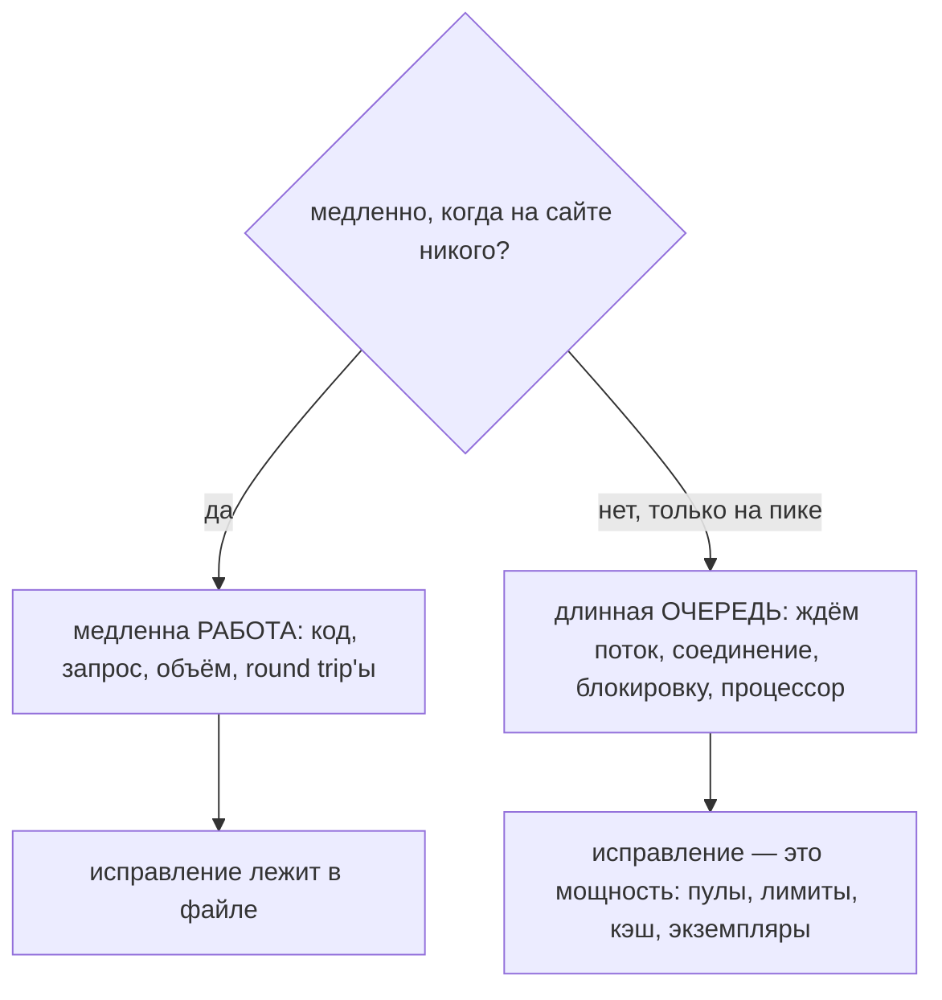

# Сайт тормозит: как найти причину?

Это вопрос не про баг. Это вопрос о том, есть ли у вас **метод**, — и ответ
интервьюер услышит уже в первой фразе. Если она начинается с «я бы добавил кэш»
или «наверное, база», вы уже ответили. Если она начинается с «сначала я выясню,
какая страница и насколько медленно, а потом измерю, куда реально уходит время»,
всё остальное — детали.

Метод по порядку:

Всем этим правит одно правило: **сначала выясните, куда уходит время, и только
потом решайте, что ускорять.** Запрос, который идёт 4 секунды, тратит эти 4
секунды где-то конкретно, и каждая секунда в один момент находится ровно в одном
месте.

## 1. «Медленно» — это ощущение. Превратите его в число

Пять вопросов, заданных вместе (по одному — это превращает пятиминутное сужение
в переписку на полдня):

| Вопрос | Чем он оправдывает своё место |
|---|---|
| **Какая** страница или запрос? URL, а не «сайт» | Одна страница дёргает десяток вызовов; одиннадцать из них могут быть в порядке |
| **Кто** это видит? Один пользователь, один регион, одно устройство, все? | Отделяет проблему данных или сети от общесистемной |
| **Насколько** медленно? В секундах, измеренных, по сравнению с тем, как было | «Медленно» и «3,1с на p95 вместо 0,9с» — это разные баг-репорты |
| **С какого момента**? Наклон за месяц или обрыв во вторник в 14:20? | Обрыв указывает на деплой, правку конфигурации, зависимость. Наклон — на объём данных, кэш, переставший помещаться, утечку |
| **Как часто**? Каждый запрос или один из десяти? | «Каждый раз» — свойство системы. «Один из десяти» — это *хвост*, и расследование там другое |

Затем читайте форму задержки, а не её среднее:

- **среднее** — доступно всегда и почти никогда не полезно. Оно смешивает
  попадания в кэш с промахами, а пустые аккаунты с большими, и один
  30-секундный запрос вытянет его вверх, пока всё остальное в порядке.
- **p50** — как выглядит обычный визит.
- **p95** — то, что переживает жалующийся. Именно это число вы оптимизируете.
- **p99** — форма хвоста. Пользователь, делающий шесть запросов на страницу,
  встречает ваш p99 чаще, чем вам хотелось бы.

И наконец, запишите **бюджет**: «страница товара на p95 быстрее 800мс». Без него
«быстрее» — это работа, а не задача: всегда найдётся ещё один запрос, который
можно подтюнить. Бюджет ещё и решает, какие находки важны: при цели 800мс
сегмент в 40мс — шум, на который нужно отказаться смотреть.

## 2. Измерьте общее время и разбейте его на складывающиеся части

Для сайта первый экран бесплатен и уже установлен: сетевая панель браузера
раскладывает ожидание ровно так, как его переживает пользователь (это тот же
путь, что и в теме [что происходит, когда вы вводите URL](topic:browser-page-load)).

Правило, благодаря которому это работает: **части обязаны складываться в то
число, которое ощущает пользователь.** Если части дают в сумме 400мс, а страница
идёт 4 секунды, то интересные 3,6 секунды сидят в чём-то, что вы не
инструментировали, — и этот разрыв сам по себе находка.

Что каждый сегмент верхнего уровня подтверждает или исключает:

- **Большие DNS / соединение / TLS** → сеть, география, отсутствие переиспользования
  соединения, отсутствующий CDN или проблема с цепочкой сертификатов
  ([сертификаты SSL/TLS](topic:ssl-tls-certificate)).
- **Большой TTFB** → сервер. Дальше работает весь раздел 3.
- **TTFB нормальный, а страница всё равно появляется поздно** → браузер:
  блокирующий рендеринг JavaScript, неоптимизированные картинки, сторонние
  скрипты на критическом пути. У половины медленных сайтов в мире совершенно
  быстрый бэкенд.
- **Ничего не велико, но запросов 80** → проблема в *количестве* round trip'ов, а
  не в каком-то одном ([как общаются фронтенд и бэкенд](topic:frontend-backend-interaction)).

## 3. Идите за самым большим срезом вниз

Разбить, пойти за самым большим куском, разбить снова, остановиться, когда
остаток достаточно мал, чтобы быть причиной. Это сходится, потому что каждый
уровень умножает разрешение, а не удлиняет список проверок, и это держит ваши
мнения снаружи: ваша вера в то, какой слой «наверное» медленный, не имеет права
голоса.

| Уровень | Вопрос | Инструмент |
|---|---|---|
| Браузер | Сервер или клиент? | Сетевая панель, вкладка coverage |
| Запрос | Очередь, обработчик, база, исходящие? | Лог доступа с длительностями, трассировка, идентификатор запроса в каждой строке лога |
| Обработчик | Какой вызов и сколько раз? | Профилировщик, span в APM, лог SQL |
| Запрос к базе | Что реально делает план? | [EXPLAIN и план запроса](topic:query-execution-plan), [чтение EXPLAIN в PostgreSQL](topic:postgresql-explain-plan-reading) |

Углубляйтесь в самый большой срез **и только в него**. Уровень, открытый из
любопытства, — это уровень, который вы потом оптимизируете из нежелания
признать потраченное время.

Внутри веб-запроса короткий список того, что обычно держит время:

- **База данных**: отсутствующий индекс ([какие индексы добавить](topic:indexes-for-query-optimization)),
  индекс, который есть, но не используется ([почему](topic:postgresql-index-not-used)),
  запрос, у которого план переключился, когда таблица выросла, или ожидания
  блокировок.
- **Запросы N+1** — 213 обращений там, где хватило бы одного; классический
  невидимый убийца, потому что каждый отдельный запрос быстрый
  ([проблема N+1 select](topic:hibernate-n-plus-one)).
- **Медленная зависимость**, которую вы вызываете синхронно и с щедрым
  таймаутом ([таймауты, fallback'и и circuit breaker](topic:service-timeouts-fallbacks)).
- **Объём ответа** — 4МБ JSON, который собирался 40мс, а ехал 2 секунды.
- **Алгоритмическая сложность**, которая проявляется только на данных размером с
  прод ([почему O(n²) плохо](topic:quadratic-complexity)).
- **Паузы GC** или куча, которая всё время заполняется
  ([рост памяти в проде](topic:diagnosing-memory-leaks),
  [настройка сборщика мусора](topic:gc-configuration)).

## 4. Медленная работа или длинная очередь?

Одно сравнение решает, в какой половине мира вы находитесь: замерьте **тот же
запрос** на пустом сайте и ещё раз на пике.

У этих половин нет ничего общего, и ошибка здесь дорога: если время уходит в
очередь, **профилирование обработчика не покажет вам ровным счётом ничего** —
каждый метод быстрый, потому что запрос не выполнялся, а ждал. Это проблема
мощности ([один сервер не справляется](topic:scaling-an-overloaded-server)), и
решается она пулами, лимитами и экземплярами, а не сообразительностью.

Чтобы найти очередь, пройдите по ресурсам, которые нужны запросу, и спросите о
каждом три вещи: насколько он занят, **стоит ли кто-нибудь к нему в очереди** и
не отказывает ли он в работе. Пропускают обычно второе — а именно оно объясняет
задержку: пул на 100% загрузки без очереди делает свою работу; пул на 60% с
очередью позади — это место, где исчезают секунды. Обычных подозреваемых
достаточно мало, чтобы их запомнить: процессор, память и GC, пул соединений,
блокировки и ввод-вывод самой базы, [пул потоков](topic:java-thread-pool) и сеть
до того, кого вы вызываете.

Насыщенный общий ресурс объясняет задержку сразу *всех* эндпоинтов — а это ровно
то, что означает «весь сайт стал медленным».

## 5. Оцените исправление до того, как его писать

Прежде чем что-то писать, проговорите вслух эту арифметику:

> Ускорение сегмента в **95мс** в **4 раза** убирает **71мс** из **3100мс**
> страницы = **2%**. Этого никто не почувствует.

Это закон Амдала, и он решает большинство споров о производительности до их
начала: **потолок любой оптимизации равен размеру среза, которого она
касается.** Даже бесконечное ускорение этого среза приносит вам только сам срез.
Прогоняйте расчёт сначала на собственной идее — он одинаково хорош и в том,
чтобы убить желанное переписывание, и в том, чтобы обосновать скучный кэш,
которого не хотелось. И заметьте, куда он указывает: две секунды ожидания базы
перевешивают все микрооптимизации вашего кода вместе взятые
([streams против циклов](topic:streams-vs-loops-performance) — не тот спор,
который стоит вести, когда запрос сканирует 2,1 млн строк).

## 6. Подтвердить, исправить, проверить

**Причина** — это не «подозрительный код». Планка такова: её миллисекунды
*объясняют* те миллисекунды, которых вы недосчитались. Если ваша причина
объясняет 300мс трёхсекундной страницы, вы нашли ОДНУ причину, а не ТУ САМУЮ, и
её выкатка даст график, который не сдвинулся, и заказчика, который перестал вам
верить. Самое дешёвое подтверждение обычно вообще не требует кода: отключите
подозреваемую работу в тестовом окружении или выполните тот же запрос на тех же
данных без подозреваемого и посмотрите, как число падает.

Дальше — **одно** изменение за раз, с записанной до деплоя ожидаемой экономией:
два изменения сразу означают, что измерения нет ни у одного. Предпочитайте
скучное исправление: индекс, недостающий кэш, один запрос вместо N, меньший
объём ответа, работа, унесённая с пути запроса или выполненная параллельно.

**Проверяйте тем же измерением**: та же страница, тот же перцентиль, в проде. Не
локальный прогон, не бенчмарк изменённого метода и не «ощущается бодрее».
Смотрите и на всё распределение — исправление умеет улучшить p50 и не тронуть
тот p99, на который жалуются.

И ждите, что узкое место *переедет*, а не исчезнет. Снятие одного лишь повышает
в должности следующее — поэтому выигрыш в 61% может всё ещё быть выше бюджета, и
поэтому честный ответ звучит как «разбивай новую сумму и иди по кругу».

## 7. Что вы оставляете после себя

Постоянный результат охоты за производительностью — не исправление: та же
страница снова станет медленной, только по другой причине. Постоянный результат
— то измерение, которого у вас не было в начале:

1. **График p95** для этого сценария, на том же дашборде, что и деплои.
2. **Алерт** на согласованный бюджет, чтобы регрессию нашла машина, а не клиент.
3. **Тайминги каждого запроса** с одним идентификатором, общим для шлюза,
   приложения и лога базы, чтобы следующее разбиение заняло минуты
   ([зачем нужен Kibana](topic:why-kibana)).

Если сегодня нет ничего из этого — это не провал, а честный первый ответ на
данный вопрос в большинстве настоящих систем, и дешёвый слой уже на месте: в
логах доступа есть длительности, у браузера есть waterfall, а один
идентификатор запроса превращает четыре разрозненных лога в одну шкалу времени.

## Ответ на собеседовании за 60 секунд

> Сначала я превращу «медленно» в измерение: какая страница, у кого, насколько
> медленно, с какого момента и как часто, — плюс цель, к которой мы идём, на p95,
> а не в среднем. Затем измерю сквозное время и разобью его на складывающиеся
> части: DNS, соединение, TLS, время до первого байта, загрузка, рендеринг. Это
> скажет, где я — на сервере или в браузере. Возьму самый большой срез и разобью
> его снова: первый байт — на очередь, код приложения, базу и исходящие вызовы;
> медленный запрос — на то, что реально делает его план, — пока оставшееся не
> станет достаточно малым, чтобы быть причиной. По дороге проверю одну вещь:
> медленно ли, когда на сайте никого, или только на пике? Если только на пике, я
> ищу очередь — пул соединений, пул потоков, блокировку, — и профилирование кода
> не сказало бы мне ничего. Прежде чем строить исправление, оценю его: срез,
> составляющий 3% запроса, не может купить больше 3%. Потом одно изменение,
> повторный замер тем же способом и оставленные после себя график и алерт, чтобы
> следующий раз начинался с данных.

## Частые ловушки

- **Оптимизировать по наитию.** Это ощущается как прогресс и может быть даже
  настоящим улучшением, но если улучшенное было 4% запроса, пользователь этого не
  заметит, а у вас теперь есть изменение в системе, которую вы всё ещё не умеете
  объяснить.
- **Читать среднее.** Оно не описывает никого. Жалоба живёт на p95.
- **Профилировать код, который ждёт, а не работает.** При очереди каждый метод
  быстрый, а запрос всё равно медленный.
- **«Просто добавь кэш».** Иногда это ровно правильно; часто — прячет проблему,
  переносит её в инвалидацию и ухудшает хвост на холодном старте.
- **Добавлять серверы запросу, который медленный при простое.** Больше
  экземпляров укорачивают очереди, а не работу.
- **Проверять на ноутбуке с 40 строками.** Причина часто в объёме данных, а план,
  нормальный на 40 строках, переключается на двух миллионах.
- **Объявлять победу без повторного замера.** Изменение без числа «до» — это
  вера, а не улучшение, и вера уезжает вместе с вами в следующую систему.
- **Останавливаться на первой причине.** Проверьте, действительно ли её
  миллисекунды складываются в те, которых вам недоставало.

Смежное: та же дисциплина, применённая к сбоям, а не к задержкам, — это
[прошло тесты и сломалось в проде](topic:endpoint-broken-in-prod), а выбор того,
*какие* запросы заслуживают усилий, — это
[выбор запросов для оптимизации](topic:query-optimization-candidates).
