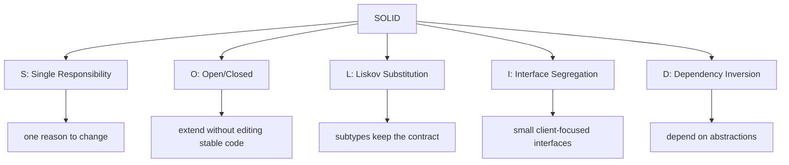
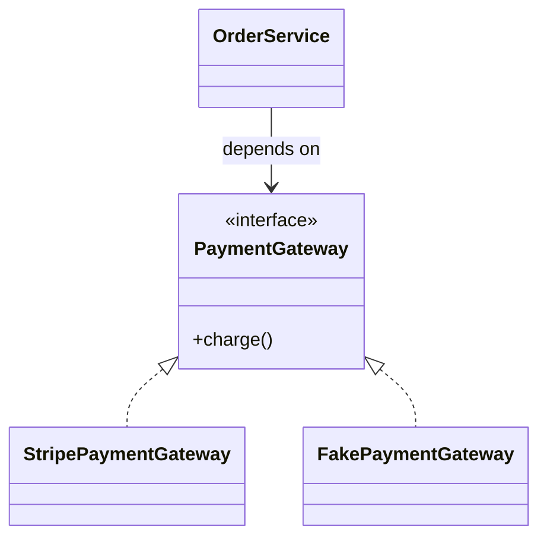

# SOLID Principles

**SOLID** is a set of five object-oriented design principles that help code stay
easy to change without turning every change into a risky rewrite. Think of a busy
post office: sorting letters, selling stamps, delivering parcels, and handling
complaints are related, but they should not all be done by the same counter.
SOLID gives names to those boundaries in Java code.

## S — Single Responsibility Principle

A class should have one reason to change: one business responsibility, not
necessarily one method. In practice, `InvoiceCalculator`, `InvoicePrinter`, and
`InvoiceRepository` often change for different reasons, so keeping them separate
keeps changes local. Like a kitchen, the cook, cashier, and dishwasher all help
the restaurant, but a menu-price change should not force you to rewrite the
dishwasher's checklist.

This principle is about **cohesion**. A class is suspicious when it mixes business
rules, formatting, persistence, HTTP mapping, and audit logging. The focused
employee API topics show this kind of separation in practice: [Employee API:
Design](topic:employee-api-design) and [Employee API: REST and Separation of
Concerns](topic:employee-api-rest-cqrs).

## O — Open/Closed Principle

Software entities should be open for extension but closed for modification. You
should be able to add a new behavior by adding a new class or implementation,
without editing a stable `if/else` block that already works. Like a post office
adding a new parcel lane: the building keeps operating, and the new lane plugs
into the existing queue.

In Java, OCP often appears as an interface plus implementations: `DiscountPolicy`
with `StudentDiscount`, `BlackFridayDiscount`, and `NoDiscount`. The
[Strategy](topic:strategy) pattern is a common way to express this. It does not
mean code is never edited; it means stable, tested code is not repeatedly opened
for every variant.

## L — Liskov Substitution Principle

If `Child` extends or implements `Parent`, code that expects `Parent` must still
work when it receives `Child`. The subtype must preserve the parent contract:
accepted inputs, returned guarantees, side effects, and exceptions should remain
compatible. In traffic terms, a replacement bus can run on a train route only if
it still follows the timetable contract passengers rely on.

Classic violations include overriding a method to throw `UnsupportedOperationException`,
silently weakening validation, returning `null` where the parent promised a value,
or changing the meaning of a method. LSP is less about inheritance syntax and more
about behavioral promises.

## I — Interface Segregation Principle

Clients should not depend on methods they do not use. A large interface such as
`Worker` with `code()`, `designUi()`, `approveBudget()`, and `deploy()` forces
every implementation to know about unrelated work. It is better to split it into
focused roles like `Coder`, `Designer`, `BudgetApprover`, and `Deployer`. Like a
city office, a driver should not need a fishing license form just because both are
printed at the same counter.

ISP keeps implementations honest and tests smaller. If an implementation has
empty methods, dummy exceptions, or comments like "not used here", the interface
is probably too wide.

## D — Dependency Inversion Principle

High-level policy should not depend directly on low-level details. Both should
depend on abstractions. For example, `OrderService` should depend on a
`PaymentGateway` interface, not directly on `StripeClient`. The concrete adapter
can be selected at the edge of the application. Like a kitchen recipe saying
"use an oven" instead of naming one exact oven model, the recipe remains useful
when the appliance changes.

Dependency Inversion is the design principle; [Spring IoC and Dependency
Injection](topic:spring-ioc-di) is one common way to wire the concrete objects at
runtime. DIP also supports testability: tests can pass a fake `PaymentGateway`
without starting real network calls.

## How the principles work together

SOLID principles reinforce each other. SRP gives each class a clear job. OCP
usually needs DIP or polymorphism to add behavior cleanly. LSP protects OCP from
broken substitutions. ISP keeps abstractions narrow enough to be useful. In a
post office analogy: separate counters, clear service contracts, specialized
forms, and replaceable equipment make the office easier to reorganize without
closing it.

They also connect to [Design Patterns Overview](topic:design-patterns-overview):
patterns are reusable shapes, while SOLID is a set of pressure tests for whether
those shapes keep code maintainable.

## 60-second interview answer

> SOLID is five OOP design principles. **SRP** says a class should have one reason
> to change. **OCP** says stable code should be extended with new behavior rather
> than edited for every variation. **LSP** says subclasses or implementations must
> be safely usable wherever their parent type is expected. **ISP** says clients
> should depend only on the methods they need, so interfaces should be focused.
> **DIP** says high-level business code should depend on abstractions, not concrete
> infrastructure details. The goal is not to create more interfaces everywhere,
> but to make change safer, tests easier, and responsibilities clearer.

## Production relevance

SOLID matters when a codebase has repeated change: new payment providers, new
delivery rules, new validation policies, new integrations, or new reporting
formats. It helps keep change local. In a restaurant, adding a new delivery
partner should not require retraining the cook, rewriting the menu printer, and
changing the dishwasher routine.

In real Java systems, SOLID often appears in service boundaries, strategy
interfaces, adapters around external APIs, narrow repository contracts, and
controllers that delegate instead of doing business work themselves. It pairs
well with tests because each part can be replaced with a small fake or stub.

## Common misconceptions

- **"SRP means every class has one method."** No. It means one reason to change.
  A post office counter may have several buttons, but they should belong to one
  service.
- **"OCP means never modify code."** No. Bugs and real requirements still require
  edits. OCP warns against editing the same stable decision block for every new
  variant.
- **"LSP is only about inheritance diagrams."** No. The important part is
  behavior. A replacement ticket machine must honor the same ticket rules, not
  just fit in the same corner.
- **"ISP means tiny interfaces everywhere."** No. Split interfaces around real
  clients. Too many artificial roles can be as confusing as one giant form.
- **"DIP means always use Spring."** No. Spring can implement the wiring, but the
  design idea is depending on abstractions. You can apply DIP without a framework.
- **"SOLID is mandatory ceremony."** No. For small, stable code, simple direct
  code can be better. SOLID pays off when change pressure is real.
