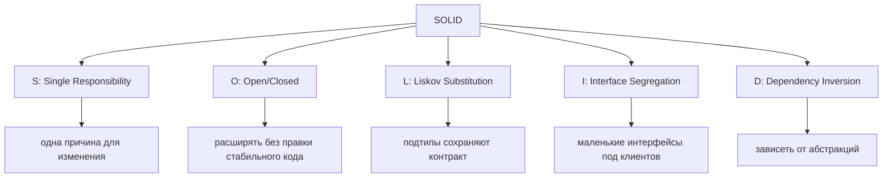
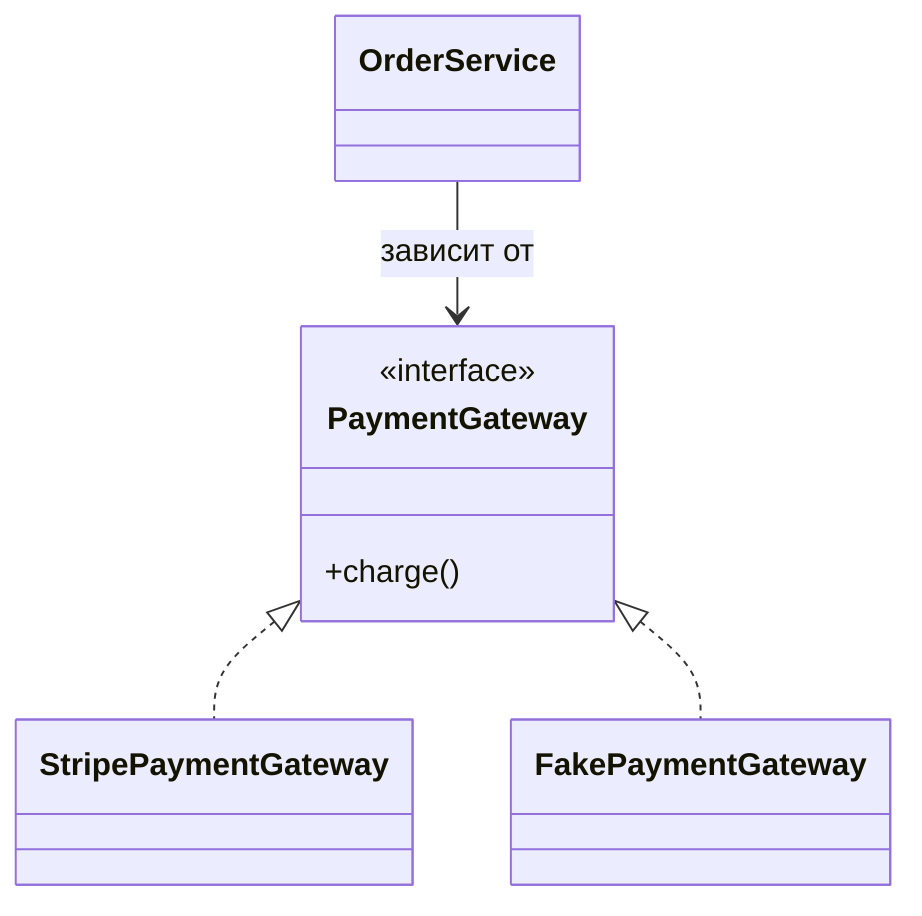

# Принципы SOLID

**SOLID** — это набор из пяти принципов объектно-ориентированного
проектирования, которые помогают коду меняться без рискованной переписки всего
модуля. Представьте загруженное почтовое отделение: сортировка писем, продажа
марок, выдача посылок и работа с жалобами связаны между собой, но их не стоит
сваливать на одно окно. SOLID дает таким границам имена в Java-коде.

## S — Single Responsibility Principle

У класса должна быть одна причина для изменения: одна бизнес-ответственность, а
не обязательно один метод. На практике `InvoiceCalculator`, `InvoicePrinter` и
`InvoiceRepository` часто меняются по разным причинам, поэтому их разделение
оставляет изменения локальными. Как на кухне: повар, кассир и мойщик посуды все
помогают ресторану, но изменение цен в меню не должно заставлять переписывать
чек-лист мойщика.

Этот принцип про **связность**. Класс выглядит подозрительно, если смешивает
бизнес-правила, форматирование, persistence, HTTP mapping и audit logging.
Темы про employee API показывают такое разделение на практике: [Employee API:
Design](topic:employee-api-design) и [Employee API: REST and Separation of
Concerns](topic:employee-api-rest-cqrs).

## O — Open/Closed Principle

Программные сущности должны быть открыты для расширения, но закрыты для
модификации. Новое поведение должно добавляться новой сущностью или
реализацией, без правки стабильного `if/else`, который уже работает. Это похоже
на почтовое отделение, где добавили отдельное окно для нового типа посылок:
здание продолжает работать, а новое окно подключается к существующей очереди.

В Java OCP часто выглядит как интерфейс плюс реализации: `DiscountPolicy` с
`StudentDiscount`, `BlackFridayDiscount` и `NoDiscount`. Паттерн
[Strategy](topic:strategy) часто выражает эту идею. Это не значит, что код
никогда нельзя редактировать; это значит, что стабильный и проверенный код не
надо снова открывать ради каждого варианта.

## L — Liskov Substitution Principle

Если `Child` расширяет или реализует `Parent`, код, который ожидает `Parent`,
должен корректно работать и с `Child`. Подтип обязан сохранять контракт
родителя: допустимые входы, гарантии результата, побочные эффекты и исключения
должны оставаться совместимыми. В дорожной аналогии автобус может заменить поезд
на маршруте только если он соблюдает расписание, на которое рассчитывают
пассажиры.

Типичные нарушения: переопределить метод так, что он бросает
`UnsupportedOperationException`, незаметно ослабить валидацию, вернуть `null`
там, где родитель обещал значение, или изменить смысл метода. LSP меньше про
синтаксис наследования и больше про поведенческие обещания.

## I — Interface Segregation Principle

Клиенты не должны зависеть от методов, которыми не пользуются. Большой интерфейс
вроде `Worker` с `code()`, `designUi()`, `approveBudget()` и `deploy()` заставляет
каждую реализацию знать о чужой работе. Лучше разделить его на узкие роли:
`Coder`, `Designer`, `BudgetApprover` и `Deployer`. Как в городском офисе:
водителю не нужна форма для рыболовной лицензии только потому, что обе формы
печатают за одной стойкой.

ISP делает реализации честнее, а тесты меньше. Если в реализации появляются
пустые методы, фиктивные исключения или комментарии вроде "not used here",
интерфейс, скорее всего, слишком широкий.

## D — Dependency Inversion Principle

Высокоуровневая политика не должна напрямую зависеть от низкоуровневых деталей.
И то и другое должно зависеть от абстракций. Например, `OrderService` должен
зависеть от интерфейса `PaymentGateway`, а не напрямую от `StripeClient`.
Конкретный adapter можно выбрать на краю приложения. Как рецепт на кухне говорит
"используйте духовку", а не называет точную модель духовки: рецепт остается
полезным, когда техника меняется.

Dependency Inversion — это принцип проектирования; [Spring IoC and Dependency
Injection](topic:spring-ioc-di) — один из распространенных способов связать
конкретные объекты во время выполнения. DIP также помогает тестированию: тесты
могут передать fake `PaymentGateway` без реальных сетевых вызовов.

## Как принципы работают вместе

Принципы SOLID усиливают друг друга. SRP дает каждому классу понятную работу.
OCP обычно требует DIP или полиморфизма, чтобы чисто добавлять поведение. LSP
защищает OCP от сломанных подстановок. ISP делает абстракции достаточно узкими,
чтобы ими было удобно пользоваться. В аналогии с почтой: отдельные окна,
понятные контракты услуг, специализированные формы и заменяемое оборудование
помогают перестраивать отделение, не закрывая его.

Они также связаны с темой [Design Patterns Overview](topic:design-patterns-overview):
паттерны — это повторяемые формы, а SOLID — набор проверок, помогают ли эти формы
сохранять код поддерживаемым.

## Ответ за 60 секунд

> SOLID — это пять принципов OOP-проектирования. **SRP** говорит, что у класса
> должна быть одна причина для изменения. **OCP** говорит, что стабильный код
> лучше расширять новым поведением, а не редактировать под каждую вариацию.
> **LSP** говорит, что наследники и реализации должны безопасно использоваться
> там, где ожидается родительский тип. **ISP** говорит, что клиенты должны
> зависеть только от нужных им методов, поэтому интерфейсы должны быть
> сфокусированными. **DIP** говорит, что высокоуровневый бизнес-код должен
> зависеть от абстракций, а не от конкретных инфраструктурных деталей. Цель не в
> том, чтобы везде создать больше интерфейсов, а в том, чтобы сделать изменения
> безопаснее, тесты проще и ответственности яснее.

## Зачем это в production

SOLID важен там, где код часто меняется: новые платежные провайдеры, новые
правила доставки, новые политики валидации, новые интеграции или новые форматы
отчетов. Он помогает держать изменения локальными. В ресторане добавление нового
партнера доставки не должно требовать переучить повара, переписать принтер меню
и изменить порядок работы мойки.

В реальных Java-системах SOLID часто проявляется в границах сервисов,
strategy-интерфейсах, adapters вокруг внешних API, узких repository-контрактах и
controllers, которые делегируют работу, а не выполняют бизнес-логику сами. Он
хорошо сочетается с тестами, потому что каждую часть можно заменить маленьким
fake или stub.

## Частые заблуждения

- **"SRP значит, что у каждого класса один метод."** Нет. Это значит одну причину
  для изменения. В почтовом окне может быть несколько кнопок, но они должны
  относиться к одной услуге.
- **"OCP значит, что код нельзя менять никогда."** Нет. Баги и реальные требования
  все равно требуют правок. OCP предупреждает против постоянной правки одного и
  того же стабильного блока решений ради каждого нового варианта.
- **"LSP — это только про диаграммы наследования."** Нет. Главное — поведение.
  Новый билетный автомат должен соблюдать те же правила продажи билетов, а не
  просто помещаться в тот же угол.
- **"ISP значит делать крошечные интерфейсы везде."** Нет. Интерфейсы делят
  вокруг реальных клиентов. Слишком много искусственных ролей может запутать не
  меньше, чем одна гигантская форма.
- **"DIP значит всегда использовать Spring."** Нет. Spring может выполнить
  связывание, но идея проектирования — зависеть от абстракций. DIP можно
  применять без framework.
- **"SOLID — обязательная церемония."** Нет. Для маленького и стабильного кода
  простой прямой код может быть лучше. SOLID окупается, когда давление изменений
  реально.
