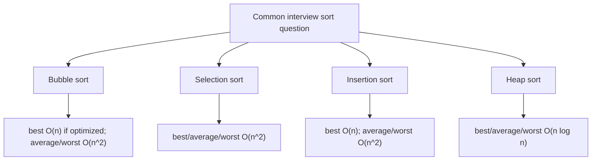
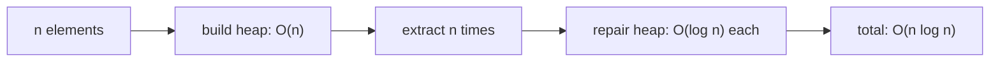

# Big-O of Common Sorting Algorithms

Big-O for sorting answers this question: as the number of elements `n` grows, how
fast does the amount of work grow? It is not the exact number of milliseconds.
Think of a kitchen counter with plates to arrange: Big-O is about how the work
grows when the pile doubles, not whether one cook is faster than another.

For interview answers, separate **best**, **average**, and **worst** cases. Also
mention extra space and stability when there is time. Sorting objects in Java may
also depend on comparison logic, so review [Comparator vs Comparable](topic:comparator-vs-comparable)
when the interviewer moves from raw complexity to production code.

## Complexity table

| Algorithm | Best | Average | Worst | Extra space | Stable? | How to remember it |
| --- | --- | --- | --- | --- | --- | --- |
| Bubble sort | `O(n)` with early-exit flag; otherwise `O(n^2)` | `O(n^2)` | `O(n^2)` | `O(1)` | Yes | Adjacent items swap like people slowly moving through a narrow checkout line. |
| Selection sort | `O(n^2)` | `O(n^2)` | `O(n^2)` | `O(1)` | Usually no | Each shelf position requires scanning the whole remaining pantry to find the smallest jar. |
| Insertion sort | `O(n)` | `O(n^2)` | `O(n^2)` | `O(1)` | Yes | Add each receipt into an already sorted folder; easy when the folder is almost sorted. |
| Heap sort | `O(n log n)` | `O(n log n)` | `O(n log n)` | `O(1)` for classic in-place heapsort | No | Build a priority pile, then repeatedly take the top item and repair the pile. |

## Why each row looks that way

**Bubble sort** repeatedly compares neighbors and swaps them if they are out of
order. After one pass, one large element has "bubbled" to its final end position.
With a `swapped` flag, already sorted input needs one pass, so best case is
`O(n)`. Without that early-exit optimization, a naive fixed-pass implementation
still does quadratic work. Kitchen analogy: if every plate is already in order,
one inspection along the counter is enough; if not, plates move only one position
at a time.

**Selection sort** chooses the minimum remaining element and puts it into the next
position. Even when the input is already sorted, it still has to scan the rest of
the array to prove the next minimum. That makes best, average, and worst time
`O(n^2)`. Its upside is only `O(n)` swaps. Post office analogy: for every empty
mail slot, the clerk still checks every remaining envelope before placing one.

**Insertion sort** maintains a sorted prefix and inserts the next element into
that prefix. If the data is already sorted or nearly sorted, each new element
barely moves, so best case is `O(n)`. If the data is reversed, each element shifts
across the whole prefix, so worst case is `O(n^2)`. Desk analogy: adding one new
invoice into a tidy folder is quick; rebuilding a folder that is in reverse order
takes repeated shifting.

**Heap sort** first builds a binary heap in `O(n)`, then extracts the largest or
smallest element `n` times. Each extraction repairs a heap of height `log n`, so
the total is `O(n log n)` in best, average, and worst cases. Warehouse analogy:
after stacking boxes into a priority pile, removing the top box is cheap, but the
stack must be repaired each time.

## 60-second interview answer

> Bubble sort is `O(n^2)` average and worst, but `O(n)` best case if implemented
> with an early-exit flag. Selection sort is `O(n^2)` in best, average, and worst
> cases because it always scans the remaining elements to find the next minimum.
> Insertion sort is `O(n)` best case on already sorted or nearly sorted data, and
> `O(n^2)` average and worst. Heap sort is `O(n log n)` in best, average, and
> worst cases: build the heap, then do `n` extractions at `O(log n)` each. The
> simple quadratic sorts are usually `O(1)` extra space; bubble and insertion are
> stable, while classic selection sort and heap sort are not.

## Production relevance

The point is not to hand-code these sorts every day. The point is to recognize
growth. `O(n^2)` algorithms can be fine for a tiny kitchen drawer of items, but
they become painful when the data turns into a warehouse shelf; see
[Why O(n^2) Complexity Is Bad](topic:quadratic-complexity). Java library sorting
uses more practical algorithms, such as TimSort for object arrays and lists, and
dual-pivot quicksort for primitive arrays. When the task involves searching after
sorting, connect the sorting cost to [Search Complexity After Sorting](topic:search-complexity-after-sorting).

## Common misconceptions

- "Selection sort is `O(n)` when the array is sorted." No. It still scans the
  remaining range for every position, like checking every envelope even when the
  mail already appears ordered.
- "Insertion sort is always quadratic." No. On sorted or nearly sorted input it
  behaves like walking along an already tidy shelf and doing almost no moves.
- "Bubble sort best case is always `O(n)`." Only the optimized version with an
  early-exit flag has that best case; a fixed-pass classroom version remains
  `O(n^2)`.
- "Heap sort needs `O(n)` extra memory." Classic array heapsort is in-place and
  uses `O(1)` extra memory; using a separate `PriorityQueue` to sort would change
  the space story.
- "`O(n log n)` is always faster for every tiny input." Asymptotically it scales
  better, but constants and nearly sorted data can make insertion sort attractive
  for small piles.
