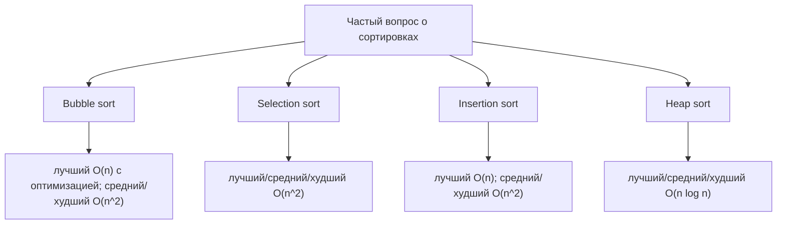
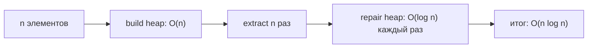

# Сложность популярных алгоритмов сортировки по Big-O

Big-O для сортировки отвечает на вопрос: как растет объем работы, когда растет
число элементов `n`? Это не точное число миллисекунд. Представьте кухонную
столешницу с тарелками, которые нужно расставить: Big-O говорит о том, как
растет работа при удвоении стопки, а не о том, какой повар быстрее.

В ответе на собеседовании разделяйте **лучший**, **средний** и **худший**
случаи. Если есть время, добавьте дополнительную память и стабильность. При
сортировке объектов в Java стоимость может зависеть еще и от логики сравнения,
поэтому полезно повторить [Comparator vs Comparable](topic:comparator-vs-comparable),
если интервьюер переходит от общей сложности к продакшен-коду.

## Таблица сложностей

| Алгоритм | Лучший | Средний | Худший | Доп. память | Стабильный? | Как запомнить |
| --- | --- | --- | --- | --- | --- | --- |
| Bubble sort | `O(n)` с флагом раннего выхода; иначе `O(n^2)` | `O(n^2)` | `O(n^2)` | `O(1)` | Да | Соседние элементы меняются местами, как люди, которые медленно продвигаются в узкой очереди к кассе. |
| Selection sort | `O(n^2)` | `O(n^2)` | `O(n^2)` | `O(1)` | Обычно нет | Для каждой позиции на полке нужно просмотреть всю оставшуюся кладовую и найти самую маленькую банку. |
| Insertion sort | `O(n)` | `O(n^2)` | `O(n^2)` | `O(1)` | Да | Каждый чек вставляется в уже отсортированную папку; легко, когда папка почти упорядочена. |
| Heap sort | `O(n log n)` | `O(n log n)` | `O(n log n)` | `O(1)` для классической in-place heapsort | Нет | Сначала строим приоритетную стопку, потом постоянно берем верхний элемент и восстанавливаем стопку. |

## Почему строки таблицы именно такие

**Bubble sort** многократно сравнивает соседние элементы и меняет их местами,
если они стоят не по порядку. После одного прохода один большой элемент
"всплывает" в свою конечную позицию справа. С флагом `swapped` уже
отсортированный вход требует один проход, поэтому лучший случай - `O(n)`. Без
этой оптимизации наивная реализация с фиксированным числом проходов все равно
делает квадратичную работу. Кухонная аналогия: если тарелки уже стоят по порядку,
достаточно один раз пройти вдоль столешницы; если нет, тарелки сдвигаются только
на одну позицию за раз.

**Selection sort** выбирает минимальный элемент из оставшихся и ставит его в
следующую позицию. Даже если вход уже отсортирован, алгоритм все равно
просматривает хвост массива, чтобы доказать, что следующий минимум найден.
Поэтому лучший, средний и худший случаи имеют время `O(n^2)`. Плюс алгоритма -
только `O(n)` обменов. Почтовая аналогия: для каждой пустой ячейки сортировщик
все равно проверяет все оставшиеся конверты, прежде чем положить один.

**Insertion sort** поддерживает отсортированный префикс и вставляет следующий
элемент внутрь этого префикса. Если данные уже отсортированы или почти
отсортированы, каждый новый элемент почти не двигается, поэтому лучший случай -
`O(n)`. Если данные идут в обратном порядке, каждый элемент сдвигается через весь
префикс, поэтому худший случай - `O(n^2)`. Аналогия с рабочим столом: добавить
один новый счет в аккуратную папку быстро; собрать папку, которая лежит в
обратном порядке, требует постоянных сдвигов.

**Heap sort** сначала строит бинарную кучу за `O(n)`, затем `n` раз извлекает
наибольший или наименьший элемент. Каждое извлечение восстанавливает кучу высоты
`log n`, поэтому итог - `O(n log n)` в лучшем, среднем и худшем случаях.
Складская аналогия: после укладки коробок в приоритетную стопку верхнюю коробку
легко снять, но после каждого снятия стопку нужно восстановить.

## Ответ на собеседовании за 60 секунд

> Bubble sort имеет `O(n^2)` в среднем и худшем случаях, но `O(n)` в лучшем
> случае, если реализован флаг раннего выхода. Selection sort имеет `O(n^2)` в
> лучшем, среднем и худшем случаях, потому что всегда просматривает оставшиеся
> элементы, чтобы найти следующий минимум. Insertion sort имеет `O(n)` в лучшем
> случае на уже отсортированных или почти отсортированных данных и `O(n^2)` в
> среднем и худшем случаях. Heap sort имеет `O(n log n)` в лучшем, среднем и
> худшем случаях: сначала строится куча, затем выполняется `n` извлечений по
> `O(log n)`. Простые квадратичные сортировки обычно используют `O(1)`
> дополнительной памяти; bubble и insertion стабильны, а классические selection
> и heap sort - нет.

## Значение в продакшене

Смысл не в том, чтобы каждый день писать эти сортировки вручную. Смысл в том,
чтобы видеть рост. Алгоритмы `O(n^2)` могут быть нормальны для маленького
кухонного ящика с предметами, но становятся болезненными, когда данные превращаются
в складской стеллаж; см. [Why O(n^2) Complexity Is Bad](topic:quadratic-complexity).
Библиотечная сортировка Java использует более практичные алгоритмы: например,
TimSort для массивов объектов и списков, а также dual-pivot quicksort для
массивов примитивов. Когда задача связана с поиском после сортировки, связывайте
стоимость сортировки с темой [Search Complexity After Sorting](topic:search-complexity-after-sorting).

## Частые заблуждения

- "Selection sort дает `O(n)` на отсортированном массиве." Нет. Он все равно
  просматривает оставшийся диапазон для каждой позиции, как сортировщик, который
  проверяет каждый конверт, хотя почта уже выглядит упорядоченной.
- "Insertion sort всегда квадратичный." Нет. На отсортированном или почти
  отсортированном входе он похож на проход вдоль аккуратной полки почти без
  перестановок.
- "Лучший случай Bubble sort всегда `O(n)`." Такой лучший случай есть только у
  оптимизированной версии с флагом раннего выхода; учебная версия с фиксированным
  числом проходов остается `O(n^2)`.
- "Heap sort требует `O(n)` дополнительной памяти." Классическая array heapsort
  работает in-place и использует `O(1)` дополнительной памяти; сортировка через
  отдельную `PriorityQueue` изменила бы расход памяти.
- "`O(n log n)` всегда быстрее на любом крошечном входе." Асимптотически он
  масштабируется лучше, но константы и почти отсортированные данные могут сделать
  insertion sort удобным для маленьких стопок.
