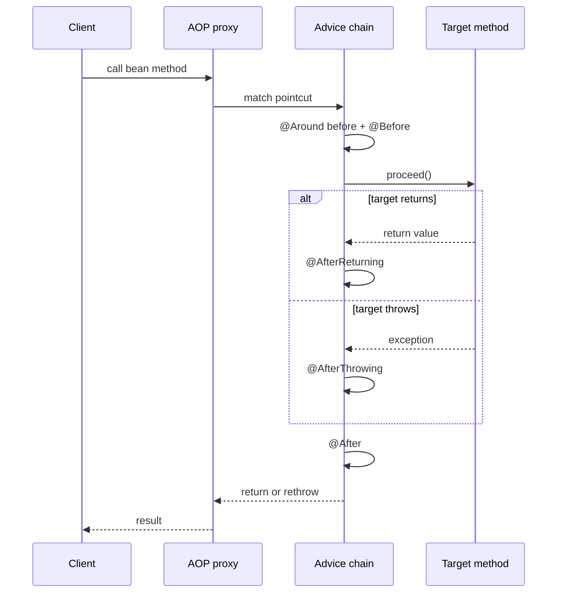
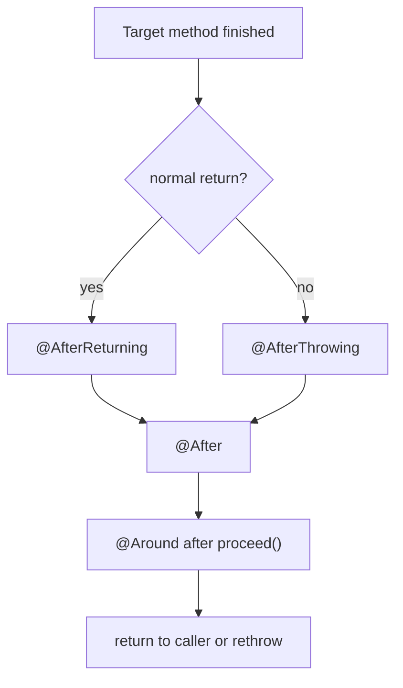

# Spring AOP Advice Types

Spring AOP advice is code that Spring runs around a matched method call on a proxied bean. If the general proxy idea is fuzzy, start with [Spring AOP basics](topic:spring-aop-basics): this topic zooms in on the five advice types and their timing. Think of the proxy like a post office counter: the customer never walks straight into the sorting room; the counter can check, stamp, route, or report the parcel before the real work continues.

The important interview point is not just naming the annotations. You should be able to say what each advice can observe, whether it runs on success or failure, and whether it can control the target call. In a kitchen analogy, some workers check the ticket before cooking, some clean after cooking, some record only successful plates, some report burned dishes, and the head chef can stop, repeat, or change the whole process.

## The five advice types

`@Before` runs before the target method starts. Use it for preconditions such as authorization checks, input audit, or simple logging where you do not need the return value. It is like a restaurant host checking the reservation before the kitchen starts cooking. If it throws, the target method does not run.

`@After` runs after the target method finishes, whether it returned normally or threw an exception. It is finally-style advice, so it fits cleanup and "this call is over" bookkeeping. It is like wiping the kitchen counter after service: you clean up whether the dish was served or dropped.

`@AfterReturning` runs only when the target method returns successfully. It can inspect the returned value and record success audit or metrics. It is like printing a receipt only after the payment terminal approves the card. Do not use it for failure logging because it will not run on exceptions.

`@AfterThrowing` runs only when an exception escapes the target method. It is good for error audit, alerts, or translating failure metadata. It is like a fire alarm in a kitchen: it reacts to smoke, but it is not the normal cooking path. It does not mean "catch and continue normally"; the exception still leaves unless the advice throws something else.

`@Around` wraps the whole invocation through `ProceedingJoinPoint.proceed()`. It can run before and after the target, measure time, change arguments, replace the result, catch exceptions, retry, or skip the target deliberately. It is like the head chef controlling the whole ticket: they can start it, pause it, send it back, or cancel it. Because it controls `proceed()`, it is the most powerful and the easiest to misuse.

## How to choose

Choose `@Before` when the work only depends on method arguments and must happen before business logic. The post office version is checking the address before accepting the parcel.

Choose `@After` for cleanup or final bookkeeping that should run for both success and failure. The kitchen version is closing the workstation at the end of an order, regardless of whether the order succeeded.

Choose `@AfterReturning` when success matters: auditing the returned DTO, publishing a success metric, or logging a completed operation. The shop version is updating the sales report only after checkout succeeds.

Choose `@AfterThrowing` when failure matters: error audit, alerts, incident tags, or exception-specific metrics. The traffic version is a crash sensor that activates only on an accident, not on every normal trip.

Choose `@Around` when you need control over the invocation itself: timing, caching, retries, transactions, or conditional execution. Many framework features, including the mental model behind [how @Transactional works](topic:spring-transactional-proxy), are easiest to explain as around-style interception. The post office version is a supervisor who can hold the parcel, reroute it, or decide whether it should be processed at all.

## 60-second interview answer

Spring AOP has five common advice types. `@Before` runs before the matched method and is used for checks or logging that does not need a result. `@After` runs after completion in both success and exception cases, like `finally`. `@AfterReturning` runs only after a normal return and can inspect the returned value. `@AfterThrowing` runs only when an exception leaves the method and is used for failure handling such as logging or alerts. `@Around` wraps the call through `proceed()`, so it can run before and after, measure time, change arguments or result, catch exceptions, retry, or skip the target. In Spring, these advices run through proxies, so proxy limitations such as self-invocation still matter.

## Production relevance

In production services, advice keeps cross-cutting behavior out of business methods: logging, metrics, security, audit, caching, and transaction boundaries. It is like keeping the restaurant's host desk, receipt printer, cleaner, and incident log separate from the cook's recipe: each job stays in the right place.

The exact advice type affects correctness. A success metric in `@After` can overcount failed calls; an error alert in `@AfterReturning` will never fire; an `@Around` advice that forgets `proceed()` silently stops the business method. That is like putting the receipt printer, smoke alarm, and head chef controls on the wrong station: the kitchen still has tools, but the process becomes unreliable.

Proxy boundaries matter too. Spring AOP normally intercepts public method calls that go through a Spring proxy. Self-calls inside the same bean can bypass advice, which is the same class of problem discussed in [@Transactional self-invocation](topic:spring-transactional-self-invocation) and [@Async self-invocation](topic:spring-async-self-invocation). It is like a staff member walking through the back door instead of the front counter: the counter checks never happen.

## Common misconceptions

`@After` is not the same as `@AfterReturning`. `@After` runs for both success and exception; `@AfterReturning` is success-only. Remember the kitchen: cleanup happens after every order, but the receipt prints only for a completed order.

`@AfterThrowing` is not a general-purpose catch block. It observes an exception that is already leaving the target method; it can log or throw another exception, but it is not the right tool for "recover and continue". Think of it like an incident report: it records the crash, it does not make the trip successful.

`@Around` is not just "before plus after". It owns `proceed()`, so it can decide whether the target method runs at all. That power is why transactions, retries, timers, and caches often feel around-like, but it also means a missing `proceed()` is like a post office supervisor keeping every parcel on the desk.

Advice order is not random. When several aspects match the same method, order can matter and should be made explicit with ordering rules. In traffic terms, the security checkpoint, toll booth, and exit gate all work, but the route is confusing if nobody defines the lane order.

Spring AOP is proxy-based, not full AspectJ weaving. It does not automatically advise every private method, constructor, field access, or self-invocation. If you expect magic everywhere, you are imagining a building where every door has a guard; Spring AOP usually guards the public front entrance through the proxy.
