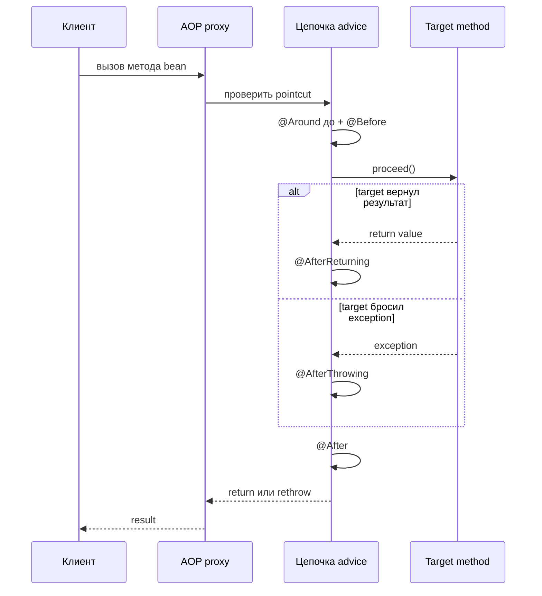
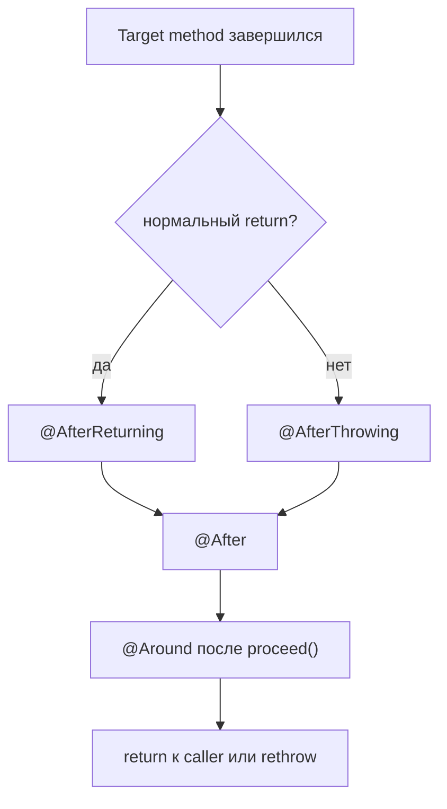

# Типы Advice в Spring AOP

Advice в Spring AOP — это код, который Spring выполняет вокруг подходящего вызова метода у proxied bean. Если общая идея proxy пока неустойчива, начни с [основ Spring AOP](topic:spring-aop-basics): эта тема фокусируется именно на пяти типах advice и их моменте выполнения. Представь proxy как стойку на почте: клиент не заходит прямо в сортировочную комнату; стойка может проверить, проштамповать, направить или зафиксировать посылку до того, как продолжится настоящая работа.

Главное на собеседовании — не просто назвать аннотации. Нужно сказать, что каждый advice может увидеть, выполняется ли он при success или failure, и может ли он управлять вызовом target. В кухонной аналогии одни сотрудники проверяют заказ до готовки, другие убирают после готовки, третьи записывают только успешные блюда, четвертые сообщают о сгоревших блюдах, а шеф может остановить, повторить или изменить весь процесс.

## Пять типов advice

`@Before` выполняется до старта target method. Используй его для preconditions: authorization checks, input audit или простого logging, где не нужен return value. Это как хост в ресторане, который проверяет бронь до того, как кухня начинает готовить. Если `@Before` бросает exception, target method не запускается.

`@After` выполняется после завершения target method, независимо от того, был нормальный return или exception. Это advice в стиле finally, поэтому он подходит для cleanup и учета "этот вызов завершился". Это как протереть кухонную стойку после смены: убираешь и после поданного блюда, и после уроненного.

`@AfterReturning` выполняется только когда target method успешно вернул результат. Он может посмотреть returned value и записать success audit или metrics. Это как распечатать чек только после того, как терминал одобрил карту. Не используй его для failure logging, потому что при exceptions он не выполнится.

`@AfterThrowing` выполняется только когда exception выходит из target method наружу. Он хорошо подходит для error audit, alerts или добавления failure metadata. Это как пожарная сигнализация на кухне: она реагирует на дым, но не является обычным путем готовки. Это не означает "поймать и продолжить нормально"; exception все равно выходит наружу, если advice не бросит что-то другое.

`@Around` оборачивает весь invocation через `ProceedingJoinPoint.proceed()`. Он может выполниться до и после target, измерить время, изменить arguments, заменить result, поймать exceptions, сделать retry или намеренно пропустить target. Это как шеф, который контролирует весь заказ: он может запустить, поставить на паузу, вернуть на переделку или отменить его. Из-за контроля над `proceed()` это самый мощный и самый опасный при ошибках тип advice.

## Как выбрать

Выбирай `@Before`, когда работа зависит только от method arguments и должна произойти до business logic. Почтовая версия — проверить адрес до приема посылки.

Выбирай `@After` для cleanup или финального учета, который должен выполниться и при success, и при failure. Кухонная версия — закрыть рабочее место в конце заказа, независимо от результата.

Выбирай `@AfterReturning`, когда важен success: audit возвращенного DTO, success metric или logging завершенной операции. Магазинная версия — обновить отчет о продажах только после успешной оплаты.

Выбирай `@AfterThrowing`, когда важен failure: error audit, alerts, incident tags или exception-specific metrics. Дорожная версия — датчик аварии, который срабатывает только при аварии, а не при каждой обычной поездке.

Выбирай `@Around`, когда нужен контроль над самим invocation: timing, caching, retries, transactions или conditional execution. Многие framework-фичи, включая ментальную модель [как работает @Transactional](topic:spring-transactional-proxy), проще объяснять как around-style interception. Почтовая версия — supervisor, который может удержать посылку, перенаправить ее или решить, надо ли вообще ее обрабатывать.

## Ответ на 60 секунд

В Spring AOP есть пять распространенных типов advice. `@Before` выполняется до подходящего метода и используется для проверок или logging, которым не нужен результат. `@After` выполняется после завершения и при success, и при exception, как `finally`. `@AfterReturning` выполняется только после нормального return и может посмотреть returned value. `@AfterThrowing` выполняется только когда exception выходит из метода, и подходит для failure handling вроде logging или alerts. `@Around` оборачивает вызов через `proceed()`, поэтому может выполниться до и после, измерить время, изменить arguments или result, поймать exceptions, сделать retry или пропустить target. В Spring эти advice работают через proxy, поэтому ограничения proxy вроде self-invocation остаются важными.

## Зачем это в production

В production-сервисах advice выносит сквозное поведение из business methods: logging, metrics, security, audit, caching и transaction boundaries. Это как держать стойку хоста, чековый принтер, уборщика и журнал инцидентов отдельно от рецепта повара: каждая работа остается на своем месте.

Правильный тип advice влияет на корректность. Success metric в `@After` может посчитать failed calls; error alert в `@AfterReturning` никогда не сработает; `@Around`, который забыл вызвать `proceed()`, тихо остановит business method. Это как поставить чековый принтер, пожарную сигнализацию и пульт шефа не на те станции: инструменты есть, но процесс становится ненадежным.

Границы proxy тоже важны. Spring AOP обычно перехватывает public method calls, которые проходят через Spring proxy. Вызовы внутри того же bean могут обходить advice, и это та же категория проблемы, что в темах про [self-invocation в @Transactional](topic:spring-transactional-self-invocation) и [self-invocation в @Async](topic:spring-async-self-invocation). Это как сотрудник, который зашел через заднюю дверь вместо стойки: проверки на стойке не произошли.

## Частые заблуждения

`@After` — не то же самое, что `@AfterReturning`. `@After` выполняется и при success, и при exception; `@AfterReturning` — только при success. Запомни кухню: уборка происходит после каждого заказа, а чек печатается только для завершенного заказа.

`@AfterThrowing` — не универсальный catch block. Он наблюдает exception, который уже выходит из target method; он может записать лог или бросить другой exception, но это не инструмент для "восстановиться и продолжить". Представь отчет об аварии: он фиксирует ДТП, но не делает поездку успешной.

`@Around` — не просто "before плюс after". Он владеет `proceed()`, поэтому решает, запустится ли target method вообще. Эта сила объясняет, почему transactions, retries, timers и caches часто выглядят around-like, но пропущенный `proceed()` похож на supervisor на почте, который оставил все посылки на столе.

Порядок advice не случайный. Когда несколько aspects подходят к одному методу, order может влиять на поведение и должен задаваться явно. В дорожной аналогии security checkpoint, toll booth и exit gate все работают, но маршрут становится непонятным, если никто не задал порядок полос.

Spring AOP основан на proxy, а не на полном AspectJ weaving. Он не начинает автоматически advise каждый private method, constructor, field access или self-invocation. Если ожидать магию везде, это как представить здание, где у каждой двери стоит охранник; Spring AOP обычно охраняет публичный главный вход через proxy.
