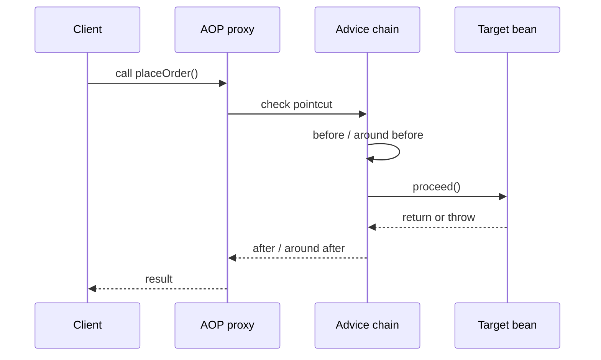
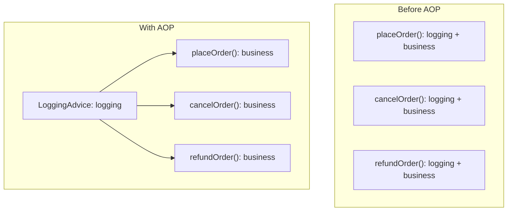

# Spring AOP and Cross-Cutting Code

## Intuition

**AOP (Aspect-Oriented Programming)** is a way to keep repeated cross-cutting behavior outside business methods. In a Spring app, that usually means code for logging, security checks, metrics, caching, or transaction boundaries is placed in an **aspect**, while `OrderService.placeOrder()` keeps only order logic. Think of a kitchen: the cook prepares dishes, while a separate hygiene checklist is handled by the shift process, not copied into every recipe.

The reason interviewers ask about AOP is duplication. Without AOP, the same "log start, check permission, measure time, catch and report" code can appear in dozens of service methods. AOP moves that shared concern into one place and lets Spring apply it where a rule says it should apply. Like a post office, every parcel does not need its own stamp desk; the parcel passes through the shared counter.

Spring AOP commonly works through a **proxy**. The caller receives a proxy object instead of the raw bean. The proxy intercepts a method call, checks whether any **pointcut** matches the method, runs the matching **advice**, then delegates to the real target bean. This fits naturally with [Spring IoC and Dependency Injection](topic:spring-ioc-di): the container controls which reference gets injected. Like traffic control, cars do not install their own traffic lights; they pass through an intersection that applies the shared rule.

## Vocabulary

- **Join point**: a place where AOP can attach behavior. In Spring AOP, the practical join point is a method execution on a Spring bean. Analogy: a service window in a post office where a clerk can step into the process.
- **Pointcut**: a rule that selects join points, such as "all service methods named `place*`". Analogy: a sorting label that says which parcels go to the fragile-items desk.
- **Advice**: code that runs at a selected join point. `before`, `after returning`, `after throwing`, and `around` are common kinds. Analogy: a clerk stamps, checks, or times the parcel before or after it is handled.
- **Aspect**: a module that groups pointcuts and advice for one concern, such as logging or security. Analogy: the whole post-office counter for fragile parcels, with both its rule and its staff.
- **Target**: the real bean that contains the business method. Analogy: the kitchen station that actually cooks the dish after the shared checklist is done.

## How a proxy applies advice

The proxy is the front counter. It sees the incoming call before the target bean does. If the pointcut matches, advice can run before the method, after a successful return, after an exception, or around the whole call. The target method stays focused on business work, like a cook focusing on the recipe while the kitchen process handles timing, labels, and cleanliness checks.

`around` advice is the most powerful form because it controls `proceed()`. It can run code before the target, decide whether to call the target, change the result, handle an exception, or run code afterward. Like a traffic officer at a crossing, it can stop, let through, reroute, or record the passing car. That power is useful, but it also means `around` advice should be easy to understand and tested.

## How AOP removes duplicated code

Without AOP, every method carries its own copy of the same cross-cutting code. With AOP, the concern becomes a single advice and the pointcut describes where it applies. Like a restaurant putting one hand-washing station at the kitchen entrance, each cook follows the same rule without adding sink instructions to every recipe.

This is why `@Transactional` is usually explained with AOP: the transaction boundary is cross-cutting, so Spring can wrap the method call with begin, commit, and rollback logic. For the focused transaction version, see [How @Transactional Works (Proxy / AOP)](topic:spring-transactional-proxy). Like a checkout counter, payment rules surround many products without being printed inside every product description.

## Production relevance

AOP is common in production Spring systems for logging, audit trails, metrics, tracing, caching, authorization, retries, and transactions. These concerns often apply to many services and need consistent behavior. Like a traffic system, it is safer to maintain one speed camera rule than to ask every driver to remember a custom rule per street.

AOP also makes policy changes cheaper. If audit format changes, you update one aspect instead of editing every service method. Like a post office changing the stamp design at one counter, old parcel instructions do not need to be rewritten one by one.

It also keeps code review cleaner. Reviewers can read business logic without skipping repeated boilerplate, and they can review cross-cutting policy in the aspect. Like a kitchen recipe, the ingredient list stays readable because fire-safety rules live in the kitchen manual.

## Limits and traps

Spring AOP is usually **proxy-based**, so advice runs only when the call enters through the proxy. A same-class call like `this.save()` can bypass the proxy, so the advice does not run. This is the same trap behind [@Transactional Self-Invocation](topic:spring-transactional-self-invocation). Like entering a post office through a side door, you miss the counter that was supposed to stamp the parcel.

Private methods are not good AOP entry points, and final methods/classes can be a problem for subclass-based proxies. A proxy must be able to intercept a visible method call. Like a guard at a public door, it cannot check someone who teleports into a locked storage room.

Pointcuts can be too broad or too narrow. A broad pointcut may apply advice to methods you did not intend; a narrow pointcut may miss the real method. Like a traffic sign placed on the wrong road, the rule is either over-applied or ignored.

AOP should not hide important domain behavior. If the behavior is part of the core business rule, put it in ordinary code. AOP fits supporting policies that cut across many use cases. Like kitchen safety, a shared checklist is useful, but the recipe still needs to say whether the dish is soup or bread. This is also why AOP is related to, but not the same as, [Decorator vs Proxy](topic:decorator-vs-proxy) or basic [OOP Principles](topic:oop-principles).

Advice order matters. If security, transactions, metrics, and retries all apply, their order changes what is measured, what is protected, and what rolls back. Like a checkout line, scanning, payment, bagging, and receipt printing must happen in the right order.

## 60-second interview answer

> AOP is Aspect-Oriented Programming. It helps move cross-cutting concerns, such as logging, security, metrics, caching, and transactions, out of business methods into aspects. In Spring, this is usually implemented with proxies: the caller invokes a proxy, the proxy checks pointcuts, runs matching advice, and then delegates to the target bean. This reduces duplicated code because one advice can apply to many methods. The main trap is that proxy-based AOP works only when the call goes through the proxy, so self-invocation, private methods, and some final methods may not be advised.

## Common misconceptions

- **"AOP means annotations magically execute."** Not exactly. An annotation is often just metadata; Spring infrastructure must create a proxy and attach advice. Like a parcel label, it matters only if the sorting counter reads it.
- **"AOP is only for logging."** Logging is the easy example, but transactions, security, metrics, tracing, caching, and retries are common too. Like a post office counter, it can stamp, weigh, scan, and route.
- **"AOP removes all duplication."** It removes duplicated cross-cutting code, not repeated business decisions. Like one traffic light system, it manages intersections; it does not decide every driver's destination.
- **"If the method has `@Transactional`, it always works."** In Spring, transaction advice is AOP-based, so proxy limits matter. The dedicated topic on [How @Transactional Works (Proxy / AOP)](topic:spring-transactional-proxy) goes deeper.
- **"AOP is always cleaner."** Too many hidden aspects make control flow hard to reason about. Like a kitchen with invisible rules, it can slow everyone down unless the rules are few, clear, and documented.
