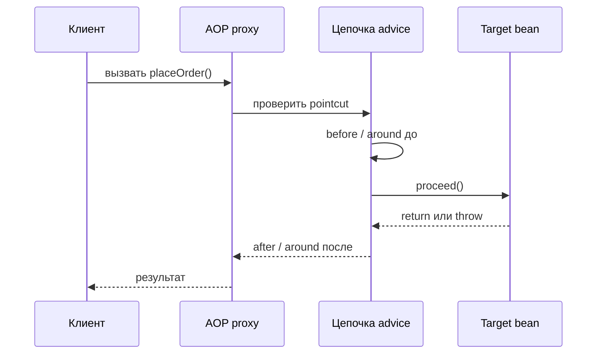
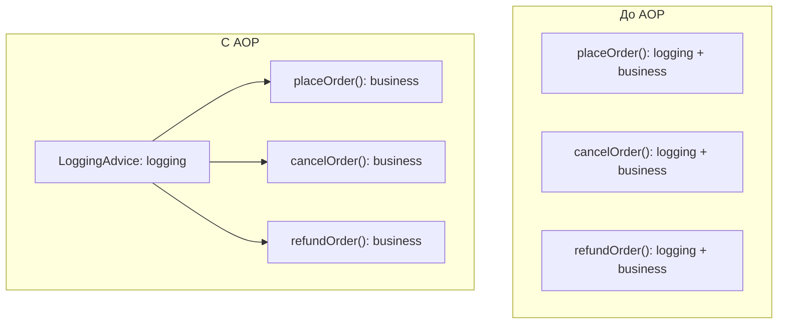

# Spring AOP и сквозной код

## Интуиция

**AOP (Aspect-Oriented Programming)** - это способ держать повторяющееся сквозное поведение вне бизнес-методов. В Spring-приложении это обычно означает, что code для logging, security checks, metrics, caching или transaction boundaries находится в **aspect**, а `OrderService.placeOrder()` содержит только логику заказа. Представь кухню: повар готовит блюда, а отдельный процесс смены следит за hygiene checklist, вместо того чтобы копировать его в каждый рецепт.

На собеседованиях про AOP спрашивают из-за дублирования. Без AOP один и тот же code "log start, check permission, measure time, catch and report" может оказаться в десятках service methods. AOP переносит этот общий concern в одно место и позволяет Spring применить его там, где правило говорит применить. Как на почте: каждой посылке не нужен собственный стол для штампов, она проходит через общий counter.

Spring AOP часто работает через **proxy**. Вызывающий код получает proxy object вместо raw bean. Proxy перехватывает method call, проверяет, подходит ли какой-нибудь **pointcut** к методу, запускает подходящий **advice**, а затем делегирует реальному target bean. Это естественно сочетается со [Spring IoC and Dependency Injection](topic:spring-ioc-di): container контролирует, какая ссылка будет внедрена. Как на дороге: машины не устанавливают себе traffic lights, они проезжают через перекрёсток, где применяется общее правило.

## Словарь

- **Join point**: место, куда AOP может прикрепить поведение. В Spring AOP практический join point - это method execution на Spring bean. Аналогия: окно обслуживания на почте, где clerk может встроиться в процесс.
- **Pointcut**: правило, которое выбирает join points, например "все service methods с именем `place*`". Аналогия: сортировочная наклейка, которая говорит, какие посылки идут к fragile-items desk.
- **Advice**: code, который выполняется в выбранном join point. Частые виды: `before`, `after returning`, `after throwing` и `around`. Аналогия: clerk ставит штамп, проверяет или замеряет время до или после обработки посылки.
- **Aspect**: модуль, который группирует pointcuts и advice для одного concern, например logging или security. Аналогия: целый почтовый counter для хрупких посылок, где есть и правило, и сотрудники.
- **Target**: реальный bean, содержащий business method. Аналогия: кухонная станция, которая действительно готовит блюдо после общей проверки.

## Как proxy применяет advice

Proxy - это передний counter. Он видит входящий вызов раньше, чем target bean. Если pointcut подходит, advice может выполниться до метода, после успешного возврата, после exception или вокруг всего вызова. Target method остаётся сосредоточенным на бизнес-работе, как повар сосредоточен на рецепте, пока кухонный процесс отвечает за timing, labels и cleanliness checks.

`around` advice - самая мощная форма, потому что она контролирует `proceed()`. Она может выполнить code до target, решить, вызывать ли target, изменить result, обработать exception или выполнить code после. Как traffic officer на переходе, она может остановить, пропустить, перенаправить или записать проезжающую машину. Эта сила полезна, но значит, что `around` advice должен быть понятным и покрытым тестами.

## Как AOP убирает дублирование

Без AOP каждый метод несёт собственную копию одного и того же cross-cutting code. С AOP concern становится одним advice, а pointcut описывает, где он применяется. Как ресторан ставит одну станцию для мытья рук у входа на кухню: каждый повар следует одному правилу, но инструкции про раковину не добавляются в каждый рецепт.

Поэтому `@Transactional` часто объясняют через AOP: transaction boundary является cross-cutting concern, и Spring может обернуть method call логикой begin, commit и rollback. Подробная версия про транзакции есть в теме [How @Transactional Works (Proxy / AOP)](topic:spring-transactional-proxy). Как касса, правила оплаты окружают множество товаров, но не печатаются внутри описания каждого товара.

## Практическая польза

AOP часто встречается в production Spring systems для logging, audit trails, metrics, tracing, caching, authorization, retries и transactions. Эти concerns обычно применяются ко многим services и должны вести себя одинаково. Как traffic system: безопаснее поддерживать одно правило speed camera, чем просить каждого водителя помнить отдельное правило для каждой улицы.

AOP также удешевляет изменение политик. Если меняется audit format, ты обновляешь один aspect, а не каждый service method. Как на почте при смене дизайна штампа: меняется один counter, а старые инструкции для посылок не переписываются по одной.

Code review тоже становится чище. Ревьюер читает business logic без повторяющегося boilerplate и отдельно проверяет cross-cutting policy в aspect. Как в кухонном рецепте: список ингредиентов остаётся читаемым, потому что fire-safety rules живут в kitchen manual.

## Ограничения и ловушки

Spring AOP обычно **proxy-based**, поэтому advice выполняется только тогда, когда вызов входит через proxy. Вызов внутри того же класса, например `this.save()`, может обойти proxy, и advice не выполнится. Это та же ловушка, что в теме [@Transactional Self-Invocation](topic:spring-transactional-self-invocation). Как вход на почту через боковую дверь: ты минуешь counter, который должен был поставить штамп.

Private methods - плохие точки входа для AOP, а final methods/classes могут быть проблемой для subclass-based proxies. Proxy должен иметь возможность перехватить видимый method call. Как guard у публичной двери: он не проверит того, кто оказался внутри закрытой кладовой.

Pointcuts могут быть слишком широкими или слишком узкими. Широкий pointcut применит advice к методам, которые ты не планировал; узкий pointcut пропустит нужный метод. Как traffic sign на неправильной дороге: правило либо применяется слишком широко, либо игнорируется.

AOP не должен прятать важное domain behavior. Если поведение является частью core business rule, оставь его в обычном code. AOP подходит для supporting policies, которые проходят через многие use cases. Как kitchen safety: общий checklist полезен, но recipe всё равно должен сказать, что это soup или bread. Поэтому AOP связано, но не совпадает с [Decorator vs Proxy](topic:decorator-vs-proxy) или базовыми [OOP Principles](topic:oop-principles).

Порядок advice важен. Если одновременно применяются security, transactions, metrics и retries, их порядок меняет, что измеряется, что защищается и что откатывается. Как очередь на кассе: scanning, payment, bagging и receipt printing должны идти в правильном порядке.

## Ответ за 60 секунд

> AOP - это Aspect-Oriented Programming. Оно помогает вынести cross-cutting concerns, такие как logging, security, metrics, caching и transactions, из business methods в aspects. В Spring это обычно реализовано через proxies: вызывающий код обращается к proxy, proxy проверяет pointcuts, запускает подходящий advice и затем делегирует target bean. Это уменьшает дублирование, потому что один advice может применяться ко многим methods. Главная ловушка: proxy-based AOP работает только когда вызов идёт через proxy, поэтому self-invocation, private methods и некоторые final methods могут не получить advice.

## Частые заблуждения

- **"AOP означает, что annotations магически выполняются."** Не совсем. Annotation часто является только metadata; Spring infrastructure должна создать proxy и подключить advice. Как наклейка на посылке: она важна только если сортировочный counter её прочитал.
- **"AOP нужно только для logging."** Logging - простой пример, но transactions, security, metrics, tracing, caching и retries тоже частые варианты. Как почтовый counter: он может штамповать, взвешивать, сканировать и маршрутизировать.
- **"AOP убирает всё дублирование."** Оно убирает duplicated cross-cutting code, а не повторяющиеся business decisions. Как единая система traffic lights: она управляет перекрёстками, но не решает, куда едет каждый водитель.
- **"Если у метода есть `@Transactional`, оно всегда работает."** В Spring transaction advice основан на AOP, поэтому ограничения proxy важны. Тема [How @Transactional Works (Proxy / AOP)](topic:spring-transactional-proxy) разбирает это глубже.
- **"AOP всегда делает код чище."** Слишком много скрытых aspects усложняет control flow. Как кухня с невидимыми правилами, это замедляет всех, если правила не короткие, ясные и задокументированные.
