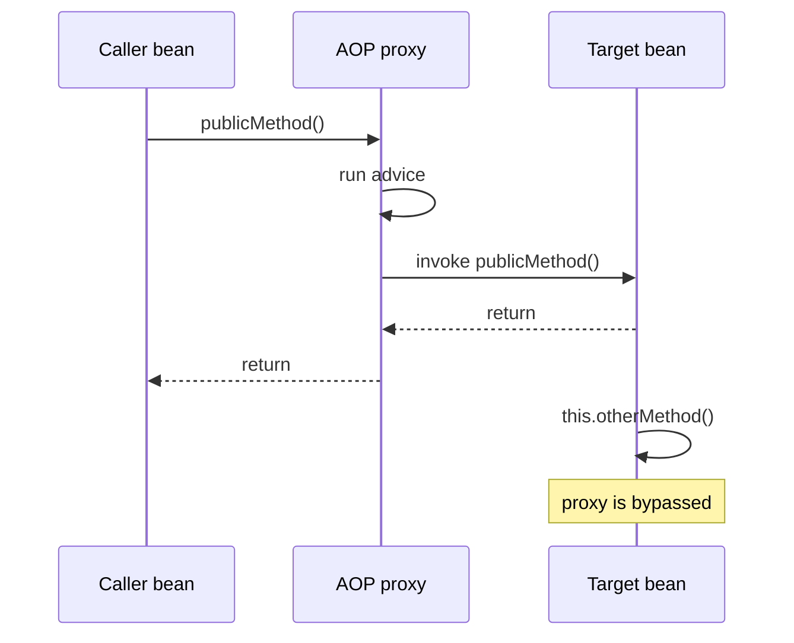
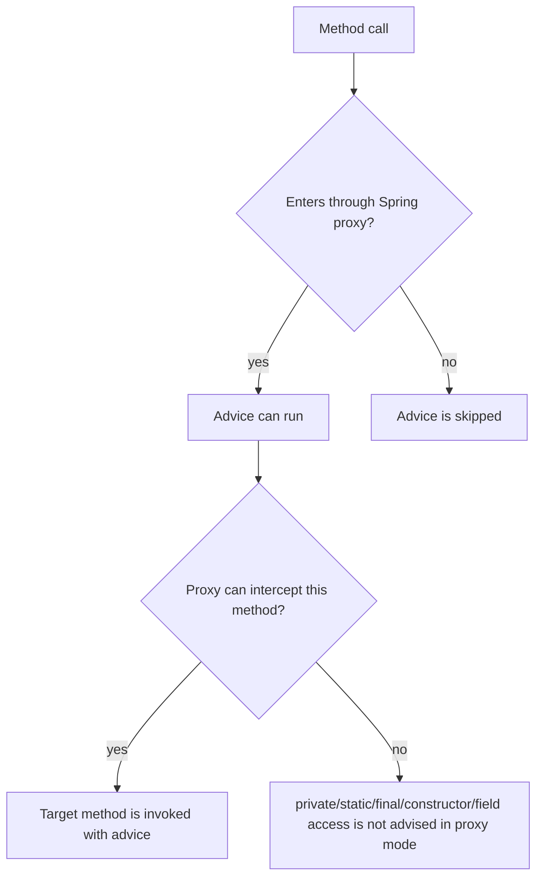

# Spring AOP Proxy Limitations

Spring AOP is mostly proxy-based. Spring creates a wrapper object around a bean,
and callers usually interact with that wrapper, not directly with the target
object. The wrapper can run advice before, after, or around the target method.
Post office analogy: the clerk at the counter can stamp, weigh, and route a
parcel only when the parcel is handed through the counter.

This is the boundary behind many Spring surprises. The broader idea is covered
in [Spring AOP and Cross-Cutting Code](topic:spring-aop-basics), and the same
rule explains transaction behavior in
[How @Transactional Works (Proxy / AOP)](topic:spring-transactional-proxy).
Traffic analogy: a toll gate can charge cars that pass through the gate; it
cannot charge cars already moving inside the parking lot.

## The proxy is the doorway

In default Spring AOP, advice runs when a method call enters a Spring-managed
bean through its proxy. If the call does not cross that proxy, the advice has no
place to attach. Kitchen analogy: the quality check happens at the serving pass;
if a dish moves between two prep tables, the pass never sees it.



Spring can create proxies in two common ways. A JDK dynamic proxy implements an
interface and intercepts calls made through that interface. A CGLIB proxy creates
a subclass and overrides eligible methods. Both are still proxies, so both only
help when the caller enters through the proxy object. Post office analogy: one
counter uses a paper form and another uses a scanner, but both still require the
customer to come to the counter.



## Private methods

A private method is not a public entry point into a bean. With JDK dynamic
proxies, only interface methods can be proxied, and interface methods are not
private business methods. With CGLIB, private methods cannot be overridden by the
subclass proxy, so the proxy cannot wrap their execution. Kitchen analogy: a
staff-only drawer inside the kitchen cannot act as the public serving pass.

That means annotations such as `@Transactional`, `@Cacheable`, `@Async`, or a
custom `@Around` pointcut on a private method are usually a design smell in
proxy-based Spring AOP. The annotation may be visible in source code, but no
proxy call reaches it. Post office analogy: writing "registered mail" inside a
closed box does not register the parcel unless the clerk handles it.

```java
@Service
public class ReportService {
    public void generate() {
        loadData(); // direct internal call
    }

    @Measured
    private void loadData() {
        // Spring AOP proxy mode will not advise this private method
    }
}
```

## Static methods

A static method belongs to the class, not to a bean instance. Spring AOP proxies
wrap bean instances, so a static call such as `ReportUtils.normalize()` has no
proxy instance to pass through. Traffic analogy: a speed camera at a driveway can
see cars using that driveway, not a map printed on the wall.

Static helpers also tend to hide dependencies from Spring. If cross-cutting
behavior matters, prefer an injected Spring bean with an instance method, or keep
the static helper pure and let the caller's proxied method own the transaction,
security, cache, or metrics boundary. Kitchen analogy: a shared knife can be
useful, but food-safety checks belong at the staffed station, not inside the
knife.

## Self-invocation

Self-invocation is the most common interview trap. If one method in a bean calls
another method in the same bean, Java uses `this.otherMethod()`. That is a direct
call on the target object, not a call out to the Spring proxy and back in.
Traffic analogy: a delivery van moving from one warehouse door to another never
passes the toll gate outside.

```java
@Service
public class PaymentService {
    public void checkout() {
        chargeCard(); // really this.chargeCard()
    }

    @Measured
    public void chargeCard() {
        // advice is skipped when reached by self-invocation
    }
}
```

The same shape appears in
[@Transactional Self-Invocation](topic:spring-transactional-self-invocation) and
[@Async and Self-Invocation](topic:spring-async-self-invocation). The symptom
changes, but the cause is the same: the framework behavior lives at the proxy
boundary. Post office analogy: tracking, express delivery, and insurance are
different services, but all start at the counter.

## Other proxy-mode limits

Spring AOP only supports method execution join points on Spring beans. It does
not advise field reads, field writes, constructors, local object creation with
`new`, or arbitrary calls on objects that Spring did not create. Kitchen analogy:
the restaurant can inspect plates moving through its pass, not groceries already
inside someone's private backpack.

Final classes and final methods are also a problem for CGLIB because subclass
proxies cannot override them. JDK dynamic proxies can still proxy interface calls,
but the call must be made through an interface proxy. This is why proxy type
matters, but it does not remove the core boundary rule. Traffic analogy: changing
the toll booth design does not help a car that never reaches any booth.

Spring AOP is also not full AspectJ. AspectJ can weave advice into bytecode and
therefore cover cases that proxy mode cannot, but it adds build or runtime
weaving setup and operational complexity. Post office analogy: installing
sensors inside every sorting room catches more movements, but it is much heavier
than using the front counter correctly.

## How to fix missed advice

The cleanest fix is usually to move the advised operation to another Spring bean
and inject that collaborator. The call now goes from one bean to another, so it
enters through the collaborator's proxy. Kitchen analogy: hand the dish back
through the serving pass instead of sliding it between prep tables.

Another clean fix is to move the annotation to the outer public method if the
whole workflow should share one boundary. For example, if `checkout()` is the
real unit of work, annotate `checkout()` rather than a helper it calls. Post
office analogy: insure the whole parcel at the counter, not one item already
inside the parcel.

Self-injection, `ObjectProvider`, `@Lazy`, or `AopContext.currentProxy()` can make
the code call its own proxy deliberately. These are escape hatches, not the
default design, because they couple business code to Spring proxy mechanics and
can make dependencies harder to reason about. Traffic analogy: driving out of
the parking lot and back through the toll gate works, but it is a strange route
to make normal.

Programmatic APIs can be clearer when the boundary is truly local. For
transactions, `TransactionTemplate` makes the transaction boundary explicit
without depending on an AOP call. Kitchen analogy: the cook opens a numbered
order envelope at the workstation instead of hoping the plate crossed the pass.

## 60-second interview answer

> Spring AOP is usually proxy-based, so advice runs only when a call enters a
> Spring-managed bean through its proxy. Private methods are not suitable
> join points in this model: JDK proxies expose interface methods, and CGLIB
> proxies cannot override private methods. Static methods belong to the class,
> not to a proxied bean instance, so there is no proxy dispatch to intercept.
> Calls inside the same class are normal `this.method()` calls on the target
> object, so they bypass the proxy too. The practical fix is to put the advised
> method on a public/proxy-reachable method, move it to another Spring bean,
> annotate the outer method when that is the real boundary, or use a programmatic
> API. If you truly need non-proxy join points, consider AspectJ weaving, but it
> is more complex.

## Production relevance

These limits cause quiet bugs. Logging, metrics, security, caching,
`@Transactional`, and `@Async` code may appear configured but never run on a
specific path. Post office analogy: the package still moves, but without the
stamp you expected, nobody can prove the service was applied.

Design service boundaries so important cross-cutting behavior sits on methods
called from outside the bean. This also makes tests clearer because a Spring
integration test calling the proxy will exercise the same path production uses.
Traffic analogy: design the road so every billable trip naturally passes the
toll gate.

The proxy rule connects strongly to the [Decorator vs Proxy](topic:decorator-vs-proxy)
discussion: a proxy controls access only when the caller uses the proxy. It also
fits Spring's [IoC and Dependency Injection](topic:spring-ioc-di) model because
the object you inject is often not the raw target. Kitchen analogy: if the waiter
hands dishes through the official pass, the kitchen process works; if someone
grabs plates directly, the process is skipped.

## Common misconceptions

- "`@Around` can intercept any Java method." No. Spring AOP proxy mode intercepts
  method executions reached through Spring proxies. Kitchen analogy: the serving
  pass cannot inspect every movement inside the building.
- "CGLIB fixes self-invocation." No. CGLIB changes how the proxy is built, but an
  internal `this.method()` call still does not re-enter the proxy. Traffic
  analogy: a better toll gate does not see cars already inside the lot.
- "A private annotated method should work because reflection can see the
  annotation." No. Seeing metadata is not the same as intercepting a call. Post
  office analogy: reading a label through a window is not the same as processing
  the parcel at the counter.
- "A static utility can have transactional behavior if it is annotated." No.
  Static methods are not invoked on a Spring proxy instance. Kitchen analogy: a
  recipe card is not a staffed station.
- "Calling `new SomeService()` is equivalent to injecting it." No. Manually
  created objects are not Spring-managed proxies. Traffic analogy: a private
  driveway is not connected to the toll system.
- "AspectJ and Spring AOP have the same capabilities." No. AspectJ weaving can
  advise more join points, while Spring AOP intentionally keeps the proxy model
  simpler. Post office analogy: counter service and full warehouse sensor
  coverage are different operating models.
