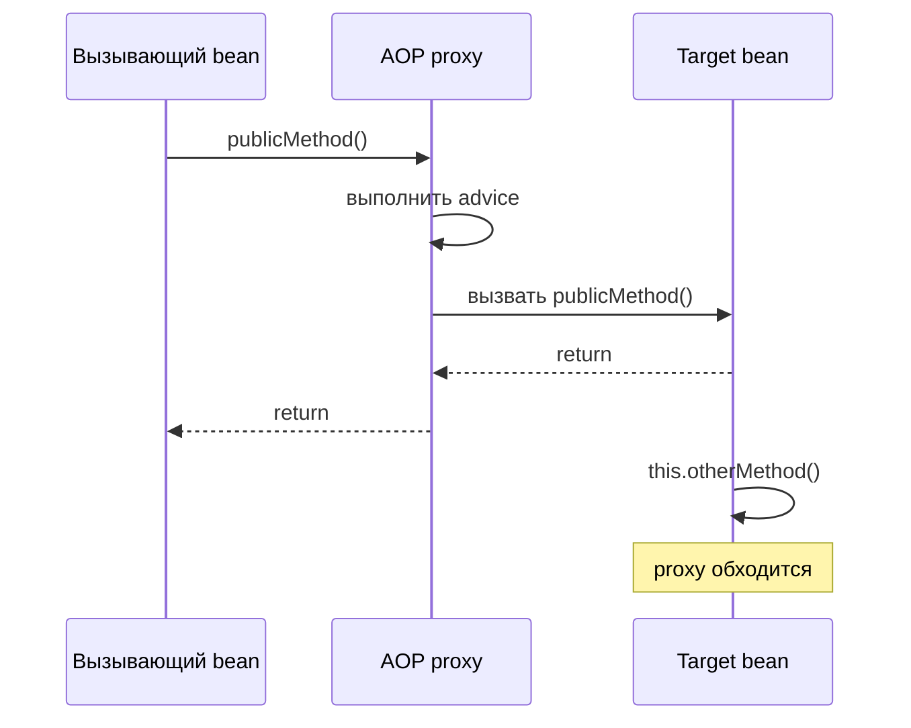
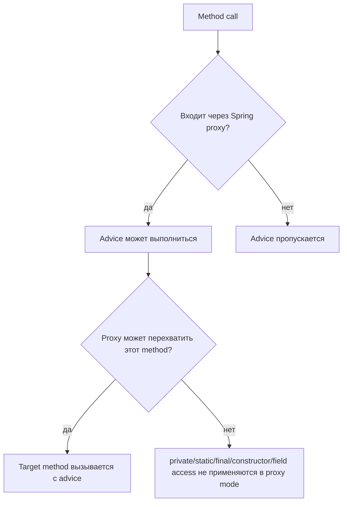

# Ограничения Spring AOP proxy

Spring AOP в основном proxy-based. Spring создаёт объект-обёртку вокруг bean, и
вызывающий код обычно работает с этой обёрткой, а не напрямую с target object.
Обёртка может выполнить advice до, после или вокруг target method. Аналогия с
почтой: сотрудник за стойкой может поставить штамп, взвесить и направить посылку
только тогда, когда посылку передали через стойку.

Это граница, из-за которой появляются многие сюрпризы в Spring. Более широкая
идея разобрана в [Spring AOP and Cross-Cutting Code](topic:spring-aop-basics), и
это же правило объясняет поведение транзакций в
[How @Transactional Works (Proxy / AOP)](topic:spring-transactional-proxy).
Дорожная аналогия: шлагбаум может взять оплату с машин, которые проехали через
него; он не может взять оплату с машин, которые уже ездят внутри парковки.

## Proxy — это входная дверь

В стандартном Spring AOP advice выполняется, когда method call входит в
Spring-managed bean через его proxy. Если вызов не пересекает этот proxy, advice
негде прицепиться. Кухонная аналогия: проверка качества происходит на раздаче;
если блюдо перемещают между двумя prep tables, раздача его не видит.



Spring может создавать proxy двумя распространёнными способами. JDK dynamic
proxy реализует interface и перехватывает вызовы через этот interface. CGLIB
proxy создаёт subclass и переопределяет подходящие методы. Но оба варианта всё
равно остаются proxy, поэтому помогают только тогда, когда вызывающий код входит
через proxy object. Аналогия с почтой: одна стойка использует бумажный бланк, а
другая сканер, но клиент всё равно должен прийти к стойке.



## Private methods

Private method не является публичной точкой входа в bean. С JDK dynamic proxies
можно проксировать только interface methods, а interface methods не являются
private business methods. С CGLIB private methods нельзя переопределить в
subclass proxy, поэтому proxy не может обернуть их выполнение. Кухонная
аналогия: служебный ящик внутри кухни не может быть публичной раздачей.

Это значит, что annotations вроде `@Transactional`, `@Cacheable`, `@Async` или
custom `@Around` pointcut на private method обычно являются design smell в
proxy-based Spring AOP. Annotation может быть видна в source code, но ни один
proxy call до неё не доходит. Почтовая аналогия: надпись "registered mail"
внутри закрытой коробки не зарегистрирует посылку, если сотрудник не обработал
её на стойке.

```java
@Service
public class ReportService {
    public void generate() {
        loadData(); // direct internal call
    }

    @Measured
    private void loadData() {
        // Spring AOP proxy mode will not advise this private method
    }
}
```

## Static methods

Static method принадлежит class, а не экземпляру bean. Spring AOP proxies
оборачивают экземпляры bean, поэтому у static call вроде
`ReportUtils.normalize()` нет proxy instance, через который можно пройти.
Дорожная аналогия: камера скорости у подъездной дорожки видит машины на этой
дорожке, а не карту, напечатанную на стене.

Static helpers также часто прячут зависимости от Spring. Если cross-cutting
behavior действительно важен, лучше использовать injected Spring bean с instance
method или оставить static helper чистым, а boundary для transaction, security,
cache или metrics держать в proxied method вызывающего кода. Кухонная аналогия:
общий нож может быть полезен, но food-safety checks должны быть на рабочей
станции с сотрудником, а не внутри ножа.

## Self-invocation

Self-invocation — самый частый подвох на собеседованиях. Если один method внутри
bean вызывает другой method того же bean, Java использует `this.otherMethod()`.
Это прямой вызов на target object, а не выход к Spring proxy и вход обратно.
Дорожная аналогия: фургон, который едет от одной двери склада к другой, не
проезжает внешний шлагбаум.

```java
@Service
public class PaymentService {
    public void checkout() {
        chargeCard(); // really this.chargeCard()
    }

    @Measured
    public void chargeCard() {
        // advice is skipped when reached by self-invocation
    }
}
```

Та же форма ошибки встречается в
[@Transactional Self-Invocation](topic:spring-transactional-self-invocation) и
[@Async and Self-Invocation](topic:spring-async-self-invocation). Симптом
меняется, но причина та же: framework behavior живёт на proxy boundary. Почтовая
аналогия: tracking, express delivery и insurance — разные услуги, но все они
начинаются у стойки.

## Другие ограничения proxy mode

Spring AOP поддерживает только method execution join points на Spring beans. Он
не применяет advice к field reads, field writes, constructors, созданию объектов
через `new` или произвольным вызовам на объектах, которые Spring не создавал.
Кухонная аналогия: ресторан может проверять тарелки на своей раздаче, но не
продукты, которые уже лежат в чьём-то личном рюкзаке.

Final classes и final methods также проблемны для CGLIB, потому что subclass
proxies не могут их переопределить. JDK dynamic proxies всё ещё могут
проксировать interface calls, но вызов должен идти через interface proxy. Поэтому
тип proxy важен, но он не отменяет главное правило boundary. Дорожная аналогия:
смена конструкции шлагбаума не поможет машине, которая вообще не подъехала ни к
какому шлагбауму.

Spring AOP также не является полным AspectJ. AspectJ может встраивать advice в
bytecode и поэтому покрывать случаи, недоступные proxy mode, но он добавляет
build или runtime weaving setup и операционную сложность. Почтовая аналогия:
датчики внутри каждой сортировочной комнаты ловят больше движений, но это
значительно тяжелее, чем правильно пользоваться передней стойкой.

## Как исправить пропущенный advice

Самое чистое исправление обычно — вынести advised operation в другой Spring bean
и внедрить этот collaborator. Тогда вызов идёт из одного bean в другой, значит,
он входит через proxy collaborator. Кухонная аналогия: передайте блюдо обратно
через раздачу, а не проталкивайте его между prep tables.

Другое чистое исправление — перенести annotation на внешний public method, если
весь workflow должен иметь одну boundary. Например, если `checkout()` — реальная
unit of work, аннотируйте `checkout()`, а не helper, который он вызывает.
Почтовая аналогия: страхуйте всю посылку на стойке, а не один предмет, уже
лежащий внутри посылки.

Self-injection, `ObjectProvider`, `@Lazy` или `AopContext.currentProxy()` могут
заставить код намеренно вызвать собственный proxy. Это запасные выходы, а не
базовый дизайн, потому что они связывают business code с механикой Spring proxy
и усложняют понимание зависимостей. Дорожная аналогия: выехать с парковки и
снова въехать через шлагбаум можно, но странно делать это обычным маршрутом.

Programmatic APIs могут быть понятнее, когда boundary действительно локальна.
Для транзакций `TransactionTemplate` делает transaction boundary явной в коде и
не зависит от AOP call. Кухонная аналогия: повар открывает пронумерованный
конверт заказа прямо на рабочем месте, а не надеется, что тарелка прошла через
раздачу.

## Ответ за 60 секунд

> Spring AOP обычно proxy-based, поэтому advice выполняется только тогда, когда
> вызов входит в Spring-managed bean через его proxy. Private methods не являются
> подходящими join points в этой модели: JDK proxies показывают interface
> methods, а CGLIB proxies не могут переопределить private methods. Static
> methods принадлежат class, а не proxied bean instance, поэтому нет proxy
> dispatch, который можно перехватить. Вызовы внутри того же класса — это
> обычные `this.method()` calls на target object, поэтому они тоже обходят proxy.
> Практическое исправление — поместить advised method на public/proxy-reachable
> method, вынести его в другой Spring bean, аннотировать внешний method, если он
> и есть настоящая boundary, или использовать programmatic API. Если действительно
> нужны non-proxy join points, можно рассмотреть AspectJ weaving, но он сложнее.

## Почему это важно в production

Эти ограничения создают тихие ошибки. Logging, metrics, security, caching,
`@Transactional` и `@Async` могут выглядеть настроенными, но не выполняться на
конкретном пути. Почтовая аналогия: посылка всё ещё движется, но без ожидаемого
штампа никто не докажет, что услуга была применена.

Проектируйте service boundaries так, чтобы важное cross-cutting behavior стояло
на методах, вызываемых снаружи bean. Это также делает тесты понятнее, потому что
Spring integration test, вызывающий proxy, проверит тот же путь, что и
production. Дорожная аналогия: спроектируйте дорогу так, чтобы каждая оплачиваемая
поездка естественно проходила через шлагбаум.

Правило proxy тесно связано с темой [Decorator vs Proxy](topic:decorator-vs-proxy):
proxy контролирует доступ только тогда, когда вызывающий код использует proxy.
Оно также соответствует модели [IoC and Dependency Injection](topic:spring-ioc-di)
в Spring, потому что объект, который вы inject, часто не является raw target.
Кухонная аналогия: если официант отдаёт блюда через официальную раздачу, процесс
кухни работает; если кто-то забирает тарелки напрямую, процесс пропускается.

## Частые заблуждения

- "`@Around` может перехватить любой Java method." Нет. Spring AOP proxy mode
  перехватывает method executions, достигнутые через Spring proxies. Кухонная
  аналогия: раздача не может проверить каждое движение внутри здания.
- "CGLIB исправляет self-invocation." Нет. CGLIB меняет способ создания proxy, но
  внутренний вызов `this.method()` всё равно не входит обратно в proxy. Дорожная
  аналогия: лучший шлагбаум не видит машины, которые уже внутри парковки.
- "Private annotated method должен работать, потому что reflection видит
  annotation." Нет. Видеть metadata — не то же самое, что перехватывать вызов.
  Почтовая аналогия: прочитать наклейку через окно не значит обработать посылку
  на стойке.
- "Static utility может иметь transactional behavior, если поставить
  annotation." Нет. Static methods не вызываются на Spring proxy instance.
  Кухонная аналогия: карточка с рецептом — не рабочая станция с сотрудником.
- "Вызов `new SomeService()` эквивалентен inject." Нет. Объекты, созданные
  вручную, не являются Spring-managed proxies. Дорожная аналогия: частная
  подъездная дорога не подключена к системе шлагбаумов.
- "AspectJ и Spring AOP имеют одинаковые возможности." Нет. AspectJ weaving может
  применять advice к большему числу join points, а Spring AOP намеренно держит
  proxy model проще. Почтовая аналогия: обслуживание на стойке и полное покрытие
  датчиками склада — разные операционные модели.
