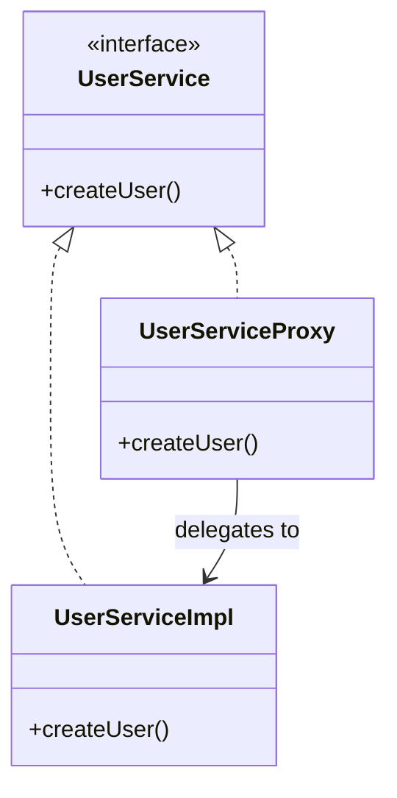
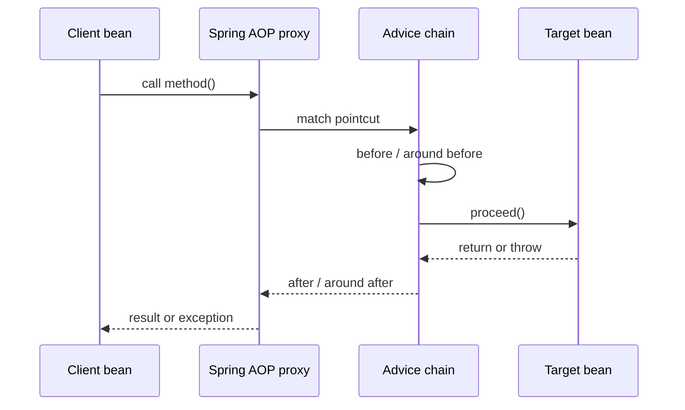

# Spring AOP Proxy

## Intuition

A **Spring AOP proxy** is a Spring-managed wrapper object around a real bean. The caller usually receives the wrapper, not the raw target object, and the wrapper can run **advice** before, after, or around the target method. Think of a post office counter: the parcel still goes to the real delivery route, but first it passes through a counter that can weigh it, stamp it, scan it, or reject it.

The key idea is interception without changing the service class itself. Your `OrderService` can keep business logic, while logging, security, metrics, caching, or transaction logic lives in an aspect. Like a kitchen, the cook should follow the recipe, while the shared hygiene checkpoint handles checks that apply to every station.

This topic zooms in on the proxy part of [Spring AOP and Cross-Cutting Code](topic:spring-aop-basics). It also explains why proxy limits matter for [How @Transactional Works (Proxy / AOP)](topic:spring-transactional-proxy), [@Transactional Self-Invocation](topic:spring-transactional-self-invocation), and [@Async and Self-Invocation](topic:spring-async-self-invocation).

## What Spring Actually Creates

When a bean matches an AOP rule, Spring does not usually rewrite your class. Instead, during bean creation, Spring registers a proxy object in the application context. Other beans injected through [Spring IoC and Dependency Injection](topic:spring-ioc-di) receive that proxy reference. Like traffic entering a controlled intersection, callers go through the traffic light before reaching the road behind it.

The proxy has two jobs:

- It exposes the same usable contract as the target bean, so clients can call it naturally. Like a reception desk with the same service menu as the specialist behind the door.
- It intercepts matching method calls, runs the advice chain, and delegates to the real target. Like a post office counter that scans the parcel and then hands it to the delivery room.

## Call Flow

When a client calls an advised method, the proxy receives the call first. It checks which advice applies, runs the advice chain, calls the target through `proceed()` or equivalent delegation, then returns the result or propagates the exception. Like a restaurant order: the waiter takes the order, applies house rules, sends it to the kitchen, then brings back the dish or explains the problem.

This is why `@Transactional` can open a transaction before the method and commit or roll it back afterward. The target method does not contain transaction boilerplate; the proxy surrounds the call. Like a checkout counter, payment and receipt rules wrap many products without being printed on every product label.

## JDK Dynamic Proxy vs CGLIB-Style Proxy

Spring commonly uses two proxy shapes:

- **JDK dynamic proxy**: implements one or more interfaces of the target. The injected type is often the interface. Like a post office clerk who can stand in for any counter role defined by a service menu.
- **CGLIB-style subclass proxy**: creates a subclass of the target class and overrides interceptable methods. This is useful when there is no interface. Like a kitchen assistant trained to stand at the same station and intercept steps before the cook's original routine continues.

In modern Spring Boot, class-based proxies are common, but the interview point is not the library name. The point is that callers interact with the proxy, and the proxy decides when to call the target. Like traffic control, it matters less whether the signal is mounted on a pole or a gantry; what matters is that cars pass through it.

## Why Self-Invocation Bypasses AOP

Proxy-based AOP only works when the call enters through the proxy. If `OrderService.placeOrder()` calls `this.saveOrder()` inside the same object, that internal call goes directly to the target instance, not out through the proxy. Like walking from the kitchen straight into the pantry: you skipped the front counter, so the counter cannot stamp anything.

That is why annotations such as `@Transactional` or `@Async` can appear to be ignored during self-invocation. The annotation may be correct, but the call path did not pass through the wrapper that knows how to act on it. Like a parcel with a label sitting on a private desk, it is not processed until it reaches the sorting counter.

## Limits and Traps

Spring AOP is method-call interception on Spring-managed beans, not a universal Java magic layer. Calls on objects created with `new` are not intercepted because the container did not inject a proxy. Like a parcel delivered by hand outside the post office, the counter never sees it.

Private methods are not good AOP join points because callers cannot enter them through the proxy contract. Final methods or final classes can also block subclass-based interception. Like a locked back-room door, the reception desk cannot intercept someone who never goes through a public service window.

A broad pointcut can wrap too much, and a narrow pointcut can miss the method you care about. Like traffic signs, placement matters: one sign on the wrong road either controls the wrong drivers or controls nobody.

Advice order matters. Security, transactions, metrics, caching, and retries can all surround the same method, and their order changes behavior. Like a checkout line, scanning, discounts, payment, bagging, and receipt printing must happen in a sensible sequence.

Do not confuse a Spring AOP proxy with every use of the Proxy design pattern. They are related by the idea of controlling access through a wrapper, but Spring adds container-managed wiring, pointcuts, and advice. For the broader pattern comparison, see [Decorator vs Proxy](topic:decorator-vs-proxy). Like two counters that both stand in front of a room, one may add gift wrap while the other checks permission.

## Production Relevance

In production Spring apps, proxies are behind transactions, security annotations, metrics, tracing, caching, validation, retries, and custom aspects. Knowing the proxy model helps debug "the annotation is there, but nothing happens" cases. Like a city traffic system, understanding where the lights are installed explains why one street is controlled and another is not.

This also affects code design. If a method needs AOP behavior, call it from another Spring bean or through the proxy reference, not through `this`. Like sending a parcel through the post office counter, the route is part of the guarantee.

## 60-second interview answer

> In Spring AOP, a proxy is a wrapper bean that Spring puts in front of the real target bean. Other beans usually receive the proxy from the application context. When they call a method, the proxy can match pointcuts, run advice such as logging, security, metrics, `@Transactional`, or `@Async`, and then delegate to the real method. Spring can create interface-based JDK dynamic proxies or class-based subclass proxies. The main trap is that advice runs only when the call goes through the proxy. Self-invocation, private methods, objects created with `new`, and some final methods/classes may bypass or block proxy interception.

## Common Misconceptions

- **"Spring changes my service method bytecode."** Usually no. Spring normally registers a proxy bean around the target. Like a post office counter, it changes the route to the parcel, not the parcel's contents.
- **"If an annotation is present, the behavior always runs."** Not if the call bypasses the proxy. Like a stamp label, it only matters when the counter reads it.
- **"Self-invocation should still work because it is the same object."** That is exactly why it does not go through the proxy. Like a cook moving inside the kitchen, they do not pass the reception desk again.
- **"JDK proxy and CGLIB proxy are different AOP concepts."** They are different proxy implementations, not different goals. Like two kinds of traffic lights, both control entry to the same road.
- **"AOP proxies can intercept everything."** They are limited by Spring management, method visibility, finality, and call path. Like a public counter, they only handle traffic that reaches the counter.
