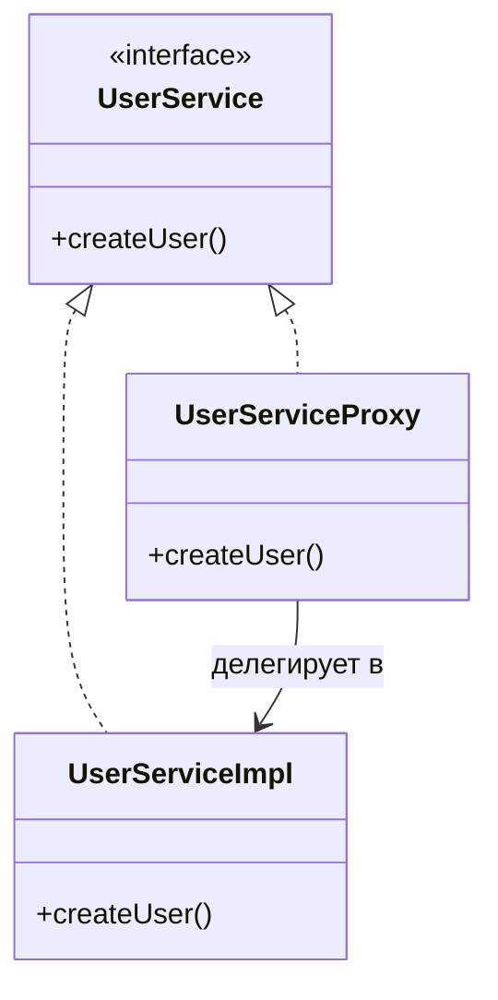
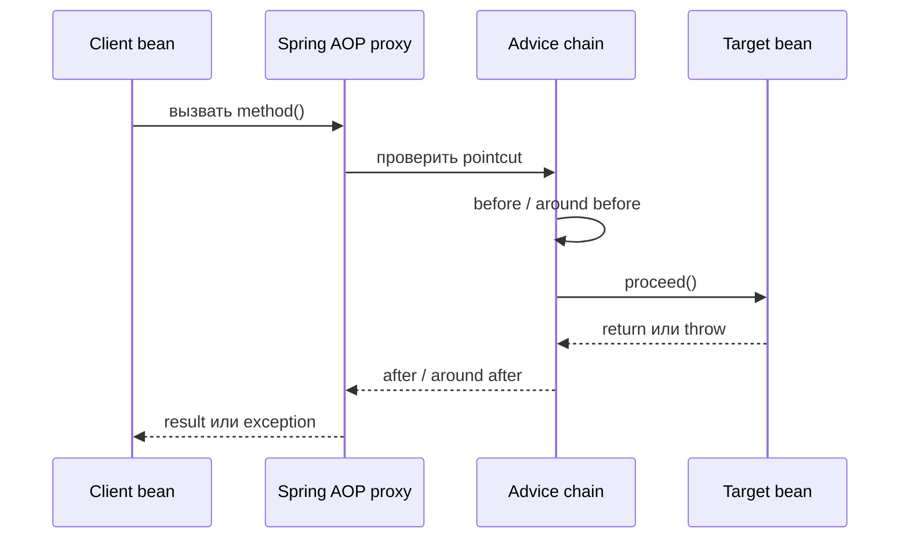

# Spring AOP Proxy

## Интуиция

**Spring AOP proxy** — это управляемый Spring объект-обертка вокруг настоящего bean. Вызывающий код обычно получает обертку, а не сырой target object, и эта обертка может выполнить **advice** до, после или вокруг target method. Представь стойку на почте: посылка все равно попадет в настоящую доставку, но сначала пройдет через стойку, где ее могут взвесить, проштамповать, отсканировать или отклонить.

Главная идея — перехват без изменения самого service class. `OrderService` может хранить business logic, а logging, security, metrics, caching или transaction logic живут в aspect. Как на кухне: повар готовит по рецепту, а общий санитарный пост проверяет правила, которые относятся ко всем станциям.

Эта тема приближает именно proxy-часть темы [Spring AOP и сквозной код](topic:spring-aop-basics). Она также объясняет, почему ограничения proxy важны для [Как работает @Transactional (Proxy / AOP)](topic:spring-transactional-proxy), [@Transactional Self-Invocation](topic:spring-transactional-self-invocation) и [@Async and Self-Invocation](topic:spring-async-self-invocation).

## Что Spring реально создает

Когда bean подходит под AOP rule, Spring обычно не переписывает твой class. Вместо этого во время создания bean Spring регистрирует proxy object в application context. Другие beans, внедренные через [Spring IoC and Dependency Injection](topic:spring-ioc-di), получают ссылку на этот proxy. Как машины на регулируемом перекрестке: сначала они проходят через светофор, и только потом попадают на дорогу за ним.

У proxy две задачи:

- Он предоставляет тот же usable contract, что и target bean, поэтому clients вызывают его естественно. Как стойка регистрации с тем же меню услуг, что и специалист за дверью.
- Он перехватывает подходящие method calls, выполняет advice chain и делегирует вызов настоящему target. Как почтовая стойка: сначала сканирует посылку, а потом передает ее в зал доставки.

## Поток вызова

Когда client вызывает advised method, proxy получает вызов первым. Он проверяет, какой advice подходит, выполняет advice chain, вызывает target через `proceed()` или похожее делегирование, затем возвращает result или пробрасывает exception. Как заказ в ресторане: официант принимает заказ, применяет правила заведения, отправляет его на кухню, а потом приносит блюдо или объясняет проблему.

Именно поэтому `@Transactional` может открыть transaction до метода и commit или rollback после него. Target method не содержит transaction boilerplate; proxy оборачивает вызов. Как касса: правила оплаты и чеков окружают много товаров, но не печатаются на каждой этикетке товара.

## JDK Dynamic Proxy и CGLIB-style Proxy

Spring часто использует две формы proxy:

- **JDK dynamic proxy**: реализует один или несколько interfaces target object. Внедряемый тип часто является interface. Как почтовый сотрудник, который может заменить любую роль стойки, описанную в меню услуг.
- **CGLIB-style subclass proxy**: создает subclass от target class и переопределяет методы, которые можно перехватить. Это полезно, когда interface нет. Как помощник на кухне, обученный стоять на той же станции и перехватывать шаги до продолжения исходной работы повара.

В современном Spring Boot class-based proxies встречаются часто, но на собеседовании важнее не название библиотеки. Важно, что caller взаимодействует с proxy, а proxy решает, когда вызвать target. Как в управлении движением: не так важно, висит ли светофор на столбе или на раме; важно, что машины проходят через него.

## Почему self-invocation обходит AOP

Proxy-based AOP работает только когда вызов входит через proxy. Если `OrderService.placeOrder()` внутри того же объекта вызывает `this.saveOrder()`, этот внутренний вызов идет напрямую в target instance, а не наружу через proxy. Как пройти с кухни прямо в кладовую: ты пропустил переднюю стойку, значит стойка ничего не сможет проштамповать.

Поэтому аннотации вроде `@Transactional` или `@Async` могут казаться проигнорированными при self-invocation. Аннотация может быть правильной, но путь вызова не прошел через обертку, которая знает, как на нее реагировать. Как посылка с наклейкой на личном столе: ее обработают только когда она попадет на сортировочную стойку.

## Ограничения и ловушки

Spring AOP — это перехват method calls на Spring-managed beans, а не универсальная магия Java. Вызовы на объектах, созданных через `new`, не перехватываются, потому что container не внедрял proxy. Как посылка, переданная лично вне почты: стойка ее никогда не увидит.

Private methods не подходят как AOP join points, потому что callers не могут войти в них через proxy contract. Final methods или final classes тоже могут мешать subclass-based interception. Как запертая дверь в подсобку: стойка регистрации не может перехватить того, кто не проходит через public service window.

Слишком широкий pointcut может обернуть лишнее, а слишком узкий — пропустить нужный method. Как дорожные знаки: место установки важно, иначе знак либо управляет не теми водителями, либо не управляет никем.

Порядок advice важен. Security, transactions, metrics, caching и retries могут окружать один и тот же method, и порядок меняет поведение. Как очередь на кассе: сканирование, скидки, оплата, упаковка и печать чека должны идти в разумной последовательности.

Не путай Spring AOP proxy с любым использованием Proxy design pattern. Они связаны идеей контроля доступа через обертку, но Spring добавляет container-managed wiring, pointcuts и advice. Для более широкого сравнения паттернов смотри [Decorator против Proxy](topic:decorator-vs-proxy). Как две стойки перед комнатой: одна может добавлять подарочную упаковку, а другая проверять доступ.

## Практическая значимость

В production Spring apps proxies стоят за transactions, security annotations, metrics, tracing, caching, validation, retries и custom aspects. Понимание proxy model помогает отлаживать случаи «аннотация есть, но ничего не происходит». Как городская система светофоров: понимание, где установлены светофоры, объясняет, почему одна улица регулируется, а другая нет.

Это влияет и на дизайн кода. Если методу нужно AOP behavior, вызывай его из другого Spring bean или через proxy reference, а не через `this`. Как с посылкой на почте: маршрут через стойку является частью гарантии.

## Ответ за 60 секунд

> В Spring AOP proxy — это bean-обертка, которую Spring ставит перед настоящим target bean. Другие beans обычно получают proxy из application context. Когда они вызывают метод, proxy может сопоставить pointcuts, выполнить advice вроде logging, security, metrics, `@Transactional` или `@Async`, а затем делегировать вызов настоящему методу. Spring может создавать interface-based JDK dynamic proxies или class-based subclass proxies. Главная ловушка: advice выполняется только когда вызов идет через proxy. Self-invocation, private methods, объекты, созданные через `new`, и некоторые final methods/classes могут обходить или блокировать proxy interception.

## Частые заблуждения

- **«Spring меняет bytecode моего service method».** Обычно нет. Spring обычно регистрирует proxy bean вокруг target. Как почтовая стойка: она меняет маршрут посылки, а не содержимое посылки.
- **«Если аннотация стоит, поведение всегда выполнится».** Нет, если вызов обходит proxy. Как наклейка на посылке: она важна только когда стойка ее считывает.
- **«Self-invocation должен работать, потому что это тот же объект».** Именно поэтому вызов и не проходит через proxy. Как повар, который перемещается внутри кухни: он не проходит стойку регистрации заново.
- **«JDK proxy и CGLIB proxy — это разные AOP concepts».** Это разные proxy implementations, а не разные цели. Как два вида светофоров: оба управляют въездом на одну дорогу.
- **«AOP proxies могут перехватить все».** Они ограничены Spring management, visibility метода, finality и путем вызова. Как public counter: он обрабатывает только тот поток, который дошел до стойки.
