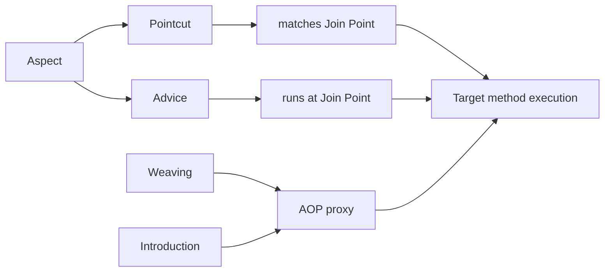
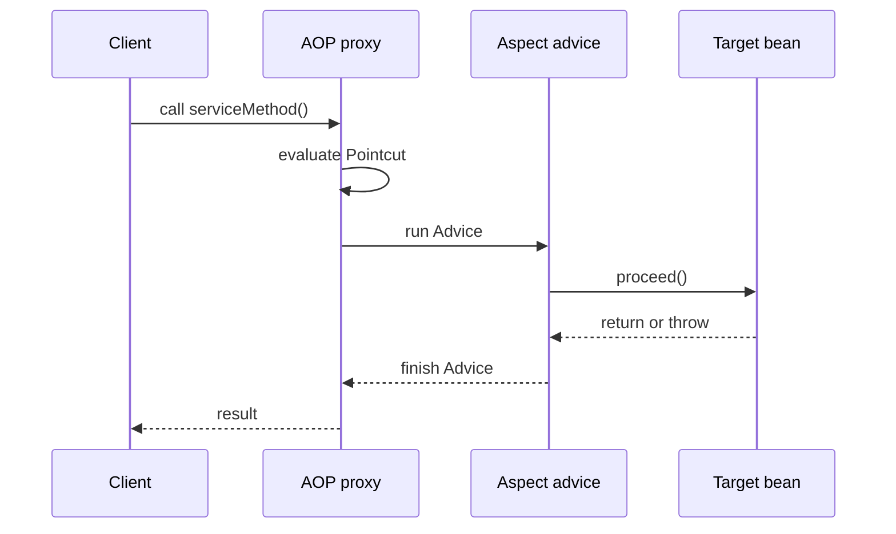

# Spring AOP Terms

## Intuition

Spring AOP is easier to explain when you separate the vocabulary from the implementation. The vocabulary names *what* is being described: the extra behavior, the places where it can run, the rule that selects those places, and the moment when Spring connects everything. Think of a post office: parcels are business method calls, special counters are cross-cutting concerns, and the routing rules decide which parcel visits which counter.

This topic is the vocabulary companion to [Spring AOP and Cross-Cutting Code](topic:spring-aop-basics). That topic shows why AOP removes repeated logging, security, metrics, or transaction code; this one makes the words precise. Like a kitchen ticket system, knowing the roles matters before you can debug why the dessert station received the soup order.

In Spring, the key detail is that Spring AOP is normally proxy-based. The caller invokes a proxy, and the proxy decides whether advice should run before delegating to the target bean. This proxy model is also central to [How @Transactional Works (Proxy / AOP)](topic:spring-transactional-proxy). Like a traffic checkpoint, the rule applies only to cars that pass through the checkpoint.

## The six core terms

**Aspect** is a module for one cross-cutting concern. In Spring, it is often a class annotated with `@Aspect` that groups pointcuts and advice, for example logging all service calls or checking permissions. Analogy: one post-office counter owns the "fragile parcel" process, including its rule and its clerk.

**Join Point** is a point during program execution where an aspect could apply. In Spring AOP, the practical join point is a method execution on a Spring bean. Full AspectJ can support more join point kinds, but Spring AOP mainly intercepts method calls through proxies. Analogy: a service window where a parcel can be inspected; Spring watches the service windows, not every shelf in the building.

**Advice** is the action that an aspect runs at a join point. Common kinds are `@Before`, `@AfterReturning`, `@AfterThrowing`, `@After`, and `@Around`. `@Around` is special because it wraps the call and controls `proceed()`. Analogy: the clerk can stamp a parcel before handling, record success after handling, report damage after a failure, or manage the whole handoff.

**Pointcut** is the predicate that selects join points. A pointcut expression can match methods by package, method name, annotations, arguments, or bean name, depending on the expression designator. Analogy: the sorting label that says "all fragile parcels from window 3 go to the fragile counter."

**Introduction** lets an aspect make a proxied object implement an additional interface. In Spring AOP this is usually done with `@DeclareParents`. It is much less common than advice and pointcuts, but interviewers ask because it shows AOP can add type-level capability to a proxy, not only run code around a method. Analogy: the post office gives certain parcels a temporary "trackable" sticker so they can be handled through a tracking interface.

**Weaving** is the process of connecting aspects with target objects to create advised objects. In Spring AOP, weaving normally happens at runtime when Spring creates proxies for beans. AspectJ can also weave at compile time, after compilation, or during class loading. Analogy: the routing system is installed into the post office so parcels are automatically sent through the right counters.

## How the terms fit together

The aspect owns both the selection rule and the code to run. The pointcut says where the aspect applies; the advice says what happens there. The join point is the selected method execution. Weaving creates the proxy that makes this happen at runtime. Introduction is the rarer case where the proxy also exposes an extra interface. Like a restaurant workflow, the menu rule, the station worker, the serving window, and the kitchen route are separate ideas even though they work together during one order.

## Method call flow in Spring AOP

The client calls the proxy, not the raw target bean. The proxy evaluates pointcuts and runs the matching advice chain. The target method executes when the advice allows the call to proceed. Like a road checkpoint, inspection happens before the car reaches the warehouse only if the route passes through the checkpoint.

This explains common production behavior. `@Transactional`, method security, logging, metrics, tracing, caching, and retries are often implemented as advice around service methods. The same proxy limitation explains self-invocation traps such as [@Transactional Self-Invocation](topic:spring-transactional-self-invocation) and [@Async and Self-Invocation](topic:spring-async-self-invocation). Like a side door into the kitchen, an internal call can skip the front counter.

## Production relevance

These terms appear in logs, stack traces, configuration, and code reviews. If someone says "the pointcut is too broad," they mean the rule selects too many join points. If someone says "the advice did not run," they may mean the call did not go through the proxy. Like traffic planning, a wrong sign and a missed intersection are different problems even if both cause bad routing.

The vocabulary also helps you compare Spring AOP with proxy-related design ideas such as [Decorator vs Proxy](topic:decorator-vs-proxy). A Spring AOP proxy is infrastructure that applies cross-cutting advice; a Decorator is usually an explicit object design choice in application code. Like a building security gate versus a custom package wrapper, both sit around something, but they serve different purposes.

Introduction is rare in everyday Spring projects, but it is useful to know the term. Most production AOP discussions focus on aspects, pointcuts, advice, and weaving through proxies. Like a post office, most work is stamping and routing parcels; adding a new temporary handling interface is a special service.

## 60-second interview answer

> In Spring AOP, an Aspect is the module that contains cross-cutting logic. A Join Point is a point where that logic can apply; in Spring AOP this usually means a method execution on a Spring bean. Advice is the code that runs at the join point, such as before, after returning, after throwing, or around a call. A Pointcut is the rule that selects which join points should receive advice. Introduction means adding an extra interface or behavior to a proxied object, usually with `@DeclareParents`. Weaving is the process of connecting aspects with target objects; in Spring AOP it normally happens at runtime when Spring creates proxies. The main Spring-specific trap is that proxy-based AOP works only when the call goes through the proxy.

## Common misconceptions

- **"Join Point and Pointcut are the same."** No. A join point is a possible place in execution; a pointcut is the rule that selects places. Like a street corner versus the traffic rule that applies to certain corners.
- **"Advice is the annotation."** Not quite. The annotation marks the advice method, but the advice is the action that runs. Like a counter sign naming the service, not the clerk doing the work.
- **"Aspect is just a helper class."** An aspect groups a cross-cutting concern and binds advice to pointcuts. Like a dedicated service desk, it has both staff and routing rules.
- **"Spring AOP can intercept everything AspectJ can."** Spring AOP is mostly method-execution interception through proxies. AspectJ has broader weaving options. Like a front-door checkpoint versus a full building wiring system.
- **"Introduction is the same as advice."** Introduction changes what interface a proxy can expose; advice runs code at selected join points. Like adding a tracking sticker versus stamping the parcel during handling.
- **"Weaving always means compile-time bytecode changes."** In Spring AOP, weaving is usually runtime proxy creation. Compile-time and load-time weaving are AspectJ options. Like installing a temporary checkpoint for today rather than rebuilding the road.
