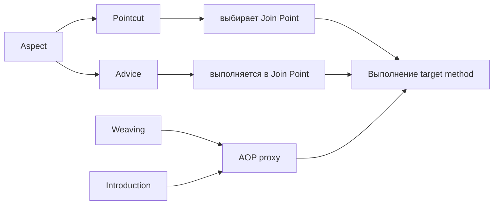
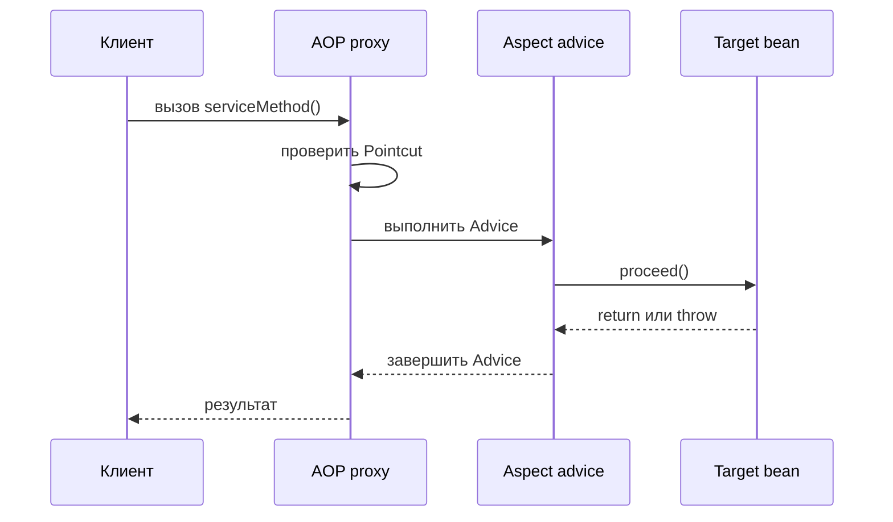

# Термины Spring AOP

## Интуиция

Spring AOP проще объяснять, если отделить словарь от реализации. Словарь называет, *что* именно обсуждается: дополнительное поведение, места, где оно может выполниться, правило выбора этих мест и момент, когда Spring всё соединяет. Представьте почту: посылки — это вызовы бизнес-методов, специальные стойки — сквозные задачи, а правила маршрутизации решают, какая посылка идёт к какой стойке.

Эта тема дополняет [Spring AOP и сквозной код](topic:spring-aop-basics) как словарь. Та тема показывает, почему AOP убирает повторяющийся logging, security, metrics или transaction-код; здесь мы точно называем роли. Как на кухне с системой заказов: сначала нужно понять, кто отвечает за горячее, десерт и выдачу, иначе трудно отладить, почему суп попал на десертную станцию.

В Spring ключевая деталь такая: Spring AOP обычно основан на proxy. Вызывающий код обращается к proxy, а proxy решает, нужно ли выполнить advice перед передачей вызова target bean. Эта proxy-модель также лежит в основе темы [Как работает @Transactional (Proxy / AOP)](topic:spring-transactional-proxy). Как дорожный пост: правило применяется только к машинам, которые через него проехали.

## Шесть основных терминов

**Aspect** — это модуль для одной сквозной задачи. В Spring это часто класс с `@Aspect`, который группирует pointcut и advice, например для logging всех вызовов service или проверки прав. Аналогия: одна стойка на почте отвечает за процесс «хрупкая посылка», включая правило и сотрудника.

**Join Point** — это точка выполнения программы, где aspect мог бы примениться. В Spring AOP практический join point — выполнение метода Spring bean. Полный AspectJ поддерживает больше видов join point, но Spring AOP в основном перехватывает вызовы методов через proxy. Аналогия: окно обслуживания, где посылку можно проверить; Spring смотрит на окна обслуживания, а не на каждую полку в здании.

**Advice** — это действие, которое aspect выполняет в join point. Частые виды: `@Before`, `@AfterReturning`, `@AfterThrowing`, `@After` и `@Around`. `@Around` особенный, потому что оборачивает вызов и управляет `proceed()`. Аналогия: сотрудник может поставить штамп перед обработкой, записать успешный результат после обработки, сообщить о повреждении после сбоя или управлять всей передачей посылки.

**Pointcut** — это предикат, который выбирает join point. Pointcut expression может выбирать методы по package, имени метода, аннотациям, аргументам или имени bean, в зависимости от expression designator. Аналогия: сортировочная метка «все хрупкие посылки из окна 3 идут к стойке хрупких посылок».

**Introduction** позволяет aspect сделать так, чтобы proxied object реализовал дополнительный interface. В Spring AOP это обычно делается через `@DeclareParents`. Это встречается намного реже, чем advice и pointcut, но на собеседованиях термин спрашивают, потому что он показывает: AOP может добавить proxy возможность на уровне типа, а не только выполнить код вокруг метода. Аналогия: почта временно клеит на некоторые посылки стикер «trackable», чтобы с ними можно было работать через tracking interface.

**Weaving** — это процесс соединения aspect с target object, чтобы получить advised object. В Spring AOP weaving обычно происходит во время выполнения, когда Spring создаёт proxy для bean. AspectJ также умеет weaving на этапе компиляции, после компиляции или при загрузке классов. Аналогия: систему маршрутизации устанавливают на почте, чтобы посылки автоматически проходили через нужные стойки.

## Как термины связаны

Aspect владеет и правилом выбора, и кодом, который нужно выполнить. Pointcut говорит, где aspect применяется; advice говорит, что там происходит. Join point — это выбранное выполнение метода. Weaving создаёт proxy, благодаря которому это работает во время выполнения. Introduction — более редкий случай, когда proxy ещё и показывает дополнительный interface. Как в ресторанном процессе: правило меню, работник станции, окно выдачи и маршрут на кухне — разные идеи, хотя в одном заказе они работают вместе.

## Поток вызова метода в Spring AOP

Client вызывает proxy, а не raw target bean. Proxy проверяет pointcut и выполняет подходящую цепочку advice. Target method выполняется, когда advice разрешает продолжить вызов. Как дорожный пост: проверка происходит до склада только если маршрут проходит через пост.

Это объясняет обычное поведение в production. `@Transactional`, method security, logging, metrics, tracing, caching и retries часто реализуются как advice вокруг service methods. То же proxy-ограничение объясняет ловушки self-invocation, например [@Transactional Self-Invocation](topic:spring-transactional-self-invocation) и [@Async и Self-Invocation](topic:spring-async-self-invocation). Как боковая дверь на кухню: внутренний вызов может обойти стойку у входа.

## Практическая ценность

Эти термины встречаются в logs, stack traces, configuration и code review. Если кто-то говорит «pointcut слишком широкий», значит правило выбирает слишком много join point. Если кто-то говорит «advice не сработал», причина может быть в том, что вызов не прошёл через proxy. Как в организации движения: неправильный знак и пропущенный перекрёсток — разные проблемы, хотя оба портят маршрут.

Словарь также помогает сравнивать Spring AOP с proxy-related идеями проектирования, например [Decorator vs Proxy](topic:decorator-vs-proxy). Spring AOP proxy — это инфраструктура, которая применяет cross-cutting advice; Decorator обычно явное проектное решение в коде приложения. Как охранный турникет здания и специальная упаковка посылки: оба стоят «вокруг» чего-то, но задачи разные.

Introduction редко встречается в обычных Spring-проектах, но термин полезно знать. Большинство production-разговоров про AOP сосредоточено на aspect, pointcut, advice и weaving через proxy. Как на почте: основная работа — штамповать и направлять посылки; добавление временного handling interface — специальная услуга.

## Ответ на 60 секунд

> В Spring AOP Aspect — это модуль, который содержит сквозную логику. Join Point — точка, где эта логика может примениться; в Spring AOP обычно это выполнение метода Spring bean. Advice — код, который выполняется в join point: например before, after returning, after throwing или around. Pointcut — правило, которое выбирает, какие join point получат advice. Introduction означает добавление дополнительного interface или поведения к proxied object, обычно через `@DeclareParents`. Weaving — процесс соединения aspect с target object; в Spring AOP он обычно происходит во время выполнения, когда Spring создаёт proxy. Главная Spring-специфичная ловушка: proxy-based AOP работает только тогда, когда вызов проходит через proxy.

## Частые заблуждения

- **«Join Point и Pointcut — одно и то же».** Нет. Join point — возможное место в выполнении программы; pointcut — правило, которое выбирает такие места. Как перекрёсток и правило движения, которое действует на некоторых перекрёстках.
- **«Advice — это аннотация».** Не совсем. Аннотация помечает advice method, но advice — это действие, которое выполняется. Как вывеска на стойке, которая называет услугу, но не заменяет сотрудника.
- **«Aspect — просто helper class».** Aspect группирует сквозную задачу и связывает advice с pointcut. Как отдельная стойка обслуживания: у неё есть и сотрудники, и правила маршрутизации.
- **«Spring AOP может перехватить всё, что умеет AspectJ».** Spring AOP в основном перехватывает выполнение методов через proxy. У AspectJ шире варианты weaving. Как пост у главного входа по сравнению с проводкой, встроенной во всё здание.
- **«Introduction — то же самое, что advice».** Introduction меняет, какой interface может показывать proxy; advice выполняет код в выбранных join point. Как добавить стикер tracking и поставить штамп во время обработки — разные действия.
- **«Weaving всегда означает изменение bytecode на этапе компиляции».** В Spring AOP weaving обычно означает runtime proxy creation. Compile-time и load-time weaving — варианты AspectJ. Как поставить временный дорожный пост на сегодня, а не перестраивать дорогу.
