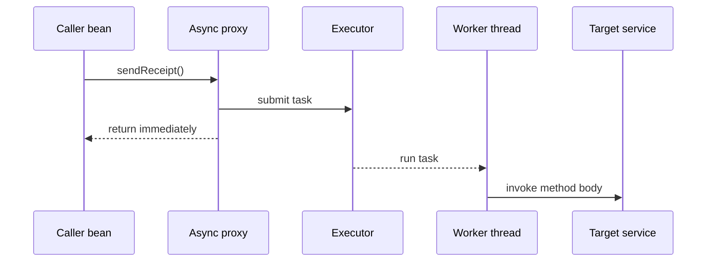
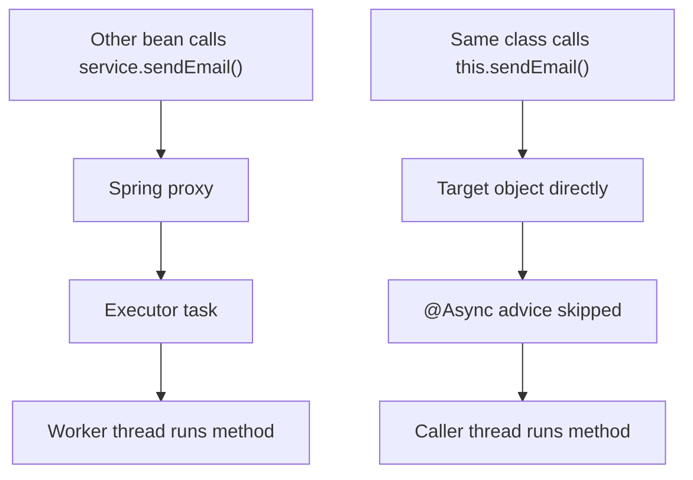

# @Async and Self-Invocation

`@Async` tells Spring that a method should run asynchronously when it is called
through Spring's async infrastructure. `@EnableAsync` turns that infrastructure
on: Spring looks for `@Async` on managed beans and applies an advisor, usually by
wrapping the bean in a proxy. Post office analogy: `@EnableAsync` opens the
express-mail counter, and `@Async` is the sticker that says this parcel should be
sent to a courier instead of handled at the window.

This only applies to Spring-managed beans. A plain object created with `new`
does not pass through the container, so Spring has no chance to add the async
proxy. The same container idea is covered in [Spring IoC and Dependency
Injection](topic:spring-ioc-di). Kitchen analogy: the restaurant can route
orders only for dishes that entered through the official order screen; a note
scribbled on a private napkin is invisible to the kitchen system.

## What happens on an async call

When another bean calls an `@Async` method through the Spring proxy, the proxy
does not execute the method body on the caller thread. It submits a task to an
`Executor` and returns to the caller quickly. The method body then runs later on
a worker thread. Traffic analogy: the front desk hands the delivery to a dispatch
queue, and a driver takes it from there while the customer can leave the counter.



The default `@EnableAsync` mode is proxy-based. Spring searches for a unique
`TaskExecutor` bean, then for an `Executor` bean named `taskExecutor`; if it does
not find one, it falls back to a simple executor. In production, configure a
named thread pool with limits, queue size, and rejection policy. Kitchen analogy:
an unlimited pile of order tickets on a tiny counter works in a demo, but a real
restaurant needs a known number of cooks and a rule for overflow.

An `@Async` method usually returns `void`, `Future`, or `CompletableFuture`.
`void` methods cannot send a failure back to the caller; Spring routes uncaught
exceptions to an `AsyncUncaughtExceptionHandler`. With `CompletableFuture`, the
exception belongs to the future and the caller can observe it. Post office
analogy: dropping a postcard gives no tracking screen, while registered mail has
a tracking number and a delivery status.

## Why same-class calls often do not work

The classic trap is self-invocation:

```java
@Service
public class ReportService {
    public void generateReport() {
        sendEmail(); // really this.sendEmail()
    }

    @Async
    public void sendEmail() {
        // expected to run on a worker thread
    }
}
```

`generateReport()` calls `sendEmail()` on `this`, the target object itself. That
direct Java call never enters the Spring proxy, so the async advisor is skipped.
The method runs synchronously on the current thread. Mailroom analogy: instead of
handing the parcel to the express counter, the clerk walks to the back room and
does the job personally, so no courier is dispatched.



This is the same proxy boundary idea that surprises people with
[@Transactional Rollback Rules](topic:spring-transactional-rollback): in proxy
mode, framework behavior is applied when the call crosses the proxy boundary.
Factory analogy: the quality-control gate works only for parts that pass through
the gate; a worker moving a part from one bench to another inside the room
does not trigger the scanner.

Other proxy-mode limits follow from the same rule. A method should be an
interceptable Spring bean method, commonly a public entry point called from
outside the bean. Private methods, final methods, and direct construction with
`new` prevent normal proxy interception. Traffic analogy: the traffic light can
control cars on the public road, not a shortcut inside a private warehouse.

## How to fix the design

The cleanest fix is to put the async operation in another Spring bean and inject
that bean where it is needed:

```java
@Service
public class ReportService {
    private final NotificationService notifications;

    public ReportService(NotificationService notifications) {
        this.notifications = notifications;
    }

    public void generateReport() {
        notifications.sendEmail();
    }
}

@Service
public class NotificationService {
    @Async
    public void sendEmail() {
        // worker-thread work
    }
}
```

Now the call goes from one bean to another through the injected proxy, so Spring
can submit the async task. Post office analogy: the reports clerk hands the
parcel to the mail counter instead of trying to use the back-room conveyor
directly.

Other options exist, but they are usually less clean. A bean can inject its own
proxy or look itself up from `ApplicationContext`, but that makes the class aware
of Spring mechanics. AspectJ mode can handle some self-invocation cases because
it weaves advice into the class instead of relying only on a proxy, but it adds
setup complexity. Kitchen analogy: installing sensors into every oven can catch
more cases, but it is more expensive than sending orders through the normal
ticket rail.

## 60-second interview answer

> `@EnableAsync` enables Spring's asynchronous method execution support.
> `@Async` marks a Spring bean method so that, when the method is called through
> the Spring proxy, the proxy submits the invocation to an `Executor` and returns
> immediately; the method body runs on a worker thread. It may not work on a call
> from another method of the same class because that is a direct `this.method()`
> call. It bypasses the proxy, so the async interceptor never sees the call and
> the method runs synchronously. The usual fix is to move the async method to a
> separate Spring bean and call it through injection, or deliberately call through
> the bean's proxy. In production, also configure the executor and think about
> exception handling and return type.

## Production relevance

`@Async` is good for fire-and-forget work, notification sending, cache warming,
or parallelizing independent tasks inside the same application process. It is
not a durable message broker. If the JVM dies, queued in-process work can be
lost. For reliable cross-service side effects, consider patterns such as the
[Outbox pattern](topic:outbox-pattern) and [Inbox pattern](topic:inbox-pattern).
Courier analogy: a restaurant runner can deliver nearby orders quickly, but a
city-wide guaranteed delivery service needs tracking, retry, and a central
dispatch system.

Async execution also changes context boundaries. Transaction state, request
state, security context, MDC logging context, and thread-local data do not
automatically mean the same thing on a worker thread. If an async method needs a
new transaction or a copied security context, configure that deliberately.
Restaurant analogy: when a waiter hands work to another station, the new station
does not automatically know every note from the original table unless the ticket
carries it.

Thread pools are capacity controls. Too many async jobs can exhaust CPU, memory,
database connections, or remote-service quotas. A bounded executor makes back
pressure visible. Traffic analogy: adding more delivery vans helps only until
the roads, loading docks, or kitchens become the bottleneck.

## Common misconceptions

- "`@Async` means any call to this method becomes asynchronous." It only works
  when Spring intercepts the call, usually through a proxy. Mail analogy: the
  express sticker matters only when the parcel reaches the express counter.
- "`@EnableAsync` starts a separate service or message queue." It enables Spring
  method interception and executor submission inside this JVM. Kitchen analogy:
  it adds an internal prep station, not a second restaurant.
- "Self-invocation should work because the annotation is on the method." Java
  annotations do not run themselves; Spring has to see the method call. Traffic
  analogy: painting a bus-lane symbol on a garage floor does not make the city
  traffic system route buses through it.
- "The async method shares the caller's transaction." It runs on another thread,
  so transaction context does not automatically follow it. Compare this with
  [@Transactional Rollback Rules](topic:spring-transactional-rollback). Post
  office analogy: a new courier route gets its own clipboard unless you attach
  the old paperwork.
- "`void @Async` is fine because errors will reach the caller." The caller has
  already returned; use `CompletableFuture` when the caller must observe results
  or failures. Delivery analogy: without a tracking number, the sender cannot
  wait on the package status.
- "More threads always make it faster." Async improves responsiveness or
  concurrency for suitable work, but it can overload shared resources. Road
  analogy: more cars do not help when the bridge is already jammed.
