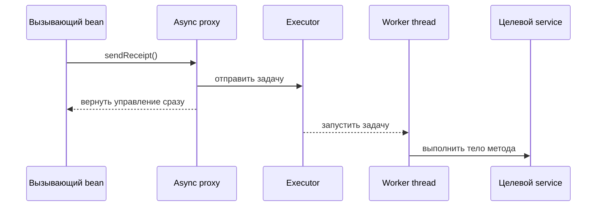
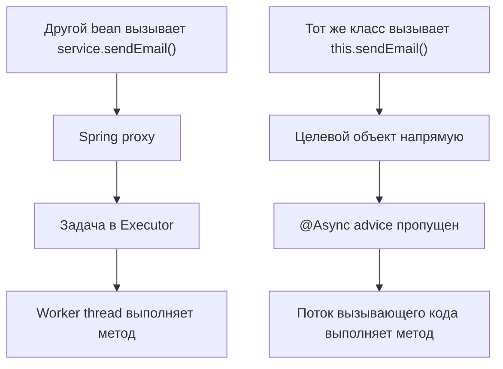

# @Async и self-invocation

`@Async` говорит Spring, что метод должен выполняться асинхронно, когда он
вызывается через async-инфраструктуру Spring. `@EnableAsync` включает эту
инфраструктуру: Spring ищет `@Async` на управляемых bean и применяет advisor,
обычно оборачивая bean в proxy. Аналогия с почтой: `@EnableAsync` открывает
стойку экспресс-отправлений, а `@Async` является наклейкой, которая говорит, что
посылку нужно передать курьеру, а не обрабатывать прямо у окна.

Это работает только для Spring-managed beans. Обычный объект, созданный через
`new`, не проходит через container, поэтому Spring не может добавить async proxy.
Та же идея container подробно разобрана в [Spring IoC and Dependency
Injection](topic:spring-ioc-di). Аналогия с кухней: ресторан может направлять
заказы только для блюд, которые вошли через официальную систему заказов; записка
на личной салфетке невидима для кухонной системы.

## Что происходит при async-вызове

Когда другой bean вызывает `@Async`-метод через Spring proxy, proxy не выполняет
тело метода в потоке вызывающего кода. Он отправляет задачу в `Executor` и быстро
возвращает управление вызывающему коду. Тело метода затем выполняется позже в
worker thread. Аналогия с дорожной службой доставки: стойка приема передает
доставку в очередь диспетчера, и водитель забирает ее оттуда, пока клиент уже
может уйти от стойки.



Режим `@EnableAsync` по умолчанию основан на proxy. Spring ищет единственный
bean типа `TaskExecutor`, затем bean типа `Executor` с именем `taskExecutor`; если
ничего не найдено, он использует простой executor. В production стоит явно
настраивать thread pool с лимитами, размером очереди и политикой отказа.
Аналогия с кухней: бесконечная стопка заказов на маленькой стойке подходит для
демо, но настоящему ресторану нужно известное число поваров и правило для
переполнения.

`@Async`-метод обычно возвращает `void`, `Future` или `CompletableFuture`.
`void`-методы не могут вернуть ошибку вызывающему коду; Spring передает
непойманные исключения в `AsyncUncaughtExceptionHandler`. С `CompletableFuture`
исключение относится к future, и вызывающий код может его увидеть. Аналогия с
почтой: обычная открытка не дает экрана отслеживания, а заказное письмо имеет
номер и статус доставки.

## Почему вызовы внутри того же класса часто не работают

Классическая ловушка — self-invocation:

```java
@Service
public class ReportService {
    public void generateReport() {
        sendEmail(); // really this.sendEmail()
    }

    @Async
    public void sendEmail() {
        // expected to run on a worker thread
    }
}
```

`generateReport()` вызывает `sendEmail()` на `this`, то есть на самом целевом
объекте. Такой прямой Java-вызов не входит в Spring proxy, поэтому async advisor
пропускается. Метод выполняется синхронно в текущем потоке. Аналогия с почтовой
комнатой: вместо того чтобы отдать посылку на стойку экспресс-отправлений,
сотрудник идет в подсобку и делает работу сам, поэтому курьер не вызывается.



Это та же граница proxy, которая часто удивляет с
[@Transactional Rollback Rules](topic:spring-transactional-rollback): в proxy
mode поведение фреймворка применяется, когда вызов пересекает границу proxy.
Аналогия с заводом: контроль качества работает только для деталей, которые
проходят через ворота контроля; если рабочий переносит деталь между двумя
столами внутри комнаты, сканер не срабатывает.

Другие ограничения proxy mode следуют из того же правила. Метод должен быть
перехватываемым методом Spring bean, обычно публичной точкой входа, вызываемой
снаружи bean. Private methods, final methods и прямое создание через `new`
мешают нормальному proxy interception. Аналогия с дорогами: светофор может
управлять машинами на общественной дороге, но не коротким путем внутри частного
склада.

## Как исправить дизайн

Самое чистое исправление — вынести async-операцию в другой Spring bean и
инжектировать этот bean туда, где он нужен:

```java
@Service
public class ReportService {
    private final NotificationService notifications;

    public ReportService(NotificationService notifications) {
        this.notifications = notifications;
    }

    public void generateReport() {
        notifications.sendEmail();
    }
}

@Service
public class NotificationService {
    @Async
    public void sendEmail() {
        // worker-thread work
    }
}
```

Теперь вызов идет от одного bean к другому через внедренный proxy, поэтому Spring
может отправить async task. Аналогия с почтой: сотрудник отчетов передает
посылку на почтовую стойку, а не пытается напрямую пользоваться внутренним
конвейером.

Есть и другие варианты, но обычно они менее чистые. Bean может внедрить
собственный proxy или найти себя через `ApplicationContext`, но тогда класс
начинает знать о механике Spring. AspectJ mode может обработать часть случаев
self-invocation, потому что вплетает advice в класс, а не полагается только на
proxy, но это усложняет настройку. Аналогия с кухней: установить датчики в
каждую печь позволит поймать больше случаев, но это дороже, чем отправлять
заказы через обычную ленту с чеками.

## Ответ на собеседовании за 60 секунд

> `@EnableAsync` включает в Spring поддержку асинхронного выполнения методов.
> `@Async` помечает метод Spring bean так, что при вызове через Spring proxy этот
> proxy отправляет invocation в `Executor` и сразу возвращает управление; тело
> метода выполняется в worker thread. Это может не сработать при вызове из
> другого метода того же класса, потому что это прямой вызов `this.method()`. Он
> обходит proxy, async interceptor не видит вызов, и метод выполняется
> синхронно. Обычное решение — вынести async-метод в отдельный Spring bean и
> вызывать его через injection или осознанно вызывать через proxy этого bean. В
> production также нужно настроить executor и продумать обработку исключений и
> return type.

## Практическая важность

`@Async` хорошо подходит для fire-and-forget работы, отправки уведомлений,
прогрева cache или параллелизации независимых задач внутри того же процесса
приложения. Но это не надежный message broker. Если JVM завершится, работа в
очереди внутри процесса может потеряться. Для надежных side effects между
сервисами стоит рассмотреть паттерны вроде [Outbox pattern](topic:outbox-pattern)
и [Inbox pattern](topic:inbox-pattern). Аналогия с курьером: ресторанный бегунок
может быстро доставить близкие заказы, но городская гарантированная доставка
требует tracking, retry и центральную диспетчерскую.

Async-выполнение также меняет границы контекста. Transaction state, request
state, security context, MDC logging context и thread-local data не начинают
автоматически означать то же самое в worker thread. Если async-методу нужна
новая transaction или скопированный security context, это нужно настраивать
явно. Аналогия с рестораном: когда официант передает работу на другую станцию,
новая станция не знает автоматически все заметки исходного столика, если они не
попали в чек.

Thread pools являются ограничителями емкости. Слишком много async jobs могут
исчерпать CPU, memory, database connections или квоты внешних сервисов.
Ограниченный executor делает back pressure видимым. Аналогия с дорожным
движением: больше машин помогает только до тех пор, пока мосты, зоны погрузки
или кухни не становятся bottleneck.

## Частые заблуждения

- "`@Async` означает, что любой вызов этого метода станет асинхронным." Он
  работает только когда Spring перехватывает вызов, обычно через proxy.
  Почтовая аналогия: наклейка экспресс-отправления имеет значение только если
  посылка дошла до экспресс-стойки.
- "`@EnableAsync` запускает отдельный сервис или message queue." Он включает
  Spring method interception и отправку задач в executor внутри этой JVM.
  Аналогия с кухней: он добавляет внутреннюю станцию подготовки, а не второй
  ресторан.
- "Self-invocation должен работать, потому что annotation стоит на методе."
  Java annotations не запускают себя сами; Spring должен увидеть вызов метода.
  Дорожная аналогия: нарисовать символ автобусной полосы на полу гаража не
  заставит городскую систему движения вести туда автобусы.
- "Async-метод разделяет transaction вызывающего кода." Он выполняется в другом
  потоке, поэтому transaction context не переносится автоматически. Сравните с
  [@Transactional Rollback Rules](topic:spring-transactional-rollback). Почтовая
  аналогия: новый курьерский маршрут получает свой планшет, если старые бумаги
  не прикрепили отдельно.
- "`void @Async` безопасен, потому что ошибки попадут к вызывающему коду."
  Вызывающий код уже вернулся; используйте `CompletableFuture`, когда нужно
  наблюдать результаты или ошибки. Аналогия с доставкой: без tracking number
  отправитель не может ждать статус посылки.
- "Больше потоков всегда быстрее." Async улучшает отзывчивость или concurrency
  для подходящей работы, но может перегрузить общие ресурсы. Дорожная аналогия:
  больше машин не помогает, когда мост уже стоит в пробке.
