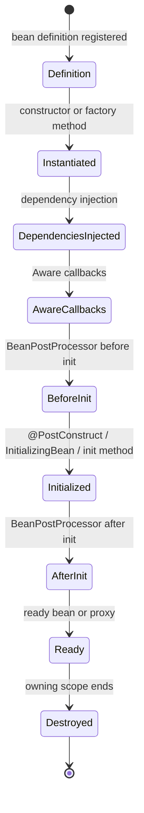
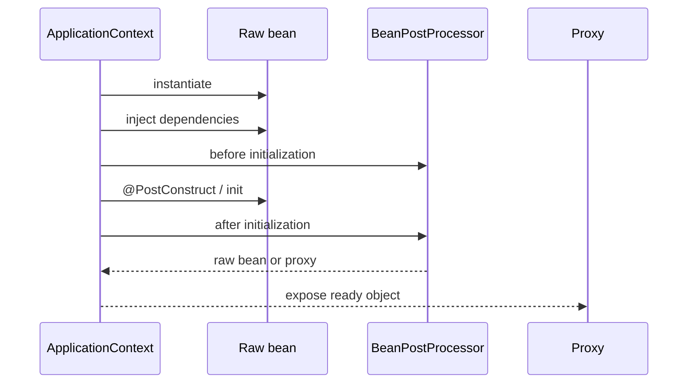
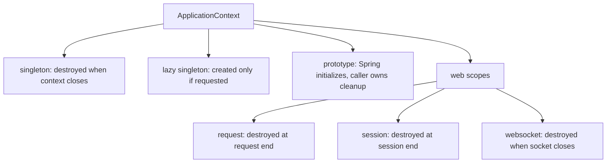

# Spring Bean Lifecycle

A Spring bean is an object whose creation and lifecycle are managed by the Spring container, usually an `ApplicationContext`. The container does more than call `new`: it reads bean definitions, chooses a scope, builds the object, injects dependencies, runs lifecycle callbacks, lets `BeanPostProcessor`s wrap it, and later destroys it when the owning scope ends. Think of a restaurant kitchen: the kitchen does not just buy ingredients; it prepares each station, assigns tools, checks the dish, sends it to service, and cleans up at the right time.

This topic is the lifecycle-focused neighbor of [Spring IoC and Dependency Injection](topic:spring-ioc-di). Registration style is separate: a bean may come from `@Component` scanning or from an `@Bean` method, as covered in [@Bean vs @Component in Spring](topic:spring-bean-vs-component). Scope is also separate and is covered broadly in [Spring Bean Scopes](topic:spring-bean-scopes).

## Creation and Initialization

Spring starts from a bean definition: class, factory method, scope, dependencies, and lifecycle metadata. In a post office analogy, this is the service ticket: it says what parcel must be prepared, which counter owns it, and which labels are needed.

For a normal singleton, Spring creates the instance during context startup, unless it is lazy. Constructor injection happens first, then Spring fills setter or field-injected dependencies. The kitchen analogy: the cook gets the pan first, then the ingredients and utensils are placed around it.

After dependency injection, Spring may call "aware" callbacks such as `BeanNameAware` or `ApplicationContextAware`. Use them sparingly because they couple the bean to Spring APIs. It is like giving a delivery driver the whole depot map; useful for infrastructure, too much for ordinary business code.

Then `BeanPostProcessor`s get a chance before initialization. After that, Spring calls initialization callbacks such as `@PostConstruct`, `InitializingBean.afterPropertiesSet()`, or a custom init method. This is the final kitchen check before the dish leaves the pass: sauces are finished, temperatures are checked, and the object is ready to serve.

After initialization, `BeanPostProcessor`s run again. This is where Spring can return a proxy instead of the raw object for features such as transactions or async behavior. The proxy is like a reception desk in front of a specialist: callers talk to the desk, and the desk adds rules before forwarding. For the proxy trap, see [How @Transactional Works](topic:spring-transactional-proxy) and [@Async and Self-Invocation](topic:spring-async-self-invocation).

## How Long Beans Live

The default `singleton` scope means one bean instance per `ApplicationContext`. In a normal application, a singleton is created once and destroyed when that context is closed. It is like one shared coffee machine in the office kitchen: it stays available for the workday and is cleaned when the kitchen closes.

That does not mean every bean always lives for the whole JVM. A test suite may create several contexts, a web app may have parent and child contexts, and a closed child context destroys its own singleton beans even while a parent context continues. Think of a shopping mall: one shop can close and clean its own counter while the mall is still open.

Lazy singleton beans may not be created at startup. They are created only when first requested, and if nobody asks for them, they may never exist. It is like keeping a special tool in the catalog but never taking it off the shelf.

Shorter scopes end earlier than the application context. A `request` bean is destroyed when the HTTP request ends, a `session` bean when the HTTP session ends, and a `websocket` bean when the WebSocket session ends. The restaurant analogy is simple: a tray belongs to one order, a locker belongs to one visitor, and a phone line belongs to one live call; each is cleaned when its own use ends.

Prototype beans are different. Spring creates them, injects dependencies, and runs initialization callbacks, but after handing the instance to the caller, Spring does not track it for normal destruction. The owner must close resources or call cleanup. It is like the post office handing you a form: the counter prepared it, but you own what happens to that paper afterward. The focused topic [Prototype Bean Use Case](topic:spring-prototype-bean-use-case) covers this ownership boundary.

## Destruction

For singleton beans, Spring calls destruction callbacks when the context closes: `@PreDestroy`, `DisposableBean.destroy()`, or a configured destroy method. It also destroys dependent beans in an order that avoids tearing down a shared dependency too early. In kitchen terms, the staff closes stations in a sensible order: finish the dish, clean the prep table, then shut off the main equipment.

For web-scoped beans, destruction is tied to that web scope. A request-scoped bean can be created and destroyed many times while the same application context keeps running. It is like a post office counter serving hundreds of numbered tickets during one business day.

For prototype beans, destruction callbacks are not automatically called by the container after creation. If a prototype owns a file handle, connection, or thread-like resource, design explicit cleanup or use a scope that matches the resource. It is like renting a tool: receiving it from the desk does not mean the desk follows you home to return it.

`Lifecycle` and `SmartLifecycle` are about start and stop phases, not the full bean lifecycle. They are useful for message listeners or background components that should start after wiring and stop during shutdown. Traffic analogy: a traffic light can switch from active to stopped, but the pole is not demolished every time the light changes phase.

## 60-Second Interview Answer

> A Spring bean goes through definition registration, instantiation, dependency injection, aware callbacks, `BeanPostProcessor` hooks, initialization callbacks such as `@PostConstruct`, and then normal use, possibly through a proxy. Destruction depends on scope. A singleton bean normally lives until its `ApplicationContext` is closed, and then Spring calls destroy callbacks such as `@PreDestroy`. But not all beans live that long: request, session, websocket, and custom scoped beans are destroyed when their scope ends; prototype beans are initialized by Spring but are not tracked for automatic destruction after being handed to the caller; lazy singletons may be created later or never. So the correct answer is: default singletons usually live with the context, but shorter scopes and prototype ownership can end much earlier.

## Production Relevance

Lifecycle knowledge prevents startup and shutdown bugs. If a bean opens a resource in `@PostConstruct`, it should release it in `@PreDestroy` or another controlled shutdown path. It is like a food truck: if you open the gas line before service, you also need a closing checklist.

It also helps explain why proxy-based features sometimes surprise people. The object you inject may be a proxy created after initialization, and self-invocation may bypass proxy behavior. It is like calling the chef directly from inside the kitchen instead of placing the order through the front counter that applies payment, receipts, and routing rules.

Scopes matter for memory and correctness. A singleton service should usually be stateless because it may serve many threads. Request or session state belongs in the matching scope or in explicit method data. In traffic terms, the control center can be shared, but each car still needs its own lane position and trip state.

Prototype cleanup is a real production concern. If a prototype opens external resources and nobody closes them, the leak is yours, not Spring's. Treat such objects like borrowed equipment: the checkout desk helps you obtain it, but the return process must be designed.

## Common Misconceptions

- "Every Spring bean lives as long as the application." No. That is roughly true for eager singleton beans in one `ApplicationContext`, but request, session, websocket, custom scopes, child contexts, and prototypes have different boundaries.
- "Singleton means one object in the whole JVM." No. It means one instance per Spring container. Multiple contexts can create multiple singleton instances.
- "`@PostConstruct` runs after proxies are fully created." Not exactly. Initialization runs on the target bean; proxy wrapping usually happens in a later post-processing step.
- "`@PreDestroy` always runs for every bean Spring creates." No. It runs for container-managed destruction, especially singleton and scoped beans. Prototype instances are not automatically destroyed after handoff.
- "A bean is ready as soon as its constructor returns." No. Dependencies, post-processors, initialization callbacks, and proxy wrapping may still happen.
- "Stopping a `SmartLifecycle` bean is the same as destroying it." No. Stop/start is an operational phase; destruction is final cleanup when the owning context or scope ends.
- "A singleton bean is thread-safe because Spring manages it." No. Lifecycle management is not a concurrency guarantee; shared mutable fields still need normal design discipline.
