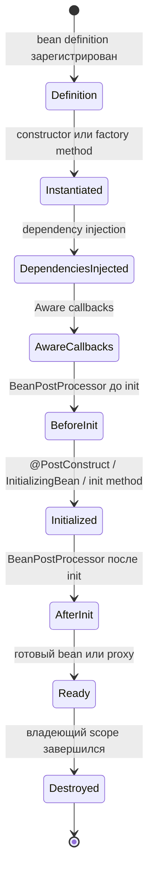
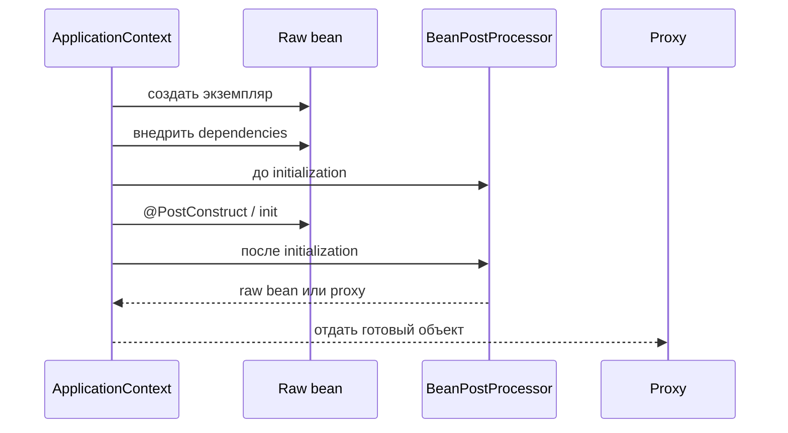
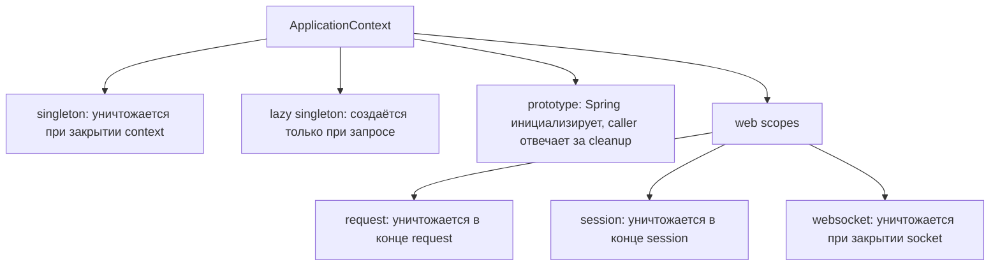

# Жизненный цикл бинов Spring

Spring-бин — это объект, созданием и жизненным циклом которого управляет Spring container, обычно `ApplicationContext`. Container делает больше, чем просто вызывает `new`: он читает bean definitions, выбирает scope, создаёт объект, внедряет зависимости, запускает lifecycle callbacks, даёт `BeanPostProcessor` возможность обернуть объект и позже уничтожает его, когда заканчивается владеющий scope. Представьте ресторанную кухню: кухня не просто покупает продукты; она готовит рабочее место, выдаёт инструменты, проверяет блюдо, отдаёт его в зал и убирает всё в правильный момент.

Эта тема фокусируется на lifecycle и дополняет [Spring IoC and Dependency Injection](topic:spring-ioc-di). Способ регистрации — отдельный вопрос: бин может появиться через сканирование `@Component` или через метод `@Bean`, как описано в теме [@Bean vs @Component in Spring](topic:spring-bean-vs-component). Scope тоже отдельен и подробно разобран в [Spring Bean Scopes](topic:spring-bean-scopes).

## Создание и инициализация

Spring начинает с bean definition: class, factory method, scope, dependencies и lifecycle metadata. В аналогии с почтой это талон на обслуживание: он говорит, какую посылку нужно подготовить, какая стойка за неё отвечает и какие наклейки нужны.

Для обычного singleton Spring создаёт экземпляр при старте context, если бин не lazy. Сначала срабатывает constructor injection, затем Spring заполняет setter- или field-injected dependencies. Кухонная аналогия: повар сначала берёт сковороду, а потом вокруг неё раскладывают ингредиенты и инструменты.

После dependency injection Spring может вызвать "aware" callbacks, например `BeanNameAware` или `ApplicationContextAware`. Используйте их осторожно, потому что они привязывают бин к Spring API. Это как выдать курьеру карту всего склада: полезно для инфраструктуры, но слишком много для обычной бизнес-логики.

Затем `BeanPostProcessor` получает шанс до инициализации. После этого Spring вызывает initialization callbacks: `@PostConstruct`, `InitializingBean.afterPropertiesSet()` или custom init method. Это финальная проверка блюда на кухне перед выдачей: соусы готовы, температура проверена, объект можно отдавать в работу.

После инициализации `BeanPostProcessor` запускается ещё раз. Здесь Spring может вернуть proxy вместо raw object для возможностей вроде transactions или async behavior. Proxy похож на стойку ресепшена перед специалистом: клиенты говорят со стойкой, а она добавляет правила перед передачей вызова дальше. Про ловушку proxy см. [How @Transactional Works](topic:spring-transactional-proxy) и [@Async and Self-Invocation](topic:spring-async-self-invocation).

## Сколько живут бины

Scope `singleton` по умолчанию означает один экземпляр бина на один `ApplicationContext`. В обычном приложении singleton создаётся один раз и уничтожается, когда этот context закрывается. Это как одна общая кофемашина на офисной кухне: она доступна весь рабочий день и чистится, когда кухня закрывается.

Но это не значит, что каждый бин всегда живёт весь JVM. Тесты могут создавать несколько contexts, web-приложение может иметь parent и child contexts, а закрытый child context уничтожает свои singleton-бины, пока parent context продолжает работать. Представьте торговый центр: один магазин может закрыть и убрать свою стойку, хотя сам центр ещё открыт.

Lazy singleton-бины могут не создаваться при старте. Они создаются только при первом запросе, а если никто их не запросил, они могут вообще не появиться. Это как держать специальный инструмент в каталоге, но ни разу не снять его с полки.

Бины с более короткими scopes заканчиваются раньше, чем application context. `request`-бин уничтожается в конце HTTP request, `session`-бин — в конце HTTP session, `websocket`-бин — при завершении WebSocket session. Ресторанная аналогия простая: поднос принадлежит одному заказу, шкафчик — одному посетителю, телефонная линия — одному активному звонку; всё убирается, когда заканчивается своё использование.

Prototype-бины устроены иначе. Spring создаёт их, внедряет dependencies и запускает initialization callbacks, но после передачи экземпляра вызывающему коду Spring не отслеживает его для обычного destruction. Владелец должен закрыть ресурсы или вызвать cleanup. Это как почта выдаёт вам форму: стойка подготовила бумагу, но дальше вы отвечаете за неё сами. Граница владения подробно разобрана в [Prototype Bean Use Case](topic:spring-prototype-bean-use-case).

## Уничтожение

Для singleton-бинов Spring вызывает destruction callbacks при закрытии context: `@PreDestroy`, `DisposableBean.destroy()` или настроенный destroy method. Он также уничтожает dependent beans в порядке, который не ломает общую dependency слишком рано. На кухне персонал закрывает станции в разумной последовательности: закончить блюдо, убрать рабочий стол, потом выключить главное оборудование.

Для web-scoped beans destruction привязан к соответствующему web scope. Request-scoped bean может создаваться и уничтожаться много раз, пока один и тот же application context продолжает работать. Это как почтовая стойка, которая обслуживает сотни талонов за один рабочий день.

Для prototype-бинов destruction callbacks автоматически не вызываются container после создания. Если prototype владеет file handle, connection или похожим ресурсом, проектируйте явный cleanup или используйте scope, который соответствует ресурсу. Это как взять инструмент напрокат: получение на стойке не значит, что стойка пойдёт за вами домой, чтобы вернуть его.

`Lifecycle` и `SmartLifecycle` отвечают за фазы start и stop, а не за весь bean lifecycle. Они полезны для message listeners или background components, которые должны стартовать после wiring и останавливаться при shutdown. Дорожная аналогия: светофор может перейти из active в stopped, но столб не демонтируют при каждом изменении фазы.

## 60-секундный ответ на интервью

> Spring-бин проходит регистрацию definition, instantiation, dependency injection, aware callbacks, хуки `BeanPostProcessor`, initialization callbacks вроде `@PostConstruct`, а затем обычное использование, иногда через proxy. Уничтожение зависит от scope. Singleton-бин обычно живёт до закрытия своего `ApplicationContext`, после чего Spring вызывает destroy callbacks вроде `@PreDestroy`. Но не все бины живут так долго: request, session, websocket и custom scoped beans уничтожаются при завершении своего scope; prototype-бины инициализируются Spring, но после передачи вызывающему коду не отслеживаются для автоматического destruction; lazy singletons могут создаться позже или вообще не создаться. Поэтому правильный ответ такой: default singletons обычно живут вместе с context, но короткие scopes и владение prototype могут закончиться намного раньше.

## Значение в production

Понимание lifecycle предотвращает ошибки старта и shutdown. Если бин открывает ресурс в `@PostConstruct`, он должен освободить его в `@PreDestroy` или в другом контролируемом shutdown path. Это как фудтрак: если перед сменой открыть газ, нужен чек-лист закрытия.

Оно также объясняет, почему proxy-based возможности иногда удивляют. Объект, который вы внедряете, может быть proxy, созданный после initialization, а self-invocation может обойти proxy behavior. Это как позвонить повару напрямую из кухни вместо того, чтобы оформить заказ через стойку, которая применяет оплату, чеки и маршрутизацию.

Scopes важны для памяти и корректности. Singleton-сервис обычно должен быть stateless, потому что его могут вызывать многие threads. Request или session state должен жить в соответствующем scope или передаваться явно через method data. В дорожной аналогии центр управления может быть общим, но у каждой машины всё равно есть своя полоса и состояние поездки.

Cleanup prototype — настоящая production-задача. Если prototype открывает внешние ресурсы и никто их не закрывает, утечка принадлежит вашему коду, а не Spring. Относитесь к таким объектам как к взятому оборудованию: стойка выдачи помогает получить его, но процесс возврата нужно спроектировать.

## Частые заблуждения

- "Каждый Spring bean живёт столько же, сколько приложение." Нет. Это примерно верно для eager singleton beans в одном `ApplicationContext`, но у request, session, websocket, custom scopes, child contexts и prototypes другие границы.
- "Singleton означает один объект на весь JVM." Нет. Это один экземпляр на Spring container. Несколько contexts могут создать несколько singleton instances.
- "`@PostConstruct` запускается после полного создания proxies." Не совсем. Initialization запускается на target bean; proxy wrapping обычно происходит на более позднем post-processing step.
- "`@PreDestroy` всегда запускается для каждого bean, созданного Spring." Нет. Он запускается при container-managed destruction, особенно для singleton и scoped beans. Prototype instances после handoff автоматически не уничтожаются.
- "Bean готов сразу после возврата из constructor." Нет. Dependencies, post-processors, initialization callbacks и proxy wrapping могут ещё продолжаться.
- "Остановка `SmartLifecycle` bean — то же самое, что его destruction." Нет. Stop/start — это operational phase; destruction — финальный cleanup при завершении владеющего context или scope.
- "Singleton bean потокобезопасен, потому что им управляет Spring." Нет. Lifecycle management не даёт concurrency guarantee; shared mutable fields всё равно требуют нормального проектирования.
