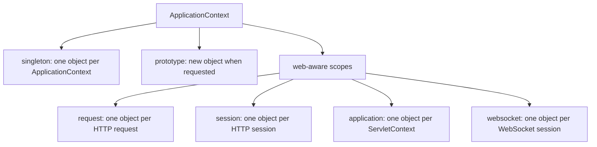
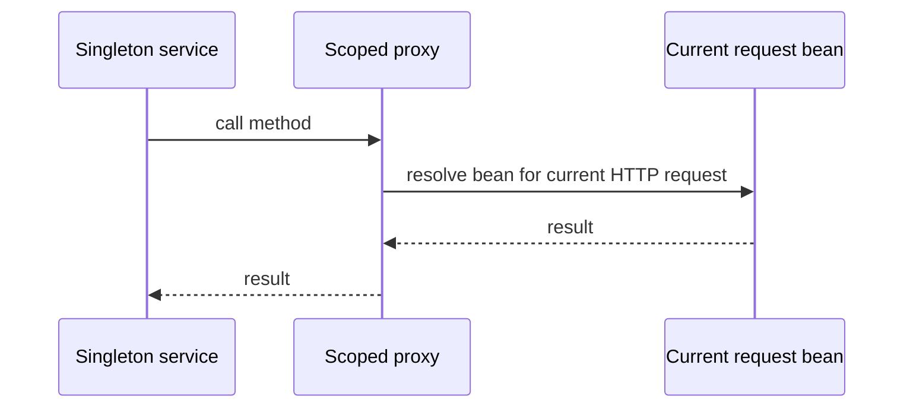

# Spring Bean Scopes

Spring bean scope answers one practical question: when Spring needs this bean, should it reuse an existing object or create a new one? Think of an office kitchen. Some things are shared by the whole office, like the coffee machine; some things are handed out fresh, like a clean cup; some things belong only to one visitor while they are in the building, like a temporary locker.

In Spring, the scope is part of the bean definition. You can put it on a class discovered with `@Component` or on a method declared with `@Bean`; the registration style is separate from the scope, as covered in [@Bean vs @Component](topic:spring-bean-vs-component). The scope only says how long the object lives and when another instance is needed.

## Main Scopes

`singleton` is the default. Spring creates one bean instance per `ApplicationContext` and injects the same object wherever that bean is needed. It is like one shared coffee machine in the office kitchen: everyone uses the same machine, so it must not keep unsafe per-user state. This is not exactly the GoF Singleton pattern because the uniqueness is managed by one Spring container, not by a private constructor and a static global instance.

`prototype` asks Spring to create a new bean instance every time the bean is requested from the container. It is like the post office giving each customer a fresh numbered form. Spring creates it and performs dependency injection, but after handing it over, Spring does not manage its full destruction lifecycle the way it does for singleton beans.

`request` exists in a web-aware Spring application. One instance is created for one HTTP request and then discarded when the request is done. It is like a restaurant tray used for one customer order: it carries data through that order, then gets cleared.

`session` creates one instance per HTTP session. It is like a locker assigned to one visitor while they keep coming back during the same visit. It can hold user-session state, but it also increases memory use and must be treated carefully in clustered or stateless systems.

`application` creates one instance per `ServletContext`. It is like a notice board shared by the whole building, not just one kitchen. In many single-application deployments it feels similar to `singleton`, but the boundary is the web application context.

`websocket` creates one instance per WebSocket session. It is like a dedicated phone line while a call is open. The bean can keep state for that connection, but it should be cleaned up when the connection closes.

Spring also supports custom scopes, and Spring has a `SimpleThreadScope`, but it is not registered by default. In interviews, list the standard scopes first and mention custom scopes only after the core answer is clear.

## Short-Lived Beans Inside Long-Lived Beans

A common trap is injecting `prototype` or `request` scoped beans directly into a `singleton`. Constructor and field injection happen when the singleton is created, so the singleton receives one object at startup and keeps that reference. It is like a kitchen manager taking one fresh cup in the morning and reusing that same cup for every customer, even though the rule said "fresh cup per customer".

Use `ObjectProvider<T>`, `Provider<T>`, method injection, or a scoped proxy when the singleton needs the current shorter-lived object on each call. A scoped proxy is a small stable object injected into the singleton; when a method is called, the proxy looks up the real bean for the current request, session, or scope. It is like a concierge desk: the desk stays in the lobby, but it forwards each visitor to the right current counter.

## 60-Second Interview Answer

Spring bean scope controls the lifecycle and visibility of a bean instance. The default is `singleton`: one instance per Spring `ApplicationContext`. `prototype` creates a new instance each time the bean is requested, but Spring does not manage its destruction callbacks after creation. In web applications there are extra scopes: `request` is one instance per HTTP request, `session` is one per HTTP session, `application` is one per `ServletContext`, and `websocket` is one per WebSocket session. The big interview trap is shorter-lived beans inside singletons: direct injection resolves once, so use `ObjectProvider`, `Provider`, lookup method injection, or a scoped proxy if the singleton needs a fresh or current scoped object. Also, singleton scope does not make a class thread-safe; shared mutable state is still dangerous.

## Production Relevance

Most stateless services should stay `singleton`. It keeps object creation cheap and predictable, like one reliable kitchen appliance used all day. The service should put per-request data in method parameters, local variables, request-scoped collaborators, or persistence, not in mutable fields.

Use `prototype` for stateful helper objects that are cheap to create and are owned by the caller after creation. It is like issuing a new form for a specific task. Do not expect Spring to call destroy callbacks for every prototype instance.

Use `request` for request-specific context such as correlation data, current tenant, or request-local formatting state. It is like a tray that follows one order from counter to counter. Avoid using it for domain state that should be persisted or passed explicitly.

Use `session` sparingly for user-session state such as a web shopping cart. It is like a visitor locker: convenient, but it consumes space and becomes painful when you need horizontal scaling, sticky sessions, or stateless APIs.

Use `application` and `websocket` only when their boundaries are exactly what you need. A building-wide notice board and a live phone line are useful tools, but they are wrong places for random shared mutable state.

## Common Misconceptions

- "Singleton means one object in the whole JVM." Not necessarily. It is one object per Spring `ApplicationContext`. A test suite, parent/child contexts, or multiple applications can create more than one.
- "Singleton beans are automatically thread-safe." No. The same object may serve many threads, so mutable fields need normal thread-safety discipline.
- "Prototype means every injection gets a new object forever." Only the injection point is resolved when the owning bean is created. A singleton with a directly injected prototype keeps that one instance unless it asks the container again.
- "Spring fully manages prototype destruction." Spring creates and initializes prototype beans, but cleanup after handoff is the caller's responsibility.
- "Request and session scopes work in any Spring app." They require a web-aware context. In a plain CLI or batch application, those scopes are not active unless you provide a matching scope.
- "Session scope is a good cache." Usually not. It is per user and memory-heavy, like giving every visitor a locker for things that should be stored in a proper warehouse.
