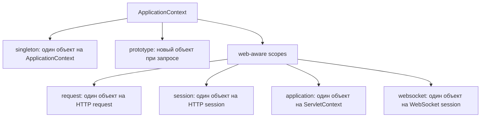
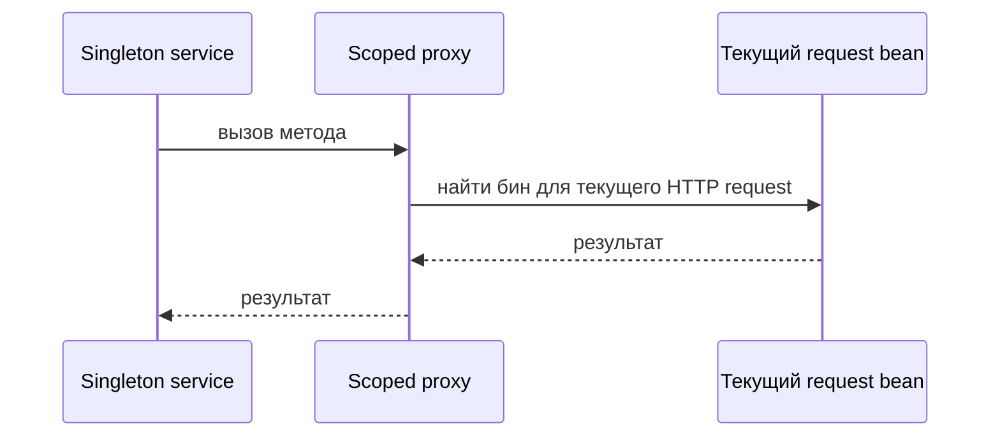

# Скоупы бинов в Spring

Scope бина отвечает на практический вопрос: когда Spring нужен этот бин, должен ли он переиспользовать существующий объект или создать новый? Представьте офисную кухню. Одни вещи общие для всего офиса, например кофемашина; другие выдаются свежими, например чистая чашка; третьи принадлежат одному посетителю, пока он находится в здании, например временный шкафчик.

В Spring scope является частью определения бина. Его можно поставить на класс, который найден через `@Component`, или на метод, объявленный через `@Bean`; способ регистрации отделён от scope, как описано в [@Bean и @Component](topic:spring-bean-vs-component). Scope говорит только о том, как долго живёт объект и когда нужен новый экземпляр.

## Основные скоупы

`singleton` используется по умолчанию. Spring создаёт один экземпляр бина на один `ApplicationContext` и внедряет тот же объект всюду, где нужен этот бин. Это как одна общая кофемашина на офисной кухне: ей пользуются все, поэтому она не должна хранить небезопасное состояние конкретного пользователя. Это не совсем GoF Singleton, потому что уникальность контролирует один Spring-контейнер, а не private constructor и static global instance.

`prototype` просит Spring создавать новый экземпляр бина каждый раз, когда бин запрашивают из контейнера. Это как почта, которая выдаёт каждому клиенту новый номерной бланк. Spring создаёт объект и выполняет dependency injection, но после передачи наружу не управляет полным destroy lifecycle так же, как у singleton-бинов.

`request` существует в web-aware Spring-приложении. Один экземпляр создаётся для одного HTTP request и удаляется после завершения запроса. Это как поднос в кафе для одного заказа: он несёт данные через этот заказ, а потом очищается.

`session` создаёт один экземпляр на одну HTTP session. Это как шкафчик, выданный одному посетителю, пока он возвращается в рамках того же визита. Он может хранить user-session state, но увеличивает расход памяти и требует осторожности в кластерных или stateless-системах.

`application` создаёт один экземпляр на один `ServletContext`. Это как доска объявлений для всего здания, а не только одной кухни. Во многих single-application deployments он похож на `singleton`, но границей является web application context.

`websocket` создаёт один экземпляр на одну WebSocket session. Это как выделенная телефонная линия, пока открыт звонок. Бин может хранить состояние этого соединения, но должен очищаться при закрытии соединения.

Spring также поддерживает custom scopes, и в Spring есть `SimpleThreadScope`, но он не зарегистрирован по умолчанию. На собеседовании сначала перечислите стандартные скоупы и упоминайте custom scopes только после чёткого основного ответа.

## Короткоживущие бины внутри долгоживущих бинов

Частая ловушка — напрямую внедрить `prototype` или `request` scoped bean в `singleton`. Constructor и field injection выполняются при создании singleton, поэтому singleton получает один объект на старте и хранит эту ссылку. Это как если бы менеджер кухни взял одну чистую чашку утром и использовал её для каждого клиента, хотя правило было «свежая чашка для каждого клиента».

Используйте `ObjectProvider<T>`, `Provider<T>`, method injection или scoped proxy, когда singleton должен получать текущий короткоживущий объект при каждом вызове. Scoped proxy — это маленький стабильный объект, внедрённый в singleton; при вызове метода proxy ищет реальный бин для текущего request, session или другого scope. Это как стойка консьержа: стойка всегда в вестибюле, но каждого посетителя направляет к нужному актуальному окну.

## Ответ за 60 секунд

Scope бина в Spring управляет жизненным циклом и видимостью экземпляра бина. По умолчанию используется `singleton`: один экземпляр на Spring `ApplicationContext`. `prototype` создаёт новый экземпляр при каждом запросе бина, но Spring не управляет его destroy callbacks после создания. В web-приложениях есть дополнительные скоупы: `request` — один экземпляр на HTTP request, `session` — один на HTTP session, `application` — один на `ServletContext`, `websocket` — один на WebSocket session. Главная ловушка на собеседовании — короткоживущие бины внутри singleton: прямое внедрение выполняется один раз, поэтому используйте `ObjectProvider`, `Provider`, lookup method injection или scoped proxy, если singleton нужен свежий или текущий scoped object. И ещё: scope singleton не делает класс потокобезопасным; shared mutable state всё равно опасен.

## Практическая ценность

Большинство stateless services должны оставаться `singleton`. Это делает создание объектов дешёвым и предсказуемым, как один надёжный кухонный прибор на весь день. Сервис должен хранить per-request data в параметрах методов, локальных переменных, request-scoped collaborators или persistence, а не в mutable fields.

Используйте `prototype` для stateful helper objects, которые дёшево создавать и которыми после создания владеет вызывающий код. Это как выдать новый бланк под конкретную задачу. Не ожидайте, что Spring вызовет destroy callbacks для каждого prototype instance.

Используйте `request` для request-specific context: correlation data, current tenant или request-local formatting state. Это как поднос, который сопровождает один заказ от стойки к стойке. Не используйте его для domain state, который должен сохраняться или передаваться явно.

Используйте `session` экономно для user-session state, например корзины покупок в web. Это как шкафчик посетителя: удобно, но занимает место и создаёт проблемы, когда нужны horizontal scaling, sticky sessions или stateless APIs.

Используйте `application` и `websocket` только когда их границы действительно подходят задаче. Доска объявлений для всего здания и живая телефонная линия полезны, но это плохие места для случайного shared mutable state.

## Частые заблуждения

- «Singleton означает один объект на всю JVM». Не обязательно. Это один объект на Spring `ApplicationContext`. Тестовый набор, parent/child contexts или несколько приложений могут создать больше одного экземпляра.
- «Singleton-бины автоматически thread-safe». Нет. Один и тот же объект может обслуживать много потоков, поэтому для mutable fields нужна обычная дисциплина thread safety.
- «Prototype означает, что каждая инъекция всегда получает новый объект». Только injection point резолвится при создании владеющего бина. Singleton с напрямую внедрённым prototype хранит один этот экземпляр, если не обращается к контейнеру снова.
- «Spring полностью управляет destroy для prototype». Spring создаёт и инициализирует prototype beans, но cleanup после передачи наружу — ответственность вызывающего кода.
- «Request и session scopes работают в любом Spring app». Для них нужен web-aware context. В обычном CLI или batch-приложении эти scopes не активны, если вы не предоставили подходящий scope.
- «Session scope — хороший cache». Обычно нет. Он per user и тяжёлый по памяти, как если бы каждому посетителю дали шкафчик для вещей, которые надо хранить на нормальном складе.
