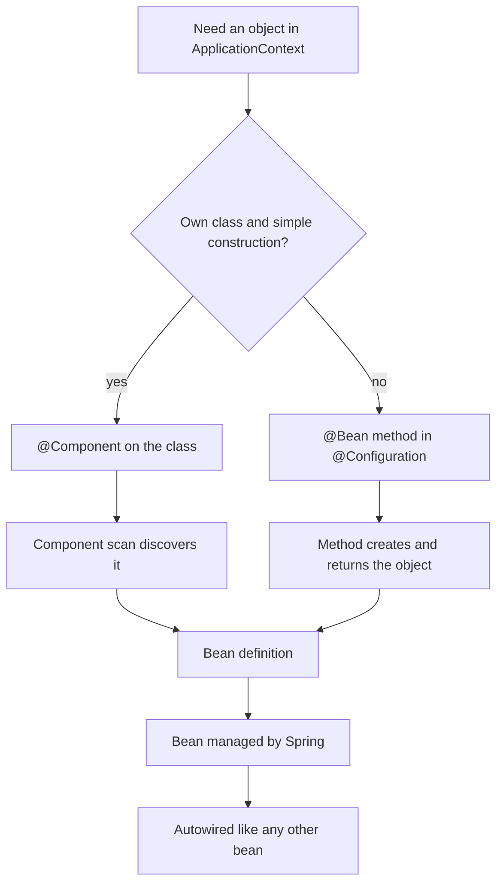

# @Bean vs @Component in Spring

Both annotations can put an object into the Spring `ApplicationContext`; after
that, the object is just a Spring bean and can be injected, proxied, configured
with scopes, and closed through the same lifecycle. The difference is **where the
bean definition comes from**. Real-life analogy: two parcels arrive at the same
post office counter, but one was found by the mail scanner and the other was
entered manually by the clerk.



## @Component: mark the class itself

`@Component` is placed on a class that Spring can create by calling its
constructor. During component scanning, Spring finds that class and registers it
as a bean. This is the common choice for your own application code: services,
adapters, validators, schedulers, and other classes whose construction belongs to
the class itself. Kitchen analogy: the jar already has a barcode on it, so the
store scanner can add it to inventory without a separate order form.

```java
@Component
public class OrderService {
    private final PaymentClient paymentClient;

    public OrderService(PaymentClient paymentClient) {
        this.paymentClient = paymentClient;
    }
}
```

`@Service`, `@Repository`, and `@Controller` are specialized stereotypes built on
top of `@Component`; they add intent and sometimes framework behavior, but they
still enter the container through component scanning. Traffic analogy: all of
them use the same road into the city, but the vehicle labels tell Spring what
kind of job they do.

## @Bean: declare the factory method

`@Bean` is placed on a method, usually inside `@Configuration`. Spring calls the
method and registers the returned object as a bean. This is the cleaner choice
when the class is not yours, comes from a library, needs constructor values from
properties, or must be assembled from several pieces. Kitchen analogy: the cook
uses a recipe card, combines ingredients, and then puts the finished dish on the
serving counter.

```java
@Configuration
public class TimeConfig {
    @Bean
    public Clock clock() {
        return Clock.systemUTC();
    }
}
```

`@Bean` also makes dependencies and configuration visible in one place. For
example, you can return one implementation of a [Strategy](topic:strategy)
interface based on properties, or build a third-party client with timeouts,
credentials, and interceptors. Post office analogy: the clerk writes the exact
delivery route on the form instead of hoping the package label explains
everything.

## What happens after registration

Once the bean definition exists, Spring treats both sources almost the same:
constructor injection, `@Autowired`, `@Qualifier`, `@Primary`, scopes,
`@PostConstruct`, `DisposableBean`, AOP proxies, and lifecycle callbacks are
applied by the container. Office analogy: after both people receive employee
badges, they pass through the same doors and follow the same building rules.

The default bean name is different. A `@Component` bean usually gets the
decapitalized class name, such as `orderService`. A `@Bean` usually gets the
method name, such as `clock`, unless you override it. Library analogy: one book
is cataloged by its title on the cover, the other by the title written on the
library card.

There is one important advanced detail: full `@Configuration` classes are
proxied by Spring, so a call from one `@Bean` method to another can return the
managed singleton instead of building a second object. `@Bean` methods in a plain
`@Component` class use a lighter mode and do not get the same inter-method
proxying guarantee. Dispatch-desk analogy: the official desk checks whether a
courier is already assigned before sending another one; a casual sticky note
does not.

## 60-second interview answer

> `@Component` marks a class for component scanning: Spring discovers the class
> on the classpath and creates a bean from it. `@Bean` marks a method whose return
> value should be registered as a bean, usually in a `@Configuration` class. I use
> `@Component` for my own classes with straightforward construction, and `@Bean`
> for third-party objects or explicit setup that needs parameters, conditionals,
> or several dependencies. After registration, both are Spring beans and take part
> in the same dependency injection and lifecycle. The common trap is thinking one
> is more "Spring-managed" than the other; the real difference is discovery versus
> explicit factory declaration.

## Production relevance

Use `@Component` when the class belongs to your codebase and its constructor
expresses the dependencies clearly. It keeps the class close to its role and
keeps configuration files smaller. Kitchen analogy: common pantry items live on
the labeled shelf because everyone knows where they go.

Use `@Bean` when object creation is a decision. Examples: `DataSource`,
`ObjectMapper`, `Clock`, SDK clients, caches, or an implementation selected by a
profile or property. Traffic analogy: a custom route needs a dispatcher, not just
a street sign.

In large systems, the split also helps reviews. `@Component` answers "what kind
of class is this?" while `@Bean` answers "how exactly do we construct this
object?" Warehouse analogy: barcode labels identify items; packing instructions
explain how to assemble a shipment.

## Common misconceptions

- "@Bean is for Spring objects and @Component is for normal objects." Both create
  Spring-managed beans; they just declare them differently. Post office analogy:
  both parcels get tracking numbers.
- "A class from a third-party jar can just be annotated with @Component." You
  usually cannot or should not edit library source, so a `@Bean` method is the
  right entry point. Kitchen analogy: you cannot print a barcode on a sealed
  supplier box, so you fill out an intake form.
- "Putting both @Component and a @Bean for the same type is harmless." It can
  create two beans and make injection ambiguous unless you use `@Primary` or
  `@Qualifier`. Traffic analogy: two taxis answer the same booking and the
  passenger does not know which one to enter.
- "@Bean always means singleton Java object." The default Spring scope is
  singleton, but scope can be changed for either style. Office analogy: a desk
  can be permanently assigned or booked per visit.
- "Calling a @Bean method is the same as using the bean." It is safe in full
  `@Configuration` proxy mode, but plain method calls in lite mode can create new
  objects. Dispatch analogy: go through the desk when you need the assigned
  courier, not around it.
