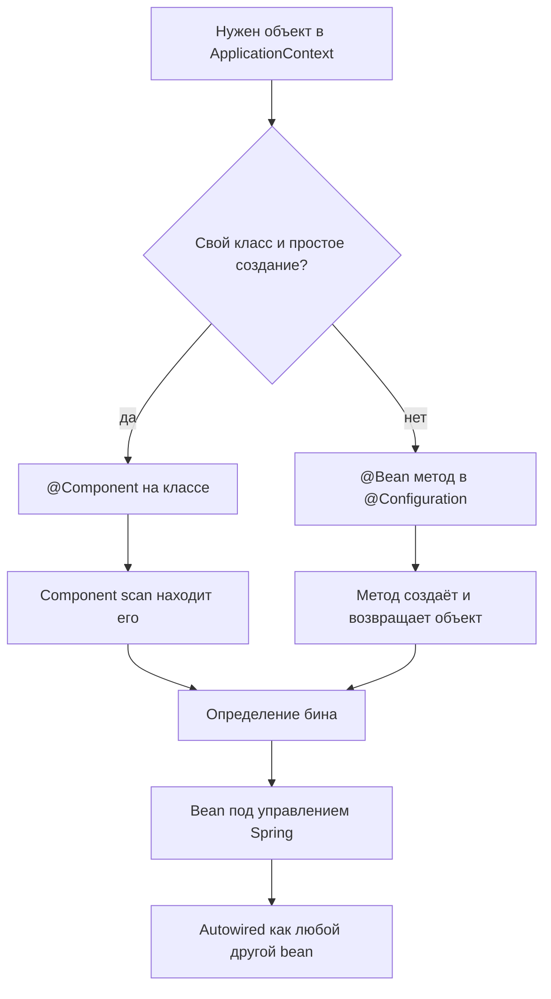

# @Bean и @Component в Spring

Обе аннотации могут поместить объект в Spring `ApplicationContext`; после этого
объект становится обычным Spring bean и может инжектиться, проксироваться,
настраиваться через scopes и закрываться тем же lifecycle. Разница в том,
**откуда берётся определение бина**. Аналогия из жизни: две посылки приходят на
одну стойку почты, но одну нашёл почтовый сканер, а вторую клерк внёс вручную.



## @Component: пометить сам класс

`@Component` ставится на класс, который Spring может создать через его
конструктор. Во время component scanning Spring находит этот класс и
регистрирует его как bean. Это обычный выбор для вашего собственного
application-кода: services, adapters, validators, schedulers и других классов,
чьё создание принадлежит самому классу. Аналогия с кухней: на банке уже есть
штрихкод, поэтому сканер магазина может добавить её в учёт без отдельного бланка.

```java
@Component
public class OrderService {
    private final PaymentClient paymentClient;

    public OrderService(PaymentClient paymentClient) {
        this.paymentClient = paymentClient;
    }
}
```

`@Service`, `@Repository` и `@Controller` — специализированные stereotypes,
построенные поверх `@Component`; они добавляют намерение, а иногда и поведение
framework, но всё равно попадают в container через component scanning. Аналогия с
дорогой: все они въезжают в город по одной дороге, но таблички на машине говорят
Spring, какую работу они выполняют.

## @Bean: объявить factory method

`@Bean` ставится на метод, обычно внутри `@Configuration`. Spring вызывает метод
и регистрирует возвращённый объект как bean. Это более чистый выбор, когда класс
не ваш, приходит из библиотеки, требует значений из properties или должен быть
собран из нескольких частей. Аналогия с кухней: повар берёт карточку рецепта,
соединяет ингредиенты и ставит готовое блюдо на раздачу.

```java
@Configuration
public class TimeConfig {
    @Bean
    public Clock clock() {
        return Clock.systemUTC();
    }
}
```

`@Bean` также делает зависимости и конфигурацию видимыми в одном месте. Например,
можно вернуть одну реализацию интерфейса [Strategy](topic:strategy) на основе
properties или собрать сторонний client с timeouts, credentials и interceptors.
Аналогия с почтой: клерк пишет точный маршрут доставки на бланке, а не надеется,
что наклейка на посылке всё объяснит.

## Что происходит после регистрации

Когда определение бина уже существует, Spring обрабатывает оба источника почти
одинаково: constructor injection, `@Autowired`, `@Qualifier`, `@Primary`, scopes,
`@PostConstruct`, `DisposableBean`, AOP proxies и lifecycle callbacks применяются
container. Аналогия с офисом: после выдачи пропусков оба человека проходят через
одни двери и соблюдают одни правила здания.

Имя бина по умолчанию отличается. Bean из `@Component` обычно получает имя класса
с маленькой первой буквой, например `orderService`. Bean из `@Bean` обычно
получает имя метода, например `clock`, если его не переопределить. Аналогия с
библиотекой: одну книгу заносят в каталог по названию на обложке, другую — по
названию, указанному на библиотечной карточке.

Есть важная продвинутая деталь: полноценные классы `@Configuration` проксируются
Spring, поэтому вызов одного метода `@Bean` из другого может вернуть управляемый
singleton, а не создать второй объект. Методы `@Bean` в обычном классе
`@Component` работают в более лёгком режиме и не дают той же гарантии proxying
между методами. Аналогия с диспетчерской: официальная стойка проверяет, не
назначен ли курьер уже, прежде чем отправить ещё одного; случайная заметка на
стикере этого не делает.

## Ответ за 60 секунд

> `@Component` помечает класс для component scanning: Spring находит класс в
> classpath и создаёт из него bean. `@Bean` помечает метод, возвращаемое значение
> которого нужно зарегистрировать как bean, обычно в классе `@Configuration`. Я
> использую `@Component` для собственных классов с простым созданием, а `@Bean` —
> для сторонних объектов или явной сборки, где нужны параметры, условия или
> несколько зависимостей. После регистрации оба варианта становятся Spring beans
> и участвуют в одном dependency injection и lifecycle. Частая ловушка — думать,
> что один вариант "более управляемый Spring", чем другой; настоящая разница в
> discovery против явного factory declaration.

## Значение в production

Используйте `@Component`, когда класс принадлежит вашему codebase и его
конструктор ясно показывает зависимости. Это держит класс рядом с его ролью и
уменьшает конфигурационные файлы. Аналогия с кухней: обычные продукты лежат на
подписанной полке, потому что всем понятно, где их место.

Используйте `@Bean`, когда создание объекта — это решение. Примеры: `DataSource`,
`ObjectMapper`, `Clock`, SDK clients, caches или реализация, выбранная через
profile или property. Аналогия с трафиком: для особого маршрута нужен диспетчер,
а не просто дорожный знак.

В больших системах такое разделение помогает review. `@Component` отвечает "что
это за класс?", а `@Bean` отвечает "как именно мы создаём этот объект?" Аналогия
со складом: штрихкоды идентифицируют товары, а packing instructions объясняют,
как собрать отправление.

## Частые заблуждения

- "@Bean нужен для Spring-объектов, а @Component — для обычных объектов." Оба
  создают Spring-managed beans; они просто объявляют их разным способом. Аналогия
  с почтой: обе посылки получают tracking number.
- "Класс из стороннего jar можно просто пометить @Component." Обычно вы не можете
  или не должны редактировать исходники библиотеки, поэтому правильная точка
  входа — метод `@Bean`. Аналогия с кухней: на запечатанную коробку поставщика
  нельзя напечатать штрихкод, поэтому вы заполняете приёмный бланк.
- "Одновременно поставить @Component и объявить @Bean того же типа — безвредно."
  Это может создать два бина и сделать injection неоднозначным, если не
  использовать `@Primary` или `@Qualifier`. Аналогия с трафиком: два такси
  приехали на один заказ, и пассажир не знает, в какое садиться.
- "@Bean всегда означает singleton Java object." По умолчанию Spring scope —
  singleton, но scope можно изменить для обоих вариантов. Аналогия с офисом:
  стол может быть закреплён навсегда или бронироваться на каждый визит.
- "Вызвать метод @Bean — то же самое, что получить bean." В full
  `@Configuration` proxy mode это безопасно, но обычные вызовы методов в lite
  mode могут создавать новые объекты. Аналогия с диспетчерской: когда нужен
  назначенный курьер, идите через стойку, а не в обход неё.
