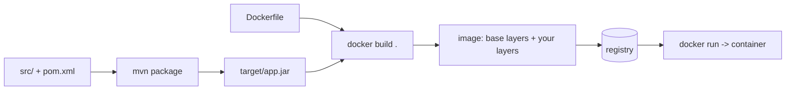
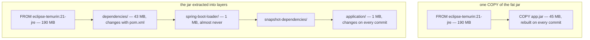
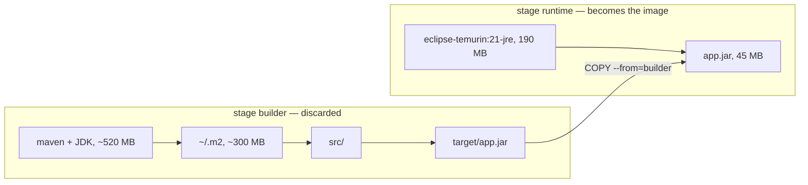

# Building a Docker image from a Spring Boot application

**You build the jar first, then write a Dockerfile that starts from a JRE base
image, copies the jar in and declares how to launch it.** Everything else —
layers, multi-stage builds, `.dockerignore`, a non-root user — is about making
that image cheap to rebuild, cheap to ship and safe to run.

The smallest version that works:

```dockerfile
FROM eclipse-temurin:21-jre
WORKDIR /app
COPY target/app.jar app.jar
EXPOSE 8080
ENTRYPOINT ["java", "-jar", "/app/app.jar"]
```

```bash
mvn -B package -DskipTests
docker build -t shop-api:1.0.0 .
docker run -p 8080:8080 shop-api:1.0.0
```

Note what the Dockerfile does *not* do: it does not compile anything. `mvn
package` produced the jar (see [how Java source becomes running
code](topic:jvm-source-code-flow)); Docker only packages it together with a
Linux userland and a JVM so the result runs identically on any machine that has
a container runtime.



## The one rule everything follows: instructions become cached layers

Each instruction produces a layer, and the daemon reuses a layer only when
**its own cache key and every layer below it are unchanged**. The cache is a
chain, not a set of independent entries — so the first instruction that changes
invalidates itself *and everything after it*.

For a `COPY`, the cache key includes a digest of the copied content. That is
where the fat jar hurts: your classes and all your dependencies live in one
file, so Docker sees one indivisible blob. Change one line in one controller and
the entire 45 MB layer is rewritten, pushed to the registry again, and pulled
again by every node.



Both images are 235 MB. The difference is not size, it is **churn**: after a
one-line change the first one moves 45 MB and the second one moves about 1 MB.
(The numbers here are round illustrative ones — a typical Spring Boot jar is
tens of megabytes and a `-jre` base a couple of hundred; measure your own with
`docker history`.)

## The layered jar

Spring Boot builds its jar with a layer index, and can extract itself into four
folders ordered by how often they change:

| Layer | Contents | Changes |
|---|---|---|
| `dependencies/` | released third-party jars | when `pom.xml` does |
| `spring-boot-loader/` | the loader classes | on a Spring Boot upgrade |
| `snapshot-dependencies/` | `-SNAPSHOT` jars | when an internal library does |
| `application/` | your classes and resources | every commit |

```dockerfile
# 1. build the jar
FROM maven:3.9-eclipse-temurin-21 AS builder
WORKDIR /build
COPY pom.xml .
RUN mvn -B dependency:go-offline
COPY src ./src
RUN mvn -B package -DskipTests

# 2. split it into layers
FROM eclipse-temurin:21-jre AS extractor
WORKDIR /extract
COPY --from=builder /build/target/*.jar application.jar
RUN java -Djarmode=tools -jar application.jar extract --layers --destination .

# 3. the image that actually ships
FROM eclipse-temurin:21-jre
WORKDIR /app
RUN useradd --system --no-create-home app
COPY --from=extractor /extract/dependencies/ ./
COPY --from=extractor /extract/spring-boot-loader/ ./
COPY --from=extractor /extract/snapshot-dependencies/ ./
COPY --from=extractor /extract/application/ ./
USER app
EXPOSE 8080
ENTRYPOINT ["java", "-jar", "application.jar"]
```

`-Djarmode=tools … extract --layers` is the Spring Boot 3.3+ form; before that it
was `-Djarmode=layertools -jar app.jar extract`, and the entrypoint was
`ENTRYPOINT ["java", "org.springframework.boot.loader.launch.JarLauncher"]`
(`org.springframework.boot.loader.JarLauncher` before 3.2). You will meet both in
real repositories.

The ordering rule is **by change frequency, not by size**. Layering is a bet
that code changes are frequent and dependency changes are rare; when you do add
a starter to `pom.xml`, the dependency layer and everything copied after it are
rebuilt, exactly as before.

## Multi-stage builds

Two (or more) `FROM` blocks in one Dockerfile. Earlier stages can do anything —
run Maven, run tests, generate code — and only the **last** stage becomes the
image. `COPY --from=<stage>` reaches back for the artefacts you want to keep.



What that buys you:

- **The build tooling never ships.** No Maven, no compiler, no `~/.m2`, no
  source code in production — roughly 600 MB and a chunk of attack surface gone.
- **Anyone can build it.** `docker build .` needs no local JDK or Maven, which
  is why CI images and onboarding get simpler.
- **The cache still applies inside a stage.** Copying `pom.xml` and running
  `mvn dependency:go-offline` *before* copying `src/` is what keeps the
  dependency download cached when only your code changed. Reverse those two
  instructions and every commit re-downloads the internet.

In CI, where the daemon starts with an empty cache, that ordering is not enough
on its own: use `docker build --cache-from` against a previously pushed image, or
a BuildKit cache mount (`RUN --mount=type=cache,target=/root/.m2 mvn -B package`)
which survives across builds without becoming a layer.

## The build context: the dot in `docker build .`

Before the first instruction runs, the CLI packs that folder and sends it to the
daemon. Without a `.dockerignore` that includes your local `target/`, your
`.git/` history and any `node_modules/` — hundreds of megabytes transferred on
every build, plus a `COPY . .` that is invalidated by files the image never
needed.

```
target/
.git/
node_modules/
*.md
.env
```

The caveat: only ignore what no `COPY` reads. If your Dockerfile copies
`target/app.jar`, ignoring all of `target/` breaks the build with a "file not
found" — which is one more argument for building inside a multi-stage image
instead.

## The image you would actually deploy

- **JRE, not JDK.** A compiler is a build-time tool; dropping it saves ~150 MB.
  The counter-argument is diagnostics: `jcmd`, `jstack` and `jmap` come with the
  JDK, so some teams ship a JDK image on purpose, or add `jattach`. Decide
  deliberately rather than by default.
- **A non-root `USER`.** Root in the container is uid 0 on the kernel it shares
  with the host, and many clusters refuse to schedule an image that needs it.
  One `useradd` and one `USER` line.
- **Tell the JVM about the limit.** Since Java 10 the JVM reads the container's
  cgroup limit, but the default `MaxRAMPercentage` is 25%: in a 512 MB container
  it takes 128 MB of heap and leaves the rest idle. Set
  `-XX:MaxRAMPercentage=75` (via `JAVA_TOOL_OPTIONS` so it stays overridable) and
  remember that the *rest* of the limit is not spare — metaspace, thread stacks,
  code cache and direct buffers live there too, and exceeding the limit gets the
  container OOM-killed by the kernel rather than throwing an
  `OutOfMemoryError`. See [configuring the garbage
  collector](topic:gc-configuration) and [how Java memory is
  organized](topic:jvm-memory-areas).
- **Configuration comes from the environment.** One image must be able to run in
  staging and production, so the database URL and passwords arrive as environment
  variables (`SPRING_DATASOURCE_URL`), a mounted config file, or a secret store —
  never baked into a layer.
- **Exec form for `ENTRYPOINT`.** `ENTRYPOINT ["java", "-jar", "app.jar"]` makes
  the JVM PID 1, so `docker stop`'s `SIGTERM` reaches it and Spring Boot's
  graceful shutdown runs. The shell form (`ENTRYPOINT java -jar app.jar`) wraps
  it in `/bin/sh -c`, which does not forward signals — your app is `SIGKILL`ed ten
  seconds later, mid-request.
- **Meaningful tags.** `:latest` is not a version, it is a label that moves. Tag
  with the build number or the git SHA so a rollback is a tag change and two
  nodes cannot end up running different code under the same name.
- **A readiness signal.** Expose `/actuator/health/readiness` and let the
  orchestrator probe it, so traffic arrives only after the context is up — the
  same concern as [timeouts and circuit
  breakers](topic:service-timeouts-fallbacks) on the caller's side.

## Without a Dockerfile at all

- **Buildpacks**: `mvn spring-boot:build-image` (Paketo, built into the Spring
  Boot plugin) produces a layered, non-root, memory-tuned image from your project
  with no Dockerfile. You give up fine control and gain a maintained default.
- **Jib** (`mvn jib:dockerBuild`): builds a layered image from the Maven build
  itself — no Docker daemon needed, reproducible, and fast because it uploads
  only changed layers.
- **`docker init`** scaffolds a reasonable Dockerfile for you if you would rather
  own the file.

An interviewer usually wants to hear that you *know* these exist and can say when
you would still hand-write the Dockerfile: unusual base images, extra native
packages, or a build that does more than compile.

## The 60-second interview answer

> Maven or Gradle builds the jar; the Dockerfile only packages it. The minimal
> one is `FROM eclipse-temurin:21-jre`, `COPY target/app.jar app.jar`,
> `ENTRYPOINT ["java","-jar","/app/app.jar"]`. That works, but every instruction
> is a cached layer, and a fat jar is a single 45 MB layer that changes on every
> commit — so I extract Spring Boot's layered jar and copy `dependencies`,
> `spring-boot-loader`, `snapshot-dependencies` and `application` in that order,
> rarest change first. Then a one-line change re-pushes about a megabyte instead
> of the whole jar. I use a multi-stage build so Maven, the JDK and the sources
> stay out of the shipped image, and copy `pom.xml` and run `dependency:go-offline`
> before copying `src/` so a code change does not re-download dependencies. A
> `.dockerignore` keeps `target/` and `.git/` out of the build context. In the
> final image: a JRE base, a non-root `USER`, `-XX:MaxRAMPercentage=75` so the
> JVM uses the container's limit, config from environment variables, exec-form
> `ENTRYPOINT` so `SIGTERM` reaches the JVM, and a version tag rather than
> `latest`. If I do not want to maintain a Dockerfile, `spring-boot:build-image`
> or Jib produce a layered image directly.

## Why it matters in production

- **Deploy speed is layer speed.** Every node pulls the layers it lacks. A 45 MB
  application layer per release, times fifty nodes, times twenty releases a day,
  is real money and real minutes; 1 MB is not.
- **The image is the unit of scaling.** Identical containers from one image are
  what lets you add instances behind a load balancer — see [scaling an overloaded
  server](topic:scaling-an-overloaded-server) and [why microservices are
  used](topic:why-microservices).
- **Layers are permanent.** A file added in one layer and deleted in a later one
  is still in the image — anyone can extract it. Secrets passed through
  `--build-arg` or copied and removed are published, which is why BuildKit has
  `--mount=type=secret` (compare [OWASP's top risks](topic:owasp-top-ten)).
- **Reproducibility.** The tag your CI built and the tag your cluster runs must
  be the same immutable digest, or "works on my machine" comes back at cluster
  scale.
- **Base image upgrades are your patching story.** CVEs are usually in the base
  layer, not in your jar; rebuilding on a fresh base is the fix, so the pipeline
  must be able to rebuild and redeploy without a code change.

## Common misconceptions

- **"The Dockerfile builds my application."** Only in a multi-stage build. A
  plain `COPY target/app.jar` ships whatever happens to be in `target/` — including
  a stale jar from last week.
- **"A layered jar makes the image smaller."** It does not; the bytes are the
  same. It makes the *changed* part smaller, which is what rebuilds, pushes and
  pulls actually cost.
- **"`RUN rm secret.txt` removes it from the image."** The file still exists in
  the layer that added it. Deleting in a later layer only hides it from the final
  filesystem view.
- **"The JVM will see the host's memory."** Not since Java 10 with cgroup limits
  — but the default heap share is only 25% of the limit, so an untuned container
  wastes most of what you gave it. On ancient Java 8 images the old problem is
  real.
- **"`EXPOSE 8080` publishes the port."** It documents it. Publishing is
  `-p 8080:8080` or the orchestrator's service definition.
- **"Alpine is always the right small base."** It uses musl instead of glibc, so
  you need a JVM built for it, and DNS, locale and some native libraries behave
  differently. The saving is real but so is the surprise; a `-jre` slim image or a
  distroless one is often the safer trade.
- **"`:latest` is fine, it means the newest build."** It means whatever was
  pushed last. Two nodes pulling at different times can run different code under
  one name, and a rollback becomes archaeology.
- **"CI is slow because Docker is slow."** A fresh CI runner has an empty layer
  cache. Without `--cache-from` or a cache mount, every build downloads every
  dependency again, no matter how well ordered your Dockerfile is.
- **"Shell-form `ENTRYPOINT` is the same thing."** It puts `/bin/sh` at PID 1, so
  `SIGTERM` never reaches the JVM and graceful shutdown never runs.
