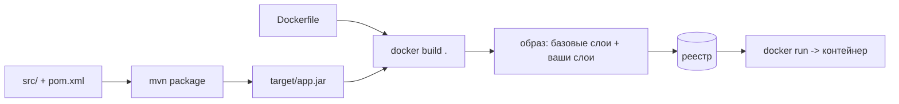
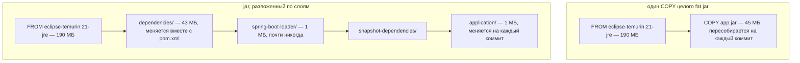
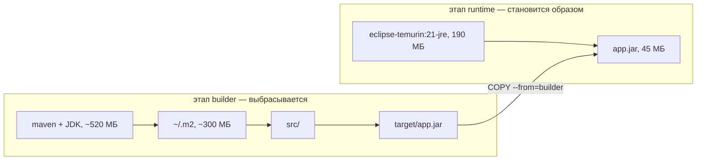

# Сборка Docker-образа из приложения на Spring Boot

**Сначала собирается jar, затем пишется Dockerfile: берём базовый образ с JRE,
копируем туда jar и объявляем, как его запускать.** Всё остальное — слои,
многоэтапная сборка, `.dockerignore`, пользователь не root — про то, как сделать
этот образ дешёвым в пересборке, дешёвым в доставке и безопасным в работе.

Минимальный рабочий вариант:

```dockerfile
FROM eclipse-temurin:21-jre
WORKDIR /app
COPY target/app.jar app.jar
EXPOSE 8080
ENTRYPOINT ["java", "-jar", "/app/app.jar"]
```

```bash
mvn -B package -DskipTests
docker build -t shop-api:1.0.0 .
docker run -p 8080:8080 shop-api:1.0.0
```

Обратите внимание, чего Dockerfile *не* делает: он ничего не компилирует. Jar
собрал `mvn package` (см. [как исходный код Java становится работающим
кодом](topic:jvm-source-code-flow)); Docker лишь упаковывает его вместе с
окружением Linux и JVM, чтобы результат одинаково запускался на любой машине со
средой выполнения контейнеров.



## Правило, из которого следует всё остальное: инструкции становятся кешируемыми слоями

Каждая инструкция создаёт слой, и демон переиспользует слой, только если **не
изменились его собственный ключ кеша и все слои под ним**. Кеш здесь цепочка, а
не набор независимых записей: первая же изменившаяся инструкция обесценивает и
себя, *и всё, что после неё*.

Для `COPY` в ключ кеша входит дайджест копируемого содержимого. Именно здесь
больно бьёт fat jar: ваши классы и все зависимости лежат в одном файле, поэтому
Docker видит один неделимый кусок. Измените одну строку в одном контроллере — и
весь слой на 45 МБ будет переписан, заново залит в реестр и заново скачан каждым
узлом.



Оба образа весят 235 МБ. Разница не в размере, а в **объёме изменений**: после
правки одной строки первый двигает 45 МБ, а второй — около 1 МБ. (Числа здесь
круглые и иллюстративные: типичный jar Spring Boot — это десятки мегабайт, а
база `-jre` — пара сотен; свои цифры смотрите через `docker history`.)

## Слоистый jar

Spring Boot собирает jar с индексом слоёв и умеет распаковывать себя в четыре
папки, упорядоченные по частоте изменений:

| Слой | Содержимое | Когда меняется |
|---|---|---|
| `dependencies/` | выпущенные сторонние jar-файлы | вместе с `pom.xml` |
| `spring-boot-loader/` | классы загрузчика | при обновлении Spring Boot |
| `snapshot-dependencies/` | jar-файлы `-SNAPSHOT` | вместе с внутренней библиотекой |
| `application/` | ваши классы и ресурсы | на каждый коммит |

```dockerfile
# 1. собираем jar
FROM maven:3.9-eclipse-temurin-21 AS builder
WORKDIR /build
COPY pom.xml .
RUN mvn -B dependency:go-offline
COPY src ./src
RUN mvn -B package -DskipTests

# 2. раскладываем его по слоям
FROM eclipse-temurin:21-jre AS extractor
WORKDIR /extract
COPY --from=builder /build/target/*.jar application.jar
RUN java -Djarmode=tools -jar application.jar extract --layers --destination .

# 3. образ, который действительно поедет в прод
FROM eclipse-temurin:21-jre
WORKDIR /app
RUN useradd --system --no-create-home app
COPY --from=extractor /extract/dependencies/ ./
COPY --from=extractor /extract/spring-boot-loader/ ./
COPY --from=extractor /extract/snapshot-dependencies/ ./
COPY --from=extractor /extract/application/ ./
USER app
EXPOSE 8080
ENTRYPOINT ["java", "-jar", "application.jar"]
```

`-Djarmode=tools … extract --layers` — форма для Spring Boot 3.3+; до этого было
`-Djarmode=layertools -jar app.jar extract`, а точкой входа —
`ENTRYPOINT ["java", "org.springframework.boot.loader.launch.JarLauncher"]`
(до 3.2 — `org.springframework.boot.loader.JarLauncher`). В реальных
репозиториях встречаются оба варианта.

Правило порядка — **по частоте изменений, а не по размеру**. Слои — это ставка
на то, что код меняется часто, а зависимости редко; когда вы всё-таки добавите
стартер в `pom.xml`, слой зависимостей и всё скопированное после него
пересоберутся ровно так же, как раньше.

## Многоэтапная сборка

Два (или больше) блока `FROM` в одном Dockerfile. Ранние этапы могут делать что
угодно — запускать Maven, гонять тесты, генерировать код, — а образом становится
только **последний** этап. `COPY --from=<этап>` дотягивается назад за
артефактами, которые нужно сохранить.



Что это даёт:

- **Инструменты сборки никуда не едут.** Ни Maven, ни компилятора, ни `~/.m2`,
  ни исходников в проде — минус примерно 600 МБ и заметный кусок поверхности
  атаки.
- **Собрать может кто угодно.** Для `docker build .` не нужны локальные JDK и
  Maven — поэтому упрощаются и образы CI, и онбординг.
- **Кеш работает и внутри этапа.** Скопировать `pom.xml` и выполнить
  `mvn dependency:go-offline` *до* копирования `src/` — это и есть то, что
  сохраняет скачанные зависимости в кеше, когда изменился только ваш код.
  Поменяйте эти две инструкции местами — и каждый коммит будет заново качать
  полинтернета.

В CI, где демон стартует с пустым кешем, одного порядка мало: используйте
`docker build --cache-from` с ранее залитым образом или кеш-монтирование BuildKit
(`RUN --mount=type=cache,target=/root/.m2 mvn -B package`), которое переживает
сборки, не становясь слоем.

## Контекст сборки: точка в `docker build .`

Прежде чем выполнится первая инструкция, CLI упаковывает эту папку и отправляет
её демону. Без `.dockerignore` туда попадают локальный `target/`, история
`.git/` и любые `node_modules/` — сотни мегабайт на каждую сборку плюс
`COPY . .`, который сбрасывается из-за файлов, никогда образу не нужных.

```
target/
.git/
node_modules/
*.md
.env
```

Оговорка: исключать можно только то, что не читает ни один `COPY`. Если
Dockerfile копирует `target/app.jar`, исключение всего `target/` уронит сборку с
ошибкой «файл не найден» — ещё один аргумент в пользу того, чтобы собирать
внутри многоэтапного образа.

## Образ, который не стыдно задеплоить

- **JRE, а не JDK.** Компилятор нужен во время сборки; отказ от него экономит
  ~150 МБ. Контраргумент — диагностика: `jcmd`, `jstack` и `jmap` идут с JDK,
  поэтому некоторые команды намеренно возят образ с JDK или добавляют `jattach`.
  Решайте осознанно, а не по умолчанию.
- **`USER` не root.** Root в контейнере — это uid 0 на ядре, которое контейнер
  делит с хостом, и многие кластеры просто не запустят образ, которому это
  нужно. Одна команда `useradd` и одна строка `USER`.
- **Скажите JVM про лимит.** Начиная с Java 10 JVM читает лимит cgroup
  контейнера, но `MaxRAMPercentage` по умолчанию равен 25%: в контейнере на
  512 МБ она возьмёт 128 МБ кучи, а остальное будет простаивать. Задайте
  `-XX:MaxRAMPercentage=75` (через `JAVA_TOOL_OPTIONS`, чтобы значение можно было
  переопределить) и помните, что *остаток* лимита — не запас: там же живут
  metaspace, стеки потоков, кеш кода и прямые буферы, а превышение лимита
  заканчивается не `OutOfMemoryError`, а убийством контейнера ядром по OOM. См.
  [настройку сборщика мусора](topic:gc-configuration) и [как устроена память
  Java](topic:jvm-memory-areas).
- **Конфигурация приходит из окружения.** Один образ должен уметь работать и на
  staging, и в проде, поэтому URL базы и пароли приезжают переменными окружения
  (`SPRING_DATASOURCE_URL`), примонтированным файлом конфигурации или хранилищем
  секретов — но не зашиваются в слой.
- **Exec-форма для `ENTRYPOINT`.** `ENTRYPOINT ["java", "-jar", "app.jar"]`
  делает JVM процессом PID 1, поэтому `SIGTERM` от `docker stop` доходит до неё и
  срабатывает graceful shutdown Spring Boot. Shell-форма
  (`ENTRYPOINT java -jar app.jar`) заворачивает запуск в `/bin/sh -c`, который
  сигналы не пробрасывает, — и через десять секунд приложение получает `SIGKILL`
  посреди запроса.
- **Осмысленные теги.** `:latest` — не версия, а подвижный ярлык. Помечайте
  образы номером сборки или git SHA, чтобы откат был сменой тега, а два узла не
  оказались с разным кодом под одним именем.
- **Сигнал готовности.** Отдайте `/actuator/health/readiness` и дайте
  оркестратору его опрашивать, чтобы трафик приходил только после подъёма
  контекста, — та же забота, что и [таймауты с circuit
  breaker](topic:service-timeouts-fallbacks) на стороне вызывающего.

## Вообще без Dockerfile

- **Buildpacks**: `mvn spring-boot:build-image` (Paketo, встроен в плагин Spring
  Boot) делает из проекта слоистый образ с пользователем не root и настроенной
  памятью — без Dockerfile. Вы теряете тонкий контроль и получаете
  поддерживаемые разумные умолчания.
- **Jib** (`mvn jib:dockerBuild`): собирает слоистый образ прямо из сборки Maven
  — демон Docker не нужен, результат воспроизводим, а заливаются только
  изменившиеся слои.
- **`docker init`** сгенерирует приличный Dockerfile, если файл вы всё же хотите
  держать под своим контролем.

Собеседующий обычно хочет услышать, что вы *знаете* об этих инструментах и
можете сказать, когда всё-таки напишете Dockerfile руками: нестандартный базовый
образ, дополнительные системные пакеты или сборка, которая делает больше, чем
компиляцию.

## Ответ на собеседовании за 60 секунд

> Jar собирает Maven или Gradle; Dockerfile его только упаковывает. Минимальный
> вариант — `FROM eclipse-temurin:21-jre`, `COPY target/app.jar app.jar`,
> `ENTRYPOINT ["java","-jar","/app/app.jar"]`. Это работает, но каждая инструкция
> — кешируемый слой, а fat jar — это один слой на 45 МБ, который меняется на
> каждый коммит. Поэтому я распаковываю слоистый jar Spring Boot и копирую
> `dependencies`, `spring-boot-loader`, `snapshot-dependencies` и `application`
> именно в таком порядке, начиная с того, что меняется реже. Тогда правка одной
> строки заливает около мегабайта вместо целого jar. Использую многоэтапную
> сборку, чтобы Maven, JDK и исходники не попали в итоговый образ, и копирую
> `pom.xml` с запуском `dependency:go-offline` до копирования `src/`, чтобы
> правка кода не тянула зависимости заново. `.dockerignore` держит `target/` и
> `.git/` вне контекста сборки. В финальном образе: база с JRE, `USER` не root,
> `-XX:MaxRAMPercentage=75`, чтобы JVM пользовалась лимитом контейнера,
> конфигурация из переменных окружения, `ENTRYPOINT` в exec-форме, чтобы
> `SIGTERM` доходил до JVM, и тег с версией вместо `latest`. А если Dockerfile
> поддерживать не хочется — `spring-boot:build-image` или Jib соберут слоистый
> образ сами.

## Почему это важно в продакшене

- **Скорость деплоя — это скорость слоёв.** Каждый узел скачивает те слои,
  которых у него нет. Слой приложения в 45 МБ на релиз, умноженный на полсотни
  узлов и двадцать релизов в день, — это реальные деньги и реальные минуты;
  1 МБ — нет.
- **Образ — единица масштабирования.** Одинаковые контейнеры из одного образа —
  это то, что позволяет добавлять экземпляры за балансировщиком, см. [что делать,
  когда один сервер не справляется](topic:scaling-an-overloaded-server) и [зачем
  нужны микросервисы](topic:why-microservices).
- **Слои вечны.** Файл, добавленный в одном слое и удалённый в следующем,
  остаётся в образе — его может извлечь кто угодно. Секреты, переданные через
  `--build-arg` или скопированные и стёртые, считаются опубликованными; для этого
  в BuildKit есть `--mount=type=secret` (ср. [топ-10 рисков
  OWASP](topic:owasp-top-ten)).
- **Воспроизводимость.** Тег, который собрал CI, и тег, который запускает
  кластер, должны указывать на один и тот же неизменяемый дайджест — иначе
  «у меня локально работает» возвращается уже в масштабах кластера.
- **Обновление базового образа — это ваш процесс латания дыр.** CVE обычно
  находятся в базовом слое, а не в вашем jar; лечится пересборкой на свежей базе,
  поэтому конвейер должен уметь пересобрать и передеплоить без изменений в коде.

## Частые заблуждения

- **«Dockerfile собирает моё приложение».** Только в многоэтапной сборке.
  Обычный `COPY target/app.jar` увезёт то, что случайно лежит в `target/`, —
  включая протухший jar недельной давности.
- **«Слоистый jar уменьшает образ».** Нет, байты те же. Он уменьшает
  *изменяющуюся* часть — а именно она и определяет цену пересборок, заливок и
  скачиваний.
- **«`RUN rm secret.txt` удаляет файл из образа».** Файл остаётся в том слое,
  который его добавил. Удаление в более позднем слое лишь прячет его из итогового
  представления файловой системы.
- **«JVM увидит память хоста».** Не начиная с Java 10 при наличии лимитов cgroup
  — но доля кучи по умолчанию составляет всего 25% лимита, поэтому ненастроенный
  контейнер тратит впустую большую часть выданного. На древних образах с Java 8
  старая проблема реальна.
- **«`EXPOSE 8080` публикует порт».** Он его документирует. Публикация — это
  `-p 8080:8080` или описание сервиса в оркестраторе.
- **«Alpine — всегда правильная маленькая база».** Там musl вместо glibc,
  поэтому нужна JVM, собранная под неё, а DNS, локали и часть нативных библиотек
  ведут себя иначе. Экономия реальна, но и сюрпризы тоже; slim-образ `-jre` или
  distroless часто безопаснее по компромиссу.
- **«`:latest` нормально, это же самая свежая сборка».** Это то, что залили
  последним. Два узла, скачавшие образ в разное время, могут работать на разном
  коде под одним именем, а откат превращается в археологию.
- **«CI медленный, потому что Docker медленный».** У свежего раннера CI пустой
  кеш слоёв. Без `--cache-from` или кеш-монтирования каждая сборка заново качает
  все зависимости, как бы аккуратно ни был упорядочен Dockerfile.
- **«Shell-форма `ENTRYPOINT` — то же самое».** Она ставит на PID 1 `/bin/sh`,
  поэтому `SIGTERM` до JVM не доходит и graceful shutdown не выполняется.
