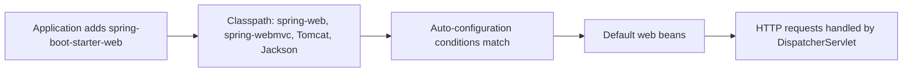
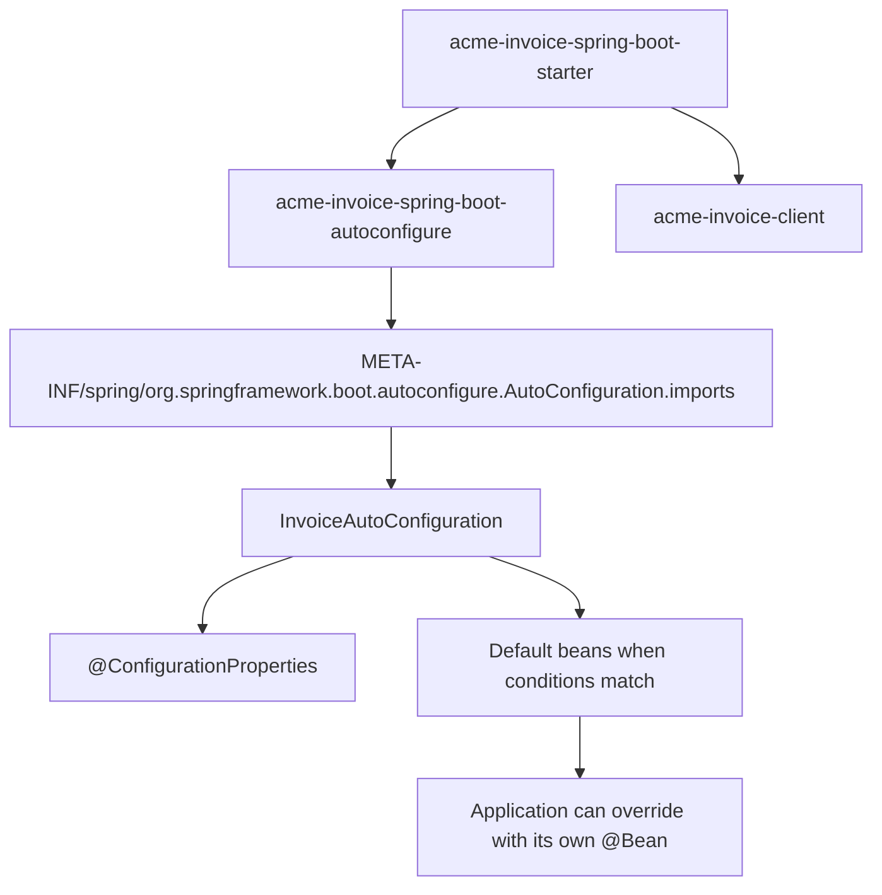

# Spring Boot Starter Web and Custom Starters

`spring-boot-starter-web` is a **starter dependency** for the servlet web stack. It
does not contain your controllers and it is not the whole web framework by itself.
It is a curated dependency bundle that brings Spring MVC, `spring-web`,
`spring-webmvc`, embedded Tomcat by default, Jackson JSON support, and the base
Spring Boot starter pieces.

Kitchen analogy: the starter is a meal kit. It puts the pan, pasta, sauce, and
recipe card in one bag, but the kitchen still does the cooking. In Spring Boot,
the starter puts libraries on the classpath; auto-configuration creates useful
beans when the application starts.



## What Starter Web gives you

- **Spring MVC request handling.** Boot can create a `DispatcherServlet`, handler
  mappings, argument resolvers, message converters, and other web infrastructure.
  Post office analogy: once the post office has counters, labels, and sorting
  rules, letters can move through the building instead of everyone inventing a
  route manually.
- **An embedded servlet container.** Tomcat is included by default, so a plain
  `main` method can start an HTTP server. Traffic analogy: the starter gives the
  application its own small bus station instead of asking you to deploy a separate
  external station first.
- **JSON support through Jackson.** Controllers can return objects and receive
  request bodies as JSON using auto-configured converters. Kitchen analogy: a
  standard measuring cup lets every cook read the same recipe format.
- **Sensible defaults, not locked-in behavior.** If you define your own
  [`@Bean`](topic:spring-bean-vs-component), Boot usually backs off because many
  defaults are guarded by `@ConditionalOnMissingBean`. Office analogy: the default
  reception desk appears only if the building owner has not already placed one.

`spring-boot-starter-web` is for the servlet model. If the application needs the
reactive stack, the usual choice is `spring-boot-starter-webflux`, not both mixed
casually in the same service.

## Starter versus auto-configuration

A **starter** is mostly a dependency descriptor. It says, "when someone depends on
me, bring these libraries too." It normally contains little or no Java code.
Shopping analogy: the starter is the grocery list.

**Auto-configuration** is Java code that creates beans when conditions are true:
classes exist, properties are set, a web application is running, or the user has
not already provided a bean. Kitchen analogy: auto-configuration is the cook who
checks what is on the counter and prepares the default dish only if nobody already
cooked it.

This distinction matters in interviews. A starter makes auto-configuration
available by putting the right jars on the classpath, but the starter itself does
not magically configure everything. The conditions in the auto-configuration do
the actual work.

## How to write your own Spring Boot starter

A clean custom starter usually has two modules:



1. **Put business integration code in a normal library.** For example,
   `acme-invoice-client` contains the HTTP client, DTOs, and retry policy. Tool
   shelf analogy: keep the wrench and screwdriver in a real toolbox, not taped to
   the shopping receipt.
2. **Put conditional setup in an autoconfigure module.** Create
   `acme-invoice-spring-boot-autoconfigure` with `@AutoConfiguration`,
   `@ConditionalOnClass`, `@ConditionalOnMissingBean`,
   `@EnableConfigurationProperties`, and small factory methods. Traffic analogy:
   traffic lights switch on only where roads actually exist and no manual officer
   is already directing cars.
3. **Register the auto-configuration.** In Spring Boot 3, list the class in
   `META-INF/spring/org.springframework.boot.autoconfigure.AutoConfiguration.imports`.
   In older Boot 2 projects, you may see `spring.factories`. Post office analogy:
   the imports file is the public directory that tells Boot which service desks
   can be opened.
4. **Make a starter module that depends on the pieces.** The starter module
   depends on the autoconfigure module and the client library. It should usually
   have almost no code. Shopping analogy: the starter is the basket that carries
   the exact ingredients together.
5. **Expose typed properties.** Use `@ConfigurationProperties`, validation if
   needed, and configuration metadata so IDEs can autocomplete settings. Kitchen
   analogy: labeled spice jars beat unlabeled bags.
6. **Test the conditions.** Use `ApplicationContextRunner` to verify the default
   bean appears, backs off when the application provides its own bean, and reacts
   to properties correctly. Train station analogy: test both the normal timetable
   and the case where a special train has already been scheduled.

A minimal auto-configuration class looks like this:

```java
@AutoConfiguration
@ConditionalOnClass(InvoiceClient.class)
@EnableConfigurationProperties(InvoiceProperties.class)
public class InvoiceAutoConfiguration {

    @Bean
    @ConditionalOnMissingBean
    InvoiceClient invoiceClient(InvoiceProperties properties) {
        return new InvoiceClient(properties.baseUrl(), properties.apiKey());
    }
}
```

And the Boot 3 registration file contains one line:

```text
com.acme.invoice.InvoiceAutoConfiguration
```

## Production relevance

Internal starters are useful when many services need the same client, metrics,
security headers, or serialization rules. They turn team conventions into a small
dependency instead of copy-pasted setup. Office analogy: every branch office gets
the same mailroom layout, but each office can still add a local counter.

Good starters are **boring, explicit, and override-friendly**. They should create
defaults only when the application has not already done so. That keeps application
ownership clear and works well with normal Spring bean rules like singleton
defaults and custom [bean scopes](topic:spring-bean-scopes).

Bad starters hide heavy side effects: unexpected network calls during startup,
global component scanning, broad property names, or beans that cannot be replaced.
Kitchen analogy: a helpful meal kit should not silently start the oven, lock the
fridge, and rename every spice jar.

## 60-second interview answer

> `spring-boot-starter-web` is a Spring Boot starter dependency for servlet-based
> web applications. It pulls in Spring MVC, `spring-web`, `spring-webmvc`, an
> embedded Tomcat server by default, Jackson JSON support, and base Boot
> dependencies. The starter itself is mainly dependency aggregation; Boot
> auto-configuration sees those classes on the classpath and creates default web
> infrastructure such as `DispatcherServlet`, message converters, and handler
> mappings, unless the application supplies its own beans. To write a custom
> starter, I usually split it into a small `*-spring-boot-starter` module and a
> `*-spring-boot-autoconfigure` module. The autoconfigure module contains
> `@AutoConfiguration`, conditional bean methods, typed `@ConfigurationProperties`,
> and a Boot 3 `AutoConfiguration.imports` registration. The starter module depends
> on that module plus the real library. I would test it with `ApplicationContextRunner`
> to ensure defaults appear, user beans override them, and properties work.

## Common misconceptions

- **"Starter Web is Spring MVC itself."** No. It brings Spring MVC and related
  dependencies; auto-configuration wires them into the application.
- **"A starter should component-scan my package."** Usually no. Prefer explicit
  auto-configuration beans. Post office analogy: opening one named service desk is
  safer than letting a clerk search every room in the building.
- **"My custom starter must force one configuration."** No. Use conditions and
  `@ConditionalOnMissingBean` so applications can override defaults. Kitchen
  analogy: provide a default sauce, but let the chef replace it.
- **"Boot 3 custom starters still register only through spring.factories."** Modern
  Boot auto-configurations use
  `META-INF/spring/org.springframework.boot.autoconfigure.AutoConfiguration.imports`;
  `spring.factories` is the older Boot 2 style for this purpose.
- **"Starter Web includes every web-related dependency."** No. For example,
  validation, security, persistence, and actuator features have their own starters.
- **"Third-party starters should be named spring-boot-starter-*."** That prefix is
  conventionally reserved for official Spring Boot starters. Libraries commonly use
  names like `acme-spring-boot-starter`.
