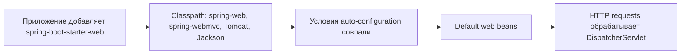
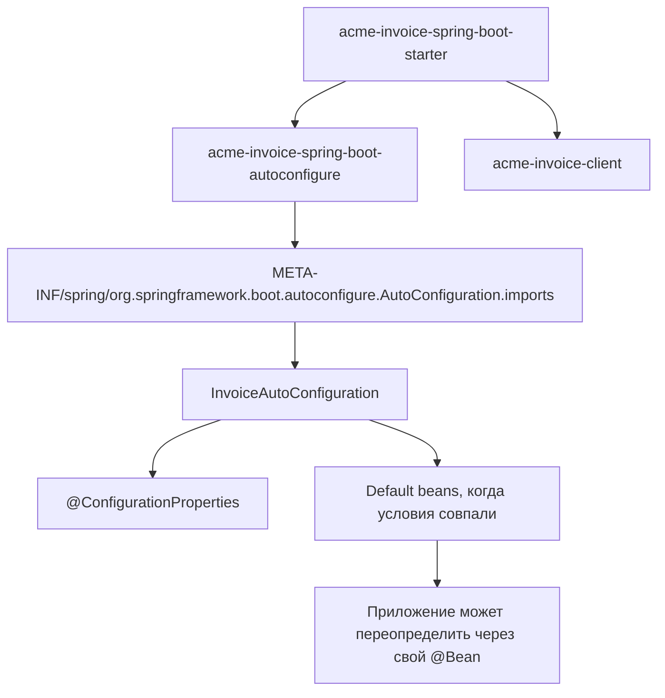

# Spring Boot Starter Web и собственные starters

`spring-boot-starter-web` - это **starter dependency** для servlet web stack. Он
не содержит ваши controllers и не является всем web framework сам по себе. Это
подобранный набор зависимостей, который приносит Spring MVC, `spring-web`,
`spring-webmvc`, embedded Tomcat по умолчанию, поддержку JSON через Jackson и
базовые части Spring Boot starter.

Кухонная аналогия: starter похож на набор для ужина. В одной сумке лежат
сковорода, паста, соус и карточка с рецептом, но готовит все равно кухня. В
Spring Boot starter кладет библиотеки в classpath, а auto-configuration создает
полезные бины при старте приложения.



## Что дает Starter Web

- **Обработку requests через Spring MVC.** Boot может создать `DispatcherServlet`,
  handler mappings, argument resolvers, message converters и другую web
  infrastructure. Аналогия с почтой: когда в отделении есть окна, наклейки и
  правила сортировки, письма проходят по понятному маршруту, а не каждый раз
  вручную.
- **Embedded servlet container.** Tomcat включен по умолчанию, поэтому обычный
  `main` method может поднять HTTP server. Транспортная аналогия: starter дает
  приложению свою небольшую автобусную станцию, вместо того чтобы сначала искать
  отдельную внешнюю станцию.
- **JSON через Jackson.** Controllers могут возвращать objects и принимать request
  bodies как JSON через auto-configured converters. Кухонная аналогия: стандартный
  мерный стакан позволяет всем поварам читать рецепт в одном формате.
- **Разумные defaults, а не жестко зашитое поведение.** Если вы объявляете свой
  [`@Bean`](topic:spring-bean-vs-component), Boot обычно отступает, потому что
  многие defaults защищены `@ConditionalOnMissingBean`. Офисная аналогия: стойка
  ресепшена появляется по умолчанию только если владелец здания еще не поставил
  свою.

`spring-boot-starter-web` предназначен для servlet model. Если приложению нужен
reactive stack, обычно выбирают `spring-boot-starter-webflux`, а не смешивают оба
варианта без явной причины в одном service.

## Starter и auto-configuration

**Starter** - это в основном dependency descriptor. Он говорит: "если кто-то
зависит от меня, принеси и эти libraries". Обычно в нем мало Java-кода или его
нет совсем. Аналогия с покупками: starter - это список продуктов.

**Auto-configuration** - это Java-код, который создает beans, когда условия
истинны: нужные classes есть, properties заданы, запущено web application, или
пользователь еще не предоставил свой bean. Кухонная аналогия: auto-configuration -
это повар, который смотрит, что лежит на столе, и готовит default dish только если
никто уже не приготовил его.

Это различие важно на интервью. Starter делает auto-configuration доступной,
помещая нужные jars в classpath, но starter сам по себе не настраивает все
магически. Реальную работу выполняют условия внутри auto-configuration.

## Как написать свой Spring Boot starter

Аккуратный custom starter обычно состоит из двух modules:



1. **Вынесите business integration code в обычную library.** Например,
   `acme-invoice-client` содержит HTTP client, DTOs и retry policy. Аналогия с
   полкой инструментов: держите ключ и отвертку в настоящем ящике, а не
   приклеенными к чеку из магазина.
2. **Поместите условную настройку в autoconfigure module.** Создайте
   `acme-invoice-spring-boot-autoconfigure` с `@AutoConfiguration`,
   `@ConditionalOnClass`, `@ConditionalOnMissingBean`,
   `@EnableConfigurationProperties` и маленькими factory methods. Транспортная
   аналогия: светофоры включаются только там, где реально есть дороги и нет
   регулировщика, который уже управляет потоком.
3. **Зарегистрируйте auto-configuration.** В Spring Boot 3 укажите class в
   `META-INF/spring/org.springframework.boot.autoconfigure.AutoConfiguration.imports`.
   В старых проектах на Boot 2 можно встретить `spring.factories`. Почтовая
   аналогия: imports file - это публичный справочник, который говорит Boot, какие
   service desks можно открыть.
4. **Сделайте starter module, который зависит от нужных частей.** Starter module
   зависит от autoconfigure module и client library. В нем обычно почти нет кода.
   Аналогия с покупками: starter - это корзина, которая несет точный набор
   ингредиентов вместе.
5. **Откройте typed properties.** Используйте `@ConfigurationProperties`,
   validation при необходимости и configuration metadata, чтобы IDE могла
   автодополнять настройки. Кухонная аналогия: подписанные баночки со специями
   лучше безымянных пакетов.
6. **Проверьте условия тестами.** Используйте `ApplicationContextRunner`, чтобы
   убедиться: default bean появляется, отступает при пользовательском bean и
   правильно реагирует на properties. Аналогия с вокзалом: проверьте и обычное
   расписание, и случай, когда специальный поезд уже назначен.

Минимальный auto-configuration class выглядит так:

```java
@AutoConfiguration
@ConditionalOnClass(InvoiceClient.class)
@EnableConfigurationProperties(InvoiceProperties.class)
public class InvoiceAutoConfiguration {

    @Bean
    @ConditionalOnMissingBean
    InvoiceClient invoiceClient(InvoiceProperties properties) {
        return new InvoiceClient(properties.baseUrl(), properties.apiKey());
    }
}
```

А Boot 3 registration file содержит одну строку:

```text
com.acme.invoice.InvoiceAutoConfiguration
```

## Зачем это в production

Внутренние starters полезны, когда многим services нужен один и тот же client,
metrics, security headers или serialization rules. Они превращают team
conventions в маленькую dependency вместо copy-pasted setup. Офисная аналогия:
каждый филиал получает одинаковую mailroom layout, но все еще может добавить
свою локальную стойку.

Хорошие starters **скучные, явные и легко переопределяемые**. Они создают
defaults только когда приложение еще не сделало это само. Так ownership остается
у приложения, и это хорошо сочетается с обычными правилами Spring beans:
singleton defaults и пользовательскими [bean scopes](topic:spring-bean-scopes).

Плохие starters прячут тяжелые side effects: неожиданные network calls во время
startup, global component scanning, слишком широкие property names или beans,
которые нельзя заменить. Кухонная аналогия: полезный набор для ужина не должен
молча включать духовку, запирать холодильник и переименовывать все баночки со
специями.

## Ответ за 60 секунд

> `spring-boot-starter-web` - это Spring Boot starter dependency для servlet-based
> web applications. Он подтягивает Spring MVC, `spring-web`, `spring-webmvc`,
> embedded Tomcat server по умолчанию, JSON через Jackson и базовые зависимости
> Boot. Сам starter в основном агрегирует dependencies; Boot auto-configuration
> видит эти classes в classpath и создает default web infrastructure:
> `DispatcherServlet`, message converters и handler mappings, если application не
> предоставило свои beans. Для custom starter я обычно разделяю его на маленький
> `*-spring-boot-starter` module и `*-spring-boot-autoconfigure` module.
> Autoconfigure module содержит `@AutoConfiguration`, conditional bean methods,
> typed `@ConfigurationProperties` и Boot 3 registration через
> `AutoConfiguration.imports`. Starter module зависит от него и от реальной
> library. Я бы тестировал это через `ApplicationContextRunner`: defaults
> появляются, пользовательские beans их заменяют, properties работают.

## Частые заблуждения

- **"Starter Web - это сам Spring MVC."** Нет. Он приносит Spring MVC и связанные
  dependencies; auto-configuration подключает их к приложению.
- **"Starter должен component-scan мой package."** Обычно нет. Лучше явно
  создавать beans через auto-configuration. Почтовая аналогия: открыть одну
  названную стойку безопаснее, чем отправить сотрудника искать все комнаты в
  здании.
- **"Мой custom starter должен навязать одну configuration."** Нет. Используйте
  conditions и `@ConditionalOnMissingBean`, чтобы applications могли
  переопределять defaults. Кухонная аналогия: дайте default sauce, но позвольте
  шефу заменить его.
- **"Custom starters в Boot 3 все еще регистрируются только через spring.factories."**
  Современные Boot auto-configurations используют
  `META-INF/spring/org.springframework.boot.autoconfigure.AutoConfiguration.imports`;
  `spring.factories` - старый стиль Boot 2 для этой задачи.
- **"Starter Web включает все web-related dependencies."** Нет. Например,
  validation, security, persistence и actuator имеют свои starters.
- **"Third-party starters должны называться spring-boot-starter-*."** Этот prefix
  обычно зарезервирован для официальных Spring Boot starters. Libraries часто
  используют имена вроде `acme-spring-boot-starter`.
