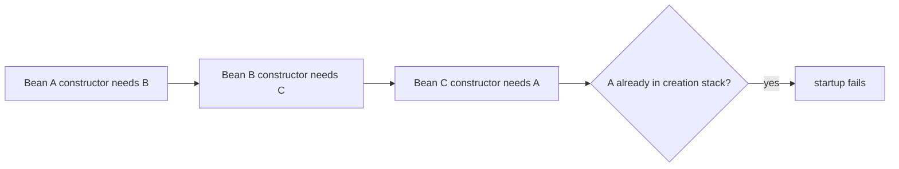
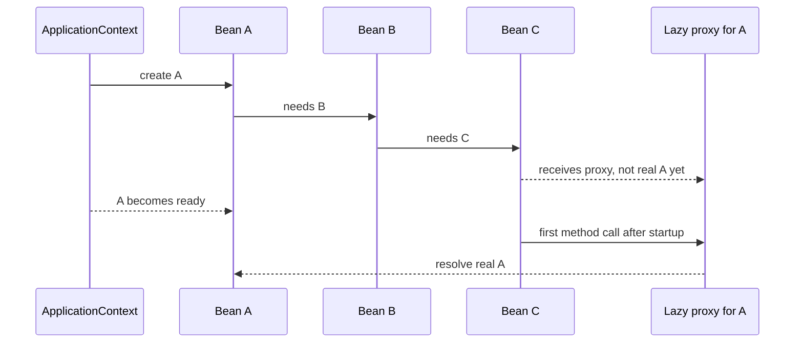

# Spring Circular Bean Dependencies

A circular bean dependency means the Spring container cannot draw a straight
creation order for the object graph. In the common interview example, bean `A`
needs `B`, `B` needs `C`, and `C` needs `A`. With constructor injection, Spring
must have every constructor argument ready before it can finish the current bean,
so it walks into `A -> B -> C -> A` and finds that `A` is already being created.
Kitchen analogy: three cooks each wait for a tool held by the next cook, and the
last cook asks for the first cook's tool before anyone can start.

This belongs to the same core container story as
[Spring IoC and Dependency Injection](topic:spring-ioc-di): beans declare what
they need, and `ApplicationContext` assembles them. The container tracks a
creation stack while it builds singleton beans. If a constructor dependency asks
for a bean already on that stack, Spring cannot produce a complete instance and
startup fails. Post office analogy: a sorting route that sends parcel A to desk
B, B to desk C, and C back to desk A never reaches a delivery truck.



## What Spring can and cannot resolve

Constructor cycles are the hard failure case because there is no partially built
object that can safely be passed into the constructor. The dependency is needed
right now. Traffic analogy: a bridge cannot be opened to cars before its first
support pillar exists.

Setter or field injection can look different for singleton beans. Spring
Framework has mechanisms for early singleton exposure, so some setter or field
cycles may appear to work when circular references are allowed. That is still a
fragile design, especially with proxies, transactions, validation, and lifecycle
callbacks. Spring Boot applications should not rely on this behavior, and modern
Boot defaults are intentionally hostile to circular references. Hotel analogy:
handing out a room key before housekeeping finishes the room may pass a smoke
test, but guests can still hit unfinished work.

Scope matters too. Most services are singleton beans, but other scopes have
different lifetimes; see [Spring Bean Scopes](topic:spring-bean-scopes).
Circular dependencies across unusual scopes are even harder to reason about.
Warehouse analogy: a shared forklift and a one-time delivery box do not follow
the same scheduling rules.

## How to avoid the cycle

The best fix is to change the design so dependencies point in one direction.
Usually the cycle means one class has too much responsibility, or two services
are calling each other as a shortcut. Kitchen analogy: if the chef and cashier
keep running to each other's stations, move the shared price list to a separate
clipboard.

Common refactorings:

- Extract the shared behavior into a third bean: `A -> SharedService` and
  `C -> SharedService`, instead of `A -> ... -> C -> A`.
- Move orchestration upward into a coordinator that calls both services, instead
  of making the services call each other.
- Split commands from queries so one service records state and another reads it,
  instead of both owning both directions.
- Use events when the second action is a reaction, not a required return value.
  Traffic analogy: a traffic light publishes a signal; it does not phone every
  car and wait for a reply.
- Inject an interface or narrower port when the class only needs one operation.
  This is related to the dependency direction ideas behind
  [Strategy](topic:strategy), but do not create an interface only to hide a bad
  cycle.

If the cycle comes from configuration methods or component registration, review
how the bean entered the container. The focused topics
[@Bean vs @Component in Spring](topic:spring-bean-vs-component) and
[@Configuration and @Bean Methods](topic:spring-configuration-bean-methods)
cover those registration choices. Post office analogy: sometimes the problem is
not the delivery route, but two duplicate address cards in the catalog.

## If refactoring is impossible: @Lazy

`@Lazy` on one injection point tells Spring to inject a proxy instead of resolving
the target bean immediately. In `A -> B -> C -> A`, you typically put `@Lazy` on
the `A` dependency inside `C`. Then Spring can create `C` with a proxy, finish
`B`, finish `A`, and resolve the real `A` only when `C` first uses that proxy.
Kitchen analogy: the cook gets a claim ticket for the oven instead of requiring
the oven to be free before the prep table is assembled.

```java
@Component
class C {
    private final A a;

    C(@Lazy A a) {
        this.a = a;
    }
}
```



`@Lazy` is a last resort, not a design pattern. It changes when the dependency is
resolved; it does not make the object graph simpler. If `C` calls the proxy too
early, for example during construction or `@PostConstruct`, the cycle may return
in a different place. Post office analogy: a pickup slip helps only if you use it
after the parcel arrives, not while the sorting office is still closed.

`ObjectProvider<A>`, `Provider<A>`, or a small factory can be clearer than
`@Lazy` when the dependency is genuinely optional or needed only inside one
method. The code then says, "I will ask for this later." Traffic analogy: calling
a taxi when you actually need one is clearer than parking a decoy car in the
driveway all day.

## 60-second interview answer

> With constructor injection, `A -> B -> C -> A` fails during context startup.
> Spring keeps a creation stack of beans currently being constructed. When it
> creates `A`, it needs `B`; `B` needs `C`; `C` asks for `A`, but `A` is already
> in creation, so Spring cannot complete the graph and fails with a circular
> dependency error. The preferred fix is to refactor: extract shared behavior,
> move orchestration to a higher-level service, use events, or narrow the
> dependency direction. If refactoring is impossible, put `@Lazy` on one injection
> point, usually the back-reference, so Spring injects a proxy and resolves the
> real bean later. Treat that as a workaround because it can hide design problems
> and move failures from startup to runtime.

## Production relevance

Circular dependencies make startup brittle. A small service rename or proxy added
for transactions can change when the cycle appears. Restaurant analogy: a kitchen
where every station blocks another may work during rehearsal, then stall when one
extra ticket enters the queue.

They also make tests harder. A unit test that wants `A` now needs enough of `B`
and `C` to close the loop, so simple fakes become messy. Garage analogy: testing
one drill should not require powering the whole building.

They hide ownership. If `A` and `C` both need to call each other, it is unclear
which class owns the workflow. Post office analogy: two counters stamping the
same parcel back and forth means nobody owns final delivery.

`@Lazy` can be useful in legacy systems where changing the graph is too risky for
one release. Use it deliberately, document why it exists, and plan the later
refactor. Traffic analogy: a temporary detour sign is acceptable during roadwork,
but it should not become the city's permanent map.

## Common misconceptions

- "Spring can always solve circular dependencies." It cannot solve constructor
  cycles because no complete object exists to inject. Kitchen analogy: you cannot
  serve soup from a pot that has not been put on the stove.
- "If field injection works, the design is fine." It may only work because Spring
  exposed an early singleton reference, and proxies or lifecycle callbacks can
  still break it. Hotel analogy: a guest can enter a half-cleaned room, but that
  does not make the room ready.
- "`@Lazy` removes the cycle." It defers one edge through a proxy. The logical
  relationship still exists. Post office analogy: a pickup slip delays receiving
  the parcel; it does not erase the parcel.
- "Use `@Lazy` on the class." For this problem, the important place is usually
  the injection point that closes the cycle. Marking a whole bean lazy changes
  startup timing more broadly and can surprise callers. Traffic analogy: closing
  the whole road is different from delaying one turn.
- "The right answer is to enable circular references." That may get a legacy app
  running, but it preserves the design smell and can fail later with proxies or
  initialization order. Restaurant analogy: telling every station to wait longer
  does not fix a bad prep plan.
