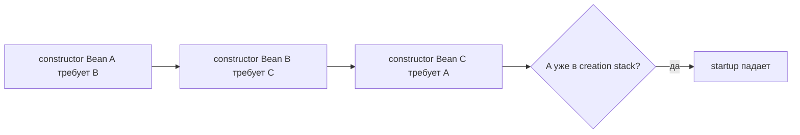
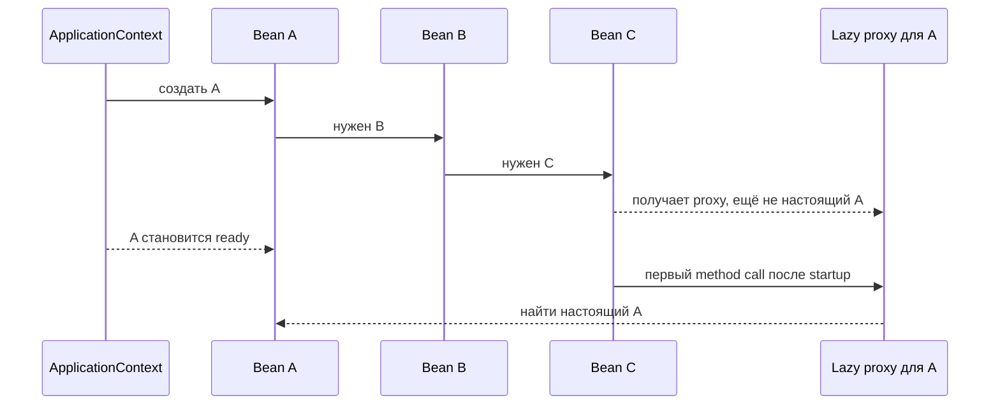

# Циклические зависимости бинов Spring

Circular bean dependency означает, что Spring container не может построить
прямой порядок создания object graph. В типичном вопросе с собеседования bean
`A` нужен `B`, `B` нужен `C`, а `C` нужен `A`. При constructor injection Spring
должен получить все constructor arguments до завершения текущего bean, поэтому он
попадает в `A -> B -> C -> A` и видит, что `A` уже создаётся. Аналогия с кухней:
три повара ждут инструмент у следующего повара, а последний просит инструмент
первого ещё до того, как кто-то начал работу.

Это часть той же истории core container, что и
[Spring IoC and Dependency Injection](topic:spring-ioc-di): beans объявляют, что
им нужно, а `ApplicationContext` собирает их. Container ведёт creation stack,
пока строит singleton beans. Если constructor dependency просит bean, который
уже есть в этом stack, Spring не может получить полноценный instance и startup
падает. Аналогия с почтой: маршрут сортировки отправляет посылку A на стол B, B
на стол C, а C обратно на стол A, поэтому посылка так и не попадает в машину
доставки.



## Что Spring может и не может разрешить

Constructor cycles являются жёстким failure case, потому что нет частично
готового object, который можно безопасно передать в constructor. Dependency нужна
прямо сейчас. Аналогия с дорогой: мост нельзя открыть для машин до появления
первой опоры.

Setter или field injection могут выглядеть иначе для singleton beans. В Spring
Framework есть механизмы early singleton exposure, поэтому некоторые setter или
field cycles могут казаться рабочими, если circular references разрешены. Но это
всё равно хрупкий дизайн, особенно с proxies, transactions, validation и
lifecycle callbacks. В Spring Boot applications не стоит полагаться на такое
поведение, а современные defaults Spring Boot специально недружелюбны к circular
references. Аналогия с отелем: выдать ключ до завершения уборки номера можно для
быстрой проверки, но гость всё равно столкнётся с незаконченной работой.

Scope тоже важен. Большинство services являются singleton beans, но другие
scopes живут иначе; см. [Spring Bean Scopes](topic:spring-bean-scopes). Circular
dependencies между необычными scopes ещё сложнее понимать. Аналогия со складом:
общий погрузчик и одноразовая коробка для доставки живут по разным правилам
расписания.

## Как избежать цикла

Лучшее решение: изменить дизайн так, чтобы dependencies шли в одну сторону.
Обычно cycle означает, что у одного class слишком много ответственности или два
services вызывают друг друга как shortcut. Аналогия с кухней: если шеф и кассир
постоянно бегают друг к другу, вынесите общий прайс-лист на отдельный планшет.

Типовые рефакторинги:

- Вынести общее поведение в третий bean: `A -> SharedService` и
  `C -> SharedService`, вместо `A -> ... -> C -> A`.
- Перенести orchestration выше, в coordinator, который вызывает оба services,
  вместо того чтобы services вызывали друг друга.
- Разделить commands и queries, чтобы один service записывал состояние, а другой
  читал его, вместо владения обеими сторонами сразу.
- Использовать events, когда второе действие является реакцией, а не обязательным
  return value. Аналогия с дорогой: светофор публикует сигнал, а не звонит каждой
  машине и не ждёт ответа.
- Inject interface или более узкий port, если class нужна только одна операция.
  Это связано с идеей направления dependencies в
  [Strategy](topic:strategy), но не стоит создавать interface только чтобы
  спрятать плохой cycle.

Если cycle приходит из configuration methods или регистрации components,
проверьте, как bean попал в container. Темы
[@Bean vs @Component in Spring](topic:spring-bean-vs-component) и
[@Configuration and @Bean Methods](topic:spring-configuration-bean-methods)
разбирают эти варианты регистрации. Аналогия с почтой: иногда проблема не в
маршруте доставки, а в двух дубликатах адресной карточки в каталоге.

## Если рефакторинг невозможен: @Lazy

`@Lazy` на одной injection point говорит Spring внедрить proxy вместо немедленного
разрешения целевого bean. В `A -> B -> C -> A` обычно ставят `@Lazy` на dependency
`A` внутри `C`. Тогда Spring может создать `C` с proxy, завершить `B`, завершить
`A` и найти настоящий `A` только когда `C` впервые использует этот proxy.
Аналогия с кухней: повар получает талон на духовку вместо требования освободить
духовку ещё до сборки рабочей станции.

```java
@Component
class C {
    private final A a;

    C(@Lazy A a) {
        this.a = a;
    }
}
```



`@Lazy` является крайним вариантом, а не design pattern. Он меняет момент
разрешения dependency, но не упрощает object graph. Если `C` вызывает proxy
слишком рано, например в constructor или `@PostConstruct`, cycle может вернуться
в другом месте. Аналогия с почтой: талон на получение помогает только после
прибытия посылки, а не пока сортировочный центр ещё закрыт.

`ObjectProvider<A>`, `Provider<A>` или небольшая factory могут быть понятнее, чем
`@Lazy`, когда dependency действительно optional или нужна только внутри одного
method. Код тогда прямо говорит: "я попрошу это позже". Аналогия с дорожным
движением: вызвать такси, когда оно реально нужно, понятнее, чем весь день
держать во дворе машину-муляж.

## 60-секундный ответ на собеседовании

> При constructor injection `A -> B -> C -> A` падает во время startup context.
> Spring ведёт creation stack бинов, которые сейчас строятся. Когда он создаёт
> `A`, ему нужен `B`; `B` нужен `C`; `C` просит `A`, но `A` уже находится в
> creation, поэтому Spring не может завершить graph и падает с ошибкой circular
> dependency. Предпочтительное решение: рефакторинг. Вынести общее поведение,
> поднять orchestration в service верхнего уровня, использовать events или сузить
> направление dependency. Если рефакторинг невозможен, поставить `@Lazy` на одну
> injection point, обычно на back-reference, чтобы Spring внедрил proxy и нашёл
> настоящий bean позже. Это workaround, потому что он может спрятать проблему
> дизайна и перенести ошибку со startup в runtime.

## Значение в production

Circular dependencies делают startup хрупким. Небольшое переименование service
или proxy, добавленный для transactions, может изменить момент появления cycle.
Аналогия с рестораном: кухня, где каждая станция блокирует другую, может
работать на репетиции, а потом встать от одного лишнего заказа.

Они также усложняют tests. Unit test для `A` теперь требует достаточно `B` и `C`,
чтобы замкнуть loop, поэтому простые fakes становятся громоздкими. Аналогия с
гаражом: чтобы проверить одну дрель, не нужно запитывать всё здание.

Они скрывают ownership. Если `A` и `C` должны вызывать друг друга, непонятно,
какой class владеет workflow. Аналогия с почтой: два окна штампуют одну посылку
туда-сюда, значит никто не отвечает за финальную доставку.

`@Lazy` может быть полезен в legacy systems, где менять graph слишком рискованно
в рамках одного release. Используйте его осознанно, документируйте причину и
планируйте последующий рефакторинг. Аналогия с дорогой: временный знак объезда
допустим во время ремонта, но не должен стать постоянной картой города.

## Частые заблуждения

- "Spring всегда может решить circular dependencies." Он не может решить
  constructor cycles, потому что нет готового object для injection. Аналогия с
  кухней: нельзя налить суп из кастрюли, которую ещё не поставили на плиту.
- "Если field injection работает, значит дизайн нормальный." Он может работать
  только потому, что Spring выдал early singleton reference, а proxies или
  lifecycle callbacks всё равно могут всё сломать. Аналогия с отелем: гость может
  войти в полуубранный номер, но номер от этого не становится готовым.
- "`@Lazy` удаляет цикл." Он откладывает одно ребро через proxy. Логическая связь
  остаётся. Аналогия с почтой: талон откладывает получение посылки, но не стирает
  саму посылку.
- "Нужно поставить `@Lazy` на class." Для этой проблемы обычно важна injection
  point, которая замыкает cycle. Сделать весь bean lazy означает шире изменить
  startup timing и удивить callers. Аналогия с дорогой: перекрыть всю улицу не то
  же самое, что задержать один поворот.
- "Правильный ответ: включить circular references." Это может запустить legacy
  app, но сохранит design smell и может позже упасть из-за proxies или порядка
  initialization. Аналогия с рестораном: попросить все станции ждать дольше не
  исправляет плохой план подготовки.
