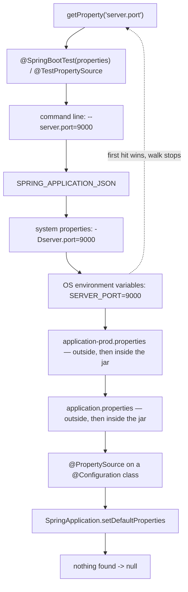
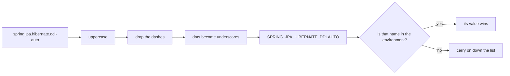

# application.properties vs environment variables: which wins

**The environment variable wins.** It sits above both copies of
`application.properties` — the one packaged inside the jar and the one on disk
next to it — so setting `SERVER_PORT=9000` overrides `server.port=8080` in the
file without editing, rebuilding or redeploying anything.

The reason is worth more than the answer, because it settles every other
question of this shape too.

## Why: an Environment is an ordered list

Spring Boot does not "read a config file". It builds an `Environment` that holds
an **ordered list of `PropertySource`s**, and every lookup walks that list from
the top and returns the **first** value it finds:

```java
String port = environment.getProperty("server.port");
```

The order is fixed by the framework. It does not depend on which value you set
last, on which file was loaded most recently, or on how deliberate the code
looks. "Higher priority" simply means "closer to the top of the list", and
environment variables are above files.



## The order, top to bottom

1. **Devtools settings** in `~/.config/spring-boot` — development only.
2. **`@TestPropertySource`**, then **`@SpringBootTest(properties = …)`**.
3. **Command line arguments**: `java -jar app.jar --server.port=9000`.
4. **`SPRING_APPLICATION_JSON`** — one variable holding a JSON document, which
   Spring flattens into dotted keys.
5. Servlet init parameters and JNDI attributes — legacy containers.
6. **Java system properties**: `java -Dserver.port=9000 -jar app.jar`.
7. **OS environment variables**: `SERVER_PORT=9000`.
8. `random.*` values.
9. **`application-{profile}.properties`** — first the copy outside the jar, then
   the one inside it.
10. **`application.properties`** — again outside first, then inside.
11. **`@PropertySource`** on a `@Configuration` class.
12. **`SpringApplication.setDefaultProperties(…)`** — the floor.

Two things are worth memorising out of that list. Everything you can change **at
deploy time without rebuilding** (ranks 3, 4, 6, 7) is above everything that
ships **inside the artefact** (ranks 9–12) — that is the design, not an accident.
And ranks 11 and 12 are the ones that surprise people: `@PropertySource` looks
like a deliberate override and loses to the ordinary `application.properties`
anyway.

For files, "outside beats inside" comes from the search locations Boot uses, in
increasing priority: `classpath:/`, `classpath:/config/`, `file:./`,
`file:./config/`, `file:./config/*/`. Dropping an `application.properties` into a
`config/` folder next to the jar overrides the packaged one — no rebuild, no
variables.

## The names: relaxed binding

No shell lets you export a variable called `spring.datasource.url`. So Spring
converts the key you asked for into the spelling an environment can hold —
uppercase, dots to underscores, dashes removed — and matches on that:



So `SPRING_DATASOURCE_URL` configures `spring.datasource.url`, and
`APP_CHECKOUT_TIMEOUT` configures `app.checkout.timeout`. List indices work too:
`app.hosts[0]` is `APP_HOSTS_0_`.

The conversion lives in Spring, not in the JVM — which produces the trap worth
knowing:

```java
environment.getProperty("spring.datasource.url");  // jdbc:postgresql://db:5432/shop
System.getenv("spring.datasource.url");            // null
```

`System.getenv` asks the operating system for that exact name and there is no
such variable. Spring Boot attaches a wrapper source named
`configurationProperties` at the head of the list that performs the relaxed
mapping over all the other sources; it does not change their order, it only makes
the names line up.

## Overriding is per key, not per file

A property source is not a file that replaces another file — it is a bag of keys
consulted in order. Set `SERVER_PORT` and you have overridden exactly one key;
every other line of `application.properties` is still in force. The file value is
not deleted and not merged: it is **shadowed**, and it comes back the moment the
variable is unset.

The corollary is the most common production incident in this area: a misspelled
variable name overrides nothing, logs nothing and fails nothing. `APP_CHEKOUT_TIMEOUT`
is simply a variable no one reads, and the application quietly keeps the value
from the file.

## Profiles are not a priority level

`application-prod.properties` is not "a lower-priority file that gets promoted".
While `prod` is inactive it is **not read at all**; activating the profile makes
it exist, above the plain `application.properties` next to it. Profiles reorder
the files among themselves — they never lift a file above the environment.

## The 60-second interview answer

> Environment variables win. A Spring Boot `Environment` is an ordered list of
> property sources, and `getProperty` returns the first value it finds walking
> that list from the top. Environment variables sit above both
> `application.properties` copies, and above them there are three more rungs you
> can reach at deploy time: `-D` system properties, `SPRING_APPLICATION_JSON`,
> and command line arguments, which is the highest of the normal ones. Below the
> files sit `@PropertySource` and `setDefaultProperties` — people usually get
> those two the wrong way round. The point of the ordering is that the artefact
> carries defaults and the deployment carries the differences, so one image runs
> in staging and production unchanged. Two details I would add: the environment
> source stores `SPRING_DATASOURCE_URL`, and relaxed binding is what maps that to
> `spring.datasource.url` — which is why `System.getenv("spring.datasource.url")`
> returns `null` in the same process. And overriding is per key, so a typo in a
> variable name silently changes nothing.

## Why it matters in production

This ordering is what makes "build once, deploy anywhere" possible. You build
[one Docker image](topic:spring-boot-docker-image), promote that exact artefact
through dev, staging and production, and each deployment supplies its own
database URL, credentials and log levels through `docker run -e`, a Kubernetes
`env`/`envFrom` block, or a systemd unit. Nothing about the jar differs between
environments, so staging is a real rehearsal rather than a similar program.

It is also why `@SpringBootTest(properties = …)` sits at the very top: a
developer with `SPRING_DATASOURCE_URL` exported in their shell would otherwise
run integration tests against staging.

Environment variables are the standard place for configuration, but a weaker
place for **secrets** than people assume — they are readable via `docker inspect`,
`/proc/<pid>/environ` and any child process, and they leak into crash dumps.
Mounting a file and pointing
`spring.config.import=optional:file:/etc/secrets/app.properties` at it, or using
a real secrets manager, keeps them out of process metadata. Storing them in the
jar instead is worse than either (see [OWASP's top ten](topic:owasp-top-ten)).

## Traps and misconceptions

- **"The last one loaded wins."** No — rank wins. Setting the file after the
  variable changes nothing; the framework decides the order.
- **"`@PropertySource` overrides `application.properties`."** It is *below* it.
  If you need an extra file to win, use `spring.config.import` instead, which
  participates in config-data ordering.
- **"An environment variable replaces the whole file."** It replaces one key.
- **"My override was ignored."** Nine times out of ten the name is wrong —
  `SPRING_DATASOURCE_URL` versus `SPRING_DATA_SOURCE_URL`, or a `-` that should
  have been dropped. Check `/actuator/env`, which lists every source in order and
  shows where each active value came from.
- **"`System.getenv` and `Environment` are the same thing."** `getenv` is exact
  and knows nothing about files, defaults or relaxed binding.
- **"`@Value` and `@ConfigurationProperties` resolve differently."** They read
  the same `Environment` and neither changes precedence.
  `@ConfigurationProperties` adds relaxed name-to-field binding, type conversion
  and validation; `@Value` supports SpEL and a `${key:default}` fallback and
  fails the context at startup when a key is missing without one. Both are
  injected during [bean creation](topic:spring-bean-lifecycle) — see also
  [IoC and dependency injection](topic:spring-ioc-di).
- **"Changing the variable updates the running app."** It does not. The
  `Environment` is populated at startup; you need a restart, or Spring Cloud's
  `@RefreshScope` plus `/actuator/refresh`.
- **"Lists get merged."** They do not. The highest-priority source that
  contributes a list supplies the whole list; you cannot append one element from
  a variable.
- **A YAML file with several `---` documents** is several sources within one
  file, and later documents win over earlier ones — a frequent surprise when
  `spring.config.activate.on-profile` blocks are reordered.
