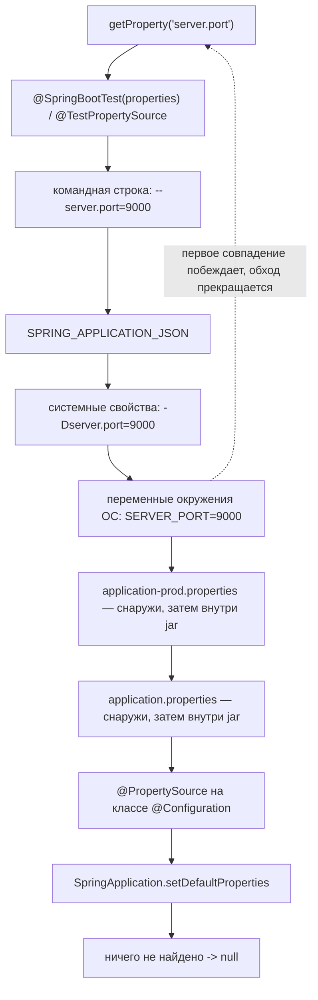
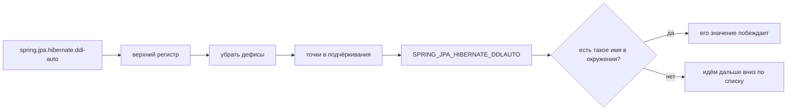

# application.properties или переменные окружения: что победит

**Побеждает переменная окружения.** Она стоит выше обеих копий
`application.properties` — и той, что упакована внутрь jar, и той, что лежит на
диске рядом с ним, — поэтому `SERVER_PORT=9000` перебивает `server.port=8080` из
файла, ничего не редактируя, не пересобирая и не передеплоивая.

Причина здесь важнее самого ответа, потому что она закрывает и все остальные
вопросы такого вида.

## Почему: Environment — это упорядоченный список

Spring Boot не «читает конфигурационный файл». Он строит `Environment`, который
хранит **упорядоченный список `PropertySource`**, и каждый запрос идёт по этому
списку сверху вниз, возвращая **первое** найденное значение:

```java
String port = environment.getProperty("server.port");
```

Порядок задан фреймворком. Он не зависит ни от того, что вы задали последним, ни
от того, какой файл загрузился позже, ни от того, насколько осознанно выглядит
код. «Более высокий приоритет» означает буквально «ближе к началу списка», а
переменные окружения находятся выше файлов.



## Порядок, сверху вниз

1. **Настройки Devtools** в `~/.config/spring-boot` — только для разработки.
2. **`@TestPropertySource`**, затем **`@SpringBootTest(properties = …)`**.
3. **Аргументы командной строки**: `java -jar app.jar --server.port=9000`.
4. **`SPRING_APPLICATION_JSON`** — одна переменная с документом JSON, который
   Spring разворачивает в ключи с точками.
5. Init-параметры сервлета и атрибуты JNDI — устаревшие контейнеры.
6. **Системные свойства Java**: `java -Dserver.port=9000 -jar app.jar`.
7. **Переменные окружения ОС**: `SERVER_PORT=9000`.
8. Значения `random.*`.
9. **`application-{profile}.properties`** — сначала копия снаружи jar, затем та,
   что внутри.
10. **`application.properties`** — снова сначала снаружи, затем внутри.
11. **`@PropertySource`** на классе `@Configuration`.
12. **`SpringApplication.setDefaultProperties(…)`** — самый низ.

Из этого списка стоит запомнить две вещи. Всё, что можно изменить **при деплое,
не пересобирая** (ранги 3, 4, 6, 7), стоит выше всего, что едет **внутри
артефакта** (ранги 9–12) — это замысел, а не случайность. И ранги 11 и 12 —
именно те, что всех удивляют: `@PropertySource` выглядит как осознанное
переопределение и всё равно проигрывает обычному `application.properties`.

Для файлов правило «снаружи побеждает внутреннее» вытекает из мест поиска,
которые использует Boot, по возрастанию приоритета: `classpath:/`,
`classpath:/config/`, `file:./`, `file:./config/`, `file:./config/*/`. Положить
`application.properties` в папку `config/` рядом с jar — значит переопределить
упакованный файл: без пересборки и без переменных.

## Имена: relaxed binding

Ни одна оболочка не даст экспортировать переменную с именем
`spring.datasource.url`. Поэтому Spring переводит запрошенный ключ в написание,
которое окружение способно хранить, — верхний регистр, точки в подчёркивания,
дефисы убираются — и ищет уже по нему:



Поэтому `SPRING_DATASOURCE_URL` настраивает `spring.datasource.url`, а
`APP_CHECKOUT_TIMEOUT` — `app.checkout.timeout`. Индексы списков тоже работают:
`app.hosts[0]` — это `APP_HOSTS_0_`.

Преобразование живёт в Spring, а не в JVM — отсюда и ловушка, которую стоит
знать:

```java
environment.getProperty("spring.datasource.url");  // jdbc:postgresql://db:5432/shop
System.getenv("spring.datasource.url");            // null
```

`System.getenv` спрашивает у операционной системы ровно это имя, а такой
переменной нет. Spring Boot добавляет в начало списка обёртку-источник с именем
`configurationProperties`, которая выполняет relaxed-сопоставление поверх всех
остальных источников; порядок она не меняет, а лишь приводит имена друг к другу.

## Переопределение работает по ключу, а не по файлу

Источник свойств — это не файл, заменяющий другой файл, а набор ключей,
опрашиваемых по порядку. Задав `SERVER_PORT`, вы переопределили ровно один ключ;
все остальные строки `application.properties` продолжают действовать. Значение из
файла не удалено и не слито с новым: оно **затенено** и вернётся, как только
переменную уберут.

Следствие — самый частый продакшен-инцидент в этой области: опечатка в имени
переменной ничего не переопределяет, ничего не пишет в лог и ничего не роняет.
`APP_CHEKOUT_TIMEOUT` — это просто переменная, которую никто не читает, а
приложение тихо продолжает жить со значением из файла.

## Профиль — это не уровень приоритета

`application-prod.properties` — не «файл с меньшим приоритетом, который потом
повышают». Пока профиль `prod` не активен, он **не читается вообще**; активация
профиля заставляет его существовать — выше обычного `application.properties`
рядом с ним. Профили переупорядочивают файлы между собой и никогда не поднимают
файл выше окружения.

## Ответ на собеседовании за 60 секунд

> Побеждают переменные окружения. `Environment` в Spring Boot — это
> упорядоченный список источников свойств, а `getProperty` возвращает первое
> значение, найденное при обходе списка сверху. Переменные окружения стоят выше
> обеих копий `application.properties`, а над ними есть ещё три ступени,
> доступные при деплое: системные свойства `-D`, `SPRING_APPLICATION_JSON` и
> аргументы командной строки — самая высокая из обычных. Ниже файлов лежат
> `@PropertySource` и `setDefaultProperties` — эти две обычно путают местами.
> Смысл такого порядка в том, что артефакт несёт значения по умолчанию, а деплой
> — различия, поэтому один образ работает и на staging, и в проде без изменений.
> Добавил бы две детали: источник окружения хранит `SPRING_DATASOURCE_URL`, и
> именно relaxed binding связывает это с `spring.datasource.url` — поэтому
> `System.getenv("spring.datasource.url")` в том же процессе вернёт `null`. И
> переопределение идёт по ключу, поэтому опечатка в имени переменной молча не
> меняет ничего.

## Почему это важно в проде

Именно этот порядок делает возможным принцип «собрать один раз, деплоить куда
угодно». Вы собираете [один образ Docker](topic:spring-boot-docker-image),
продвигаете ровно этот артефакт через dev, staging и прод, а каждый деплой
подставляет свой URL базы, учётные данные и уровни логирования через
`docker run -e`, блок `env`/`envFrom` в Kubernetes или unit systemd. В самом jar
между окружениями не отличается ничего, поэтому staging — настоящая репетиция, а
не похожая программа.

По той же причине `@SpringBootTest(properties = …)` стоит на самом верху:
разработчик с экспортированным в оболочке `SPRING_DATASOURCE_URL` иначе запускал
бы интеграционные тесты против staging.

Переменные окружения — стандартное место для конфигурации, но куда менее удачное
место для **секретов**, чем принято думать: их видно через `docker inspect`,
`/proc/<pid>/environ` и из любого дочернего процесса, и они утекают в дампы при
падении. Смонтировать файл и указать на него
`spring.config.import=optional:file:/etc/secrets/app.properties` или взять
полноценный менеджер секретов — значит убрать их из метаданных процесса. Хранить
их в jar — хуже любого из этих вариантов (см. [топ-10
OWASP](topic:owasp-top-ten)).

## Ловушки и заблуждения

- **«Побеждает тот, кто загрузился последним».** Нет — побеждает ранг. Задать
  файл после переменной не меняет ничего: порядок определяет фреймворк.
- **«`@PropertySource` переопределяет `application.properties`».** Он *ниже*
  него. Если дополнительный файл должен побеждать, используйте
  `spring.config.import` — он участвует в порядке config data.
- **«Переменная окружения заменяет весь файл».** Она заменяет один ключ.
- **«Моё переопределение проигнорировали».** В девяти случаях из десяти неверно
  имя — `SPRING_DATASOURCE_URL` против `SPRING_DATA_SOURCE_URL` или `-`, который
  нужно было убрать. Смотрите `/actuator/env`: он перечисляет все источники по
  порядку и показывает, откуда пришло каждое действующее значение.
- **«`System.getenv` и `Environment` — одно и то же».** `getenv` требует точного
  имени и ничего не знает ни о файлах, ни о значениях по умолчанию, ни о relaxed
  binding.
- **«`@Value` и `@ConfigurationProperties` разрешают значения по-разному».** Они
  читают один и тот же `Environment`, и ни один из них не меняет приоритеты.
  `@ConfigurationProperties` добавляет relaxed-связывание имён с полями,
  преобразование типов и валидацию; `@Value` поддерживает SpEL и запасное
  значение `${key:default}`, а без него роняет контекст при старте, если ключа
  нет. Внедряются оба во время [создания бина](topic:spring-bean-lifecycle) —
  см. также [IoC и внедрение зависимостей](topic:spring-ioc-di).
- **«Изменение переменной обновит работающее приложение».** Нет. `Environment`
  заполняется при старте; нужен рестарт или `@RefreshScope` из Spring Cloud
  вместе с `/actuator/refresh`.
- **«Списки сливаются».** Нет. Список целиком берётся из самого приоритетного
  источника, который его задаёт; добавить один элемент переменной нельзя.
- **YAML-файл с несколькими документами через `---`** — это несколько источников
  внутри одного файла, и более поздние документы побеждают более ранние. Частый
  сюрприз при перестановке блоков `spring.config.activate.on-profile`.
