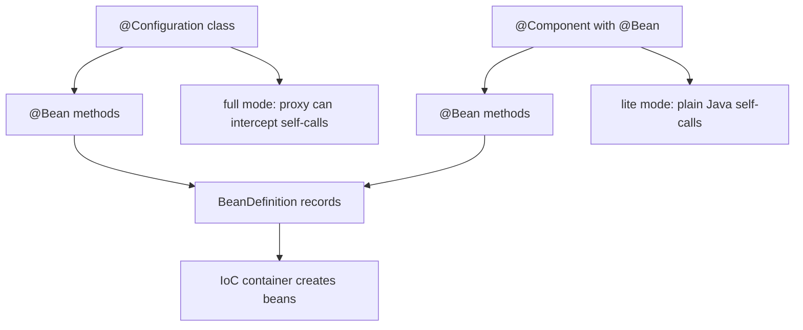
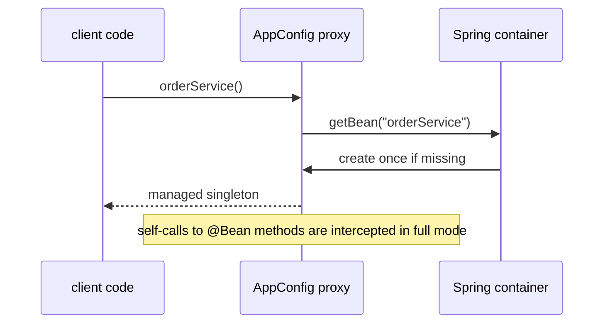

# @Configuration and @Bean Methods

`@Configuration` tells Spring: "this class contains bean definitions". Spring
reads its `@Bean` methods, registers the returned objects as beans, and manages
them in the IoC container. In everyday terms, the class is like a kitchen recipe
folder: the recipes are not dinner yet, but the kitchen uses them to prepare and
serve named dishes.

This topic sits next to [Spring IoC and Dependency Injection](topic:spring-ioc-di)
and [@Bean vs @Component in Spring](topic:spring-bean-vs-component): IoC explains
who owns object creation, and `@Bean` explains one explicit way to register those
objects. Once registered, the created objects follow normal Spring lifecycle and
scope rules, which are covered in [Spring Bean Scopes](topic:spring-bean-scopes).
Think of the container as the kitchen manager: after a dish is on the menu, the
manager decides whether it is made once, per order, or per table.



## What @Configuration adds

`@Configuration` is itself a specialized `@Component`, so it can be found by
component scanning or registered through imports. Its main extra meaning is that
Spring treats the class as a **full configuration class**. By default,
`proxyBeanMethods = true`, so Spring creates a runtime subclass proxy for the
configuration class. That proxy intercepts calls from one `@Bean` method to
another and routes them through the container.

Kitchen analogy: if one recipe says "use the house sauce", the chef does not
randomly cook a second sauce pan; the kitchen manager checks whether the house
sauce already exists and hands back the managed one.

```java
@Configuration
class AppConfig {
    @Bean
    Repository repository() {
        return new Repository();
    }

    @Bean
    OrderService orderService() {
        return new OrderService(repository());
    }
}
```

With full `@Configuration`, the call to `repository()` inside `orderService()`
is intercepted. If `repository` is a singleton bean, `OrderService` receives the
managed singleton, not a fresh unmanaged `Repository`.



## Can @Bean methods be outside @Configuration?

Yes. `@Bean` methods can be declared in a class that Spring processes, such as a
`@Component`, `@Service`, or a class imported into the application context. The
important condition is not the annotation alone; Spring must actually see and
process the class. A `@Bean` method in a random class that is never scanned,
imported, or registered is like a recipe card left in a drawer: the kitchen never
adds it to the menu.

Outside `@Configuration`, those methods run in **lite mode**. Spring still
registers the method result as a bean, but calls between `@Bean` methods are
plain Java calls. There is no configuration-class proxy protecting you from
accidentally creating extra objects.

```java
@Component
class BeanFactoryComponent {
    @Bean
    Repository repository() {
        return new Repository();
    }

    @Bean
    OrderService orderService() {
        return new OrderService(repository()); // plain Java call in lite mode
    }
}
```

Kitchen analogy: a helper in the kitchen can write useful recipes too, but if a
recipe directly cooks another recipe instead of asking the kitchen manager, it
may produce a second plate instead of reusing the prepared one.

The safe pattern in both full and lite mode is to express dependencies as method
parameters:

```java
@Bean
OrderService orderService(Repository repository) {
    return new OrderService(repository);
}
```

Spring resolves the parameter from the container. This is like writing "use the
house sauce from inventory" on the recipe instead of telling the cook to make a
new sauce inside the recipe.

## proxyBeanMethods=false

`@Configuration(proxyBeanMethods = false)` also uses lite-style behavior for
calls between `@Bean` methods. It avoids proxying and is useful when your bean
methods are independent or depend on each other through parameters. Many modern
Spring Boot auto-configurations prefer this style because it is simpler and
faster when self-invocation is not needed.

Traffic analogy: with `proxyBeanMethods = true`, every internal road goes through
a traffic controller that can redirect cars to the official parking spot. With
`false`, roads are direct and faster, but the driver must not accidentally park
in a private duplicate spot.

## 60-second interview answer

> `@Configuration` marks a class as a source of Spring bean definitions. Spring
> reads its `@Bean` methods and registers their return values as beans. The
> default full mode, `proxyBeanMethods = true`, creates a proxy for the
> configuration class so calls between `@Bean` methods go through the container
> and respect singleton/lifecycle semantics. `@Bean` methods can also be placed
> outside `@Configuration`, for example in a `@Component` that Spring scans, but
> then they are processed in lite mode: Spring still registers the beans, while
> direct calls between those methods are normal Java calls. In lite mode I prefer
> method parameters for dependencies instead of calling another `@Bean` method.

## Production relevance

In production, the difference matters most when configuration methods call each
other. With full `@Configuration`, direct calls are usually safe for singleton
beans because the proxy returns the managed instance. In lite mode, direct calls
can create duplicate objects that are not the same bean the container manages.
Post office analogy: if every parcel goes through the official counter, it gets
the right tracking label; if a worker hands over a parcel directly, it may skip
the system.

Use `@Configuration` for grouped application configuration, third-party library
objects, and cases where inter-`@Bean` calls rely on container semantics. Use
`@Bean` in a `@Component` only when it is local, simple, and you avoid self-calls.
Use `proxyBeanMethods = false` when methods are independent or dependencies are
declared as parameters. Grocery-store analogy: use the central service desk for
rules that coordinate the whole store; a shelf label is fine for a small local
item as long as it does not pretend to manage inventory.

## Common misconceptions

- "Every `@Bean` method must be inside `@Configuration`." No. It can be in other
  Spring-managed classes, but then it is usually lite mode.
- "`@Bean` works just because the annotation is present." No. Spring must scan,
  import, or register the containing class. A label on a closed box does not put
  the box on the delivery route.
- "Calling another `@Bean` method is always safe." Only full configuration mode
  intercepts those calls. In lite mode, it is a normal method call.
- "`@Configuration` creates the bean object itself." More precisely, it declares
  factory methods; the container owns registration, dependency injection,
  lifecycle callbacks, and scopes.
- "`proxyBeanMethods = false` is always better because it is faster." It is only
  better when you do not need self-call interception. A faster shortcut is still
  wrong if it bypasses the only traffic light that prevents duplicate objects.
