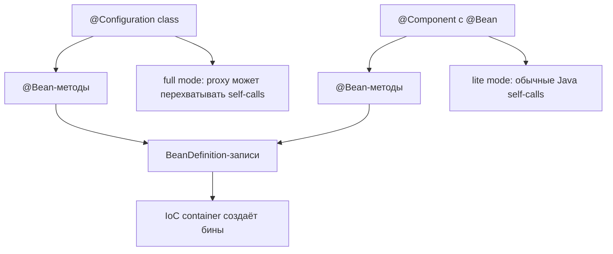
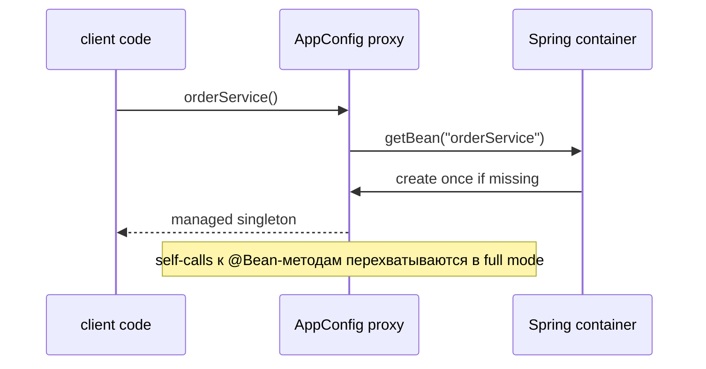

# @Configuration и @Bean-методы

`@Configuration` говорит Spring: «этот класс содержит bean definitions». Spring
читает его `@Bean`-методы, регистрирует возвращаемые объекты как бины и управляет
ими в IoC container. В бытовой аналогии это папка с рецептами на кухне: рецепты
ещё не являются ужином, но кухня использует их, чтобы приготовить и выдать
именованные блюда.

Эта тема стоит рядом с [Spring IoC and Dependency Injection](topic:spring-ioc-di)
и [@Bean vs @Component in Spring](topic:spring-bean-vs-component): IoC объясняет,
кто владеет созданием объектов, а `@Bean` показывает один явный способ
зарегистрировать эти объекты. После регистрации созданные объекты подчиняются
обычным правилам lifecycle и scope в Spring, которые разобраны в
[Spring Bean Scopes](topic:spring-bean-scopes). Представьте container как
управляющего кухней: когда блюдо попало в меню, управляющий решает, готовить его
один раз, на каждый заказ или на каждый столик.



## Что добавляет @Configuration

`@Configuration` сам является специализированным `@Component`, поэтому он может
быть найден component scanning или зарегистрирован через imports. Его главный
дополнительный смысл в том, что Spring воспринимает класс как **full
configuration class**. По умолчанию `proxyBeanMethods = true`, поэтому Spring
создаёт runtime subclass proxy для конфигурационного класса. Этот proxy
перехватывает вызовы из одного `@Bean`-метода в другой и направляет их через
container.

Кухонная аналогия: если один рецепт говорит «возьми фирменный соус», повар не
готовит случайно вторую кастрюлю соуса; управляющий кухней проверяет, есть ли
уже фирменный соус, и возвращает управляемый экземпляр.

```java
@Configuration
class AppConfig {
    @Bean
    Repository repository() {
        return new Repository();
    }

    @Bean
    OrderService orderService() {
        return new OrderService(repository());
    }
}
```

В full `@Configuration` вызов `repository()` внутри `orderService()`
перехватывается. Если `repository` является singleton bean, `OrderService`
получает управляемый singleton, а не новый неуправляемый `Repository`.



## Могут ли @Bean-методы быть вне @Configuration?

Да. `@Bean`-методы можно объявлять в классе, который Spring обрабатывает:
например, в `@Component`, `@Service` или в классе, импортированном в application
context. Важное условие не в одной аннотации: Spring должен реально увидеть и
обработать класс. `@Bean`-метод в случайном классе, который не сканируется, не
импортируется и не регистрируется, похож на карточку рецепта, оставленную в
ящике: кухня никогда не добавит его в меню.

Вне `@Configuration` такие методы работают в **lite mode**. Spring всё равно
регистрирует результат метода как бин, но вызовы между `@Bean`-методами являются
обычными Java-вызовами. Нет proxy конфигурационного класса, который защитит от
случайного создания лишних объектов.

```java
@Component
class BeanFactoryComponent {
    @Bean
    Repository repository() {
        return new Repository();
    }

    @Bean
    OrderService orderService() {
        return new OrderService(repository()); // plain Java call in lite mode
    }
}
```

Кухонная аналогия: помощник на кухне тоже может написать полезные рецепты, но
если рецепт напрямую готовит другой рецепт вместо обращения к управляющему
кухней, он может создать вторую тарелку вместо повторного использования уже
подготовленной.

Безопасный шаблон и в full mode, и в lite mode — выражать зависимости через
параметры метода:

```java
@Bean
OrderService orderService(Repository repository) {
    return new OrderService(repository);
}
```

Spring подставляет параметр из container. Это как написать в рецепте «возьми
фирменный соус со склада», а не заставлять повара готовить новый соус внутри
рецепта.

## proxyBeanMethods=false

`@Configuration(proxyBeanMethods = false)` тоже использует lite-style поведение
для вызовов между `@Bean`-методами. Он избегает proxy и полезен, когда ваши
bean-методы независимы или зависят друг от друга через параметры. Многие
современные Spring Boot auto-configurations предпочитают этот стиль, потому что
он проще и быстрее, когда self-invocation не нужен.

Дорожная аналогия: с `proxyBeanMethods = true` каждая внутренняя дорога проходит
через регулировщика, который может направить машины на официальную парковку. С
`false` дороги прямые и быстрее, но водитель не должен случайно припарковаться
на частном дубликате парковочного места.

## 60-секундный ответ на собеседовании

> `@Configuration` помечает класс как источник Spring bean definitions. Spring
> читает его `@Bean`-методы и регистрирует их return values как бины. Стандартный
> full mode, `proxyBeanMethods = true`, создаёт proxy для конфигурационного
> класса, поэтому вызовы между `@Bean`-методами проходят через container и
> соблюдают singleton/lifecycle semantics. `@Bean`-методы можно размещать и вне
> `@Configuration`, например в `@Component`, который Spring сканирует, но тогда
> они обрабатываются в lite mode: Spring всё равно регистрирует бины, а прямые
> вызовы между этими методами являются обычными Java-вызовами. В lite mode я
> предпочитаю зависимости через параметры методов вместо вызова другого
> `@Bean`-метода.

## Зачем это нужно в production

В production разница важнее всего, когда конфигурационные методы вызывают друг
друга. В full `@Configuration` прямые вызовы обычно безопасны для singleton beans,
потому что proxy возвращает управляемый экземпляр. В lite mode прямые вызовы
могут создавать дубликаты объектов, которые не являются тем же самым бином,
которым управляет container. Аналогия с почтой: если каждая посылка проходит
через официальное окно, она получает правильный трекинг; если работник передал
посылку напрямую, она может пройти мимо системы.

Используйте `@Configuration` для сгруппированной конфигурации приложения,
объектов сторонних библиотек и случаев, где inter-`@Bean` calls зависят от
container semantics. Используйте `@Bean` в `@Component` только когда это локально,
просто и без self-calls. Используйте `proxyBeanMethods = false`, когда методы
независимы или зависимости объявлены параметрами. Аналогия с магазином:
центральная стойка сервиса подходит для правил, которые координируют весь
магазин; полочная этикетка нормальна для маленького локального товара, если она
не притворяется системой управления складом.

## Частые заблуждения

- «Каждый `@Bean`-метод обязан быть внутри `@Configuration`». Нет. Он может быть
  в других Spring-managed классах, но тогда это обычно lite mode.
- «`@Bean` работает просто потому, что аннотация стоит в коде». Нет. Spring должен
  сканировать, импортировать или зарегистрировать содержащий класс. Наклейка на
  закрытой коробке не ставит коробку в маршрут доставки.
- «Вызов другого `@Bean`-метода всегда безопасен». Только full configuration mode
  перехватывает такие вызовы. В lite mode это обычный вызов метода.
- «`@Configuration` сам создаёт объект бина». Точнее, он объявляет factory
  methods; container владеет регистрацией, dependency injection, lifecycle
  callbacks и scopes.
- «`proxyBeanMethods = false` всегда лучше, потому что быстрее». Это лучше только
  когда вам не нужно перехватывание self-calls. Быстрый объезд всё равно неверен,
  если он обходит единственный светофор, который предотвращает дубликаты
  объектов.
