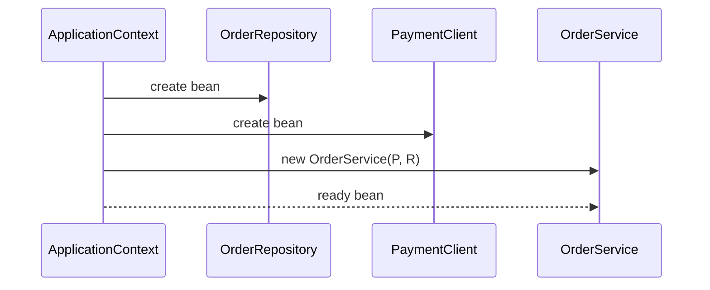

# Spring IoC and Dependency Injection

Spring is a Java framework and ecosystem for building applications from managed
objects. Its core is the **IoC container**, usually represented by
`ApplicationContext`. The container knows which objects should exist, creates
them, wires their dependencies, applies lifecycle callbacks, and may wrap them
with proxies for features such as transactions or security. Post office analogy:
instead of every parcel finding its own route, the sorting office knows the
addresses, assigns routes, and hands parcels to the right couriers.


Spring is not only DI. It includes web, data access, transactions, messaging,
testing support, integration modules, and Spring Boot conveniences. But most of
those features become usable because the container can manage application
objects consistently. Kitchen analogy: the whole restaurant has many stations,
but the prep table that keeps ingredients labeled and ready is what lets the
service run smoothly.

## Inversion of Control

Inversion of Control means the application gives part of the control flow to a
framework. In plain code, a class often decides which concrete collaborators to
create with `new`. With Spring IoC, the class declares what it needs, and the
container supplies those collaborators. Traffic analogy: a driver does not build
the road network before each trip; the city provides roads and signals, and the
driver follows the route.

Without IoC, an `OrderService` might directly create `EmailSender`,
`PaymentClient`, and `OrderRepository`. That makes the class responsible for both
business behavior and assembly. With IoC, `OrderService` receives those
collaborators from the container, so construction rules live in configuration
and business logic stays focused. Kitchen analogy: the chef asks for chopped
onions and hot stock; the chef does not also run the warehouse and delivery
truck.

## Dependency Injection

Dependency Injection is the main technique Spring uses to implement IoC. A
dependency is a collaborator an object needs to do its job. Injection means the
collaborator is passed in from the outside instead of being created inside the
class. Post office analogy: the counter clerk receives a scale, label printer,
and route table from the office; the clerk does not manufacture them before
serving each customer.

Constructor injection is the usual production default because it makes required
dependencies explicit, allows `final` fields, and lets the object be valid as
soon as it is created.

```java
@Service
public class OrderService {
    private final PaymentClient paymentClient;
    private final OrderRepository orderRepository;

    public OrderService(PaymentClient paymentClient,
                        OrderRepository orderRepository) {
        this.paymentClient = paymentClient;
        this.orderRepository = orderRepository;
    }
}
```

Field injection works in many Spring apps, but it hides required dependencies,
makes tests less direct, and can leave objects in a half-initialized shape.
Setter injection is useful for optional or replaceable dependencies, but not for
mandatory collaborators. Toolbox analogy: required tools should be in the kit
before the job starts; optional attachments can be clipped on later.



## What is a bean?

A Spring bean is an object managed by the container. It can be registered through
component scanning (`@Component`, `@Service`, `@Repository`, `@Controller`) or
through explicit factory methods (`@Bean`). The focused topic
[@Bean vs @Component in Spring](topic:spring-bean-vs-component) covers that
choice in detail. Library analogy: a book can enter the catalog because a
scanner found its barcode or because a librarian entered a record manually; once
cataloged, readers request it the same way.

The container also controls bean scope. Most application services are singleton
beans by default: one container-managed instance reused across the application.
Other scopes exist for shorter-lived state, especially in web applications; see
[Spring Bean Scopes](topic:spring-bean-scopes) and
[Prototype Bean Use Case](topic:spring-prototype-bean-use-case). Hotel analogy:
some equipment belongs to the whole building, while a room key is issued for a
specific stay.

## How Spring decides what to inject

Spring resolves dependencies mainly by type. If there is exactly one bean of the
required type, it injects that bean. If there are several candidates, you need
extra information: `@Qualifier`, `@Primary`, bean names, profiles, or explicit
configuration. This is where DI often meets design: you can inject an interface
and choose one implementation, similar to the [Strategy](topic:strategy) pattern.
Traffic analogy: if there is one bus route to the station, the dispatcher sends
it; if there are three routes, the ticket must say which one.

Spring Boot builds on this by adding auto-configuration and starters, so common
beans can be created from classpath and property conditions. That convenience is
still container wiring, not a different model. The topic
[Spring Boot Starter Web and Custom Starters](topic:spring-boot-starter-web)
explains how starters package those defaults. Kitchen analogy: a prepared meal
kit still uses normal ingredients; it just saves the cook from writing the
shopping list every time.

## 60-second interview answer

> Spring is a Java application framework whose core is an IoC container,
> `ApplicationContext`. IoC means objects do not control the full assembly of the
> application themselves; they declare what they need, and the framework creates
> and wires managed objects called beans. Dependency Injection is the main way
> Spring implements IoC: dependencies are provided from the outside, usually
> through constructors. This makes code easier to test, configure, replace, and
> decorate with framework behavior such as lifecycle callbacks or proxies. The
> common trap is saying "Spring creates objects magically"; the precise answer is
> that Spring uses bean definitions, dependency resolution, scopes, and lifecycle
> processing to assemble the object graph.

## Production relevance

DI keeps construction separate from behavior. Services can focus on business
rules, while configuration decides which repositories, clients, clocks, caches,
or adapters they receive. Restaurant analogy: a waiter takes orders and serves
tables; the manager decides which suppliers and kitchen stations support the
shift.

DI makes tests simpler. A class with constructor-injected dependencies can be
tested with fake or in-memory collaborators without starting the whole
application. Garage analogy: to test a drill, you plug it into a bench power
supply instead of rewiring the entire building.

Spring's container also centralizes lifecycle and cross-cutting behavior. The
same bean graph can receive configuration properties, validation, transaction
proxies, metrics, and shutdown callbacks. Airport analogy: once passengers go
through the terminal, boarding passes, gates, security checks, and announcements
are handled by shared infrastructure instead of each passenger inventing a
process.

## Common misconceptions

- "IoC and DI are exactly the same." DI is one way to implement IoC. IoC is the
  broader idea of the framework taking over part of control. Kitchen analogy:
  table service is the broader system; handing dishes to waiters is one concrete
  mechanism.
- "Spring is just a factory for objects." Object creation is only the beginning;
  Spring also manages scopes, lifecycle, configuration, proxies, and integration
  with other modules. Post office analogy: sorting mail is not the whole postal
  service.
- "A Spring bean is any Java object." A bean is an object registered and managed
  by the container. An object created with `new` inside your method is just a Java
  object unless you deliberately hand it to Spring. Library analogy: a book on
  your desk is not in the catalog just because it is a book.
- "Constructor injection is verbose, so field injection is better." Constructor
  injection exposes mandatory dependencies and supports immutable fields; field
  injection hides the contract and makes plain unit tests harder. Toolbox
  analogy: a checklist at the start is clearer than discovering missing tools
  halfway through the repair.
- "Spring Boot removed the need to understand IoC." Boot reduces setup, but it
  still relies on the same container concepts. Meal-kit analogy: premeasured
  ingredients do not remove the need to understand cooking time and heat.
- "Singleton bean means thread-safe object." Singleton is a scope, not a
  concurrency guarantee. A shared mutable field can still be unsafe. Office
  analogy: one shared whiteboard does not make every note on it coordinated.
