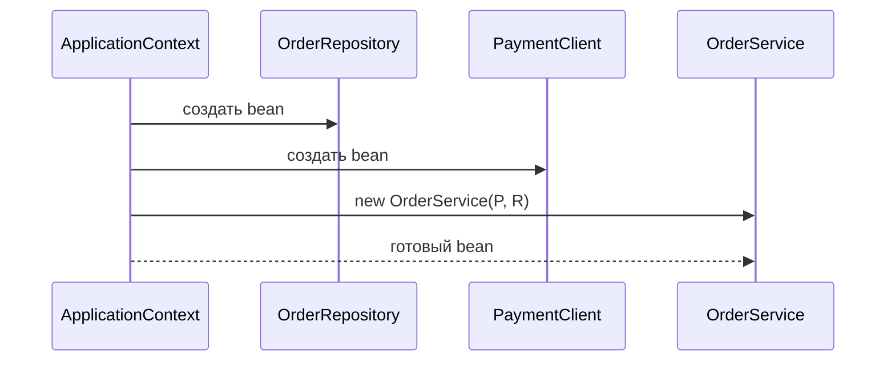

# Spring IoC и Dependency Injection

Spring — это Java framework и ecosystem для сборки приложений из управляемых
объектов. В его центре находится **IoC container**, обычно представленный
`ApplicationContext`. Container знает, какие объекты должны существовать, создаёт
их, связывает их зависимости, применяет lifecycle callbacks и может оборачивать
их в proxies для возможностей вроде transactions или security. Аналогия с
почтой: вместо того чтобы каждая посылка сама искала маршрут, сортировочный центр
знает адреса, назначает маршруты и передаёт посылки нужным курьерам.


Spring — это не только DI. В нём есть web, data access, transactions, messaging,
testing support, integration modules и удобства Spring Boot. Но большинство этих
возможностей становится полезным потому, что container умеет единообразно
управлять объектами приложения. Аналогия с кухней: в ресторане много станций, но
размеченный prep table с готовыми ингредиентами помогает всей смене работать
ровно.

## Inversion of Control

Inversion of Control означает, что приложение отдаёт часть управления framework.
В обычном коде класс часто сам решает, какие конкретные collaborators создать
через `new`. В Spring IoC класс объявляет, что ему нужно, а container передаёт
эти collaborators. Аналогия с трафиком: водитель не строит дорожную сеть перед
каждой поездкой; город предоставляет дороги и светофоры, а водитель едет по
маршруту.

Без IoC `OrderService` мог бы напрямую создавать `EmailSender`,
`PaymentClient` и `OrderRepository`. Тогда класс отвечает и за business behavior,
и за assembly. С IoC `OrderService` получает этих collaborators от container,
поэтому правила создания живут в configuration, а business logic остаётся
сфокусированной. Аналогия с кухней: шеф просит нарезанный лук и горячий бульон,
а не управляет ещё складом и грузовиком доставки.

## Dependency Injection

Dependency Injection — главный приём, которым Spring реализует IoC. Dependency —
это collaborator, который нужен объекту для работы. Injection означает, что
collaborator передают снаружи, а не создают внутри класса. Аналогия с почтой:
клерк на стойке получает весы, принтер этикеток и таблицу маршрутов от отделения,
а не производит их перед каждым клиентом.

Constructor injection обычно является production-default, потому что явно
показывает обязательные dependencies, позволяет использовать `final` fields и
делает объект валидным сразу после создания.

```java
@Service
public class OrderService {
    private final PaymentClient paymentClient;
    private final OrderRepository orderRepository;

    public OrderService(PaymentClient paymentClient,
                        OrderRepository orderRepository) {
        this.paymentClient = paymentClient;
        this.orderRepository = orderRepository;
    }
}
```

Field injection работает во многих Spring-приложениях, но скрывает обязательные
dependencies, усложняет прямые тесты и может оставлять объекты в
полуинициализированном состоянии. Setter injection полезен для optional или
заменяемых dependencies, но не для обязательных collaborators. Аналогия с
набором инструментов: обязательные инструменты должны лежать в ящике до начала
работы; дополнительные насадки можно пристегнуть позже.



## Что такое bean?

Spring bean — это объект под управлением container. Он может быть зарегистрирован
через component scanning (`@Component`, `@Service`, `@Repository`, `@Controller`)
или через явные factory methods (`@Bean`). Отдельная тема
[@Bean и @Component в Spring](topic:spring-bean-vs-component) разбирает этот
выбор подробно. Аналогия с библиотекой: книга может попасть в каталог, потому
что сканер нашёл её штрихкод, или потому что библиотекарь внёс запись вручную;
после каталогизации читатели запрашивают её одинаково.

Container также управляет scope бина. Большинство application services по
умолчанию являются singleton beans: один управляемый container экземпляр
переиспользуется во всём приложении. Есть и другие scopes для более короткой
жизни состояния, особенно в web-приложениях; см.
[Скоупы бинов в Spring](topic:spring-bean-scopes) и
[Сценарий использования prototype-бина](topic:spring-prototype-bean-use-case).
Аналогия с отелем: часть оборудования принадлежит всему зданию, а ключ от номера
выдают на конкретное проживание.

## Как Spring решает, что внедрять

Spring разрешает dependencies в основном по типу. Если есть ровно один bean
нужного типа, он будет внедрён. Если кандидатов несколько, нужна дополнительная
информация: `@Qualifier`, `@Primary`, имена бинов, profiles или явная
configuration. Здесь DI часто встречается с design: можно внедрить interface и
выбрать одну implementation, похоже на паттерн [Strategy](topic:strategy).
Аналогия с трафиком: если до станции едет один автобус, диспетчер отправляет его;
если маршрутов три, в билете нужно указать конкретный.

Spring Boot строится поверх этого и добавляет auto-configuration и starters,
чтобы common beans создавались по условиям classpath и properties. Это удобство
по-прежнему остаётся container wiring, а не другой моделью. Тема
[Spring Boot Starter Web и собственные starters](topic:spring-boot-starter-web)
объясняет, как starters упаковывают такие defaults. Аналогия с кухней: готовый
meal kit всё равно использует обычные ингредиенты; он просто избавляет повара от
написания списка покупок каждый раз.

## Ответ за 60 секунд

> Spring — это Java application framework, в центре которого находится IoC
> container, `ApplicationContext`. IoC означает, что объекты не контролируют всю
> сборку приложения сами; они объявляют, что им нужно, а framework создаёт и
> связывает управляемые объекты, называемые beans. Dependency Injection — главный
> способ, которым Spring реализует IoC: dependencies предоставляются снаружи,
> обычно через constructors. Это упрощает тестирование, конфигурацию, замену
> реализаций и добавление framework behavior вроде lifecycle callbacks или
> proxies. Частая ловушка — говорить "Spring магически создаёт объекты"; точнее
> сказать, что Spring использует bean definitions, dependency resolution, scopes
> и lifecycle processing для сборки object graph.

## Значение в production

DI отделяет создание от поведения. Services могут заниматься business rules, а
configuration решает, какие repositories, clients, clocks, caches или adapters
они получат. Аналогия с рестораном: официант принимает заказы и обслуживает
столы; manager решает, какие поставщики и кухонные станции поддерживают смену.

DI упрощает тесты. Класс с constructor-injected dependencies можно тестировать с
fake или in-memory collaborators без запуска всего приложения. Аналогия с
гаражом: чтобы проверить дрель, её подключают к стендовому питанию, а не
перепроводят всё здание.

Spring container также централизует lifecycle и cross-cutting behavior. Один и
тот же bean graph может получить configuration properties, validation,
transaction proxies, metrics и shutdown callbacks. Аналогия с аэропортом: когда
пассажиры проходят через терминал, посадочные талоны, gates, security checks и
объявления обрабатываются общей инфраструктурой, а не каждым пассажиром отдельно.

## Частые заблуждения

- "IoC и DI — это одно и то же." DI — один способ реализовать IoC. IoC шире: это
  идея, что framework берёт на себя часть управления. Аналогия с кухней: table
  service — вся система, а передача блюд официантам — конкретный механизм.
- "Spring — просто factory для объектов." Создание объектов — только начало;
  Spring также управляет scopes, lifecycle, configuration, proxies и интеграцией
  с другими modules. Аналогия с почтой: сортировка писем — ещё не вся почтовая
  служба.
- "Spring bean — это любой Java object." Bean — это объект, зарегистрированный и
  управляемый container. Объект, созданный через `new` внутри метода, остаётся
  просто Java object, если вы специально не передали его Spring. Аналогия с
  библиотекой: книга на вашем столе не находится в каталоге только потому, что
  она книга.
- "Constructor injection многословен, поэтому field injection лучше."
  Constructor injection показывает обязательные dependencies и поддерживает
  immutable fields; field injection скрывает контракт и усложняет обычные unit
  tests. Аналогия с инструментами: чек-лист в начале понятнее, чем поиск
  недостающих инструментов посреди ремонта.
- "Spring Boot отменил необходимость понимать IoC." Boot уменьшает настройку, но
  всё равно опирается на те же container concepts. Аналогия с meal kit:
  отмеренные ингредиенты не отменяют понимания времени приготовления и нагрева.
- "Singleton bean означает thread-safe object." Singleton — это scope, а не
  гарантия concurrency. Общее mutable field всё равно может быть unsafe. Аналогия
  с офисом: одна общая доска не делает все записи на ней согласованными.
