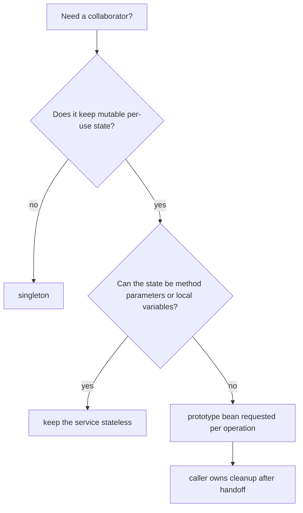
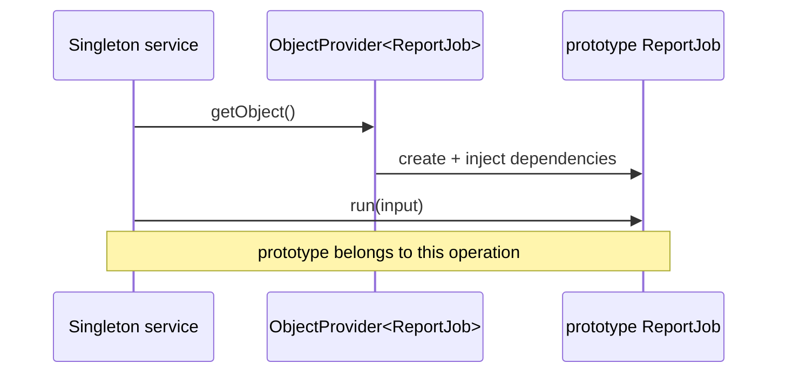

# Prototype Bean Use Case

A prototype bean is useful when Spring should build a fresh object for one specific piece of work, and that object naturally carries mutable state while the work is running. Think of a post office form: the form template is known by the office, but every customer receives a clean copy and fills it with their own data.

The practical answer is: use `prototype` for short-lived, stateful helpers such as a report builder, import job context, parser state holder, pricing calculation workspace, or command object. The bean may still need Spring-managed collaborators, configuration, or validation rules, but the data inside it belongs to one operation. In a kitchen analogy, the chef uses the same recipe and tools, but each order gets its own mixing bowl.

This is a focused case inside the broader [Spring Bean Scopes](topic:spring-bean-scopes) topic. The way you register the bean, with `@Component` or `@Bean`, is separate from the scope choice, as covered in [@Bean vs @Component in Spring](topic:spring-bean-vs-component).

## The Good Use Case

Choose `prototype` when the object is not a shared service but a per-operation workspace. A report generation service might ask Spring for a new `ReportJob` for each report. That job can collect rows, filters, temporary totals, and formatting choices while still receiving shared dependencies like `TemplateRepository` or `Clock`. It is like giving each restaurant order its own tray: the tray carries one order through the process, but the kitchen still uses the same ovens and shelves.

The important boundary is ownership. Spring creates the prototype object, injects dependencies, and runs initialization callbacks. After Spring hands the object to your code, your code owns that instance. If it opens files, sockets, or other resources, do not expect Spring to call destruction callbacks automatically for every prototype instance. Treat it like borrowing a shopping basket: the store hands it to you, but you must return or empty it correctly.

Prototype scope is often a better fit than storing operation state in fields of a singleton service. A singleton service may be called by many threads at once. If it keeps mutable per-operation fields, two requests can overwrite each other. A fresh prototype helper keeps that mutable state isolated. Picture a traffic office: one shared dispatcher is fine, but every accident report needs its own clipboard.

## Getting a Fresh Instance

The most common trap is direct injection into a singleton. Constructor injection happens when the singleton is created, so a directly injected prototype is resolved once and then reused by that singleton. That defeats the point. It is like a post office worker taking one "fresh" form in the morning and photocopying notes onto the same sheet all day.

Use `ObjectProvider<T>`, `Provider<T>`, lookup method injection with `@Lookup`, or an explicit factory when a singleton needs a new prototype on each operation. The singleton keeps a stable way to ask for a new object, not the object itself. It is like a kitchen ticket machine: the machine stays in place, but each button press prints a new ticket.

## When Not To Use It

Do not use prototype just because an object is expensive. Prototype creates more instances, not fewer. If the object is stateless and reusable, `singleton` is usually better. It is like buying a new coffee machine for every cup when one shared machine would do.

Do not use prototype as a substitute for `request` scope in a web app. A prototype gives you a new object when you ask the container for one; it does not automatically mean "one object for the whole HTTP request." If you need request-bound context, use request scope or pass the data explicitly. It is like confusing a fresh taxi receipt with a whole travel itinerary.

Do not use prototype as a thread-safety switch. It only helps when every operation actually receives its own instance. If you store a prototype instance in a static field, cache, or singleton field, you have made it shared again. A fresh lunch box stops helping once everyone eats from the same box.

## 60-Second Interview Answer

A good use case for a Spring prototype bean is a short-lived, stateful helper object created per operation: for example, a `ReportJob`, parser context, import task, command object, or calculation workspace. The object can receive Spring dependencies, but its mutable state belongs to one run and should not be shared. A singleton service should not inject the prototype directly, because that resolves only once when the singleton is created. It should request a fresh instance through `ObjectProvider`, `Provider`, `@Lookup`, or a factory. Also remember that Spring initializes prototype beans but does not manage their full destruction lifecycle after handoff, and prototype scope is not a replacement for request scope or real thread-safety design.

## Production Relevance

In production, prototype beans are most useful when a shared service coordinates work but needs a clean state container for each job. This keeps the service stateless and testable while still letting the helper use Spring configuration and dependencies. It is like a courier depot: the depot is shared, but every delivery gets its own labeled parcel bag.

They also help when object construction has dependency wiring that you do not want to duplicate manually. Instead of `new ReportJob(...)` scattered through the code, the singleton asks a provider for the next fully wired job. It is like asking the post office counter for a prepared form pack instead of assembling every envelope, stamp, and label by hand.

Keep prototypes small and clearly owned. If they start becoming hidden caches, long-lived sessions, or background services, the scope is probably wrong. In a kitchen, a mixing bowl is perfect for one cake; it is a bad place to store the restaurant's inventory.

## Common Misconceptions

- "Prototype means a new object every time I call a method." No. It means a new object every time the bean is requested from the container.
- "Injecting a prototype into a singleton gives a fresh instance on every singleton method call." No. Direct injection resolves once during singleton creation.
- "Prototype beans are fully destroyed by Spring." No. Spring creates, injects, and initializes them, but cleanup after handoff is the caller's responsibility.
- "Prototype fixes thread safety." Only if each concurrent operation truly uses its own instance and does not publish it to shared state.
- "Prototype is the right scope for HTTP request data." Not usually. Use request scope for one object per HTTP request, or pass request data explicitly.
- "Prototype is for expensive objects." Usually the opposite: it increases object creation. Use it when separate mutable state matters.
