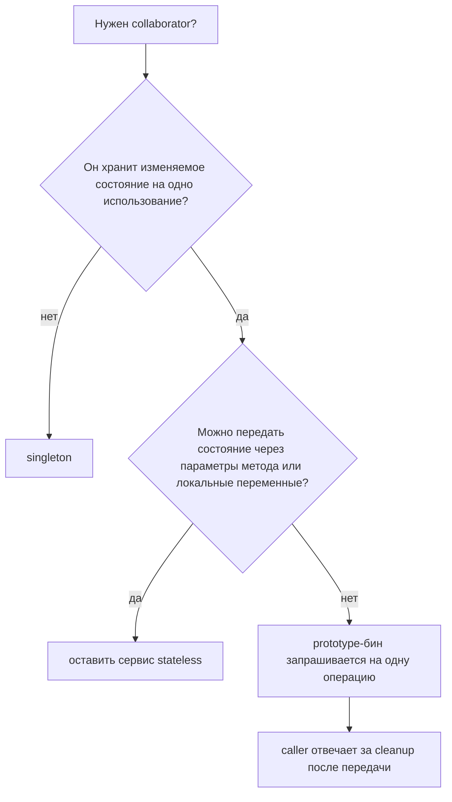
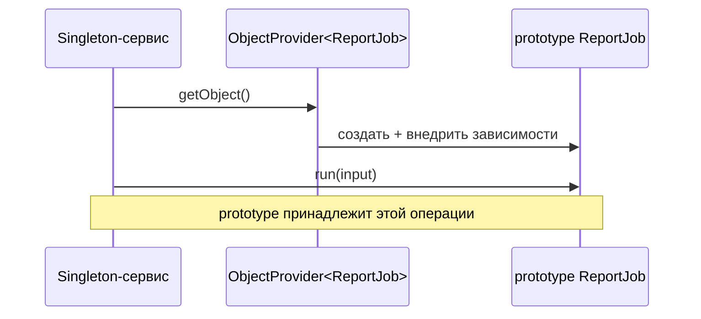

# Сценарий использования prototype-бина

Prototype-бин полезен, когда Spring должен собрать свежий объект для одной конкретной работы, а этот объект естественно хранит изменяемое состояние, пока работа выполняется. Представьте бланк на почте: шаблон бланка известен отделению, но каждый клиент получает чистую копию и заполняет её своими данными.

Практический ответ: используйте `prototype` для короткоживущих stateful helper-объектов, например report builder, import job context, parser state holder, pricing calculation workspace или command object. Такому бину могут быть нужны Spring-managed collaborators, configuration или validation rules, но данные внутри него принадлежат одной операции. Кухонная аналогия: повар использует тот же рецепт и инструменты, но каждый заказ получает свою миску для смешивания.

Это частный случай из более широкой темы [Spring Bean Scopes](topic:spring-bean-scopes). Способ регистрации бина через `@Component` или `@Bean` отделён от выбора scope, как описано в теме [@Bean vs @Component in Spring](topic:spring-bean-vs-component).

## Хороший use case

Выбирайте `prototype`, когда объект является не общим сервисом, а workspace для одной операции. Сервис генерации отчётов может просить Spring создать новый `ReportJob` для каждого отчёта. Этот job может собирать строки, фильтры, временные суммы и параметры форматирования, но при этом получать общие зависимости вроде `TemplateRepository` или `Clock`. Это похоже на ресторанный поднос для каждого заказа: поднос несёт один заказ по процессу, но кухня использует те же печи и полки.

Важная граница — владение. Spring создаёт prototype-объект, внедряет зависимости и запускает initialization callbacks. После того как Spring передал объект вашему коду, этот экземпляр принадлежит вашему коду. Если он открывает файлы, сокеты или другие ресурсы, не ожидайте, что Spring автоматически вызовет destruction callbacks для каждого prototype-экземпляра. Это как взять корзину в магазине: магазин выдал её вам, но корректно вернуть или освободить её должны вы.

Prototype scope часто лучше, чем хранить состояние операции в полях singleton-сервиса. Singleton-сервис могут одновременно вызывать разные threads. Если он хранит изменяемые поля для одной операции, два запроса могут перезаписать данные друг друга. Свежий prototype-helper изолирует это состояние. Представьте дорожную службу: общий диспетчер нормален, но каждому отчёту о ДТП нужен свой планшет.

## Как получить свежий экземпляр

Самая частая ловушка — прямое внедрение в singleton. Constructor injection происходит при создании singleton, поэтому напрямую внедрённый prototype вычисляется один раз и затем переиспользуется этим singleton. Это ломает идею. Это как сотрудник почты утром взял один «свежий» бланк и весь день записывает заметки на тот же лист.

Используйте `ObjectProvider<T>`, `Provider<T>`, lookup method injection через `@Lookup` или явную factory, когда singleton должен получать новый prototype для каждой операции. Singleton хранит стабильный способ попросить новый объект, а не сам объект. Это как кухонный аппарат для заказов: аппарат стоит на месте, но каждое нажатие печатает новый талон.

## Когда не использовать

Не используйте prototype только потому, что объект дорогой. Prototype создаёт больше экземпляров, а не меньше. Если объект stateless и переиспользуемый, `singleton` обычно лучше. Это как покупать новую кофемашину для каждой чашки, хотя одной общей машины достаточно.

Не используйте prototype вместо `request` scope в web-приложении. Prototype даёт новый объект, когда вы просите контейнер его создать; это не означает автоматически «один объект на весь HTTP request». Если нужен request-bound context, используйте request scope или передавайте данные явно. Это как спутать свежую квитанцию такси с полным маршрутом поездки.

Не используйте prototype как переключатель потокобезопасности. Он помогает только тогда, когда каждая операция действительно получает свой экземпляр. Если сохранить prototype-экземпляр в static field, cache или поле singleton, он снова станет shared. Свежий ланч-бокс перестаёт помогать, если все едят из одной коробки.

## 60-секундный ответ на интервью

Хороший use case для Spring prototype-бина — короткоживущий stateful helper-объект, создаваемый на одну операцию: например `ReportJob`, parser context, import task, command object или calculation workspace. Объект может получать Spring dependencies, но его изменяемое состояние принадлежит одному запуску и не должно разделяться. Singleton-сервис не должен внедрять prototype напрямую, потому что это вычисляется только один раз при создании singleton. Он должен запрашивать свежий экземпляр через `ObjectProvider`, `Provider`, `@Lookup` или factory. Также важно помнить, что Spring инициализирует prototype-бины, но после передачи не управляет их полным destruction lifecycle, а prototype scope не заменяет request scope или настоящую работу над thread-safety.

## Production relevance

В production prototype-бины полезнее всего, когда общий сервис координирует работу, но ему нужен чистый контейнер состояния для каждой job. Так сервис остаётся stateless и тестируемым, а helper всё ещё использует Spring configuration и dependencies. Это как курьерский склад: склад общий, но каждая доставка получает свой подписанный пакет.

Они также помогают, когда создание объекта требует dependency wiring, который не хочется дублировать вручную. Вместо разбросанного по коду `new ReportJob(...)` singleton просит provider выдать следующий полностью собранный job. Это как попросить на почте готовый набор бланков, а не вручную собирать каждый конверт, марку и наклейку.

Держите prototypes маленькими и с понятным владельцем. Если они превращаются в скрытые caches, long-lived sessions или background services, scope, скорее всего, выбран неверно. На кухне миска идеальна для одного пирога; хранить в ней все запасы ресторана — плохая идея.

## Частые заблуждения

- «Prototype значит новый объект при каждом вызове метода». Нет. Это значит новый объект при каждом запросе бина из контейнера.
- «Если внедрить prototype в singleton, на каждый вызов метода singleton будет свежий экземпляр». Нет. Прямое внедрение вычисляется один раз при создании singleton.
- «Spring полностью уничтожает prototype-бины». Нет. Spring создаёт, внедряет зависимости и инициализирует их, но cleanup после передачи — ответственность caller.
- «Prototype исправляет thread safety». Только если каждая concurrent operation действительно использует свой экземпляр и не публикует его в shared state.
- «Prototype — правильный scope для HTTP request data». Обычно нет. Для одного объекта на HTTP request используйте request scope или передавайте request data явно.
- «Prototype нужен для дорогих объектов». Обычно наоборот: он увеличивает создание объектов. Используйте его, когда важно отдельное изменяемое состояние.
