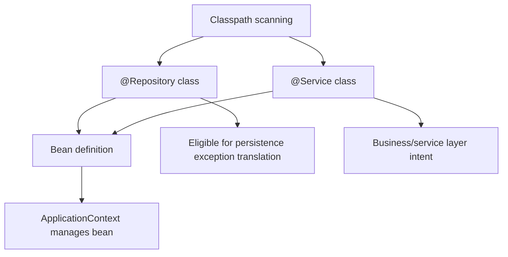
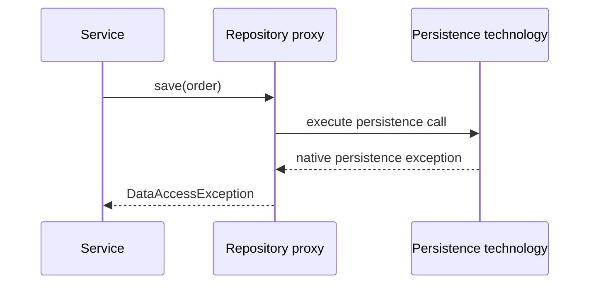

# @Repository vs @Service in Spring

`@Repository` and `@Service` are both Spring stereotype annotations. They are
specializations of `@Component`, so component scanning can discover the class,
create a bean, and let the bean participate in dependency injection, lifecycle,
and proxying. The difference is **the role you are declaring** and, for
`@Repository`, one important data-access behavior. Post office analogy: both
labels get a worker admitted into the building, but one says "sorting desk" and
the other says "customer service counter."

This connects directly to [Spring IoC and Dependency Injection](topic:spring-ioc-di):
the annotation is not just decoration; it creates metadata that the container
uses while assembling the application. Library analogy: a book in the catalog can
be requested by readers, but its shelf label still tells staff where it belongs.



## @Service: business behavior and orchestration

`@Service` marks a class whose main job is business logic: use cases,
orchestration, validation decisions, calls to repositories, and coordination
between external clients. Spring does not attach a special built-in behavior just
because the annotation is `@Service`; it mostly communicates intent to humans,
tools, architecture rules, and AOP pointcuts that your project may define.
Kitchen analogy: the chef decides the recipe and timing, but the `Chef` badge
does not by itself turn on the oven.

`@Service` classes often hold transaction boundaries, but the transaction is
caused by `@Transactional`, not by `@Service`. The service says "this is the use
case layer"; `@Transactional` says "run this method in a transaction." If you
need the database guarantees behind that boundary, review
[ACID Principles](topic:acid-principles). Traffic analogy: a road sign says this
is the delivery route, while the traffic light actually controls when cars move.

```java
@Service
public class OrderService {
    private final OrderRepository orderRepository;

    public OrderService(OrderRepository orderRepository) {
        this.orderRepository = orderRepository;
    }

    @Transactional
    public void placeOrder(Order order) {
        orderRepository.save(order);
    }
}
```

## @Repository: persistence boundary and exception translation

`@Repository` marks a persistence component: a DAO, repository adapter, mapper, or
class that hides database or storage details from the rest of the application. It
is also a stereotype, so it is discovered like other components. Warehouse
analogy: the stockroom clerk handles shelves, bins, and supplier codes so the
shop floor can ask for "item 42" without knowing the aisle layout.

The extra Spring behavior is **persistence exception translation**. With the
proper Spring infrastructure, such as `PersistenceExceptionTranslationPostProcessor`
and one or more `PersistenceExceptionTranslator` beans, Spring can advise
`@Repository` beans and translate technology-specific persistence exceptions
into Spring's unchecked `DataAccessException` hierarchy. A Hibernate
`ConstraintViolationException`, JPA `PersistenceException`, or JDBC exception can
be exposed to the service layer as a consistent Spring data-access exception.
Post office analogy: every courier has a different error code for "address
unreachable"; the sorting desk rewrites those slips into one standard form before
the counter sees them.



This translation is not magic for every possible exception. It applies to
persistence exceptions that a configured translator understands, and many Spring
data-access helpers such as `JdbcTemplate` already throw `DataAccessException`
directly. Kitchen analogy: the restaurant can standardize supplier invoices, but
it cannot turn a broken oven into a missing-ingredient note.

## Choosing the right annotation

Use `@Repository` for code whose primary responsibility is talking to storage and
mapping persistence errors into an application-friendly data-access contract. Use
`@Service` for code that expresses business decisions and coordinates other
beans. The dependency direction is usually service to repository, not repository
to service. Office analogy: the front desk sends a request to the archive room;
the archive room should not run the customer appointment.

If you use Spring Data repository interfaces, they are often registered by Spring
Data infrastructure rather than by putting `@Repository` on every interface
yourself. The concept is still the same: persistence details live behind a
repository boundary, while services orchestrate business work. Library analogy:
some shelves are cataloged by the library system automatically, but they are
still shelves, not checkout desks.

The focused topic [@Bean vs @Component in Spring](topic:spring-bean-vs-component)
explains another registration choice: classpath scanning versus explicit factory
methods. Here the registration path is usually the same; the difference is the
semantic layer and the optional exception translation attached to the persistence
stereotype. Post office analogy: both workers enter through the employee gate,
but their desk labels route different kinds of requests.

## 60-second interview answer

> Both `@Repository` and `@Service` are Spring stereotypes and specializations of
> `@Component`, so both can be found by component scanning and registered as
> beans. `@Service` marks the business/service layer and normally adds no special
> Spring runtime behavior by itself; it mainly documents intent and can be useful
> for tooling or AOP pointcuts. `@Repository` marks the persistence layer. In
> addition to communicating intent, it makes the bean eligible for persistence
> exception translation, where Spring converts vendor-specific database or ORM
> exceptions into the `DataAccessException` hierarchy when the translation
> infrastructure is configured. Transactions are separate: `@Transactional`
> controls transaction boundaries; `@Repository` helps normalize persistence
> errors.

## Production relevance

Clear stereotypes make large codebases easier to navigate. When a reviewer sees
`@Service`, they expect business rules and orchestration; when they see
`@Repository`, they expect SQL, JPA, a mapper, or another storage adapter.
Warehouse analogy: aisle signs do not move boxes for you, but they stop people
from searching the whole building.

Exception translation keeps service code less coupled to a specific persistence
technology. A service can handle `DuplicateKeyException` or
`DataIntegrityViolationException` without knowing whether the source was JDBC,
JPA, Hibernate, or another supported translator. Customer-support analogy: the
support desk reads one standard complaint form instead of learning every
supplier's private form.

Layering also helps testing. A service can be tested with a fake repository; a
repository can be tested against a database or test container without business
workflow noise. Kitchen analogy: taste the sauce at the stove and test the menu
flow in the dining room; mixing both makes failures harder to diagnose.

## Common misconceptions

- "`@Service` is required for `@Transactional` to work." `@Transactional` works
  through Spring AOP on Spring beans; the bean can be a service, repository, or
  another managed component. Traffic analogy: the traffic light works on any lane
  connected to it, not only the lane named "service."
- "`@Repository` catches all exceptions." It translates supported persistence
  exceptions through configured translators; it does not convert business
  exceptions, null pointer bugs, or arbitrary runtime failures. Post office
  analogy: the sorting desk standardizes delivery slips, not coffee machine
  complaints.
- "`@Service` and `@Repository` are only naming conventions." They are
  conventions, but `@Repository` also has a defined role in exception
  translation. Library analogy: both labels guide readers, but the archive label
  also gives staff a special handling process.
- "A repository should contain business decisions because it is close to the
  database." Persistence code should answer storage questions; business policy
  belongs in the service layer. Restaurant analogy: the pantry knows what is in
  stock, but the chef decides the menu.
- "Marking everything as `@Repository` is safer." It hides architecture intent and
  may apply data-access advice where it does not belong. Office analogy: if every
  door says "archive," nobody knows where customers should go.
