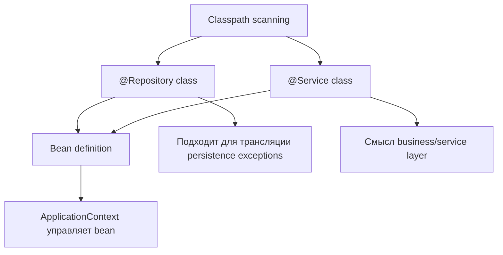
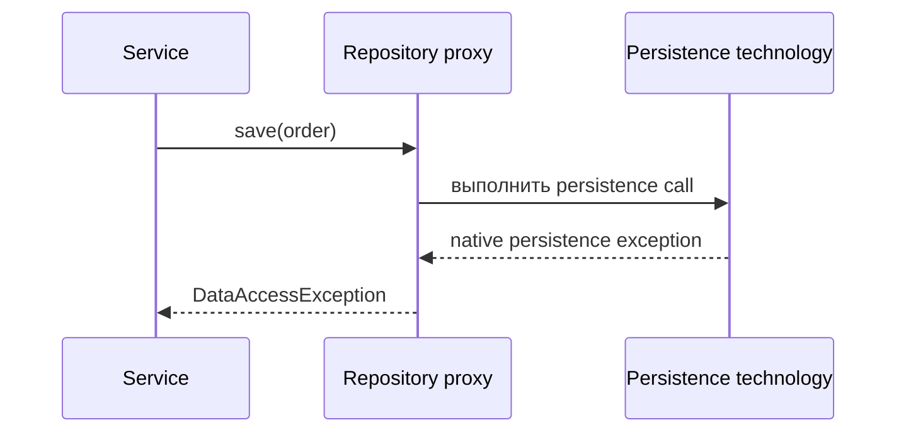

# @Repository и @Service в Spring

`@Repository` и `@Service` — это stereotype annotations в Spring. Оба являются
специализациями `@Component`, поэтому component scanning может найти класс,
создать bean и дать ему участвовать в dependency injection, lifecycle и
proxying. Разница в том, **какую роль вы объявляете**, а у `@Repository` есть ещё
одно важное поведение для data access. Аналогия с почтой: обе таблички пропускают
сотрудника в здание, но одна говорит «сортировочный стол», а другая — «окно
обслуживания клиентов».

Это напрямую связано с [Spring IoC and Dependency Injection](topic:spring-ioc-di):
annotation не просто украшает код; она создаёт metadata, которую container
использует при сборке приложения. Аналогия с библиотекой: книгу из каталога могут
заказывать читатели, но метка на полке всё равно подсказывает сотрудникам, где ей
место.



## @Service: бизнес-поведение и оркестрация

`@Service` помечает класс, основная задача которого — business logic: use cases,
оркестрация, решения по validation, вызовы repositories и координация external
clients. Spring не добавляет специальное встроенное поведение только потому, что
annotation называется `@Service`; в основном она сообщает intent людям, tools,
architecture rules и AOP pointcuts, которые может определить ваш проект.
Кухонная аналогия: chef решает рецепт и тайминг, но бейдж `Chef` сам по себе не
включает духовку.

Классы `@Service` часто держат transaction boundaries, но transaction создаётся
из-за `@Transactional`, а не из-за `@Service`. Service говорит «это слой use
cases»; `@Transactional` говорит «выполни этот метод в transaction». Если нужно
вспомнить гарантии базы данных за этой границей, посмотрите
[ACID Principles](topic:acid-principles). Дорожная аналогия: знак дороги
показывает маршрут доставки, а светофор реально управляет движением машин.

```java
@Service
public class OrderService {
    private final OrderRepository orderRepository;

    public OrderService(OrderRepository orderRepository) {
        this.orderRepository = orderRepository;
    }

    @Transactional
    public void placeOrder(Order order) {
        orderRepository.save(order);
    }
}
```

## @Repository: граница persistence и трансляция исключений

`@Repository` помечает persistence component: DAO, repository adapter, mapper или
класс, который скрывает детали базы данных или хранилища от остального
приложения. Это тоже stereotype, поэтому он находится как другие components.
Аналогия со складом: кладовщик работает с полками, ячейками и кодами поставщиков,
чтобы торговый зал мог попросить «товар 42» и не знать раскладку рядов.

Дополнительное поведение Spring — **трансляция persistence exceptions**. При
наличии нужной Spring-инфраструктуры, например
`PersistenceExceptionTranslationPostProcessor` и одного или нескольких
`PersistenceExceptionTranslator` beans, Spring может обернуть `@Repository` beans
advice и преобразовать technology-specific persistence exceptions в unchecked
иерархию Spring `DataAccessException`. Hibernate `ConstraintViolationException`,
JPA `PersistenceException` или JDBC exception могут попасть в service layer как
единое Spring data-access exception. Почтовая аналогия: у каждого курьера свой
код ошибки для «адрес недоступен»; сортировочный стол переписывает эти квитанции
на один стандартный бланк до того, как они попадут к окну.



Эта трансляция не является магией для любого возможного exception. Она
применяется к persistence exceptions, которые понимает настроенный translator, а
многие Spring data-access helpers, например `JdbcTemplate`, уже напрямую бросают
`DataAccessException`. Кухонная аналогия: ресторан может стандартизировать
счета поставщиков, но не превратит сломанную духовку в записку о нехватке
ингредиента.

## Как выбрать правильную annotation

Используйте `@Repository` для кода, чья основная ответственность — общаться с
storage и превращать persistence errors в удобный для приложения data-access
contract. Используйте `@Service` для кода, который выражает business decisions и
координирует другие beans. Направление dependency обычно service -> repository,
а не repository -> service. Офисная аналогия: ресепшен отправляет запрос в архив;
архив не должен вести запись клиентов.

Если вы используете Spring Data repository interfaces, они часто регистрируются
инфраструктурой Spring Data, и вам не нужно ставить `@Repository` на каждый
interface вручную. Идея остаётся той же: persistence details живут за repository
boundary, а services оркестрируют business work. Аналогия с библиотекой: часть
полок каталогизируется библиотечной системой автоматически, но это всё ещё
полки, а не стойка выдачи.

Отдельная тема [@Bean vs @Component in Spring](topic:spring-bean-vs-component)
объясняет другой выбор регистрации: classpath scanning или явные factory
methods. Здесь путь регистрации обычно одинаковый; отличие в semantic layer и
опциональной exception translation, связанной с persistence stereotype. Почтовая
аналогия: оба сотрудника заходят через служебный вход, но таблички на столах
направляют разные типы запросов.

## Ответ за 60 секунд

> `@Repository` и `@Service` — это Spring stereotypes и специализации
> `@Component`, поэтому оба могут быть найдены component scanning и
> зарегистрированы как beans. `@Service` помечает business/service layer и
> обычно сам по себе не добавляет специального runtime-поведения Spring; он в
> основном документирует intent и может быть полезен для tooling или AOP
> pointcuts. `@Repository` помечает persistence layer. Помимо intent, он делает
> bean кандидатом на persistence exception translation, когда Spring
> преобразует vendor-specific database или ORM exceptions в иерархию
> `DataAccessException`, если настроена соответствующая infrastructure.
> Transactions — отдельная тема: `@Transactional` управляет transaction
> boundaries, а `@Repository` помогает нормализовать persistence errors.

## Значение в production

Чёткие stereotypes упрощают навигацию по большому codebase. Когда reviewer видит
`@Service`, он ожидает business rules и orchestration; когда видит `@Repository`,
он ожидает SQL, JPA, mapper или другой storage adapter. Аналогия со складом:
таблички рядов сами не двигают коробки, но не дают людям искать по всему зданию.

Exception translation уменьшает связь service code с конкретной persistence
technology. Service может обработать `DuplicateKeyException` или
`DataIntegrityViolationException`, не зная, пришла ли причина из JDBC, JPA,
Hibernate или другого поддерживаемого translator. Аналогия со службой поддержки:
support desk читает одну стандартную форму жалобы вместо того, чтобы изучать
частную форму каждого поставщика.

Layering также помогает testing. Service можно тестировать с fake repository; a
repository можно тестировать против database или test container без шума
business workflow. Кухонная аналогия: соус пробуют у плиты, а поток меню
проверяют в зале; если смешать всё вместе, причину сбоя труднее найти.

## Частые заблуждения

- «`@Service` нужен, чтобы работал `@Transactional`». `@Transactional` работает
  через Spring AOP на Spring beans; bean может быть service, repository или
  другим managed component. Дорожная аналогия: светофор работает на любой полосе,
  подключённой к нему, а не только на полосе с названием «service».
- «`@Repository` ловит все exceptions». Он транслирует поддерживаемые persistence
  exceptions через настроенные translators; он не преобразует business
  exceptions, null pointer bugs или произвольные runtime failures. Почтовая
  аналогия: сортировочный стол стандартизирует квитанции доставки, а не жалобы на
  кофемашину.
- «`@Service` и `@Repository` — это только naming conventions». Это conventions,
  но `@Repository` ещё имеет определённую роль в exception translation. Аналогия
  с библиотекой: обе метки помогают читателям, но метка архива также запускает
  особую процедуру обработки.
- «Repository должен содержать business decisions, потому что он близко к
  database». Persistence code должен отвечать на storage questions; business
  policy принадлежит service layer. Ресторанная аналогия: кладовая знает, что
  есть в наличии, но menu решает chef.
- «Безопаснее пометить всё как `@Repository`». Это скрывает architecture intent и
  может применить data-access advice там, где оно неуместно. Офисная аналогия:
  если на каждой двери написано «архив», никто не понимает, куда идти клиентам.
