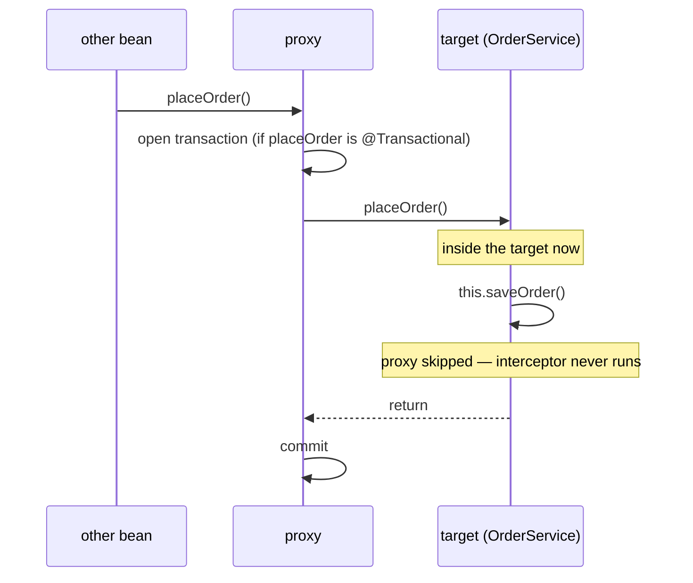
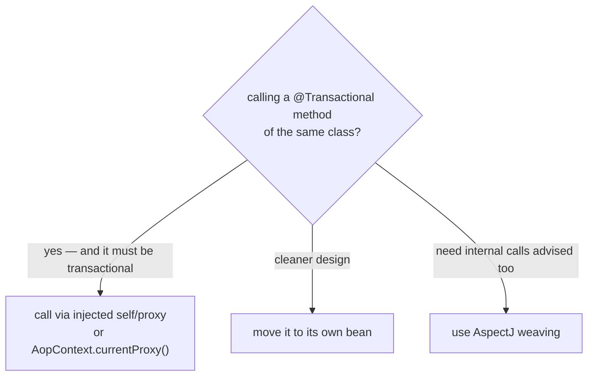

# Self-Invocation and @Transactional

## The intuition

Spring does not put `@Transactional` behaviour *inside* your bean. When it
detects the annotation, it wraps your bean in a **proxy** — a thin wrapper object
that sits in front of the real ("target") object. The proxy is the only thing
that knows how to open and commit a transaction; the target object itself has no
idea transactions exist.

> **Real-world picture.** Think of an office with a **reception desk** at the
> entrance. The receptionist (the proxy) stamps a "transaction folder" for every
> visitor before letting them into the office (the target bean). The staff inside
> just do their work; *they* never stamp anything — stamping is the receptionist's
> job, and the receptionist only sees people who come **through the front door**.

When some other class calls your bean, Spring has injected the **proxy**, so the
call enters through the front door, the receptionist stamps a transaction, and
everything works. The problem appears when a method of the bean calls **another
method of the same bean** with a plain `this.method()` call.

> **Real-world picture.** A staff member already inside the office walks straight
> to a colleague's desk to ask for help. They never pass the reception desk again,
> so no folder is stamped. `this.saveOrder()` is exactly that internal walk: it
> goes directly object-to-object on the target and **never touches the proxy**.

Because the call skips the proxy, the transaction interceptor never runs, and the
`@Transactional` on the inner method is silently ignored.

## What actually happens to the transaction

The exact symptom depends on whether a transaction is *already* open:

- **Outer method is NOT transactional** → the self-invoked `@Transactional`
  method runs with **no transaction at all**. There is no commit/rollback
  boundary; each statement may auto-commit on its own. This is the classic data
  bug.
- **Outer method IS transactional** → the inner method runs **inside the outer
  transaction**, but its *own* settings are ignored. The most painful case is
  `@Transactional(propagation = REQUIRES_NEW)`: you expect an independent
  transaction (one that commits even if the outer rolls back), but instead it
  just joins the outer one and rolls back with it.

> **Real-world picture.** The colleague was supposed to file their report in a
> **separate, sealed envelope** (`REQUIRES_NEW`) so it survives even if your big
> report is shredded. But because they never went to reception, their pages were
> just dropped into *your* folder — when your folder is shredded, theirs goes too.

This is the same proxy limitation that makes `@Transactional` not work on
`private` or `final` methods, and that affects other proxy-based annotations like
[@Async](topic:spring-async-self-invocation). It all flows from
[how @Transactional works through a proxy](topic:spring-transactional-proxy) and
[Spring AOP](topic:spring-aop-basics).

## How to fix it

The goal of every fix is the same: make the call **go through a proxy** instead of
through `this`.

1. **Call through an injected self-reference.** Inject the bean into itself (or
   inject the `ApplicationContext`/an `ObjectProvider` and fetch it) and call
   `self.saveOrder()`. That reference is the proxy, so the interceptor runs.
   Watch out for [circular dependencies](topic:spring-circular-dependencies) —
   self-injection needs lazy resolution.
2. **`AopContext.currentProxy()`.** Requires `@EnableAspectJAutoProxy(exposeProxy
   = true)`; then call `((OrderService) AopContext.currentProxy()).saveOrder()`.
   Works but couples your business code to Spring AOP.
3. **Move the method to a separate bean** and inject that bean. The call now
   crosses a real proxy boundary, so the interceptor runs — and your code stays
   clean of AOP plumbing. This is usually the cleanest design.
4. **Use AspectJ load-time/compile-time weaving** instead of proxies. Weaving
   modifies the bytecode of the method itself, so even an internal `this` call is
   advised. Powerful, but it adds build/agent complexity.

> **Real-world picture.** Fixes 1 and 2 mean: instead of walking to the colleague's
> desk, you step back out and **re-enter through the front door** so the
> receptionist stamps a folder. Fix 3 means the colleague works in a **different
> building** with its own reception — you literally cannot reach them without
> being stamped. Fix 4 replaces reception with a rule **printed on every door
> inside the building**, so even internal walks get stamped.

## 60-second interview answer

`@Transactional` is implemented with a proxy that wraps the bean; the transaction
interceptor lives on the proxy, not on the target object. When one method of the
bean calls another method of the *same* bean via `this.method()`, that call goes
directly to the target and bypasses the proxy, so the interceptor never runs. As
a result the inner `@Transactional` is ignored: if no transaction is open the
method runs without one, and if a transaction is already open the inner method's
own settings — like `REQUIRES_NEW` — are silently ignored and it just joins the
existing transaction. The fix is to make the call go through a proxy: inject the
bean into itself and call `self.method()`, use `AopContext.currentProxy()`, or —
best — move the method into a separate bean and inject it. AspectJ weaving avoids
the problem entirely because it advises the method bytecode rather than relying on
a proxy.

## Production relevance

- Silent data-integrity bugs: a "transactional" save that actually auto-commits
  each row, so a later failure leaves half-written data and no rollback. See
  [rollback rules](topic:spring-transactional-rollback) and
  [ACID](topic:acid-principles).
- A `REQUIRES_NEW` audit/outbox write that was meant to survive a rollback but
  silently shares the outer transaction and disappears with it.
- The same trap on [@Async](topic:spring-async-self-invocation) self-calls makes a
  method run synchronously on the caller's thread instead of in a pool.

## Common misconceptions

- **"The annotation is on the method, so it always applies."** It applies only
  when the call passes through the proxy. The annotation is metadata the proxy
  reads, not code inlined into the method.
- **"It's broken — no transaction is ever created."** No: external calls work
  fine. Only internal self-invocations bypass the proxy.
- **"Making the method `public` fixes it."** Visibility is unrelated; the call
  path (through `this` vs through the proxy) is what matters. `private`/`final`
  are a *different* proxy limitation.
- **"Self-injection is a hack."** It is a supported pattern, but moving the method
  to its own bean is usually the cleaner answer and avoids self-referential wiring.
- **"REQUIRES_NEW always gives me an independent transaction."** Only across a
  proxy boundary. Self-invoked, it silently degrades to joining the caller's
  transaction.

This topic is the runnable companion to the conceptual
[@Transactional self-invocation](topic:spring-transactional-self-invocation) topic.
