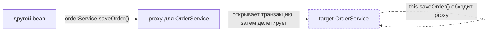
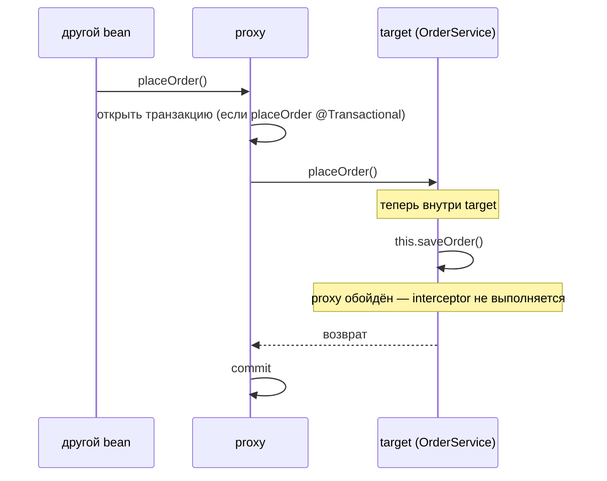
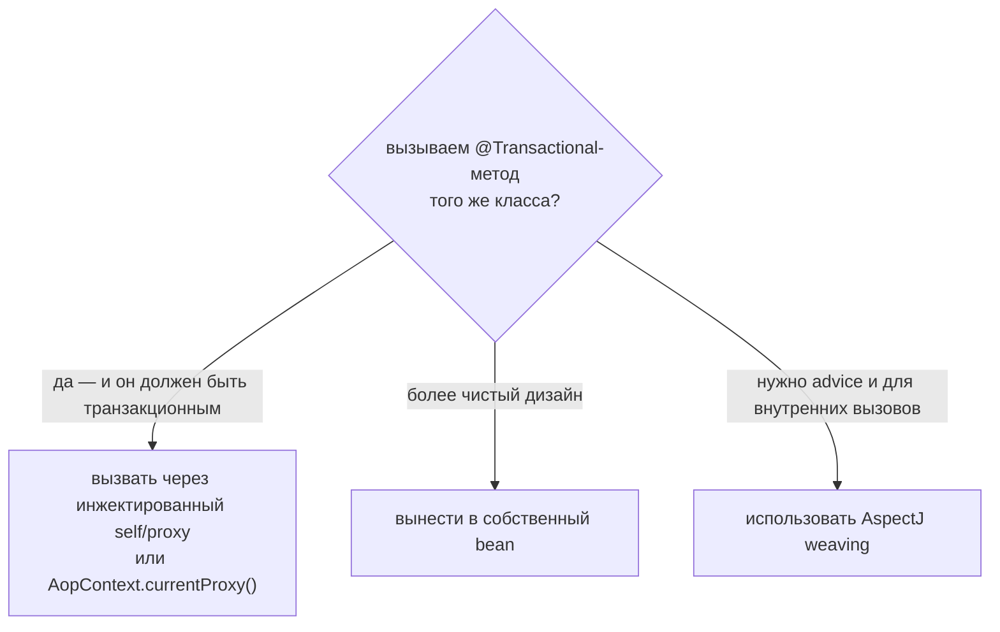

# Self-Invocation и @Transactional

## Интуиция

Spring не помещает поведение `@Transactional` *внутрь* вашего bean. Обнаружив
аннотацию, он оборачивает bean в **proxy** — тонкий объект-обёртку, который стоит
перед настоящим («target») объектом. Только proxy умеет открывать и коммитить
транзакцию; сам target-объект вообще не подозревает, что транзакции существуют.

> **Картинка из жизни.** Представьте офис со **стойкой ресепшена** на входе.
> Администратор (proxy) ставит штамп в «транзакционную папку» каждому посетителю,
> прежде чем пустить его в офис (target bean). Сотрудники внутри просто делают
> свою работу; *они* ничего не штампуют — штамповка это работа администратора, а
> администратор видит только тех, кто заходит **через парадную дверь**.

Когда ваш bean вызывает другой класс, Spring инжектировал именно **proxy**,
поэтому вызов заходит через парадную дверь, администратор ставит штамп транзакции,
и всё работает. Проблема появляется, когда метод bean вызывает **другой метод того
же bean** обычным вызовом `this.method()`.

> **Картинка из жизни.** Сотрудник, который уже внутри офиса, идёт напрямую к
> столу коллеги попросить помощи. Он не проходит ресепшен ещё раз, поэтому папку
> никто не штампует. `this.saveOrder()` — это и есть та внутренняя прогулка: вызов
> идёт напрямую от объекта к объекту на target и **никогда не касается proxy**.

Поскольку вызов обходит proxy, transaction interceptor не выполняется, и
`@Transactional` у внутреннего метода молча игнорируется.

## Что на самом деле происходит с транзакцией

Конкретный симптом зависит от того, открыта ли *уже* транзакция:

- **Внешний метод НЕ транзакционный** → вызванный через self `@Transactional`-метод
  выполняется **совсем без транзакции**. Нет границы commit/rollback; каждый
  оператор может автокоммититься сам по себе. Это классический баг с данными.
- **Внешний метод транзакционный** → внутренний метод выполняется **внутри
  внешней транзакции**, но его *собственные* настройки игнорируются. Самый
  болезненный случай — `@Transactional(propagation = REQUIRES_NEW)`: вы ждёте
  независимую транзакцию (которая закоммитится, даже если внешняя откатится), а на
  деле она просто присоединяется к внешней и откатывается вместе с ней.

> **Картинка из жизни.** Коллега должен был подшить свой отчёт в **отдельный
> запечатанный конверт** (`REQUIRES_NEW`), чтобы тот уцелел, даже если ваш большой
> отчёт отправят в шредер. Но раз он не подошёл к ресепшену, его страницы просто
> бросили в *вашу* папку — когда вашу папку шредят, его уходит вместе с ней.

Это то же ограничение proxy, из-за которого `@Transactional` не работает на
`private`- или `final`-методах и которое затрагивает другие proxy-аннотации,
например [@Async](topic:spring-async-self-invocation). Всё это вытекает из того,
[как @Transactional работает через proxy](topic:spring-transactional-proxy), и
[Spring AOP](topic:spring-aop-basics).

## Как это исправить

Цель любого фикса одна: заставить вызов **пройти через proxy**, а не через `this`.

1. **Вызов через инжектированную ссылку на себя.** Инжектируйте bean в самого себя
   (или инжектируйте `ApplicationContext`/`ObjectProvider` и доставайте bean
   оттуда) и вызывайте `self.saveOrder()`. Эта ссылка и есть proxy, поэтому
   interceptor выполняется. Осторожно с
   [циклическими зависимостями](topic:spring-circular-dependencies) —
   self-injection требует ленивого разрешения.
2. **`AopContext.currentProxy()`.** Требует `@EnableAspectJAutoProxy(exposeProxy
   = true)`; затем вызываете `((OrderService) AopContext.currentProxy()).saveOrder()`.
   Работает, но связывает бизнес-код со Spring AOP.
3. **Вынести метод в отдельный bean** и инжектировать этот bean. Теперь вызов
   пересекает реальную границу proxy, и interceptor выполняется — а ваш код
   остаётся чистым от AOP-обвязки. Обычно это самый чистый дизайн.
4. **Использовать AspectJ load-time/compile-time weaving** вместо proxy. Weaving
   меняет байт-код самого метода, поэтому даже внутренний `this`-вызов получает
   advice. Мощно, но добавляет сложность сборки/агента.

> **Картинка из жизни.** Фиксы 1 и 2 означают: вместо прогулки к столу коллеги вы
> выходите наружу и **снова заходите через парадную дверь**, чтобы администратор
> поставил штамп в папку. Фикс 3 означает, что коллега работает в **другом здании**
> со своим ресепшеном — вы физически не доберётесь до него без штампа. Фикс 4
> заменяет ресепшен правилом, **напечатанным на каждой двери внутри здания**, так
> что даже внутренние прогулки штампуются.

## Ответ за 60 секунд

`@Transactional` реализован через proxy, который оборачивает bean; transaction
interceptor находится на proxy, а не на target-объекте. Когда один метод bean
вызывает другой метод *того же* bean через `this.method()`, вызов идёт прямо на
target и обходит proxy, поэтому interceptor не выполняется. В результате внутренний
`@Transactional` игнорируется: если транзакция не открыта, метод выполняется без
неё, а если транзакция уже открыта, собственные настройки внутреннего метода —
например `REQUIRES_NEW` — молча игнорируются, и он просто присоединяется к
существующей транзакции. Фикс — заставить вызов пройти через proxy: инжектировать
bean в самого себя и вызвать `self.method()`, использовать
`AopContext.currentProxy()` или — лучше всего — вынести метод в отдельный bean и
инжектировать его. AspectJ weaving избавляет от проблемы полностью, потому что
даёт advice байт-коду метода, а не полагается на proxy.

## Где это важно в продакшене

- Незаметные баги целостности данных: «транзакционное» сохранение, которое на деле
  автокоммитит каждую строку, так что более позднее падение оставляет наполовину
  записанные данные без отката. См. [правила rollback](topic:spring-transactional-rollback)
  и [ACID](topic:acid-principles).
- Запись audit/outbox с `REQUIRES_NEW`, которая должна была пережить откат, но
  незаметно делит внешнюю транзакцию и исчезает вместе с ней.
- Та же ловушка на self-вызовах [@Async](topic:spring-async-self-invocation)
  заставляет метод выполняться синхронно в потоке вызывающего, а не в пуле.

## Частые заблуждения

- **«Аннотация на методе, значит, она всегда применяется».** Она применяется
  только когда вызов проходит через proxy. Аннотация — это метаданные, которые
  читает proxy, а не код, встроенный в метод.
- **«Всё сломано — транзакция вообще не создаётся».** Нет: внешние вызовы работают
  нормально. Proxy обходят только внутренние self-вызовы.
- **«Сделать метод `public` — и починится».** Видимость ни при чём; важен путь
  вызова (через `this` или через proxy). `private`/`final` — это *другое*
  ограничение proxy.
- **«Self-injection — это костыль».** Это поддерживаемый паттерн, но вынос метода
  в собственный bean обычно чище и избегает самоссылающейся проводки.
- **«REQUIRES_NEW всегда даёт мне независимую транзакцию».** Только через границу
  proxy. При self-вызове он молча деградирует до присоединения к транзакции
  вызывающего.

Этот топик — запускаемое дополнение к концептуальному топику
[@Transactional и self-invocation](topic:spring-transactional-self-invocation).
