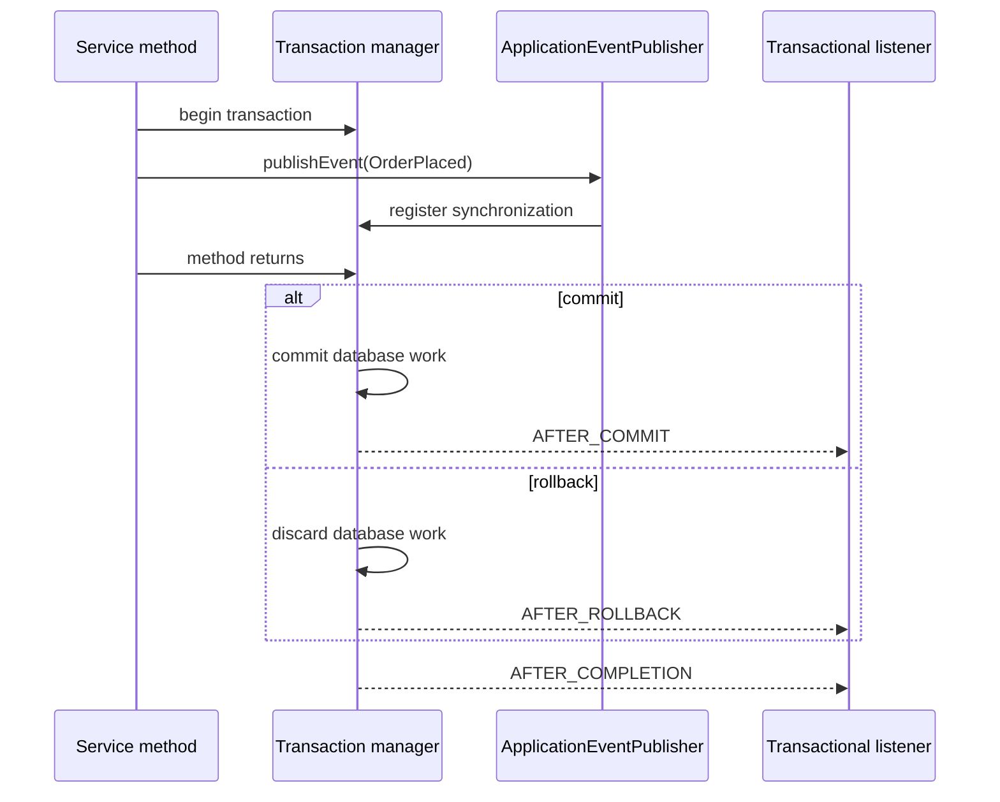
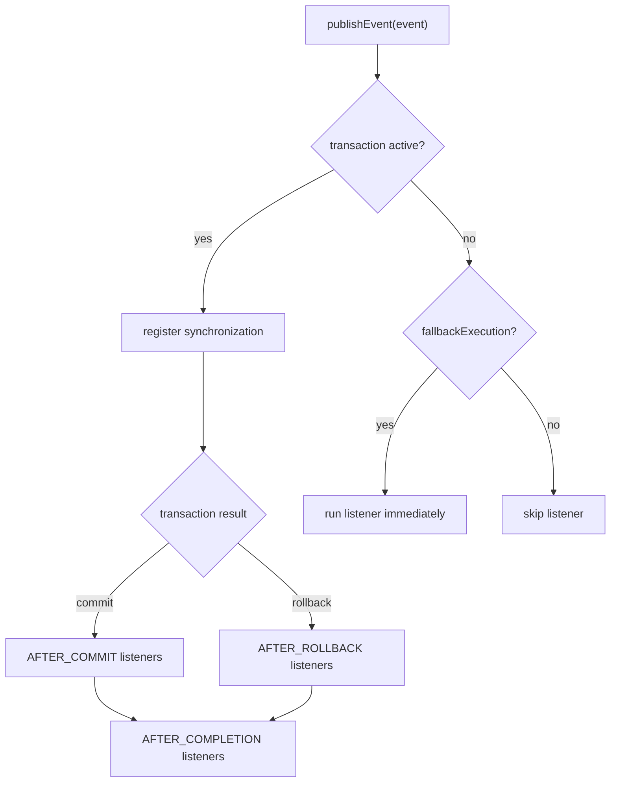

# @TransactionalEventListener after commit and rollback

## Intuition

`@TransactionalEventListener` answers a very common production question: "How do I do this side effect only if the database transaction really commits?" You publish an application event inside a `@Transactional` method, and Spring delays the listener until a transaction phase such as `AFTER_COMMIT` or `AFTER_ROLLBACK`.

Kitchen analogy: the service method is the kitchen preparing an order, the database commit is the cashier confirming payment, and the listener is the runner who sends the receipt. You do not send the receipt while the cook is still deciding whether the order will be cancelled.

This topic builds on how the [transactional proxy](topic:spring-transactional-proxy) opens and finishes the transaction, and on the [rollback rules](topic:spring-transactional-rollback) that decide whether the method commits or rolls back.

## The basic shape

```java
@Service
class OrderService {
    private final ApplicationEventPublisher publisher;

    @Transactional
    public void placeOrder(Order order) {
        orderRepository.save(order);
        publisher.publishEvent(new OrderPlaced(order.id()));
    }
}

@Component
class ReceiptListener {
    @TransactionalEventListener(phase = TransactionPhase.AFTER_COMMIT)
    public void sendReceipt(OrderPlaced event) {
        emailClient.sendReceipt(event.orderId());
    }
}
```

`publishEvent` is still called inside the transaction, but the listener does not run immediately. Spring registers a transaction synchronization and invokes the listener when the chosen phase arrives.

Post office analogy: writing the event is like putting a stamped envelope in the outgoing tray, but the clerk only hands it to the courier after the payment receipt is printed.

## Lifecycle



`AFTER_COMMIT` is the default. It is the usual choice for notifications, cache invalidation, search indexing requests, and other work that should happen only after durable data exists.

Kitchen analogy: send the waiter only after the cashier says "paid"; before that, the plate might still be removed from the order.

`AFTER_ROLLBACK` runs only when the transaction rolls back. It is useful for compensation, audit, or releasing non-transactional reservations that were made during the attempt.

Traffic analogy: if a road booking is cancelled, the traffic controller removes the temporary cone instead of opening the lane.

`AFTER_COMPLETION` runs after both commit and rollback. Use it for cleanup that does not care about the outcome, or for logging that records the final status.

Kitchen analogy: wipe the counter after the order is either served or cancelled.

`BEFORE_COMMIT` runs before the commit is finalized. If it throws, the transaction can still roll back. Use it only for checks that must be part of the transaction boundary, because it can turn a nearly finished order back into a cancelled order.

Kitchen analogy: the final chef check can still stop the dish before it leaves the kitchen.

## Phase decision



By default, if there is no active transaction, a `@TransactionalEventListener` is not invoked. Setting `fallbackExecution = true` makes it run immediately without waiting for a commit.

Post office analogy: if there is no official order ticket, the clerk either refuses to process the envelope, or with `fallbackExecution` treats it as a walk-in request.

## Important boundary after commit

An `AFTER_COMMIT` listener runs after the original transaction has committed. That means an exception from the listener cannot roll back the database changes that already committed. If the listener must write its own database row, use a new transaction, commonly `@Transactional(propagation = REQUIRES_NEW)`.

Kitchen analogy: once the customer has paid and left with the receipt, a printer jam at the back desk cannot un-pay the meal. If the back desk needs its own record, it needs a separate ledger entry.

Do not treat `@TransactionalEventListener` as a complete reliability mechanism for external systems. If a process crashes after the database commit but before a message reaches Kafka, RabbitMQ, or an email provider, the event can still be lost. For reliable external delivery, use the [Outbox pattern](topic:outbox-pattern): store the outgoing message in the same transaction, then let a separate publisher retry it.

Post office analogy: handing a letter to one clerk after payment is convenient, but an outbox ledger is the durable clipboard that proves which letters still need delivery.

This matters for [ACID](topic:acid-principles): the database transaction can make database changes atomic, but it cannot make a database commit and a remote HTTP call one atomic operation.

## Async caveat

You can combine a transactional event listener with async execution, but the original transaction context does not magically move to another thread. If you use `@Async`, reason about proxies and thread boundaries the same way as in [@Async and self-invocation](topic:spring-async-self-invocation).

Traffic analogy: after the dispatcher sends a courier onto another road, the courier no longer shares the original traffic light timing.

## 60-second interview answer

Use `ApplicationEventPublisher` inside the `@Transactional` method and handle the event with `@TransactionalEventListener`. The default phase is `AFTER_COMMIT`, so the listener runs only after the transaction commits. Use `phase = AFTER_ROLLBACK` for rollback-only compensation, `AFTER_COMPLETION` for cleanup after either outcome, and `BEFORE_COMMIT` only when the listener must participate before the final commit decision. If there is no active transaction, the listener is skipped unless `fallbackExecution = true`. An `AFTER_COMMIT` listener cannot roll back the already committed transaction; if it writes to the database, use a new transaction, and if it publishes reliable external messages, prefer the Outbox pattern.

## Production relevance

Use it for cache eviction after commit, email or notification triggers, search-index refresh requests, audit hooks, and domain events inside one Spring application.

Kitchen analogy: these are all "do it after the order is confirmed" tasks, not tasks that should run while the cook is still changing the recipe.

Keep the listener small. If it calls a slow external system, consider queueing work or using an outbox rather than blocking the commit path with a long side effect.

Traffic analogy: do not park a delivery truck in the checkout lane; move the job to a loading bay.

## Common misconceptions

- "`publishEvent` after `save` means the database is already committed." No. Inside a `@Transactional` method, data is usually staged until the method exits and the proxy commits.
- "`@TransactionalEventListener` always runs." No. Without an active transaction it is skipped unless `fallbackExecution = true`.
- "`AFTER_COMMIT` failures roll back the order." No. They happen after commit. Use retry, a new transaction, or an outbox depending on the required guarantee.
- "`BEFORE_COMMIT` is safer for side effects." Usually no. It can still roll back the transaction and may execute work that should not happen until data is durable.
- "`AFTER_ROLLBACK` is for undoing database writes." The database transaction already discarded its staged writes. Use it for non-transactional cleanup or compensation.
- "`@TransactionalEventListener` replaces messaging reliability." No. It is a timing hook inside Spring, not a durable message broker.
