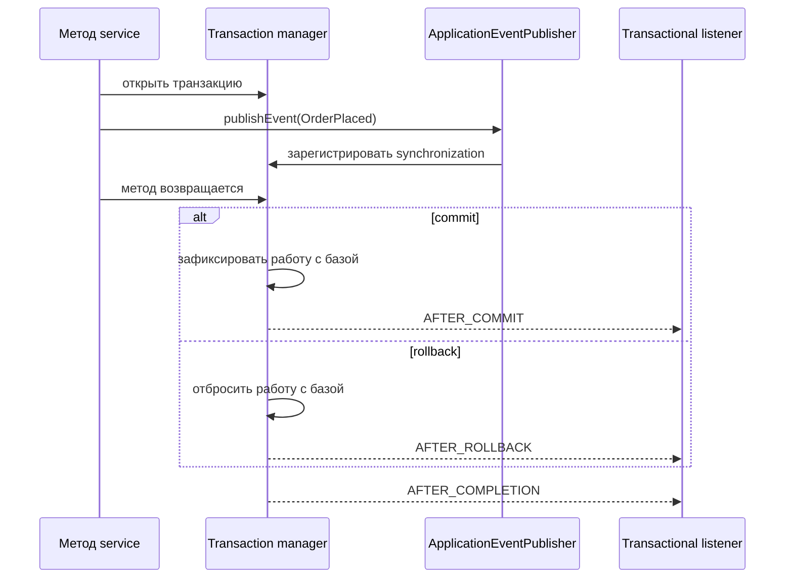
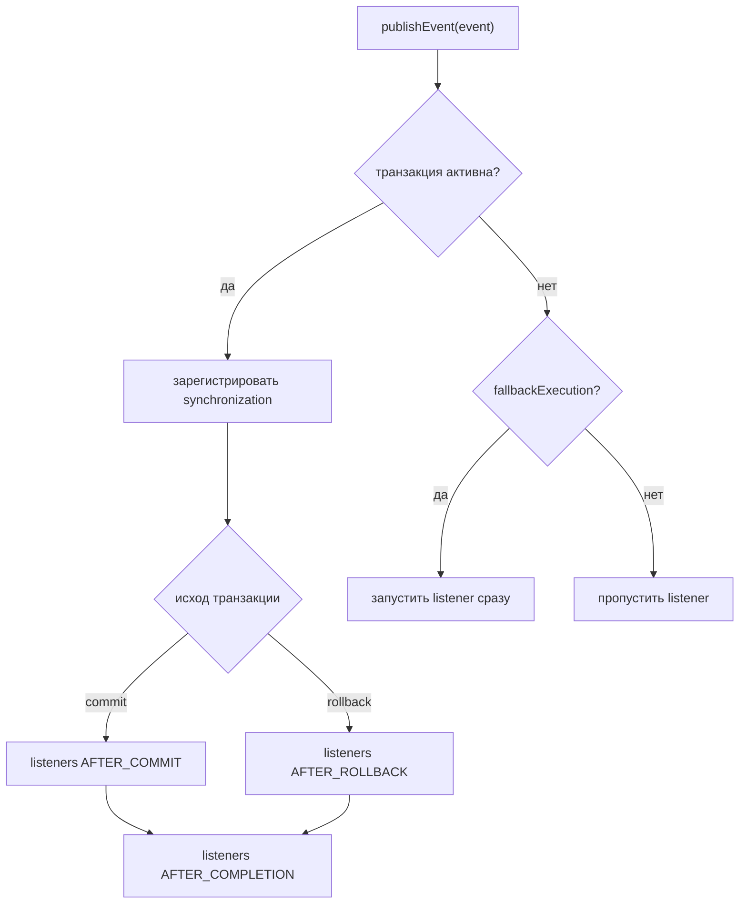

# @TransactionalEventListener после commit и rollback

## Интуиция

`@TransactionalEventListener` отвечает на частый production-вопрос: «Как выполнить побочное действие только если транзакция базы действительно сделала commit?» Ты публикуешь application event внутри `@Transactional` метода, а Spring откладывает listener до фазы транзакции, например `AFTER_COMMIT` или `AFTER_ROLLBACK`.

Аналогия с кухней: service method - это кухня, которая готовит заказ, database commit - касса, которая подтверждает оплату, а listener - сотрудник, который отправляет чек. Чек не отправляют, пока повар ещё решает, не будет ли заказ отменён.

Эта тема опирается на то, как [transactional proxy](topic:spring-transactional-proxy) открывает и завершает транзакцию, и на [правила rollback](topic:spring-transactional-rollback), которые решают, будет commit или rollback.

## Базовая форма

```java
@Service
class OrderService {
    private final ApplicationEventPublisher publisher;

    @Transactional
    public void placeOrder(Order order) {
        orderRepository.save(order);
        publisher.publishEvent(new OrderPlaced(order.id()));
    }
}

@Component
class ReceiptListener {
    @TransactionalEventListener(phase = TransactionPhase.AFTER_COMMIT)
    public void sendReceipt(OrderPlaced event) {
        emailClient.sendReceipt(event.orderId());
    }
}
```

`publishEvent` всё ещё вызывается внутри транзакции, но listener не выполняется сразу. Spring регистрирует transaction synchronization и вызывает listener, когда наступает выбранная фаза.

Аналогия с почтой: запись event похожа на конверт в лотке исходящих, но сотрудник отдаёт его курьеру только после того, как напечатан чек оплаты.

## Жизненный цикл



`AFTER_COMMIT` - фаза по умолчанию. Обычно её выбирают для уведомлений, инвалидации кеша, запросов на обновление поискового индекса и другой работы, которая должна происходить только после появления durable data.

Аналогия с кухней: отправляй официанта только после того, как касса сказала «оплачено»; до этого тарелку ещё могут убрать из заказа.

`AFTER_ROLLBACK` выполняется только при rollback транзакции. Он полезен для компенсации, аудита или освобождения нетранзакционных резервов, созданных во время попытки.

Аналогия с дорожным движением: если бронь дороги отменили, диспетчер убирает временный конус вместо того, чтобы открывать полосу.

`AFTER_COMPLETION` выполняется после commit и после rollback. Используй его для очистки, которой не важен исход, или для логирования финального статуса.

Аналогия с кухней: протри стол после того, как заказ либо выдали, либо отменили.

`BEFORE_COMMIT` выполняется до финального commit. Если он бросит exception, транзакция ещё может откатиться. Используй его только для проверок, которые должны входить в границу транзакции, потому что он может превратить почти готовый заказ в отменённый.

Аналогия с кухней: финальная проверка шефа всё ещё может остановить блюдо до выхода из кухни.

## Выбор фазы



По умолчанию, если активной транзакции нет, `@TransactionalEventListener` не вызывается. Настройка `fallbackExecution = true` заставляет его выполниться сразу, не дожидаясь commit.

Аналогия с почтой: если официального талона заказа нет, сотрудник либо отказывается обрабатывать конверт, либо с `fallbackExecution` принимает его как обращение без очереди.

## Важная граница после commit

Listener `AFTER_COMMIT` выполняется после commit исходной транзакции. Значит, exception из listener уже не может откатить изменения базы, которые были зафиксированы. Если listener должен записать собственную строку в базу, используй новую транзакцию, часто `@Transactional(propagation = REQUIRES_NEW)`.

Аналогия с кухней: когда клиент уже оплатил и ушёл с чеком, замятие бумаги на принтере в подсобке не может отменить оплату обеда. Если подсобке нужна своя запись, ей нужен отдельный журнал.

Не считай `@TransactionalEventListener` полноценным механизмом надёжности для внешних систем. Если процесс упадёт после database commit, но до отправки сообщения в Kafka, RabbitMQ или email provider, event всё ещё может потеряться. Для надёжной внешней доставки используй [Outbox pattern](topic:outbox-pattern): сохрани исходящее сообщение в той же транзакции, а отдельный publisher пусть повторяет отправку.

Аналогия с почтой: передать письмо одному сотруднику после оплаты удобно, но outbox-журнал - это прочный планшет, где видно, какие письма ещё надо доставить.

Это важно для [ACID](topic:acid-principles): транзакция базы может сделать изменения базы атомарными, но не может сделать database commit и удалённый HTTP-вызов одной атомарной операцией.

## Async-оговорка

Transactional event listener можно совместить с async-выполнением, но исходный transaction context не переносится в другой поток автоматически. Если используешь `@Async`, учитывай proxy и границы потоков так же, как в теме [@Async and self-invocation](topic:spring-async-self-invocation).

Аналогия с дорожным движением: после того как диспетчер отправил курьера на другую дорогу, курьер уже не живёт по сигналу исходного светофора.

## Ответ на собеседовании за 60 секунд

Используй `ApplicationEventPublisher` внутри `@Transactional` метода и обработай event через `@TransactionalEventListener`. Фаза по умолчанию - `AFTER_COMMIT`, поэтому listener запускается только после commit транзакции. Используй `phase = AFTER_ROLLBACK` для компенсации только при rollback, `AFTER_COMPLETION` для очистки после любого исхода и `BEFORE_COMMIT` только когда listener должен участвовать до финального решения о commit. Если активной транзакции нет, listener пропускается, если не включён `fallbackExecution = true`. Listener `AFTER_COMMIT` не может откатить уже зафиксированную транзакцию; если он пишет в базу, используй новую транзакцию, а для надёжной публикации внешних сообщений предпочитай Outbox pattern.

## Практическая польза

Используй это для удаления кеша после commit, триггеров email или уведомлений, запросов на обновление поискового индекса, audit hooks и domain events внутри одного Spring-приложения.

Аналогия с кухней: это задачи «сделать после подтверждения заказа», а не задачи, которые должны выполняться, пока повар ещё меняет рецепт.

Держи listener маленьким. Если он вызывает медленную внешнюю систему, лучше поставить работу в очередь или использовать outbox, а не блокировать путь commit долгим побочным действием.

Аналогия с дорожным движением: не ставь грузовик доставки прямо в кассовый проезд; перенеси работу на погрузочную площадку.

## Частые заблуждения

- «`publishEvent` после `save` означает, что база уже сделала commit». Нет. Внутри `@Transactional` метода данные обычно подготовлены, пока метод не завершится и proxy не выполнит commit.
- «`@TransactionalEventListener` всегда запускается». Нет. Без активной транзакции он пропускается, если не включён `fallbackExecution = true`.
- «Ошибки `AFTER_COMMIT` откатывают заказ». Нет. Они происходят после commit. Используй retry, новую транзакцию или outbox в зависимости от нужной гарантии.
- «`BEFORE_COMMIT` безопаснее для побочных действий». Обычно нет. Он всё ещё может откатить транзакцию и может выполнить работу, которую нельзя делать до durable data.
- «`AFTER_ROLLBACK` нужен, чтобы отменять записи базы». Транзакция базы уже отбросила подготовленные записи. Используй его для нетранзакционной очистки или компенсации.
- «`@TransactionalEventListener` заменяет надёжность messaging». Нет. Это timing hook внутри Spring, а не durable message broker.
