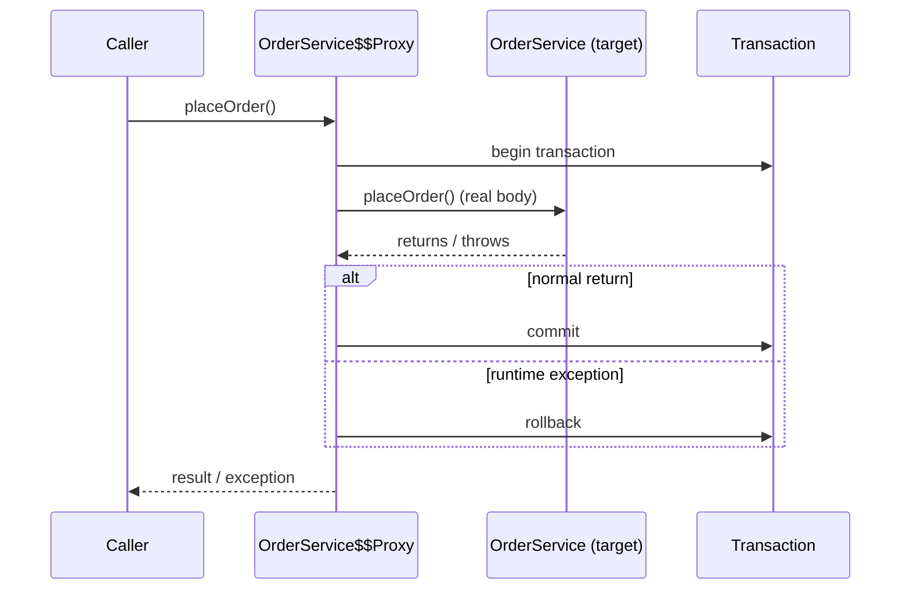
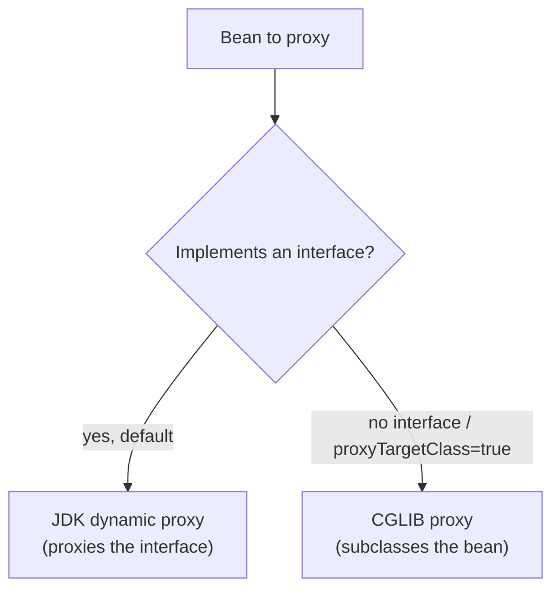

# How @Transactional Works (Proxy / AOP)

## The intuition

`@Transactional` lets you say *"run this method inside a database transaction"*
without writing a single `connection.commit()` or `connection.rollback()`. You
annotate the method; Spring takes care of opening the transaction before it runs
and deciding whether to commit or roll back when it finishes.

Think of a **restaurant kitchen with a pass**. The cook (your method) just
prepares the dish; a *waiter at the pass* checks every plate before it leaves the
kitchen and after it comes back. You never carry your own plate to the table —
the waiter does. `@Transactional` is that waiter: a layer that wraps your method,
starts the "order" before you cook, and either sends the dish out (commit) or
throws it away (rollback) based on what happened.

That waiter is the **proxy**.

## How Spring builds the proxy

At startup, when Spring finds a bean with `@Transactional` (anywhere on the class
or its methods), it does not register your plain object. Instead it registers a
**proxy** — a generated object that wraps your bean and adds the transaction
logic around each call. Every place that injects the bean receives the proxy, not
the raw instance.

It's like hiring a new cook and immediately assigning them a personal waiter:
from then on, every order to that cook goes *through* the waiter. Nobody in the
restaurant ever talks to the cook directly.



Spring picks one of two proxy mechanisms — two styles of waiter:



- A **JDK dynamic proxy** implements the same *interface* as your bean and
  forwards calls to the target. Like a waiter who only knows the printed menu
  (the interface): they can take any order on the menu and pass it to the cook.
- A **CGLIB proxy** generates a *subclass* of your bean at runtime and overrides
  its methods. Like a stand-in cook who looks exactly like the real one and
  intercepts each dish. Spring Boot uses CGLIB by default
  (`proxyTargetClass=true`).

## What happens on a call

When a call arrives at the proxy, a transaction interceptor runs around the real
method:

1. **Open** — read the transaction settings and start (or join) a transaction
   before the body runs. The waiter opens an order ticket before the cook starts.
2. **Proceed** — invoke the real method body on the target object.
3. **Decide** — when the body returns normally, **commit**; if it throws a
   runtime exception (or `Error`), **roll back**. The waiter inspects the plate:
   serve it, or scrape it into the bin.

The exact commit/rollback rules (which exceptions roll back, `rollbackFor`,
propagation) are a topic of their own — see
[@Transactional Rollback Rules](topic:spring-transactional-rollback). Here the
key point is simply *where* that decision is made: in the proxy, **around** your
method, never inside it.

## The self-invocation trap

Because all the magic lives in the proxy, it only works for calls that actually
**go through** the proxy. The most famous trap:

```java
@Service
class UserService {
    public void register(User u) {
        this.saveUser(u);          // internal call — straight to the target!
    }
    @Transactional
    public void saveUser(User u) { /* ... */ }
}
```

`register()` calls `this.saveUser()`. `this` is the **raw target object**, not
the proxy, so the call never passes the waiter — `saveUser()` runs with **no
transaction at all**, and the annotation is silently ignored. It's like the cook
handing a plate directly to a colleague through the back door: the waiter at the
pass never sees it, so none of the checks happen.

The same reason explains two more rules:

- `@Transactional` on a **private** method does nothing — the proxy can only
  intercept calls it receives from outside, and you can't call a private method
  from outside.
- With a **CGLIB** proxy, `final` methods (and `final` classes) can't be
  overridden, so they can't be advised either.

Fixes: call the method through the proxy — split it into a *different* bean and
inject that, or inject a self-reference to the proxy, or use
`AopContext.currentProxy()`. The rule of thumb: **a transaction boundary must be
crossed from the outside.** This is the exact same proxy limitation behind
[@Async and Self-Invocation](topic:spring-async-self-invocation).

## 60-second interview answer

`@Transactional` declares that a method should run inside a database
transaction, so you don't manage commit/rollback by hand. Spring implements it
with **AOP**: at startup it wraps the bean in a **proxy** (a JDK dynamic proxy if
the bean has an interface, otherwise a CGLIB subclass; Spring Boot defaults to
CGLIB). Callers get the proxy, not the bean. When a `@Transactional` method is
called through the proxy, a transaction interceptor **opens** a transaction
before the body, lets the body run, and **commits** on normal return or **rolls
back** on a runtime exception. Because the logic lives in the proxy, calls that
bypass it get no transaction: internal `this.method()` self-invocations, `private`
methods, and (with CGLIB) `final` methods are not advised. The fix is to make the
call cross the proxy — for example by moving the transactional method to another
bean.

## Common traps and misconceptions

- **"The annotation alone makes it transactional."** No — the *proxy* does. If
  the call doesn't go through the proxy, the annotation does nothing.
- **Self-invocation.** `this.transactionalMethod()` bypasses the proxy. Most
  common cause of "my `@Transactional` is ignored".
- **`private` / `final` methods.** Can't be intercepted. Keep transactional
  methods `public` (and non-`final` under CGLIB).
- **`new MyService()`.** A hand-created object is not a Spring bean, so it has no
  proxy and `@Transactional` is inert. Only container-managed beans are proxied.
- **Commit happens at method exit, not at `persist`.** Staged changes become
  durable only when the proxy commits as the transactional method returns.
- **A swallowed exception won't roll back.** The exception must *leave* the
  method for the proxy to see it; if you catch it inside, the proxy commits.
- **JDK vs CGLIB.** JDK proxies require an interface and only intercept
  interface methods; CGLIB subclasses the class and can't proxy `final`.
