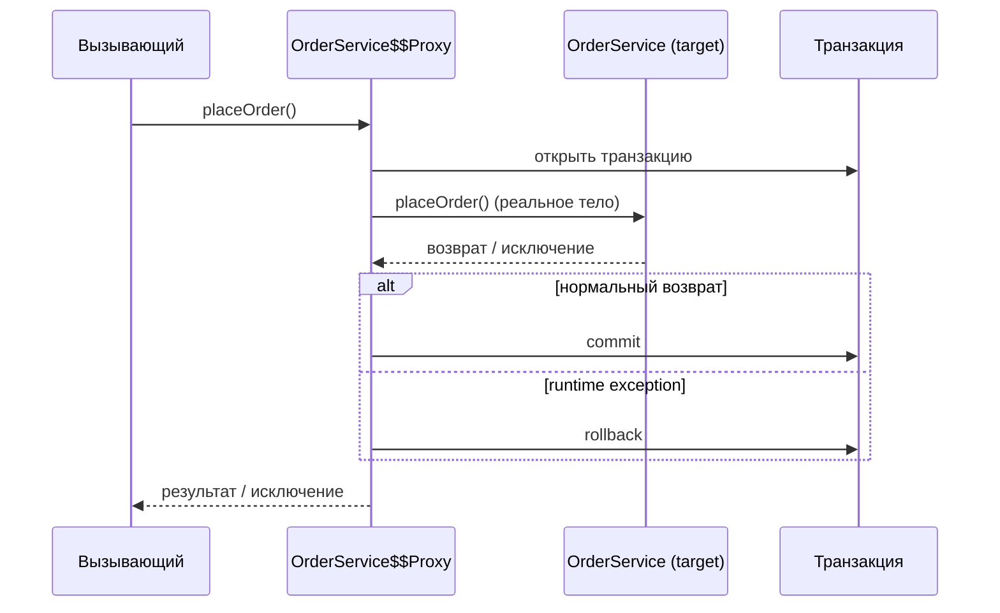
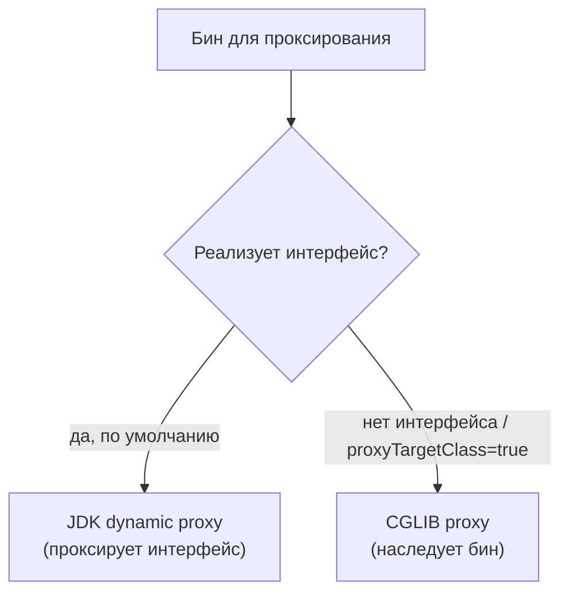

# Как работает @Transactional (Proxy / AOP)

## Интуиция

`@Transactional` позволяет сказать *«выполни этот метод внутри транзакции базы
данных»*, не написав ни одного `connection.commit()` или
`connection.rollback()`. Вы помечаете метод аннотацией; Spring сам открывает
транзакцию перед его выполнением и решает, зафиксировать её или откатить, когда
метод завершится.

Представьте **кухню ресторана с раздачей (пасом)**. Повар (ваш метод) просто
готовит блюдо; *официант на раздаче* проверяет каждую тарелку перед тем, как она
покинет кухню, и после того, как вернётся. Вы никогда не несёте свою тарелку к
столу сами — это делает официант. `@Transactional` и есть этот официант: слой,
который оборачивает ваш метод, открывает «заказ» до того, как вы начнёте
готовить, и либо отправляет блюдо в зал (commit), либо выбрасывает его
(rollback) в зависимости от того, что произошло.

Этот официант — и есть **proxy**.

## Как Spring строит proxy

На старте, когда Spring находит бин с `@Transactional` (на классе или его
методах), он регистрирует не ваш обычный объект, а **proxy** — сгенерированный
объект, который оборачивает ваш бин и добавляет транзакционную логику вокруг
каждого вызова. Везде, где внедряется бин, попадает proxy, а не сам экземпляр.

Это как нанять нового повара и сразу приставить к нему личного официанта: с этого
момента каждый заказ к повару идёт *через* официанта. Никто в ресторане не
разговаривает с поваром напрямую.



Spring выбирает один из двух механизмов proxy — два стиля официанта:



- **JDK dynamic proxy** реализует тот же *интерфейс*, что и ваш бин, и
  перенаправляет вызовы целевому объекту. Как официант, который знает только
  напечатанное меню (интерфейс): он может принять любой заказ из меню и передать
  его повару.
- **CGLIB proxy** генерирует во время выполнения *подкласс* вашего бина и
  переопределяет его методы. Как дублёр повара, который выглядит точно так же,
  как настоящий, и перехватывает каждое блюдо. Spring Boot по умолчанию использует
  CGLIB (`proxyTargetClass=true`).

## Что происходит при вызове

Когда вызов приходит в proxy, вокруг реального метода выполняется transaction
interceptor:

1. **Открыть** — прочитать настройки транзакции и начать (или присоединиться к)
   транзакцию до выполнения тела. Официант открывает тикет заказа до того, как
   повар начнёт готовить.
2. **Выполнить** — вызвать реальное тело метода на целевом объекте.
3. **Решить** — если тело завершилось нормально, **commit**; если оно бросило
   runtime exception (или `Error`), **rollback**. Официант осматривает тарелку:
   подать её или соскрести в мусор.

Точные правила commit/rollback (какие исключения откатывают, `rollbackFor`,
propagation) — отдельная тема, см.
[Правила отката @Transactional](topic:spring-transactional-rollback). Здесь
ключевой момент — просто *где* принимается это решение: в proxy, **вокруг**
вашего метода, а не внутри него.

## Ловушка self-invocation

Поскольку вся магия живёт в proxy, она работает только для вызовов, которые
действительно **проходят через** proxy. Самая известная ловушка:

```java
@Service
class UserService {
    public void register(User u) {
        this.saveUser(u);          // внутренний вызов — прямо в target!
    }
    @Transactional
    public void saveUser(User u) { /* ... */ }
}
```

`register()` вызывает `this.saveUser()`. `this` — это **сам целевой объект**, а
не proxy, поэтому вызов не проходит мимо официанта — `saveUser()` выполняется
**вообще без транзакции**, и аннотация молча игнорируется. Это как если бы повар
передал тарелку коллеге напрямую через заднюю дверь: официант на раздаче её не
видит, поэтому ни одна проверка не выполняется.

Та же причина объясняет ещё два правила:

- `@Transactional` на **private** методе ничего не делает — proxy может
  перехватить только вызовы, которые получает извне, а private метод нельзя
  вызвать снаружи.
- С **CGLIB** proxy `final` методы (и `final` классы) нельзя переопределить,
  поэтому их тоже нельзя обернуть advice.

Решения: вызывайте метод через proxy — вынесите его в *другой* бин и внедрите
его, либо внедрите self-ссылку на proxy, либо используйте
`AopContext.currentProxy()`. Правило: **границу транзакции нужно пересекать
снаружи.** За этим стоит то же ограничение proxy, что и в теме
[@Async и self-invocation](topic:spring-async-self-invocation).

## Ответ за 60 секунд

`@Transactional` объявляет, что метод должен выполняться внутри транзакции базы
данных, чтобы вы не управляли commit/rollback вручную. Spring реализует это через
**AOP**: на старте он оборачивает бин в **proxy** (JDK dynamic proxy, если у бина
есть интерфейс, иначе CGLIB-подкласс; Spring Boot по умолчанию использует CGLIB).
Вызывающие получают proxy, а не бин. Когда `@Transactional` метод вызывается через
proxy, transaction interceptor **открывает** транзакцию перед телом, даёт телу
выполниться и делает **commit** при нормальном возврате или **rollback** при
runtime exception. Поскольку логика живёт в proxy, вызовы, которые его обходят, не
получают транзакции: внутренние self-invocation `this.method()`, `private` методы
и (при CGLIB) `final` методы не обрабатываются. Решение — заставить вызов пройти
через proxy, например вынести транзакционный метод в другой бин.

## Частые ловушки и заблуждения

- **«Одна аннотация делает метод транзакционным».** Нет — это делает *proxy*.
  Если вызов не проходит через proxy, аннотация ничего не даёт.
- **Self-invocation.** `this.transactionalMethod()` обходит proxy. Самая частая
  причина «мой `@Transactional` игнорируется».
- **`private` / `final` методы.** Их нельзя перехватить. Держите транзакционные
  методы `public` (и не `final` под CGLIB).
- **`new MyService()`.** Созданный вручную объект не является бином Spring,
  поэтому у него нет proxy и `@Transactional` бездействует. Проксируются только
  бины, управляемые контейнером.
- **Commit происходит на выходе из метода, а не на `persist`.** Подготовленные
  изменения становятся сохранёнными только когда proxy делает commit при возврате
  транзакционного метода.
- **Проглоченное исключение не вызовет rollback.** Исключение должно *выйти* из
  метода, чтобы proxy его увидел; если вы перехватили его внутри, proxy сделает
  commit.
- **JDK против CGLIB.** JDK proxy требуют интерфейс и перехватывают только методы
  интерфейса; CGLIB наследует класс и не может проксировать `final`.
