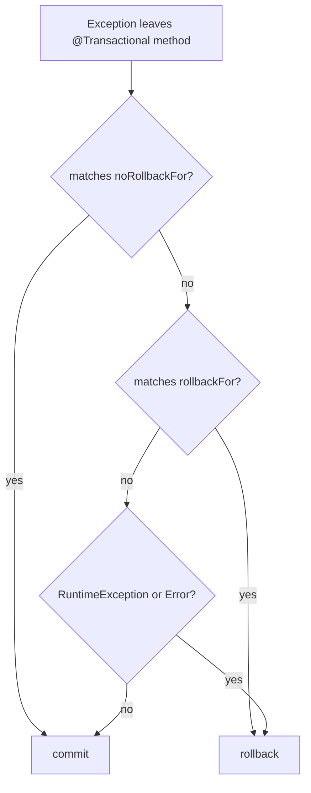
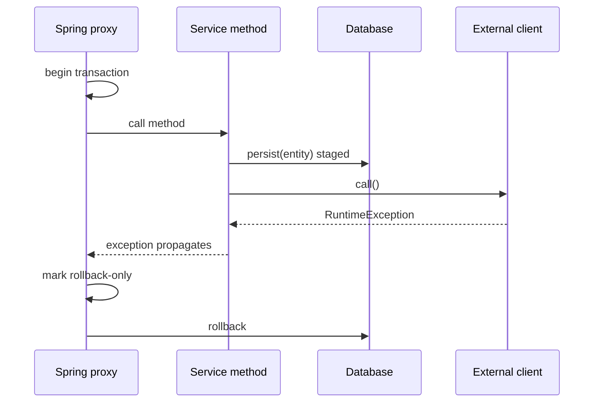

# @Transactional rollback rules

`@Transactional` is applied by a Spring proxy around your service method. The proxy opens a transaction before the method body runs, watches how the method exits, and then decides whether to commit or roll back. Think of a post office clerk holding your parcel in the back room: it is prepared for delivery, but it is not officially sent until the clerk stamps the final receipt.

`persist` does not mean "the row is already safe forever". In JPA it puts the entity into the persistence context, and SQL may be flushed before commit, but the database transaction can still roll it back. Kitchen analogy: the cook may place ingredients in the pan, but the dish is not served until the order leaves the pass.

## Default rule

Spring rolls back by default on unchecked failures: `RuntimeException` and `Error`. Checked exceptions do not roll back by default. This is a historical Spring convention: unchecked exceptions usually mean programming or infrastructure failure, while checked exceptions often represent expected business flows that old Java APIs forced callers to declare. Post office analogy: a fire alarm cancels the shipment automatically; a normal paperwork note does not cancel it unless the clerk has a special instruction.

You change the rule with annotation attributes:

```java
@Transactional(rollbackFor = IOException.class)
public void importReport() throws IOException { ... }
```

`rollbackFor` says "this exception type should roll back too". `noRollbackFor` does the opposite for an exception that would otherwise roll back. The nearest mental model is a checklist on the counter: default office policy exists, but a named instruction can override it.



## What happens after persist and an external failure?

If the external call happens inside the same `@Transactional` method after `persist`, and it throws a `RuntimeException` that propagates out of the method, the transaction rolls back by default. The earlier `persist` is only staged work, so it is discarded. Traffic analogy: the car has entered the toll lane, but if the barrier reports a system failure before the receipt is printed, the whole crossing is cancelled.

If the external call throws a checked exception, Spring commits by default unless you configured `rollbackFor` for that checked exception. The same lane needs an explicit "cancel on this paperwork problem" rule.

If the transactional method already returned and committed, a later external failure is outside that transaction and cannot roll it back. For reliable "database change + notify another system" flows, consider patterns such as the [Outbox pattern](topic:outbox-pattern). This is connected to [ACID](topic:acid-principles): a local transaction can atomically protect local database work, not magically undo a later call to a different system.



## 60-second interview answer

By default Spring `@Transactional` rolls back on unchecked exceptions: `RuntimeException` and `Error`. It does not roll back on checked exceptions unless you configure it, usually with `rollbackFor = SomeCheckedException.class`. You can also use `noRollbackFor` to prevent rollback for a specific exception. The decision is made by the transaction interceptor when the exception propagates out of the proxied method. If the method calls `persist` and then an external client throws a runtime exception before the method returns, the transaction rolls back and the persisted entity is not committed. If the exception is checked, it commits by default unless `rollbackFor` matches. If the external failure happens after the transactional method already committed, it cannot roll back that finished transaction.

## Production relevance

This matters in payment, email, file import, and messaging code. A service often saves a row and then calls something else. Keep the transactional boundary clear: local database state is protected until commit; external systems are not part of that local transaction unless you use a proper distributed protocol, and most applications avoid that. In kitchen terms, the order ticket and the plate can be coordinated inside one kitchen, but a courier outside the building needs a separate reliability plan.

For external effects, avoid "save row, then call remote service" when a crash can leave the world inconsistent. Often the safer design is to commit a durable local intent and let a worker publish or call later, which is exactly the idea behind the [Outbox pattern](topic:outbox-pattern).

## Common misconceptions

- "`persist` already committed the row." Not true. It may be managed or flushed, but the transaction can still roll back. Like a stamped parcel draft, it is not final until the clerk closes the transaction.
- "Any exception rolls back." Not true. Checked exceptions commit by default unless `rollbackFor` matches.
- "Catching and logging an exception still rolls back." Not by default. If the method returns normally, Spring sees success unless you rethrow, mark rollback-only, or use another transaction API.
- "An external failure after the method returns can undo the database." No. Once commit is done, a later failure is a new problem, not a rollback trigger.
- "`@Transactional` works on every method call." It is proxy-based in common Spring usage, so self-invocation inside the same class can bypass the proxy and therefore bypass transaction advice.
