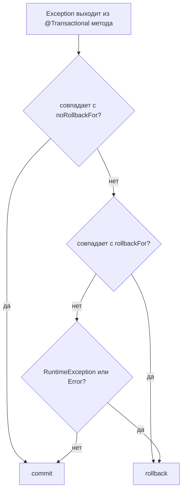
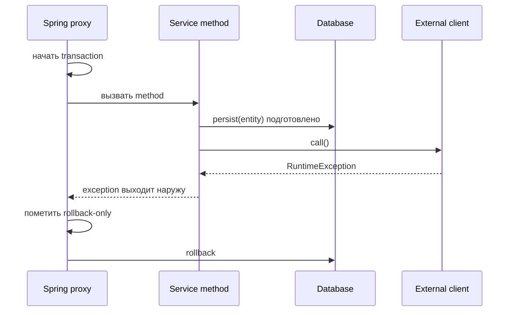

# Правила отката @Transactional

`@Transactional` применяется Spring proxy вокруг метода сервиса. Proxy открывает транзакцию до выполнения тела метода, смотрит, как метод завершился, и затем решает: commit или rollback. Представь сотрудника почты, который держит посылку в подсобке: она подготовлена к отправке, но официально не ушла, пока сотрудник не поставил финальную печать.

`persist` не означает «строка уже сохранена навсегда». В JPA он помещает entity в persistence context, а SQL может быть отправлен во время flush до commit, но database transaction всё ещё может это откатить. Аналогия с кухней: повар уже положил ингредиенты на сковороду, но блюдо не подано, пока заказ не вышел на выдачу.

## Правило по умолчанию

Spring по умолчанию откатывается на unchecked failures: `RuntimeException` и `Error`. Checked exceptions по умолчанию rollback не запускают. Это историческая договорённость Spring: unchecked exceptions обычно означают ошибку программирования или инфраструктуры, а checked exceptions часто описывают ожидаемые бизнес-сценарии, которые старые Java API заставляли объявлять. Почтовая аналогия: пожарная тревога автоматически отменяет отправку; обычная бумажная пометка не отменяет её, если у сотрудника нет специальной инструкции.

Правило меняют атрибутами аннотации:

```java
@Transactional(rollbackFor = IOException.class)
public void importReport() throws IOException { ... }
```

`rollbackFor` говорит: «этот тип exception тоже должен откатывать». `noRollbackFor` делает обратное для exception, который иначе откатил бы транзакцию. Ментальная модель: чеклист на стойке. Есть общее правило отделения, но именная инструкция может его переопределить.



## Что происходит после persist и внешней ошибки?

Если внешний вызов происходит внутри того же `@Transactional` метода после `persist` и бросает `RuntimeException`, который выходит наружу из метода, транзакция по умолчанию откатывается. Предыдущий `persist` был только подготовленной работой, поэтому он отбрасывается. Дорожная аналогия: машина уже заехала в платную полосу, но если шлагбаум сообщает о системной ошибке до печати чека, весь проезд отменяется.

Если внешний вызов бросает checked exception, Spring по умолчанию зафиксирует транзакцию, если для этого checked exception не настроен `rollbackFor`. Для такой ситуации на той же полосе нужно явное правило «отменять при этой бумажной проблеме».

Если transactional метод уже вернулся и commit завершён, более поздняя внешняя ошибка находится вне этой транзакции и не может её откатить. Для надёжных сценариев «изменить базу + уведомить другую систему» стоит рассмотреть паттерны вроде [Outbox pattern](topic:outbox-pattern). Это связано с [ACID](topic:acid-principles): локальная транзакция атомарно защищает локальную работу с базой, но не умеет магически отменять более поздний вызов другой системы.



## Ответ за 60 секунд

По умолчанию Spring `@Transactional` откатывается на unchecked exceptions: `RuntimeException` и `Error`. На checked exceptions он не откатывается, если это явно не настроено, обычно через `rollbackFor = SomeCheckedException.class`. Также можно использовать `noRollbackFor`, чтобы запретить rollback для конкретного exception. Решение принимает transaction interceptor, когда exception выходит наружу из proxied метода. Если метод вызывает `persist`, а затем внешний клиент бросает runtime exception до возврата метода, транзакция откатывается и entity не коммитится. Если exception checked, по умолчанию будет commit, если не совпал `rollbackFor`. Если внешняя ошибка случилась после того, как transactional метод уже сделал commit, она не может откатить завершённую транзакцию.

## Практическая важность

Это важно в коде платежей, email, импорта файлов и messaging. Сервис часто сохраняет строку и затем вызывает что-то ещё. Границу транзакции нужно держать явной: локальное состояние базы защищено до commit; внешние системы не являются частью этой локальной транзакции, если вы не используете настоящий распределённый протокол, а большинство приложений его избегает. В кухонной аналогии талон заказа и тарелку можно согласовать внутри одной кухни, но курьер за пределами здания требует отдельного плана надёжности.

Для внешних эффектов опасно делать «сохранить строку, потом вызвать remote service», если сбой может оставить мир в несогласованном состоянии. Часто безопаснее зафиксировать durable local intent и дать worker опубликовать событие или вызвать сервис позже. Именно эту идею использует [Outbox pattern](topic:outbox-pattern).

## Частые заблуждения

- «`persist` уже закоммитил строку». Нет. Entity может быть managed или даже flushed, но transaction всё ещё может откатиться. Как черновик отправки посылки: он не финальный, пока сотрудник не закрыл операцию.
- «Любой exception откатывает». Нет. Checked exceptions по умолчанию фиксируют транзакцию, если не совпал `rollbackFor`.
- «Если поймать и залогировать exception, rollback всё равно будет». По умолчанию нет. Если метод вернулся нормально, Spring видит успех, если вы не rethrow, не пометили rollback-only и не использовали другой transaction API.
- «Внешняя ошибка после возврата метода может отменить базу». Нет. После commit более поздняя ошибка — это новая проблема, а не trigger для rollback.
- «`@Transactional` работает при любом вызове метода». В обычном Spring это proxy-based механизм, поэтому self-invocation внутри того же класса может обойти proxy и вместе с ним transaction advice.
