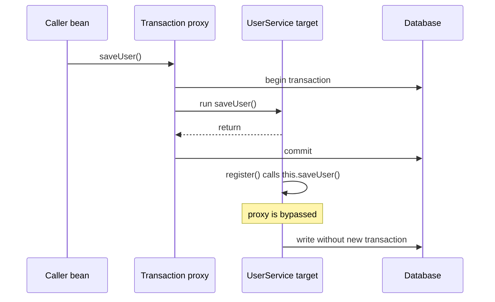
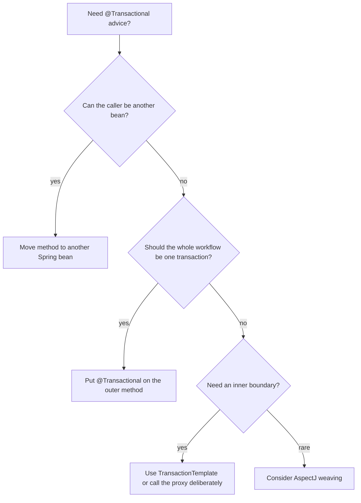

# @Transactional Self-Invocation

The short answer: **no transaction starts** when a non-transactional method calls
a `@Transactional` method of the same Spring bean through `this.method()`. The
annotation is still present, but the call never crosses the Spring proxy, so the
transaction interceptor never gets a chance to begin anything. Kitchen analogy:
the label on the dish says "check at the pass", but the cook hands the plate to
another cook through a side door, so the waiter at the pass never sees it.

This topic is a focused version of the broader proxy rule from
[How @Transactional Works (Proxy / AOP)](topic:spring-transactional-proxy). Spring
usually applies `@Transactional` with AOP proxying: callers receive a proxy, and
the proxy wraps the real method call with begin, commit, and rollback logic.
Post office analogy: customers do not walk into the sorting room; they hand the
parcel to the counter clerk, and the clerk adds tracking and routing.

## What actually happens

For a normal external call, another bean calls the transactional service through
the injected Spring reference. That reference is the proxy, so the interceptor
opens or joins a transaction before invoking the target method. Traffic analogy:
the car enters through the main toll gate, so the gate can lift the barrier and
record the trip.

For self-invocation, the first method is already running inside the target
object. When it calls `this.saveUser()`, Java dispatches a direct call on the same
object. The call does not go back out to the proxy and then in again. Traffic
analogy: a warehouse worker moves a package between two rooms inside the depot;
the street checkpoint outside cannot scan it.

```java
@Service
public class UserService {
    public void register(User user) {
        saveUser(user); // really this.saveUser(user)
    }

    @Transactional
    public void saveUser(User user) {
        // expected transaction boundary, but self-invocation bypasses the proxy
    }
}
```



The important nuance: if the outer method is not transactional, the inner
`@Transactional` method runs with **no transaction started by that annotation**.
If the outer method already had a transaction, the inner method may still run
inside that existing transaction, but its own annotation settings are not applied
because the interceptor was skipped. That means `REQUIRES_NEW`, `readOnly`,
timeout, isolation, and rollback rules on the inner method can be ignored.
Kitchen analogy: if the order ticket was already open, the next dish may still
belong to that ticket, but the special sticker on the second dish is never read.

## Why the proxy is the boundary

`@Transactional` is not a magic flag that the JVM checks before every method
call. It is metadata that Spring reads while creating beans. Spring then creates
an AOP proxy around eligible Spring-managed beans and puts transaction advice
around calls that enter through that proxy. The container mechanics are the same
world as [Spring IoC and Dependency Injection](topic:spring-ioc-di): the object
you inject is controlled by Spring. Post office analogy: the tracking system
works because the parcel entered through the official counter, not because the
box has handwriting on it.

Spring can use a JDK dynamic proxy or a CGLIB proxy. Spring Boot commonly uses
CGLIB class proxies by default, but that does not remove the self-invocation
limit in proxy-based AOP. The advice is still attached to proxy entry points, not
to every direct call made inside the target object. Traffic analogy: whether the
gate has a human operator or an automatic barrier, it still only sees cars that
drive through the gate.

The same proxy-boundary trap appears with other Spring features, such as
[@Async and Self-Invocation](topic:spring-async-self-invocation). The symptom is
different, but the shape is the same: framework behavior happens when a call
crosses the proxy. Kitchen analogy: the express oven and the transaction pass
are different stations, but both require the order to enter through the station.

## How to fix it

The cleanest fix is to move the transactional operation to another Spring bean
and inject that bean into the caller. The call now goes from one bean to another,
so it crosses the proxy and the transaction interceptor runs. Post office
analogy: the front desk hands the parcel to the official counter instead of
walking it around the counter.

```java
@Service
public class RegistrationService {
    private final UserWriter userWriter;

    public RegistrationService(UserWriter userWriter) {
        this.userWriter = userWriter;
    }

    public void register(User user) {
        userWriter.saveUser(user);
    }
}

@Service
public class UserWriter {
    @Transactional
    public void saveUser(User user) {
        // transaction starts when called through the proxy
    }
}
```

Another good fix is to put `@Transactional` on the outer method when the whole
workflow should be one transaction. This is not a workaround for an inner
`REQUIRES_NEW` boundary, but it is often the correct design when registration is
the actual unit of work. Restaurant analogy: if the whole table order must be
handled as one ticket, open the ticket at the table-order method, not halfway
through the kitchen.

When you truly need a transaction boundary inside the same class, use
`TransactionTemplate` or another programmatic transaction API. That makes the
boundary explicit in code and does not depend on a proxy call. Kitchen analogy:
instead of asking whether the plate crossed the pass, the cook opens a numbered
order envelope right at the workstation.

Self-injecting the bean's own proxy can work, especially through `@Lazy`,
`ObjectProvider`, or a separate interface, but it couples the service to proxy
mechanics and can create circular-dependency pressure. `AopContext.currentProxy()`
can also work when proxy exposure is enabled, but it is usually a last-resort
tool because it hides Spring infrastructure inside business code. Traffic
analogy: driving out of the warehouse and back through the checkpoint works, but
it is a strange route to build into every delivery instruction.

AspectJ weaving is another option. It weaves advice into the bytecode, so it can
handle calls that proxy mode cannot. It is powerful but adds build/runtime setup
and operational complexity, so most teams reserve it for cases where proxy mode
is genuinely not enough. Kitchen analogy: installing sensors inside every
workstation catches more movements, but it is more expensive than using the main
pass correctly.



## 60-second interview answer

> Usually no. In Spring's default proxy-based transaction management,
> `@Transactional` is applied by an AOP proxy. When another bean calls the
> method through the proxy, the transaction interceptor opens a transaction,
> invokes the target, and commits or rolls back on exit. But when a method of the
> same bean calls `this.transactionalMethod()`, that is a normal Java call on the
> target object, so it bypasses the proxy. If the caller is non-transactional,
> no transaction starts. The clean fix is to make the call cross a proxy, usually
> by moving the transactional method to another Spring bean and injecting it, or
> by putting `@Transactional` on the outer method if the whole workflow is one
> unit of work. Less clean options are self-injecting the proxy,
> `AopContext.currentProxy()`, programmatic `TransactionTemplate`, or AspectJ
> weaving. The key phrase is: the transaction boundary must be entered through
> Spring, not through `this`.

## Production relevance

This bug is dangerous because it is quiet. The method runs, the database write
may succeed, and tests can pass until a later failure reveals that rollback,
`REQUIRES_NEW`, timeout, or isolation never applied. This connects directly to
[@Transactional Rollback Rules](topic:spring-transactional-rollback) and
[ACID Principles](topic:acid-principles). Post office analogy: the parcel still
arrives somewhere, but because it skipped the counter, there is no tracking,
insurance, or proof that the right procedure happened.

Service boundaries should match transaction boundaries. If a method is a public
application use case, make that method transactional. If a helper needs its own
transaction, consider whether it belongs in a separate collaborator. Kitchen
analogy: write the ticket where the order really begins; do not hide important
checks in a private shortcut between two prep tables.

Be careful with tests. A unit test that calls the raw class directly will not
exercise transaction proxies at all. A Spring integration test can still miss the
self-invocation path if it only calls the inner method directly. Traffic analogy:
testing the toll gate by standing beside it tells you little about what happens
when a truck takes the warehouse shortcut.

## Common misconceptions

- "`@Transactional` starts whenever the annotated method executes." No. In proxy
  mode, the interceptor starts when the call enters through the proxy. Kitchen
  analogy: a "check this dish" sticker works only if the dish reaches the pass.
- "CGLIB fixes self-invocation because it subclasses the bean." No. Proxy-based
  advice is still missed for direct calls inside the target object. Traffic
  analogy: changing the gate design does not help a vehicle that never drives
  through the gate.
- "`private` transactional helper methods are fine." They are not a valid proxy
  boundary; private methods are not called from outside the proxy. Post office
  analogy: a locked staff-only drawer cannot be the public service counter.
- "`REQUIRES_NEW` on the inner method always opens a second transaction." Not if
  the inner method is reached by self-invocation; the propagation rule is never
  read by the interceptor. Kitchen analogy: the "separate ticket" sticker is
  useless if nobody scans it.
- "Self-injecting the proxy is the clean default." It is a possible escape hatch,
  but splitting responsibilities or moving the transaction to the real use-case
  method is usually clearer. Traffic analogy: routing every package outside and
  back through the gate is possible, but a better depot layout is usually simpler.
- "Calling `new UserService()` is equivalent to injecting it." A manually created
  object is not a Spring bean and has no transaction proxy. Post office analogy:
  a parcel packed at home does not automatically enter the postal system.
