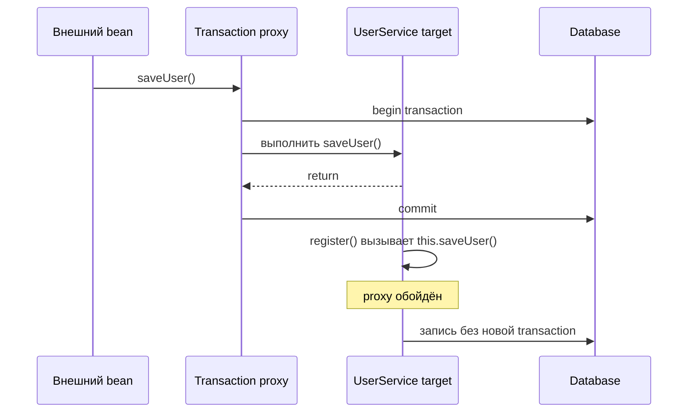
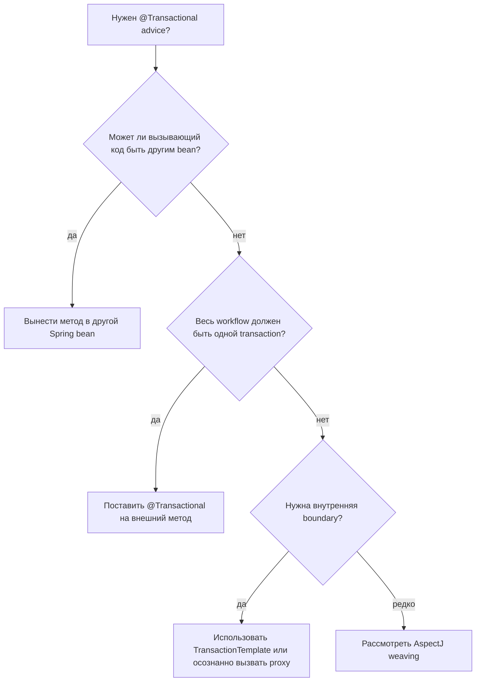

# @Transactional и self-invocation

Короткий ответ: **транзакция не начнётся**, когда нетранзакционный метод вызывает
`@Transactional`-метод того же Spring bean через `this.method()`. Аннотация всё
ещё есть на методе, но вызов не пересекает Spring proxy, поэтому transaction
interceptor не получает шанса что-либо начать. Аналогия с кухней: на блюде есть
ярлык «проверить на раздаче», но повар передаёт тарелку другому повару через
боковую дверь, и официант на раздаче её не видит.

Эта тема — фокусная версия общего правила proxy из
[How @Transactional Works (Proxy / AOP)](topic:spring-transactional-proxy). Spring
обычно применяет `@Transactional` через AOP proxy: вызывающий код получает proxy,
а proxy оборачивает настоящий вызов метода логикой begin, commit и rollback.
Аналогия с почтой: клиенты не заходят в сортировочную комнату; они отдают посылку
сотруднику у стойки, и он добавляет tracking и маршрут.

## Что на самом деле происходит

При обычном внешнем вызове другой bean вызывает transactional service через
внедрённую Spring-ссылку. Эта ссылка является proxy, поэтому interceptor
открывает или присоединяет транзакцию перед вызовом целевого метода. Аналогия с
дорогой: машина въезжает через главный платный пункт, и пункт может поднять
шлагбаум и записать поездку.

При self-invocation первый метод уже выполняется внутри целевого объекта. Когда
он вызывает `this.saveUser()`, Java делает прямой вызов на том же объекте. Вызов
не выходит обратно к proxy и не входит заново. Аналогия с доставкой: работник
склада переносит пакет между двумя комнатами внутри депо; внешний дорожный
контроль не может его просканировать.

```java
@Service
public class UserService {
    public void register(User user) {
        saveUser(user); // really this.saveUser(user)
    }

    @Transactional
    public void saveUser(User user) {
        // expected transaction boundary, but self-invocation bypasses the proxy
    }
}
```



Важная тонкость: если внешний метод не transactional, внутренний
`@Transactional`-метод выполняется **без транзакции, начатой этой аннотацией**.
Если внешний метод уже имел транзакцию, внутренний метод может всё равно
выполниться внутри этой существующей transaction, но собственные настройки его
аннотации не применятся, потому что interceptor был пропущен. Это значит, что
`REQUIRES_NEW`, `readOnly`, timeout, isolation и rollback rules на внутреннем
методе могут быть проигнорированы. Аналогия с кухней: если заказ уже открыт,
следующее блюдо может относиться к этому же заказу, но специальный ярлык на
втором блюде никто не прочитает.

## Почему proxy является границей

`@Transactional` — не магический флаг, который JVM проверяет перед каждым
вызовом метода. Это metadata, которую Spring читает при создании beans. Затем
Spring создаёт AOP proxy вокруг подходящих Spring-managed beans и размещает
transaction advice вокруг вызовов, которые входят через этот proxy. Механика
container относится к той же области, что и [Spring IoC and Dependency
Injection](topic:spring-ioc-di): объект, который вы внедряете, управляется
Spring. Почтовая аналогия: tracking работает потому, что посылка вошла через
официальную стойку, а не потому, что на коробке что-то написано от руки.

Spring может использовать JDK dynamic proxy или CGLIB proxy. Spring Boot обычно
использует CGLIB class proxies по умолчанию, но это не убирает ограничение
self-invocation в proxy-based AOP. Advice всё равно привязан к точкам входа в
proxy, а не к каждому прямому вызову внутри target object. Аналогия с дорогой:
у пункта контроля может быть человек или автоматический шлагбаум, но он всё равно
видит только машины, которые проезжают через пункт.

Та же ловушка proxy-boundary встречается в других возможностях Spring, например
в [@Async and Self-Invocation](topic:spring-async-self-invocation). Симптом
другой, но форма та же: поведение фреймворка происходит, когда вызов пересекает
proxy. Аналогия с кухней: экспресс-печь и transaction-раздача — разные станции,
но обе требуют, чтобы заказ вошёл через станцию.

## Как это исправить

Самое чистое исправление — вынести transactional operation в другой Spring bean
и внедрить этот bean в вызывающий класс. Теперь вызов идёт от одного bean к
другому, пересекает proxy, и transaction interceptor выполняется. Почтовая
аналогия: стойка регистрации передаёт посылку на официальную почтовую стойку,
а не проносит её вокруг стойки.

```java
@Service
public class RegistrationService {
    private final UserWriter userWriter;

    public RegistrationService(UserWriter userWriter) {
        this.userWriter = userWriter;
    }

    public void register(User user) {
        userWriter.saveUser(user);
    }
}

@Service
public class UserWriter {
    @Transactional
    public void saveUser(User user) {
        // transaction starts when called through the proxy
    }
}
```

Другое хорошее исправление — поставить `@Transactional` на внешний метод, если
весь workflow должен быть одной transaction. Это не обходной путь для внутренней
границы `REQUIRES_NEW`, но часто это правильный дизайн, когда регистрация и есть
настоящая единица работы. Аналогия с рестораном: если весь заказ столика должен
обрабатываться как один чек, открывайте чек на методе заказа столика, а не
посередине кухни.

Когда действительно нужна transaction boundary внутри того же класса,
используйте `TransactionTemplate` или другой programmatic transaction API. Это
делает границу явной в коде и не зависит от proxy-вызова. Аналогия с кухней:
вместо вопроса, прошла ли тарелка через раздачу, повар открывает пронумерованный
конверт заказа прямо на рабочем месте.

Self-injection собственного proxy может работать, особенно через `@Lazy`,
`ObjectProvider` или отдельный interface, но это связывает service с механикой
proxy и может давить на circular dependencies. `AopContext.currentProxy()` тоже
может работать, когда включён proxy exposure, но обычно это last-resort
инструмент, потому что он прячет Spring infrastructure внутри business code.
Дорожная аналогия: выехать со склада и снова заехать через checkpoint возможно,
но странно встраивать такой маршрут в каждую инструкцию доставки.

AspectJ weaving — ещё один вариант. Он вплетает advice в bytecode, поэтому может
обработать вызовы, которые proxy mode не может. Это мощно, но добавляет
build/runtime настройку и operational complexity, поэтому большинство команд
оставляет это для случаев, где proxy mode действительно недостаточно. Аналогия с
кухней: поставить датчики внутри каждой рабочей станции ловит больше движений,
но это дороже, чем правильно пользоваться главной раздачей.



## Ответ на собеседовании за 60 секунд

> Обычно нет. В стандартном proxy-based transaction management Spring применяет
> `@Transactional` через AOP proxy. Когда другой bean вызывает метод через proxy,
> transaction interceptor открывает transaction, вызывает target и на выходе
> делает commit или rollback. Но когда метод того же bean вызывает
> `this.transactionalMethod()`, это обычный Java-вызов на target object, поэтому
> он обходит proxy. Если вызывающий метод нетранзакционный, transaction не
> начинается. Чистое исправление — сделать так, чтобы вызов пересекал proxy:
> обычно вынести transactional method в другой Spring bean и внедрить его, или
> поставить `@Transactional` на внешний метод, если весь workflow является одной
> unit of work. Менее чистые варианты — self-injection proxy,
> `AopContext.currentProxy()`, programmatic `TransactionTemplate` или AspectJ
> weaving. Ключевая фраза: transaction boundary должна входить через Spring, а не
> через `this`.

## Практическая важность

Эта ошибка опасна тем, что она тихая. Метод выполняется, запись в database может
успеть пройти, и тесты могут быть зелёными, пока более поздний сбой не покажет,
что rollback, `REQUIRES_NEW`, timeout или isolation никогда не применялись. Это
напрямую связано с [@Transactional Rollback Rules](topic:spring-transactional-rollback)
и [ACID Principles](topic:acid-principles). Почтовая аналогия: посылка всё равно
куда-то доходит, но раз она обошла стойку, нет tracking, страховки и доказательства,
что процедура была правильной.

Service boundaries должны совпадать с transaction boundaries. Если метод является
публичным application use case, сделайте этот метод transactional. Если helper
нуждается в собственной transaction, подумайте, не должен ли он жить в отдельном
collaborator. Аналогия с кухней: пишите чек там, где заказ действительно
начинается; не прячьте важные проверки в приватном проходе между двумя
заготовочными столами.

Будьте осторожны с тестами. Unit test, который вызывает raw class напрямую,
вообще не проверяет transaction proxies. Spring integration test тоже может
пропустить self-invocation path, если вызывает только внутренний метод напрямую.
Дорожная аналогия: тестировать платный пункт, стоя рядом с ним, мало говорит о
том, что произойдёт, когда грузовик поедет через складской объезд.

## Частые заблуждения

- "`@Transactional` запускается всякий раз, когда выполняется annotated method."
  Нет. В proxy mode interceptor запускается, когда вызов входит через proxy.
  Кухонная аналогия: наклейка «проверить блюдо» работает только если блюдо дошло
  до раздачи.
- "CGLIB исправляет self-invocation, потому что наследуется от bean." Нет.
  Proxy-based advice всё равно пропускается для прямых вызовов внутри target
  object. Дорожная аналогия: изменение конструкции шлагбаума не помогает машине,
  которая вообще не проезжает через пункт.
- "`private` transactional helper methods нормальны." Это невалидная proxy
  boundary; private methods не вызываются снаружи proxy. Почтовая аналогия:
  запертый служебный ящик не может быть публичной стойкой обслуживания.
- "`REQUIRES_NEW` на внутреннем методе всегда открывает вторую transaction." Нет,
  если внутренний метод достигнут через self-invocation; propagation rule вообще
  не читается interceptor. Кухонная аналогия: ярлык «отдельный чек» бесполезен,
  если его никто не сканирует.
- "Self-injection proxy — чистый вариант по умолчанию." Это возможный аварийный
  выход, но разделение обязанностей или перенос transaction на настоящий use-case
  method обычно яснее. Дорожная аналогия: провести каждую посылку наружу и назад
  через checkpoint возможно, но лучший layout депо обычно проще.
- "Вызов `new UserService()` эквивалентен injection." Созданный вручную объект не
  является Spring bean и не имеет transaction proxy. Почтовая аналогия: посылка,
  упакованная дома, не попадает автоматически в почтовую систему.
